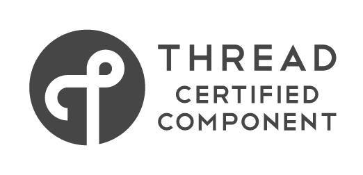

ARM Mesh networking stack
=======================

This repository contains the ARM mesh networking stack that  provides support for the following mesh protocols:

  * 6LoWPAN with Neighbor Discovery (ND) and Mesh Link Establishment (MLE)
  * Thread
  * Wi-SUN
 
 All networking stacks are using IEEE 802.15.4 based radios.
  
The full documentation is hosted in [Mbed OS documentation](https://os.mbed.com/docs/mbed-os/latest/reference/mesh-tech.html).

On mbed OS, mesh networking stacks can be used  through [Mbed Mesh API](https://os.mbed.com/docs/mbed-os/latest/apis/mesh-api.html) and [Network Socket API](https://os.mbed.com/docs/mbed-os/v5.11/apis/network-socket.html).

To see, how the mesh networking stack works, check the example application [mbed-os-example-mesh-minimal](https://github.com/ARMmbed/mbed-os-example-mesh-minimal).

  
##6LoWPAN with ND and MLE

This networking stack is using standard 6LoWPAN and uses:

* Neighbor Discovery Protocol ([RFC4861](https://tools.ietf.org/html/rfc4861)) to locate other devices in the mesh network. 
* Mesh-Link-Establishment ([draft-kelsey-intarea-mesh-link-establishment-06](https://tools.ietf.org/html/draft-kelsey-intarea-mesh-link-establishment-06)) is used for establishing and configuring secure radio links. 
  
##Thread
Thread is standardized by [Thread group](https://www.threadgroup.org/).

mbed OS is now a Thread Certified Component. Using IPv6 with 6LoWPAN as the foundation, Thread technology provides a low-power, self-healing mesh network designed for the home.

##Wi-SUN
Wi-SUN (Smart Utility Networks) specification is standardized by [Wi-SUN Alliance](https://www.wi-sun.org/). 

Mbed OS release 5.12 contains the initial Mbed Wi-SUN FAN implementation. Functionality of the Mbed Wi-SUN network stack will be updated when the Wi-SUN protocol is specified further.

## License

The software is partially provided under a Apache 2.0 license and partially BSD-3-Clause as described below.

This project also contains code from other projects as listed below. The original license text is included in those source files.

* Public header files are provided under Apache 2.0 license.
* Source code excluding Thread protocol, is provided under Apache 2.0
* Source code implementing Thread protocol is provided under BSD-3-Clause
* mDNS library is from FNET project and provided under Apache 2.0 license.
