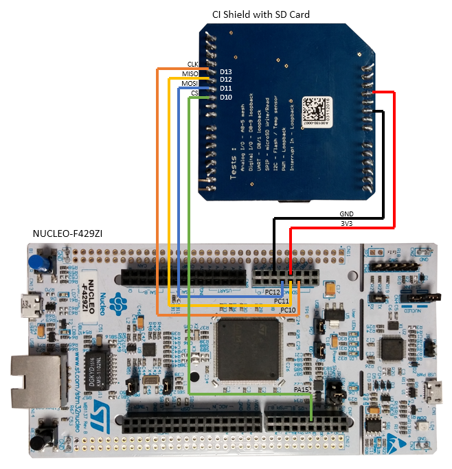

# mbed OS SDCard Driver (sd-driver) for FAT32 Filesystem Support


Simon Hughes

20170329

Version 0.1.2


# Executive Summary

The purpose of this document is to describe how to use the mbed OS SDCard
driver (sd-driver) so applications can read/write
data to flash storage cards using the standard POSIX File API
programming interface. The sd-driver uses the SDCard SPI-mode of operation
which is a subset of possible SDCard functionality.

This repository contains the mbed-os SDCard driver for generic SPI
SDCard support and other resources, as outlined below:

- `SDBlockDevice.h` and `SDBlockDevice.cpp`. This is the SDCard driver module presenting
  a Block Device API (derived from BlockDevice) to the underlying SDCard.
- POSIX File API test cases for testing the FAT32 filesystem on SDCard.
    - basic.cpp, a basic set of functional test cases.
    - fopen.cpp, more functional tests reading/writing greater volumes of data to SDCard, for example.
- `mbed_lib.json` mbed-os application configuration file with SPI pin configurations for the CI shield and overrides for specific targets.
   This file allows the SPI pins to be specified for the target without having to edit the implementation files.
- This README which includes [Summary of POSIX File API Documentation](#summary-posix-api-documentation)
  including detailed instruction on how to use the FAT filesystem and SDBlockDevice driver.

The SDCard driver is maintained in this repository as a component separate from the main mbed OS repository.
Hence the 2 repositories (mbed-os and sd-driver) have to be used together
to deliver the FAT32 Filesystem/SDCard support. This document explains how to do this.


# Introduction

### Overview

The scope of this document is to describe how applications use the FAT filesystem and sd-driver
components to persistently store data on SDCards. The document is intended to help developers adopt the
mbed OS POSIX File API support, and in particular to help explain:

- How the software components work together to deliver the storage functionality.
- How to work with the sd-driver and mbed OS to build the examples. The example code can easily
  be copied into your new application code.
- How to work with the CI Test Shield, which adds an SDCard slot to those targets that do not have already have one.
- How to run the POSIX File API mbed Greentea test cases, which provide further example code of how to use
  the POSIX File API.

Section 1 provides an Executive Summary, describing the purpose of the sd-driver, the supporting
software, examples, test cases and documentation.

Section 2 provides an an overview of the material covered including descriptions of the major sections.

Section 3 provides an overview of the mbed OS filesystem software components,
including the inter-relationships between the application, POSIX file API, the standard c-library,
the mbed OS filesystem and the SDCard driver (sd-driver).

Section 4 describes how to build and run an example application for reading
and writing data to an SDCard using the POSIX File API. The example begins by describing
the procedure for building and testing on the K64F target. The final sub-sections
describe how to use the test shield to add an SDCard slot to any mbed target,
and hence enable the persistent storage of data on any supported target.

Section 5 describes an example application which uses the raw
BlockDevice API to read and write data to the SDCard.

Section 6 describes how to build and run the SDCard POSIX File API mbed Greentea test cases.
There are a number of functional test cases demonstrating how to use the
mbed OS POSIX File API.

Section 7 describes the POSIX File API and provides links to useful API documentation web pages.


### Known mbed-os and sd-driver Compatible Versions

The following versions of the mbed-os and sd-driver repositories are known to work together:

- {mbed-os, sd-driver} = {mbed-os-5.4.0-rc2, sd-driver-0.0.1-mbed-os-5.4.0-rc2}.
  `K64F`, `NUCLEO_F429ZI` and `UBLOX_EVK_ODIN_W2` fopen and basic filesystem tests working.
- {mbed-os, sd-driver} = {mbed-os-5.4.0, sd-driver-0.0.2-mbed-os-5.4.0}.
  `K64F`, `NUCLEO_F429ZI` and `UBLOX_EVK_ODIN_W2` fopen and basic filesystem tests working.
- {mbed-os, sd-driver} = {mbed-os-5.4.1, sd-driver-0.0.3-mbed-os-5.4.1}.
- {mbed-os, sd-driver} = {mbed-os-5.5.1, sd-driver-0.1.0-mbed-os-5.5.1}.
- {mbed-os, sd-driver} = {mbed-os-5.5.4, sd-driver-0.1.1-mbed-os-5.5.4}.
- {mbed-os, sd-driver} = {mbed-os-5.6.1, sd-driver-0.1.2-mbed-os-5.6.1}.

To find the latest compatible versions, use the following command to see the messages attached to the tags
in the sd-driver repository:

    ex_app7/$ cd sd-driver
    ex_app7/sd-driver$ git tag -n
    sd-driver-0.0.1-mbed-os-5.3.4 Version compatible with mbed-os-5.3.4, and private_mbedos_filesystems-0.0.1-mbed-os-5.3.4.
    sd-driver-0.0.2-mbed-os-5.4.0 Updated README.md to include worked exmaples and restructuring of information.
    sd-driver-0.0.3-mbed-os-5.4.1 Version compatible with mbed-os-5.4.1.
    sd-driver-0.1.1-mbed-os-5.5.4 Version compatible with mbed-os-5.5.4
    sd-driver-0.1.2-mbed-os-5.6.1  Version compatible with mbed-os-5.6.1


### Known Issues With This Document

There are no known issues with this document.


# Overview of mbed OS Filesystem Software Component Stack


    ------------------------
    |                      |
    |    Application       |        // This application uses the POSIX File API
    |                      |        // to read/write data to persistent storage backends.
    ------------------------

    ------------------------        // POSIX File API (ISO).

    ------------------------
    |                      |
    |     libc             |        // The standard c library implementation
    |                      |        // e.g. newlib.
    ------------------------

    ------------------------        // sys_xxx equivalent API.

    ------------------------
    |                      |
    |  mbed_retarget.cpp   |        // Target specific mapping layer.
    |                      |
    ------------------------

    ------------------------        // Filesystem Upper Edge API.

    ------------------------
    |                      |
    |     File System      |        // File system wrappers and implementation.
    |                      |
    ------------------------

    ------------------------        // FS Lower Edge API (Block Store Interface).

    ------------------------
    |    Block API         |
    |    Device Driver     |        // The SDCard driver, for example.
    |  e.g. sd-driver      |
    ------------------------

    ------------------------        // SPI.h interface.

    ------------------------
    |                      |
    |       SPI            |        // SPI subsystem (C++ classes and C-HAL implementation).
    |                      |
    ------------------------

    Figure 1. mbedOS generic architecture of filesystem software stack.

The figure above shows the mbed OS software component stack used for data
storage on SDCard:

- At the top level is the application component which uses the standard POSIX File API
  to read and write application data to persistent storage.
- The newlib standard library (libc) stdio.h interface (POSIX File API)
  implementation is used as it's optimised for resource limited embedded systems.
- mbed_retarget.cpp implements the libc back-end file OS handlers and maps them
  to the FileSystem.
- The File System code (hosted in mbed-os) is composed of 2 parts:
    - The mbed OS file system wrapper classes (e.g. FileSystem, File, FileBase classes)
      which are used to present a consistent API to the retarget module for different
      (third-party) file system implementations.
    - The FAT filesystem implementation code.
      The [FATFS: Generic FAT File System Module](http://elm-chan.org/fsw/ff/00index_e.html)
      (ChanFS) has been integrated within mbed-os.
- The Block API Device Driver. The SDCard driver is an example of a persistent storage driver.
  It's maintained as a separate component from the mbed OS repository (in this repository).
- The SPI module provides the mbed OS generic SPI API. This functionality is maintained in
  mbed OS.


# SDCard POSIX File API Example App for Reading/Writing Data

Refer to [SD driver Example](https://github.com/ARMmbed/mbed-os-example-sd-driver)


### <a name="testing-with-an-sdcard-on-target-xyx"></a> Testing with an SDCard on Target XYZ

The standard way to test is with the mbed CI Test Shield plugged into the
target board. This pin mapping for this configuration is parameterised in
the `mbed_lib.json` file.

The following is an example of the `mbed_lib.json` file available in the repository:

    {
        "config": {
            "SPI_CS": "D10",
            "SPI_MOSI": "D11",
            "SPI_MISO": "D12",
            "SPI_CLK": "D13",
            "DEVICE_SPI": 1,
            "FSFAT_SDCARD_INSTALLED": 1
        },
        "target_overrides": {
            "DISCO_F051R8": {
                 "SPI_MOSI": "SPI_MOSI",
                 "SPI_MISO": "SPI_MISO",
                 "SPI_CLK":  "SPI_SCK",
                 "SPI_CS":   "SPI_CS"
            },
            "KL46Z": {
                 "SPI_MOSI": "PTD6",
                 "SPI_MISO": "PTD7",
                 "SPI_CLK":  "PTD5",
                 "SPI_CS":   "PTD4"
            },
            "K64F": {
                 "SPI_MOSI": "PTE3",
                 "SPI_MISO": "PTE1",
                 "SPI_CLK":  "PTE2",
                 "SPI_CS":   "PTE4"
            }
    }

Note the following things about the `mbed_lib.json` file:

- The `mbed_lib.json` file is used to define target specific symbols for the SPI pins connecting the SDCard slot to the target MCU:
    - "SPI\_CS". This is the Chip Select line.
    - "SPI\_MOSI". This is the Master Out Slave In data line.
    - "SPI\_MISO". This is the Master In Slave Out data line.
    - "SPI\_CLK".  This is the serial Clock line.
- The default configuration defined in the "config" section is for the standard Arduino header pin mappings for the SPI bus.
  The "config" section defines a dictionary mapping functional names to target board Arduino header pins:
    - "SPI\_CS": "D10". This causes the MBED\_CONF\_APP\_SPI\_CS symbol to be defined in mbed\_config.h as D10, which is used in the filesystem test implementation.
      D10 is defined in the target specific PinNames.h file.
    - "SPI\_MOSI": "D11". This causes the MBED\_CONF\_APP\_SPI\_MOSI symbol to be defined in mbed\_config.h.
    - "SPI\_MISO": "D12". This causes the MBED\_CONF\_APP\_SPI\_MISO symbol to be defined in mbed\_config.h.
    - "SPI\_CLK": "D13". This causes the MBED\_CONF\_APP\_SPI\_CLK symbol to be defined in mbed\_config.h.
- The `"target_overrides"` section is used to override the "SPI\_xxx" symbols for specific target boards, which may have an SDCard slot, for example.
  This is the case for the K64F, where the "SPI\_xxx" are mapped to the pin names for the on-board SDCard.

  ```
    "K64F": {
         "SPI_MOSI": "PTE3",
         "SPI_MISO": "PTE1",
         "SPI_CLK":  "PTE2",
         "SPI_CS":   "PTE4"
    }
    ```
- Thus, in the absence of any target specific definitions in the `"target_overrides"` section, all boards will default to
  using the Arduino header configuration. For those platforms with a `"target_overrides"` section then this configuration
  will be used in preference.
- Hence in the case that you want to test a platform with an SDCard inserted into a
  fitted CI test shield (rather than the on-board SDCard slot)
  and there is a `"target_overrides"` section present in the `mbed_lib.json` file, you must then delete the `"target_overrides"`
  section before building. This will result in the default configuration being used (suitable for the CI
  Test Shield).
-  Note when inserting the v1.0.0 CI Test Shield into the Arduino header of the target platform, the shield pins D0 and
  D1 should be bent to be parallel to the shield PCB so they are not inserted into the Arduino header. This is because
  some boards use the same UART on DAPLINK and D0/D1, which means the serial debug channel breaks and hence the mbed greentea
  test suite will not work correctly. This is mainly on older ST boards and should not be a problem on
  `K64F`, `NUCLEO_F429ZI` and `UBLOX_EVK_ODIN_W2`. Note also that the v2.0.0 CI Test Shield doesn't suffer from this
  problem and the pins don't need to be bent.
- When inserting the SDCard into the card slot on the CI test shield, make sure the card is fully inserted.
  On insertion, there should be a small clicking sound when the card registers, and the back edge of the card
  should protrude no more than ~1mm over the edge of the CI test shield PCB. If the SDCard fails to register,
  try gently pushing the metal flexible strip in the shape of a spade at the top edge of the SDCard metal slot
  casing with a pair of tweezers, bending it a little to lower it into the slot casing. This helps with the
  insertion mechanism.

### Wiring instructions for target NUCLEO_F429ZI with CI Test Shield


**Figure 3. The figure shows how to connect the NUCLEO_F429ZI platform with the CI shield.**

The above figure shows how to connect the NUCLEO_F429ZI with the v1.0.0 CI test shield. Note:

- To get the SD Card to work with this platform the CI test shield cannot be connected directly to this board, instead follow the instructions above.
- Any SD-card adapter will work as long as you connect all the relevant pins (MOSI, MISO, SCLK, CS, 3.3V and GND) as illustrated in figure 3.
- The SDCard is fully inserted into the slot and overhangs the PCB by ~1mm.

# SDBlockDevice Example Application

The following sample code illustrates how to use the sd-driver Block Device API:

``` cpp
#include "mbed.h"
#include "SDBlockDevice.h"

// Instantiate the SDBlockDevice by specifying the SPI pins connected to the SDCard
// socket. The PINS are:
//     MOSI (Master Out Slave In)
//     MISO (Master In Slave Out)
//     SCLK (Serial Clock)
//     CS (Chip Select)
SDBlockDevice sd(MBED_CONF_SD_SPI_MOSI, MBED_CONF_SD_SPI_MISO, MBED_CONF_SD_SPI_CLK, MBED_CONF_SD_SPI_CS);
uint8_t block[512] = "Hello World!\n";

int main()
{
    // call the SDBlockDevice instance initialisation method.
    if ( 0 != sd.init()) {
        printf("Init failed \n");
        return -1;
    }
    printf("sd size: %llu\n",         sd.size());
    printf("sd read size: %llu\n",    sd.get_read_size());
    printf("sd program size: %llu\n", sd.get_program_size());
    printf("sd erase size: %llu\n",   sd.get_erase_size());

    // set the frequency
    if ( 0 != sd.frequency(5000000)) {
        printf("Error setting frequency \n");
    }

    if ( 0 != sd.erase(0, sd.get_erase_size())) {
        printf("Error Erasing block \n");
    }

    // Write some the data block to the device
    if ( 0 == sd.program(block, 0, 512)) {
        // read the data block from the device
        if ( 0 == sd.read(block, 0, 512)) {
            // print the contents of the block
            printf("%s", block);
        }
    }

    // call the SDBlockDevice instance de-initialisation method.
    sd.deinit();
}
```

# SDCard POSIX File API mbed Greentea Test Cases

This section describes how to build and run the POSIX file API test cases.
The following steps are covered:

- [Create the FAT/SDCard Application Project](#create-fat-sdcard-application-project).
  This section describes how to git clone the mbed OS and sd-driver repositories containing the
  code and test cases of interest.
- [Build the mbed OS Test Cases](#build-the-mbedos-test-cases). This section
  describes how to build the mbed OS test cases.
- [Insert a microSD Card Into the K64F for Greentea Testing](#greentea-insert-sdcard-into-k64f).This section
  describes how to format (if required) a microSD card prior to running the tests.
- [Run the POSIX File Test Case](#run-the-posix-file-test-cases).This section
  describes how to run the POSIX file test cases.


### <a name="create-fat-sdcard-application-project"></a> Create the FAT/SDCard Application Project

This section describes how to create an application project combining the mbed-os and
sd-driver repositories into a single project.
In summary the following steps will be covered in this section:

- A top level application project directory is created. The directory name is ex_app1.
- In the ex_app1 directory, the mbed-os repository is cloned.
- In the ex_app1 directory at the same level as the mbed-os directory, the sd-driver repository is cloned.
- The `mbed_lib.json` file is copied from the `sd-driver/config/mbed_lib.json` to the ex_app1 directory.

First create the top level application directory ex_app1 and move into it:

    shell:/d/demo_area$ mkdir ex_app1
    shell:/d/demo_area$ pushd ex_app1

Next, get a clone of public mbed OS repository in the following way:

    shell:/d/demo_area/ex_app1$ git clone git@github.com:/armmbed/mbed-os
    <trace removed>
    shell:/d/demo_area/ex_app1$

Next, get a clone of the sd-driver repository:

    shell:/d/demo_area/ex_app1$ git clone git@github.com:/armmbed/sd-driver
    <trace removed>
    shell:/d/demo_area/ex_app1$

Note: The `mbed_lib.json` file specifies the SPI bus pin configuration for different targets,
and is discussed in the [Testing with an SDCard on Target XYZ](#testing-with-an-sdcard-on-target-xyx) section.

### <a name="build-the-mbedos-test-cases"></a> Build the mbed OS Test Cases

Build the test cases for the K64F target using the following command:

    shell:/d/demo_area/ex_app1$ mbed -v test --compile -t GCC_ARM -m K64F
    <trace removed>
    shell:/d/demo_area/ex_app1$

The build trace is quite extensive but on a successful build you should see the following output at the end of the log:

    Build successes:
      * K64F::GCC_ARM::MBED-BUILD
      * K64F::GCC_ARM::MBED-OS-FEATURES-FEATURE_LWIP-TESTS-MBEDMICRO-NET-CONNECTIVITY
      <trace removed>
      * K64F::GCC_ARM::MBED-OS-FEATURES-TESTS-FILESYSTEM-FAT_FILE_SYSTEM
      * K64F::GCC_ARM::MBED-OS-FEATURES-TESTS-FILESYSTEM-HEAP_BLOCK_DEVICE
      * K64F::GCC_ARM::MBED-OS-FEATURES-TESTS-FILESYSTEM-UTIL_BLOCK_DEVICE
      <trace removed>
      * K64F::GCC_ARM::SD-DRIVER-TESTS-BLOCK_DEVICE-BASIC
      * K64F::GCC_ARM::SD-DRIVER-TESTS-FILESYSTEM-BASIC
      * K64F::GCC_ARM::SD-DRIVER-TESTS-FILESYSTEM-DIRS
      * K64F::GCC_ARM::SD-DRIVER-TESTS-FILESYSTEM-FILES
      * K64F::GCC_ARM::SD-DRIVER-TESTS-FILESYSTEM-FOPEN
      * K64F::GCC_ARM::SD-DRIVER-TESTS-FILESYSTEM-PARALLEL
      * K64F::GCC_ARM::SD-DRIVER-TESTS-FILESYSTEM-SEEK
    
    Build skips:
      * K64F::GCC_ARM::MBED-OS-FEATURES-FEATURE_LWIP-TESTS-MBEDMICRO-NET-TCP_PACKET_PRESSURE
      <trace removed>


Notice the following tests in the sd-driver tree are listed above:

- `SD-DRIVER-TESTS-BLOCK_DEVICE-BASIC`
- `SD-DRIVER-TESTS-FILESYSTEM-BASIC`
- `SD-DRIVER-TESTS-FILESYSTEM-DIRS`
- `SD-DRIVER-TESTS-FILESYSTEM-FILES`
- `SD-DRIVER-TESTS-FILESYSTEM-FOPEN`
- `SD-DRIVER-TESTS-FILESYSTEM-PARALLEL`
- `SD-DRIVER-TESTS-FILESYSTEM-SEEK`

The FAT32/SDCard test cases are at following locations in the source code tree:

    /d/demo_area/ex_app1/sd-driver/TESTS/filesystem/basic/basic.cpp
    /d/demo_area/ex_app1/sd-driver/TESTS/filesystem/fopen/fopen.cpp
    /d/demo_area/ex_app1/sd-driver/TESTS/block_device/basic/basic.cpp
    /d/demo_area/ex_app1/sd-driver/TESTS/filesystem/dirs/main.cpp
    /d/demo_area/ex_app1/sd-driver/TESTS/filesystem/files/main.cpp
    /d/demo_area/ex_app1/sd-driver/TESTS/filesystem/parallel/main.cpp
    /d/demo_area/ex_app1/sd-driver/TESTS/filesystem/seek/main.cpp

#### <a name="settting-repos-to-compatible-versions"></a> Setting mbed-os/sd-driver Repositories To Compatible Versions

The sd-driver master HEAD and the mbed-os master HEAD should be compatible
with one another and therefore no specific tagged versions need to be checked out.
However, in the case that you experience problems building, checkout out the compatible
tagged version of each repository, as shown below:

    shell:/d/demo_area/ex_app1$ pushd mbed-os
    shell:/d/demo_area/ex_app1$ git checkout tags/mbed-os-5.4.0
    shell:/d/demo_area/ex_app1$ popd
    shell:/d/demo_area/ex_app1$ pushd sd-driver
    shell:/d/demo_area/ex_app1$ git checkout tags/sd-driver-0.0.2-mbed-os-5.4.0
    shell:/d/demo_area/ex_app1$ popd

In the above:

- `mbed-os-5.4.0` should be replaced with the latest mbed-os release tag.
-  For an mbed-os release tag `mbed-os-x.y.z`, use the equivalent sd-driver tag `sd-driver-a.b.c-mbed-os-x.y.z`
   where `a.b.c` is the latest version code for the `mbed-os-x.y.z` tag.

### <a name="greentea-insert-sdcard-into-k64f"></a> Insert SDCard into K64F for Greentea Testing

See the previous section for [Insert SDCard into K64F](#insert-sdcard-into-k64f) for details.


### <a name="run-the-posix-file-test-cases"></a> Run the POSIX File Test Case

To setup for running the test cases, connect the K64F development board to your
PC using a suitable USB cable.

All tests can be run using the following command:

    shell:/d/demo_area/ex_app1$ mbedgt -VS
    <trace removed>

However, it's possible to run a particular test case using the following form of the mbedgt command:

    shell:/d/demo_area/ex_app1$ mbedgt -VS --test-by-names=<test-name>

The names of the tests can be listed using:

    shell:/d/demo_area/ex_app1$ mbedgt -VS --list

For example, to run the basic test use:

    shell:/d/demo_area/ex_app1$ mbedgt -VS --test-by-names=sd-driver-tests-filesystem-basic

To run the fopen test use:

    shell:/d/demo_area/ex_app1$ mbedgt -VS --test-by-names=sd-driver-tests-filesystem-fopen

On a successful run, results similar to the following will be shown:

    mbedgt: test suite report:
    +--------------+---------------+-------------------------------------------+--------+--------------------+-------------+
    | target       | platform_name | test suite                                | result | elapsed_time (sec) | copy_method |
    +--------------+---------------+-------------------------------------------+--------+--------------------+-------------+
    | K64F-GCC_ARM | K64F          | sd-driver-features-tests-filesystem-fopen | OK     | 151.46             | shell       |
    +--------------+---------------+-------------------------------------------+--------+--------------------+-------------+
    mbedgt: test suite results: 1 OK
    mbedgt: test case report:
    +--------------+---------------+------------------------------------+----------------------------------------------------------------------------------------+--------+--------+--------+--------------------+
    | target       | platform_name | test suite                         | test case                                                                              | passed | failed | result | elapsed_time (sec) |
    +--------------+---------------+------------------------------------+----------------------------------------------------------------------------------------+--------+--------+--------+--------------------+
    | K64F-GCC_ARM | K64F          | sd-driver-tests-filesystem-fopen   | FSFAT_FOPEN_TEST_01: fopen()/fwrite()/fclose() directories/file in multi-dir filepath. | 1      | 0      | OK     | 7.57               |
    | K64F-GCC_ARM | K64F          | sd-driver-tests-filesystem-fopen   | FSFAT_FOPEN_TEST_02: fopen(r) pre-existing file try to write it.                       | 1      | 0      | OK     | 0.2                |
    | K64F-GCC_ARM | K64F          | sd-driver-tests-filesystem-fopen   | FSFAT_FOPEN_TEST_03: fopen(w+) pre-existing file try to write it.                      | 1      | 0      | OK     | 0.41               |
    | K64F-GCC_ARM | K64F          | sd-driver-tests-filesystem-fopen   | FSFAT_FOPEN_TEST_04: fopen() with a filename exceeding the maximum length.             | 1      | 0      | OK     | 0.11               |
    | K64F-GCC_ARM | K64F          | sd-driver-tests-filesystem-fopen   | FSFAT_FOPEN_TEST_06: fopen() with bad filenames (minimal).                             | 1      | 0      | OK     | 0.1                |
    | K64F-GCC_ARM | K64F          | sd-driver-tests-filesystem-fopen   | FSFAT_FOPEN_TEST_07: fopen()/errno handling.                                           | 1      | 0      | OK     | 0.07               |
    | K64F-GCC_ARM | K64F          | sd-driver-tests-filesystem-fopen   | FSFAT_FOPEN_TEST_08: ferror()/clearerr()/errno handling.                               | 1      | 0      | OK     | 0.1                |
    | K64F-GCC_ARM | K64F          | sd-driver-tests-filesystem-fopen   | FSFAT_FOPEN_TEST_09: ftell() handling.                                                 | 1      | 0      | OK     | 0.17               |
    | K64F-GCC_ARM | K64F          | sd-driver-tests-filesystem-fopen   | FSFAT_FOPEN_TEST_10: remove() test.                                                    | 1      | 0      | OK     | 1.28               |
    | K64F-GCC_ARM | K64F          | sd-driver-tests-filesystem-fopen   | FSFAT_FOPEN_TEST_11: rename().                                                         | 1      | 0      | OK     | 2.3                |
    | K64F-GCC_ARM | K64F          | sd-driver-tests-filesystem-fopen   | FSFAT_FOPEN_TEST_12: opendir(), readdir(), closedir() test.                            | 1      | 0      | OK     | 3.57               |
    | K64F-GCC_ARM | K64F          | sd-driver-tests-filesystem-fopen   | FSFAT_FOPEN_TEST_13: mkdir() test.                                                     | 1      | 0      | OK     | 1.21               |
    | K64F-GCC_ARM | K64F          | sd-driver-tests-filesystem-fopen   | FSFAT_FOPEN_TEST_14: stat() test.                                                      | 1      | 0      | OK     | 1.47               |
    | K64F-GCC_ARM | K64F          | sd-driver-tests-filesystem-fopen   | FSFAT_FOPEN_TEST_15: format() test.                                                    | 1      | 0      | OK     | 26.12              |
    | K64F-GCC_ARM | K64F          | sd-driver-tests-filesystem-fopen   | FSFAT_FOPEN_TEST_16: write/check n x 25kB data files.                                  | 1      | 0      | OK     | 87.11              |
    +--------------+---------------+------------------------------------+----------------------------------------------------------------------------------------+--------+--------+--------+--------------------+
    mbedgt: test case results: 15 OK
    mbedgt: completed in 152.35 sec


# <a name="summary-posix-api-documentation"></a> Summary of POSIX File API Documentation

### POSIX File API

mbed OS supports a subset of the POSIX File API, as outlined below:

- [clearerr()](https://linux.die.net/man/3/clearerr).
    - STATUS: Basic testing implemented. Working.
- [fclose()](https://linux.die.net/man/3/fclose).
    - STATUS: Basic testing implemented. Working.
- [ferror()](https://linux.die.net/man/3/clearerr).
    - STATUS: Basic testing implemented.
    - STATUS: GCC_ARM: Working.
    - STATUS: ARMCC: ARMCC has problem with ferror(filep) where filep is NULL. Appears to work for non-NULL pointer.
- [fgetc()](https://linux.die.net/man/3/fgets).
    - STATUS: Basic testing implemented. Working.
- [fgets()](https://linux.die.net/man/3/fgets).
    - STATUS: Basic testing implemented. Working.
- [fputc()](https://linux.die.net/man/3/fputs).
    - STATUS: Unknown.
- [fputs()](https://linux.die.net/man/3/fputs).
    - STATUS: Basic testing implemented. Working.
- [fprintf()](https://linux.die.net/man/3/fprintf).
    - STATUS: Basic testing implemented. Working.
- [fopen()](https://linux.die.net/man/3/fopen).
    - STATUS: Basic testing implemented. Working.
- [freopen()](https://linux.die.net/man/3/fopen).
    - STATUS: This is not tested.
- [fread()](https://linux.die.net/man/3/fread).
    - STATUS: Basic testing implemented. Working.
    - STATUS: n x 25kB stress test working.
- [ftell()](https://linux.die.net/man/3/ftell).
    - STATUS: Basic testing implemented. Working.
- [fwrite()](https://linux.die.net/man/3/fwrite).
    - STATUS: Basic testing implemented. Working.
    - STATUS: n x 25kB stress test working.
- [fseek()](https://linux.die.net/man/3/fseek)
    - STATUS: Basic testing implemented. Working.
- [getc()](https://linux.die.net/man/3/fgets).
    - STATUS: Basic testing implemented. Working.
- [gets()](https://linux.die.net/man/3/fgets).
    - STATUS: Unknown.
- [putc()](https://linux.die.net/man/3/fputs).
    - STATUS: Unknown.
- [puts()](https://linux.die.net/man/3/fputs).
    - STATUS: Unknown.
- [remove()](https://linux.die.net/man/3/remove)
    - STATUS: Basic testing implemented. Working.
- [rewind()](https://linux.die.net/man/3/rewind).
    - STATUS: Basic testing implemented. Working.
- [stat()](https://linux.die.net/man/2/stat)
    - STATUS: Implemented. Working.
    - STATUS: Not supported by ARMCC/IAR libc.
- [tmpfile()](https://linux.die.net/man/3/tmpfile).
    - STATUS: Not implemented.
- [tmpnam()](https://linux.die.net/man/3/tmpnam).
    - STATUS: Not implemented.

Supported directory related operations are as follows:

- [closedir()](https://linux.die.net/man/3/closedir).
    - STATUS: Implemented. Working.
- [mkdir()](https://linux.die.net/man/3/mkdir).
    - STATUS: Basic testing implemented. Working.
- [opendir()](https://linux.die.net/man/3/opendir).
    - STATUS: Implemented. Working.
- [readdir()](https://linux.die.net/man/3/readdir).
    - STATUS: Implemented. Working.
- [remove()](https://linux.die.net/man/3/remove).
    - STATUS: Basic testing implemented. Working.
- [rename()](https://linux.die.net/man/3/rename).
    - STATUS: Implemented. Not tested.
- [rewinddir()](https://linux.die.net/man/3/rewinddir).
    - STATUS: Implemented. Found not to work. Test case not present in repo.
- [seekdir()](https://linux.die.net/man/3/seekdir).
    - STATUS: Implemented. Found not to work. Test case not present in repo.
- [telldir()](https://linux.die.net/man/3/telldir).
    - STATUS: Implemented. Found not to work. Test case not present in repo.

### errno

Basic errno reporting is supported, tested and known to be working.


# Related Projects Resources

The following are related mbed storage projects and useful resources:

- The [mbed-os](https://github.com/ARMmbed/mbed-os) main repository.
- The [mbed-os-example-fat-filesystem](https://github.com/ARMmbed/mbed-os-example-fat-filesystem) repository.
  This is an example project for the mbed OS FAT filesystem.
- The [spiflash-driver](https://github.com/armmbed/spiflash-driver) repository.
- The [i2ceeprom-driver](https://github.com/ARMmbed/i2ceeprom-driver.git) repository.
- The [ci-test-shield](https://github.com/ARMmbed/ci-test-shield)  repository. This is the project describing
  the mbed-os Continuous Integration test shield, together with standard tests.
- The [mbed-HDK](https://github.com/ARMmbed/mbed-HDK) repository containing Hardware Development Kit resources
  including the schematics for the CI test shield.
- [POSIX File Interface ISO/IEC 9899:TC2 Documentation](http://www.eng.utah.edu/~cs5785/slides-f10/n1124.pdf).
- [FATFS: Generic FAT File System Module used in mbed OS](http://elm-chan.org/fsw/ff/00index_e.html)
