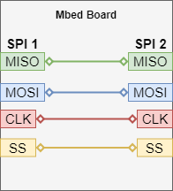
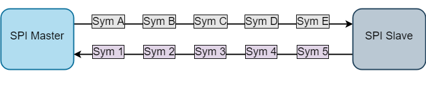

One Board SPI Communication Test
=============
  
### tests-mbed_hal-spi_com
 
Overview  
----------------
This is the SPI communication test which verifies various SPI configuration variants. The test is based on Green Tea framework. The test transfers data between SPI master and SPI slave on the same device. 
 
Test Setup
----------------
1. **Pre-requirements**  
    - One Mbed board with SPI support  
    - Board must have two SPI peripherals available  
    - Board must support SPI slave mode  
    - Wire connection between SPI interfaces
  
      
    
2. **Running the test**  
    - Test assumes that SPI pins are defined in target's `PinNames.h` file:  
        - `SPI0_MOSI`, `SPI0_MISO`, `SPI0_SCK`, `SPI0_CS`
        - `SPI1_MOSI`, `SPI1_MISO`, `SPI1_SCK`, `SPI1_CS` 
    - Wire the 4 pins for each peripheral.  
    - Set `MANUAL_TEST` macro in the test to `1`.  
    - Run the test using the following command:  
    `mbed test -t TOOLCHAIN -m BOARD -n tests-mbed_hal-spi_com`  

Test scenario
----------------
Typical SPI transmission schema during the test is shown below:   
    
  
    
Five predefined(different) symbols are sent in both directions using different SPI configurations.  
    
- Test for synchronous API
    - CS is asserted high (inactive state).  
    - Configuration is validated against device capabilities.  
    - If master or slave cannot handle this configuration the test case is skipped.  
    - Format configuration is set for both master and slave.  
    - Frequency configuration is set on the master peripheral.  
    - Reception buffers and semaphores are reinitialized.  
    - A thread is started for the slave side.  
    - A thread is started for the master side.  
    - The master thread asserts CS to 0 (active state), performs the transfer and asserts CS back to 1.  
    - The test thread (main) waits until either the semaphore is given twice or we it reaches a timeout.  
    - Master & slave rx buffers are respectively compared to slave & master tx buffers.  
    - If a buffer do not match, then the test fails.  
    - Both SPI peripheral are freed and the next test starts.  
    
**Note:**  
On master side data is transferred symbol by symbol (i.e. when 5 symbols is to be transferred, then transfer routine is called 5 times in loop). This is the limitation of the one board SPI communication test.  

- Test for asynchronous API
    - CS is asserted high (inactive state).  
    - Configuration is validated against device capabilities  
    - If master or slave cannot handle this configuration the test case is skipped.  
    - Format configuration is set for both master and slave.  
    - Frequency configuration is set on the master peripheral.  
    - Reception buffers and semaphores are reinitialized.  
    - The spi_transfer_async() function is called for the slave peripheral.  
    - The CS is asserted to 0 (active state).  
    - spi_trasnfer_async() is called for the master peripheral.  
    - The CS is asserted back to 1 (inactive state).  
    - Master & slave rx buffers are respectively compared to slave & master tx buffers.  
    - If a buffer do not match, then the test fails.  
    - Both SPI peripheral are freed and the next test starts.  

What is verified by the test?  
----------------
|     | Test case                                                      | Testing                   | Description                                              |
|-----|----------------------------------------------------------------|---------------------------|----------------------------------------------------------|
| 1   | **SPI master-slave sync com - default config**                 | Sync/General              | Verifies most commonly used SPI configuration*           |
| 2   | SPI master-slave sync com - symbol size: 1                     | Sync/Symbol sizes         | Symbol size is equal to 1                                |
| 3   | SPI master-slave sync com - symbol size: 7                     | Sync/Symbol sizes         | Symbol size is equal to 7                                |
| 4   | SPI master-slave sync com - symbol size: 9                     | Sync/Symbol sizes         | Symbol size is equal to 9                                |
| 5   | SPI master-slave sync com - symbol size: 15                    | Sync/Symbol sizes         | Symbol size is equal to 15                               |
| 6   | SPI master-slave sync com - symbol size: 16                    | Sync/Symbol sizes         | Symbol size is equal to 16                               |
| 7   | SPI master-slave sync com - symbol size: 17                    | Sync/Symbol sizes         | Symbol size is equal to 17                               |
| 8   | SPI master-slave sync com - symbol size: 31                    | Sync/Symbol sizes         | Symbol size is equal to 31                               |
| 9   | SPI master-slave sync com - symbol size: 32                    | Sync/Symbol sizes         | Symbol size is equal to 32                               |
| 10  | SPI master-slave sync com - mode: idle low, sample second edge | Sync/Clock polarity/phase | Clock idle high/sampling on the first edge               |
| 11  | SPI master-slave sync com - mode: idle high, sample first edge | Sync/Clock polarity/phase | Clock idle high/sampling on the second edge              |
| 12  | SPI master-slave sync com - mode: idle high, sample second edge| Sync/Clock polarity/phase | Clock idle low/sampling on the first edge                |
| 13  | SPI master-slave sync com - bit ordering: LSB first            | Sync/Bit order            | LSB transmitted first                                    |
| 14  | SPI master-slave sync com - master: manual ss                  | Sync/SS handling          | Internal SS handling by master                           |
| 15  | SPI master-slave sync com - freq testing: 200 KHz              | Sync/Frequency            | Minimum required frequency (200 kHz)                     |
| 16  | SPI master-slave sync com - freq testing: 2 MHz                | Sync/Frequency            | Maximum required frequency (2 MHz)                       |
| 17  | SPI master-slave sync com - freq testing: min defined          | Sync/Frequency            | Minimum frequency specified in capabilities              |
| 18  | SPI master-slave sync com - freq testing: max defined          | Sync/Frequency            | Maximum frequency specified in capabilities              |
| 19  | SPI master-slave sync com - master: TX undefined               | Sync/Buffers              | Master TX buffer is undefined (NULL)                     |
| 20  | SPI master-slave sync com - master: RX undefined               | Sync/Buffers              | Master RX buffer is undefined (NULL)                     |
| 21  | SPI master-slave sync com - slave: TX undefined                | Sync/Buffers              | Slave TX buffer is undefined (NULL)                      |
| 22  | SPI master-slave sync com - slave: RX undefined                | Sync/Buffers              | Slave RX buffer is undefined (NULL)                      |
| 23  | SPI master-slave sync com - master: TX > RX                    | Sync/Buffers              | Master TX buffer size is greater than RX buffer size     |
| 24  | SPI master-slave sync com - master: TX < RX                    | Sync/Buffers              | Master TX buffer size is less than RX buffer size        |
| 25  | SPI master-slave sync com - slave: TX > RX                     | Sync/Buffers              | SLAVE TX buffer size is greater than RX buffer size      |
| 26  | SPI master-slave sync com - slave: TX < RX                     | Sync/Buffers              | SLAVE TX buffer size is less than RX buffer size         |
| 27  | SPI master-slave sync com - one symbol                         | Sync/Buffers              | 1 symbol is transmitted                                  |
| 28  | SPI master-slave sync com - long buffer                        | Sync/Buffers              | 64 symbols are transmitted                               |
| 29  | SPI master-slave async com - default config                    | Aync/General              | Verifies most commonly used SPI configuration           |
| 30  | SPI master-slave sync com - symbol size: 1                     | Aync/Symbol sizes         | Symbol size is equal to 1                                |
| 31  | SPI master-slave sync com - symbol size: 7                     | Aync/Symbol sizes         | Symbol size is equal to 7                                |
| 32  | SPI master-slave sync com - symbol size: 9                     | Aync/Symbol sizes         | Symbol size is equal to 9                                |
| 33  | SPI master-slave sync com - symbol size: 15                    | Aync/Symbol sizes         | Symbol size is equal to 15                               |
| 34  | SPI master-slave sync com - symbol size: 16                    | Aync/Symbol sizes         | Symbol size is equal to 16                               |
| 35  | SPI master-slave sync com - symbol size: 17                    | Aync/Symbol sizes         | Symbol size is equal to 17                               |
| 36  | SPI master-slave sync com - symbol size: 31                    | Aync/Symbol sizes         | Symbol size is equal to 31                               |
| 37  | SPI master-slave sync com - symbol size: 32                    | Aync/Symbol sizes         | Symbol size is equal to 32                               |
| 38  | SPI master-slave sync com - mode: idle low, sample second edge | Aync/Clock polarity/phase | Clock idle high/sampling on the first edge               |
| 39  | SPI master-slave sync com - mode: idle high, sample first edge | Aync/Clock polarity/phase | Clock idle high/sampling on the second edge              |
| 40  | SPI master-slave sync com - mode: idle high, sample second edge| Aync/Clock polarity/phase | Clock idle low/sampling on the first edge                |
| 41  | SPI master-slave sync com - bit ordering: LSB first            | Aync/Bit order            | LSB transmitted first                                    |
| 42  | SPI master-slave sync com - freq testing: 200 KHz              | Aync/Frequency            | Minimum required frequency (200 kHz)                     |
| 43  | SPI master-slave sync com - freq testing: 2 MHz                | Aync/Frequency            | Maximum required frequency (2 MHz)                       |
| 44  | SPI master-slave sync com - master: manual ss                  | Aync/SS handling          | Internal SS handling by master                           |
| 45  | SPI master-slave sync com - one symbol                         | Aync/Buffers              | 1 symbol is transmitted                                  |
| 46  | SPI master-slave sync com - long buffer                        | Aync/Buffers              | 32 symbols are transmitted                               |

Synchronous and asynchronous modes are tested separately. 

 `*` - `default config` test case verifies the most typical SPI configuration which is:  
- Symbol size: 8 bits  
- Clock polarity/phase: Clock idle low/sampling on the first edge  
- Bit order: MSB first  
- SS handling: external (manual)  
- Duplex: Full duplex 
- Frequency: 1 MHz  
- Synchronous mode (blocking)  
- RX, TX buffers defined  
- RX buffer length is equal to TX buffer length (5 symbols are transmitted in both directions)  
  
Other test cases differs from the `default config` always only by one setting (e.g. `symbol size: 16` test case has the same scenario, but 16 bit symbols are transmitted).  

Test Limitations
----------------
    
Synchronous mode:  
    
- Test uses two threads in to handle master-slave data transfer, because of that master is sending symbols one by one (when five symbols are to be sent, then spi_transfer() function is called five times and in each call one symbol is transferred). This will allow slave thread to read transmitted symbols.   
- Half-Duplex mode cannot be tested.  
    
Asynchronous mode:  
    
**Note:**  
In async mode cases when rx buffer size is different than tx buffer size and half-duplex mode are not supported.
    
- Undefined RX/TX buffers(NULL) cannot be tested.
- High frequencies cannot be tested.

It is recommended to use Ice Tea version of the SPI communication test which do not have such limitations and is more reliable.

Expected result  
----------------
The test exits without errors.
