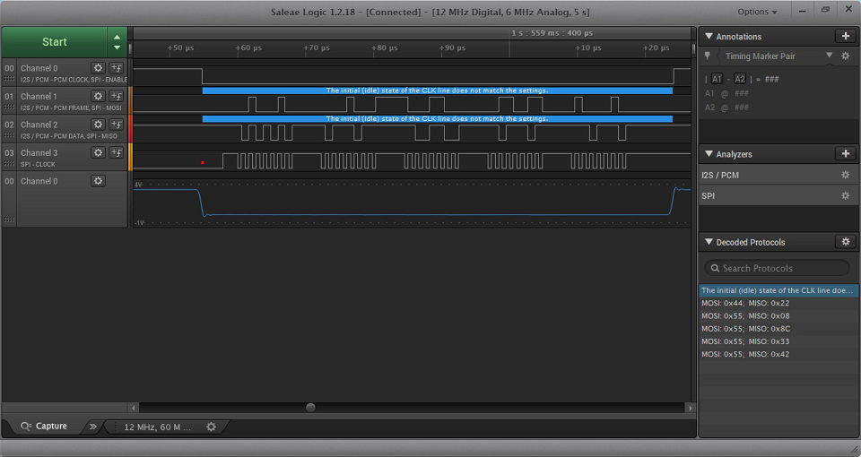

FPGA-Test-Shield: SPI master/slave tests
=============

Overview
----------------
These tests verify various SPI transmission settings like:  
- transmission formats (clock polarity and phase, bit ordering, various symbol sizes),  
- transmission frequencies (required range, range specified in capabilities),  
- synchronous/asynchronous mode,  
- master/slave mode,  
- full-duplex/half-duplex mode,  
- chip select handled by hardware/handled manually (master mode only),  
- buffers cases (TX len == RX len, TX len < RX len, TX len > RX len, TX undefined, RX undefined),  
- SPI `init()/free()` called using all pins on the form factor,  

Additional checks:  
- actual `sclk` frequency,  
- time between `cs` assertion and first `sclk` edge and last `sclk` edge and `cs` de-assertion,  
- `sclk` state on `cs` assertion and de-assertion.  

SPI pins which are used in the tests are determined automatically using the pin-map extension.

Detailed information about the defined behavior of the new SPI HAL API can be found here:  
https://github.com/ARMmbed/mbed-os/blob/feature-hal-spec-spi/docs/design-documents/hal/0000-spi-overhaul.md#defined-behaviours

Test Setup
----------------

1. **Pre-requirements**
- Mbed board with SPI support,
- FPGA-Test-Shield with the last firmware version.

2. **Running the test**
- Plug the FPGA-Test-Shield to the Device Under Test,
- Connect Device Under Test to the host PC using USB cable,
- Set jumper on the FPGA-Test-Shield to select USB power,
- Connect the power to the FPGA-Test-Shield using USB cable,
- Add `FPGA_CI_TEST_SHIELD` component to the Device Under Test in `targets.json` configuration file,
- Check out `feature-hal-spec-spi` mbed-os branch,
- Run the tests:  
  - spi master: `mbed test -t GCC_ARM -m K64F -n tests-mbed_hal_fpga_ci_test_shield-spi_master -v`
  - spi slave: `mbed test -t GCC_ARM -m K64F -n tests-mbed_hal_fpga_ci_test_shield-spi_slave -v`

**Note:**
- Half Duplex test case is disabled by default. This is because it needs an additional configuration. On different targets, a different line may be used as a data line in Half-Duplex mode. For example in the case of `NUCLEO_F429ZI` in Half-Duplex mode, `mosi` is used as the data line in master mode and `miso` is used as the data line in slave mode. To run the Half-Duplex test case please specify which line should be used as the data line (`HD_DATA_LINE = MOSI or MISO`) and un-comment the Half-Duplex test case.  

Transmission Test Scenario
----------------

The most common test case for testing SPI transmission is `basic test`, which uses the following SPI settings:  
- Symbol size: 8 bits,  
- Clock polarity/phase: Clock idle low/sampling on the first edge,  
- Bit order: MSB first,  
- SS handling: external (manual),  
- Duplex: Full duplex,  
- Frequency: 1 MHz,  
- RX, TX buffers defined,  
- RX buffer length is equal to TX buffer length.  

Other transmission test cases differ from the `basic test` always only by one setting (e.g. `symbol size testing (16)` test case has the same scenario, but 16-bit symbols are transmitted). Each transmission test case is executed using synchronous and asynchronous(if supported) API. Note that asynchronous API does not support Half-Duplex mode and rx/tx buffers must have the same size.

Each platform provides its own SPI capabilities:  
https://github.com/ARMmbed/mbed-os/blob/feature-hal-spec-spi/docs/design-documents/hal/0000-spi-overhaul.md#the-new-api

Transmission test steps:
- The test configuration is validated against the capabilities. If according to capabilities the specified configuration is not supported by the Device Under Test (e.g. `symbol size testing (16)` cannot be executed if 16-bit symbols are not supported by the Device Under Test), then the test case is skipped.  
- Init the SPI peripheral, set format, set frequency (only in case of spi master),  
- Transfer 5 times 300 symbols between the Device Under Test and the FPGA-Test-Shield.  
- After each transfer verify if:  
  - checksum on the FPGA-Test-Shield side is correct and if correct data have been received from the FPGA-Test-Shield,  
  - transmitted symbol count on the Device Under Test side and the FPGA-Test-Shield side are valid,  
  - `sclk` state on `cs` assertion and de-assertion is valid,  
  - the time between `cs` assertion and first `sclk` edge and last `sclk` edge and `cs` de-assertion is valid (this is only checked when `hardware ss handling` is selected in master mode).  
- Clean up the environment.

Supported platforms
----------------

SPI support is enabled on the following platforms:
 - `K66F`,
 - `K64F`,
 - `NUCLEO_F429ZI`.

Supported features:  

|                      | K64F Master                                                                 | K64F Slave                                                                                                                                                 | K66F Master                                                                  | K66F Slave                                                                                                                                                 | NUCLEO_F429ZI Master                                                                                                                                       | NUCLEO_F429ZI Slave                                                                                                                                        |
|----------------------|-----------------------------------------------------------------------------|------------------------------------------------------------------------------------------------------------------------------------------------------------|------------------------------------------------------------------------------|------------------------------------------------------------------------------------------------------------------------------------------------------------|------------------------------------------------------------------------------------------------------------------------------------------------------------|------------------------------------------------------------------------------------------------------------------------------------------------------------|
| Symbol size [bits]   | 8, 16                                                                       | 8, 16                                                                                                                                                      | 8, 16                                                                        | 8, 16                                                                                                                                                      | 8, 16                                                                                                                                                      | 8, 16                                                                                                                                                      |
| Clock polarity/phase | SPI_MODE_IDLE_LOW_SAMPLE_FIRST_EDGE, SPI_MODE_IDLE_LOW_SAMPLE_SECOND_EDGE   | SPI_MODE_IDLE_LOW_SAMPLE_FIRST_EDGE,  SPI_MODE_IDLE_LOW_SAMPLE_SECOND_EDGE,  SPI_MODE_IDLE_HIGH_SAMPLE_FIRST_EDGE,  SPI_MODE_IDLE_HIGH_SAMPLE_SECOND_EDGE, | SPI_MODE_IDLE_LOW_SAMPLE_FIRST_EDGE,  SPI_MODE_IDLE_LOW_SAMPLE_SECOND_EDGE   | SPI_MODE_IDLE_LOW_SAMPLE_FIRST_EDGE,  SPI_MODE_IDLE_LOW_SAMPLE_SECOND_EDGE,  SPI_MODE_IDLE_HIGH_SAMPLE_FIRST_EDGE,  SPI_MODE_IDLE_HIGH_SAMPLE_SECOND_EDGE, | SPI_MODE_IDLE_LOW_SAMPLE_FIRST_EDGE,  SPI_MODE_IDLE_LOW_SAMPLE_SECOND_EDGE,  SPI_MODE_IDLE_HIGH_SAMPLE_FIRST_EDGE,  SPI_MODE_IDLE_HIGH_SAMPLE_SECOND_EDGE, | SPI_MODE_IDLE_LOW_SAMPLE_FIRST_EDGE,  SPI_MODE_IDLE_LOW_SAMPLE_SECOND_EDGE,  SPI_MODE_IDLE_HIGH_SAMPLE_FIRST_EDGE,  SPI_MODE_IDLE_HIGH_SAMPLE_SECOND_EDGE, |
| Bit order            | SPI_BIT_ORDERING_MSB_FIRST, SPI_BIT_ORDERING_LSB_FIRST,                     | SPI_BIT_ORDERING_MSB_FIRST                                                                                                                                 | SPI_BIT_ORDERING_MSB_FIRST,  SPI_BIT_ORDERING_LSB_FIRST,                     | SPI_BIT_ORDERING_MSB_FIRST                                                                                                                                 | SPI_BIT_ORDERING_MSB_FIRST,  SPI_BIT_ORDERING_LSB_FIRST,                                                                                                   | SPI_BIT_ORDERING_MSB_FIRST,  SPI_BIT_ORDERING_LSB_FIRST,                                                                                                   |
| Frequency [Hz]       | 200000 - 4000000                                                            | 200000 -  4000000                                                                                                                                          | 200000 -  4000000                                                            | 200000 -  4000000                                                                                                                                          | 200000 -  4000000                                                                                                                                          | 200000 -  2000000                                                                                                                                          |
| CS handling          | internal, external                                                          | internal                                                                                                                                                   | internal, external                                                           | internal                                                                                                                                                   | external                                                                                                                                                   | external                                                                                                                                                   |
| Duplex mode          | Full-Duplex                                                                 | Full-Duplex                                                                                                                                                | Full-Duplex                                                                  | Full-Duplex                                                                                                                                                | Full-Duplex/Half-Duplex                                                                                                                                    | Full-Duplex/Half-Duplex                                                                                                                                    |
| Asynchronous mode    | Yes                                                                         | Yes                                                                                                                                                        | Yes                                                                          | Yes                                                                                                                                                        | Yes                                                                                                                                                        | Yes                                                                                                                                                        |
| Slave mode           | -                                                                           | Yes                                                                                                                                                        | -                                                                            | Yes                                                                                                                                                        | -                                                                                                                                                          | Yes                                                                                                                                                        |

Known Issues
----------------

- `K64F, K66F`  

1. If configured `sclk` idle state is high and manual `cs` handling is selected, then on `cs` assertion, `sclk` state is invalid (low). Because of this issue support for `SPI_MODE_IDLE_HIGH_SAMPLE_FIRST_EDGE,  SPI_MODE_IDLE_HIGH_SAMPLE_SECOND_EDGE` in master mode is now disabled. Valid idle `sclk` state is reached after the first transfer.  
Screen-shot from logic analyser below:  
  

- `NUCLEO_F429ZI`  

1. There is no complete SPI interface provided on Arduino form factor - `cs` pin is missing. Because of this, all test cases for spi slave are skipped.  

2. Half-Duplex test case fails because invalid `sclk` state is detected on `cs` assertion. It looks like in Half-Duplex mode hardware takes ownership of the `sclk` pin after calling `spi_transfer()`, not after `spi_init()`. Between `spi_init()` and `spi_transfer()` calls `sclk` state is undefined. Adding a pull-down resistor to the clock line solves the problem.  

3. According to the requirements delay from the `cs` assert to the first clock edge must be at least half spi clock period. On `NUCLEO_F429ZI` such delays cannot be programmed, thus internal `cs` handling (in master mode) is disabled.

Expected result:
----------------
The test exits without errors.
