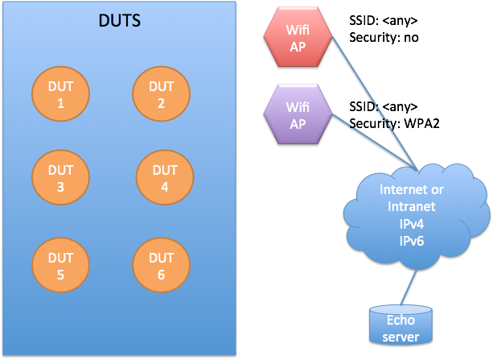

Wi-Fi test plan
========================

This is a test plan for Mbed OS Wi-Fi API.

Target API
----------

The goal of this plan is to test the [WiFiInterface](https://github.com/ARMmbed/mbed-os/blob/master/features/netsocket/WiFiInterface.h) class.

Tools needed
----------------

-   Mbed OS.
-   Secure Wi-Fi access point.
-   Unsecure Wi-Fi access point.

This test plan is written in a tool-agnostic way and does not specify how to write, build or run test cases.

Test environment
----------------

The general test environment consists of DUTs, base stations, a network connection and a test server:



-   All DUTS should be in RAAS.
-   Two Wi-Fi APs required:
    -   Nonsecured one: The SSID is later referred to as `<ssid:unsecure>`.
    -   Secured one: The SSID is later referred to as `<ssid:secure>`, password referred as `<pw:secure>`.
-   IPv4 and IPv6 must be routable between the Wi-Fi network IP address space and echo server.
-   Firewall must not block test traffic to and from the test server **echo.mbedcloudtesting.com**.
    -   Echo Protocol, [RFC 862](https://tools.ietf.org/html/rfc862) is enabled in both TCP and UDP. Port 7.
    -   Discard Protocol, [RFC 863](https://tools.ietf.org/html/rfc863) is enabled in both TCP and UDP. Port 9.
    -   Character generator protocol, [RFC 864](https://tools.ietf.org/html/rfc864) is enabled in both TCP and UDP. Port 19.
    -   Daytime protocol, [RFC 867](https://tools.ietf.org/html/rfc867) in both TCP and UDP. Port 13.
    -   Time protocol, [RFC 868](https://tools.ietf.org/html/rfc868) in both TCP and UDP. Port 37.
-   Channels to be used must be different for both APs. For secure on channel number is later referred as `<ch:secure>` and for unsecure on `<ch:unsecure>`.
-   MAC addresses of Wi-Fi APs must be known. These are later referred to as `<mac:secure>` and `<mac:unsecure>`.
-   WPA3 may not be supported for all target platforms, Refer to target specifications before updating security protocol to WPA3 or WPA3/WPA2 in  `mbed_app.json`

**NOTE:** This document refers to an echo server because it is a requirement for running Socket API tests. The test cases defined in this document do not directly use it.

Test case priorities
--------------------

Please refer to the following table for priorities of test cases. Priorities are labeled as MUST and SHOULD. MUST means this is a requirement and therefore mandatory to pass the test. SHOULD means it is recommended to pass the test if the driver implements the feature in question.

|     | Test case                               |                            | Priority |
|-----|-----------------------------------------|----------------------------|----------|
| 1   | WIFI_CONSTRUCTOR                        |                            | MUST     |
| 2   | WIFI_CONNECT_NOCREDENTIALS              |                            | MUST     |
| 3   | WIFI_SET_CREDENTIAL                     |                            | MUST     |
| 4   | WIFI_SET_CHANNEL                        |                            | SHOULD   |
| 5   | WIFI_GET_RSSI                           |                            | SHOULD   |
| 6   | WIFI_CONNECT_PARAMS_NULL                |                            | MUST     |
| 8   | WIFI_CONNECT_PARAMS_VALID_SECURE        | With security type:        |          |
|     |                                         | NSAPI_SECURITY_WEP         | SHOULD   |
|     |                                         | NSAPI_SECURITY_WPA         | SHOULD   |
|     |                                         | NSAPI_SECURITY_WPA2        | SHOULD   |
|     |                                         | NSAPI_SECURITY_WPA_WPA2    | MUST     |
|     |                                         | NSAPI_SECURITY_WPA3_WPA2   | SHOULD   |
|     |                                         | NSAPI_SECURITY_WPA3        | SHOULD   |
| 9   | WIFI_CONNECT_PARAMS_CHANNEL             |                            | SHOULD   |
| 10  | WIFI_CONNECT_PARAMS_CHANNEL_FAIL        |                            | SHOULD   |
| 11  | WIFI_CONNECT                            |                            | MUST     |
| 12  | WIFI_CONNECT_DISCONNECT_NONBLOCK        |                            | SHOULD   |
| 13  | WIFI_CONNECT_SECURE                     | With security type:        |          |
|     |                                         | NSAPI_SECURITY_WEP         | SHOULD   |
|     |                                         | NSAPI_SECURITY_WPA         | SHOULD   |
|     |                                         | NSAPI_SECURITY_WPA2        | SHOULD   |
|     |                                         | NSAPI_SECURITY_WPA_WPA2    | MUST     |
|     |                                         | NSAPI_SECURITY_WPA3_WPA2   | SHOULD   |
|     |                                         | NSAPI_SECURITY_WPA3        | SHOULD   |
| 14  | WIFI_CONNECT_SECURE_FAIL                |                            | MUST     |
| 15  | WIFI_CONNECT_DISCONNECT_REPEAT          |                            | MUST     |
| 16  | WIFI_SCAN_NULL                          |                            | SHOULD   |
| 17  | WIFI_SCAN                               |                            | SHOULD   |

Building test binaries
----------------------

For testing the board and driver, test against the Mbed OS master branch for the most recent, up-to-date test cases and drivers.

To create a build environment:

```.sh
mbed new wifi_test
cd wifi_test
cd mbed-os
git checkout master
cd ..
```

Prepare an `mbed_app.json` configuration file with all the required definitions provided. See [template_mbed_app.txt](template_mbed_app.txt) file for the full list of necessary definitions.

Now build test binaries:

```.sh
mbed test --compile -t <toolchain> -m <target> --app-config TESTS/network/wifi/template_mbed_app.txt -n mbed-os-tests-network-wifi
```

Running tests
-------------

The RAAS user and password have to be set in the shell to access it:

```.sh
mbedgt -g <target>:raas_client:ruka.mbedcloudtesting.com:8000 -n mbed-os-tests-network-wifi -V -v
```

Test cases for WifiInterface class
-------------------------------------

### WIFI_CONSTRUCTOR

**Description:**

 Test that the constructor of the driver works.

**Preconditions:**

None.

**Test step:**

Construct the driver by calling the constructor.

**Expected result:**

Constructor returns.

### WIFI_CONNECT_NOCREDENTIALS

**Description:**

Test `WiFiInterface::connect()` without parameters. Don't set parameters with `set_credentials()`.

This must be a first test to run after constructing the driver. No credentials should be given for the driver before this test.

**Precondition:**

Test the enviroment is set up as specified in the "Test Environment" chapter.

**Test steps:**

1.  Initialize the driver.
2.  Call `WiFiInterface::connect()`.
3.  `disconnect()`.

**Expected result:**

`connect()` call returns `NSAPI_ERROR_PARAMETER or NSAPI_ERROR_NO_SSID`.

### WIFI_SET_CREDENTIAL

**Description:**

This test case is to test whether the driver accepts valid credentials and rejects ones that are not valid.

**Precondition:**

Driver class is initialized.

**Test step:**

Call `set_credentials()` with various parameters described in "Expected results".

**Expected result:**

| Parameters | Password                  | Security                         | Expected return code                                |
|------------|---------------------------|----------------------------------|-----------------------------------------------------|
| ssid=NULL  | NULL                      | NSAPI_SECURITY_NONE              | NSAPI_ERROR_PARAMETER                               |
| ssid="OK"  | NULL                      | NSAPI_SECURITY_WPA_WPA2          | NSAPI_ERROR_PARAMETER                               |
| ssid="OK"  | NULL                      | NSAPI_SECURITY_WPA3_WPA2         | NSAPI_ERROR_PARAMETER                               |
| ssid="OK"  | NULL                      | NSAPI_SECURITY_WEP               | NSAPI_ERROR_PARAMETER because password is missing.  |
| ssid="OK"  | NULL                      | NSAPI_SECURITY_NONE              | NSAPI_ERROR_OK                                      |
| ssid="OK"  | [any 64 character string] | NSAPI_SECURITY_WPA2              | NSAPI_ERROR_PARAMETER because password is too long  |
| ssid="OK"  | [any 63 character string] | NSAPI_SECURITY_WPA2              | NSAPI_ERROR_OK                                      |
| ssid="OK"  | ""                        | NSAPI_SECURITY_WPA_WPA2          | NSAPI_ERROR_PARAMETER                               |
| ssid="OK"  | ""                        | NSAPI_SECURITY_WPA3_WPA2         | NSAPI_ERROR_PARAMETER                               |
| ssid="OK"  | ""                        | NSAPI_SECURITY_WEP               | NSAPI_ERROR_PARAMETER because password is missing.  |
| ssid="OK"  | ""                        | NSAPI_SECURITY_NONE              | NSAPI_ERROR_OK                                      |
| ssid="OK"  | "12345678"                | NSAPI_SECURITY_WPA_WPA2          | NSAPI_ERROR_OK                                      |
| ssid="OK"  | "12345678"                | NSAPI_SECURITY_WPA3_WPA2         | NSAPI_ERROR_OK                                      |
| ssid="OK"  | "12345678"                | NSAPI_SECURITY_WPA2              | NSAPI_ERROR_OK                                      |
| ssid="OK"  | "12345678"                | NSAPI_SECURITY_WPA3              | NSAPI_ERROR_OK                                      |
| ssid="OK"  | "12345678"                | NSAPI_SECURITY_WPA               | NSAPI_ERROR_OK                                      |
| ssid="OK"  | "12345678"                | NSAPI_SECURITY_WEP               | NSAPI_ERROR_OK or NSAPI_ERROR_UNSUPPORTED           |
| ssid=""    | ""                        | NSAPI_SECURITY_NONE              | NSAPI_ERROR_PARAMETER                               |

### WIFI_SET_CHANNEL

**Description:**

Test validity of `WiFiInterface::set_channel()`.

When proper channel number is feed, it should return `NSAPI_ERROR_OK`. API documentation is unclear what to report on error case, but we assume `NSAPI_ERROR_PARAMETER`.

If the driver does not support setting channels for scan, it should report `NSAPI_ERROR_UNSUPPORTED` for all of the channels.

**Precondition:**

Driver class is initialized.

**Test step:**

Call `set_channel()` with various parameters described in "Expected results".

**Expected result:**

For 2.4 Ghz chips:

| Channel | Expected return code                                                              |
|---------|-----------------------------------------------------------------------------------|
| 0       | NSAPI_ERROR_OK (0 = any channel)                                                  |
| 1       | NSAPI_ERROR_OK                                                                    |
| 13      | NSAPI_ERROR_OK if supporting European frequencies                                 |                  
|         | NSAPI_ERROR_PARAMETER if configured for North America                             |
| 15      | NSAPI_ERROR_PARAMETER                                                             |  
|         | because not a valid 2.4 Ghz channel                                               |

For 5 Ghz chips:

| Channel | Expected return code                                                              |
|---------|-----------------------------------------------------------------------------------|
| 3       | NSAPI_ERROR_PARAMETER                                                             |
|         | because not a valid 5 Ghz channel number                                          |
| 36      | NSAPI_ERROR_OK                                                                    |
| 169     | NSAPI_ERROR_PARAMETERs                                                            |                  
|         | should not be allowed in any country                                              |

Drivers not supporting

| channel | Expected return code                                                              |
|---------|-----------------------------------------------------------------------------------|
| <any>   | NSAPI_ERROR_UNSUPPORTED should be returned for ALL channel numbers > 0.           |

### WIFI_GET_RSSI

**Description:**

Test `WiFiInterface::get_rssi()` API. When connected, it should return a valid RSSI value. When unconnected, it should return 0.

API is a bit unclear whether 0 can also mean that driver does not support reporting of RSSI.

**Precondition:**

Test enviroment is set up as specified in "Test Environment" chapter.

**Test steps:**

1.  Initialize the driver.
2.  Call `get_rssi()`, store the result.
3.  Call `connect()` with valid SSID parameters. Wait for connection.
4.  Call `get_rssi()`.

**Expected result:**

The first call should return 0, and the second call should return a negative number between -10 and -100.

### WIFI_CONNECT_PARAMS_NULL

**Description:**

Test `WiFiInterface::connect(ssid, pass, security, channel)` with NULL parameters.

**Precondition:**

Test enviroment is set up as specified in "Test Environment" chapter.

**Test steps:**

1.  Initialize the driver.
2.  Call `WiFiInterface::connect(NULL, NULL)`.
3.  Call `WiFiInterface::connect("", "")`.

**Expected result:**

Both `connect()` calls return NSAPI_ERROR_PARAMETER.

### WIFI_CONNECT_PARAMS_VALID_SECURE

**Description:**

Test `WiFiInterface::connect(ssid, pass, security)` with valid parameters for secure network.

**Preconditions:**

Test enviroment is set up as specified in the "Test Environment" chapter.

**Test steps:**

1.  Initialize the driver.
2.  Call `WiFiInterface::connect( <ssid:secure>, <pw:secure>, NSAPI_SECURITY_WPA2)`.
3.  `disconnect()`.

**Expected result:**

`connect()` call returns NSAPI_ERROR_OK.

### WIFI_CONNECT_PARAMS_CHANNEL

**Description:**

Test `WiFiInterface::connect(ssid, pass, security, channel)` with valid parameters for the secure network using the channel specified.

This test only applies to devices that support selecting the channel (passes `WIFI-SET-CHANNEL`).

**Precondition:**

Test enviroment is set up as specified in the "Test Environment" chapter.

**Test steps:**

1.  Initialize the driver.
2.  Call `WiFiInterface::connect( <ssid:secure>, <pw:secure>, NSAPI_SECURITY_WPA2, <ch:secure>)`.
3.  `disconnect()`.

**Expected result:**

`connect()` call returns NSAPI_ERROR_OK.

### WIFI_CONNECT_PARAMS_CHANNEL_FAIL

**Description:**

Test `WiFiInterface::connect(ssid, pass, security, channel)` with valid parameters for the secure network using the channel specified. The channel specified must be wrong, so the connect call can fail.

This test only applies to devices that support selecting the channel (passes `WIFI-SET-CHANNEL`).

**Precondition:**

Test enviroment is set up as specified in the "Test Environment" chapter.

**Test steps:**

1.  Initialize the driver.
2.  Call `WiFiInterface::connect( <ssid:secure>, <pw:secure>, NSAPI_SECURITY_WPA2, <ch:secure>)`.
3.  `disconnect()`.

**Expected result:**

The `connect()` call returns `NSAPI_ERROR_CONNECTION_TIMEOUT` or `NSAPI_ERROR_NO_CONNECTION`.

### WIFI_CONNECT

**Description:**

Test `WiFiInterface::connect()` without parameters. Use `set_credentials()` for setting parameters. This checks that driver does not try to retrieve SSID from a location it's not controlling.

**Preconditions:**

1.  Test enviroment is set up as specified in the "Test Environment" chapter.

**Test steps:**

1.  Initialize the driver.
2.  `Call WiFiInterface::set_credentials( <ssid:unsecure>, NULL)`.
3.  `Call WiFiInterface::connect()`.
4.  `disconnect()`.
5.  `Call WiFiInterface::set_credentials( <ssid:unsecure>, "")`.
6.  `Call WiFiInterface::connect()`.
7.  `disconnect()`.
8.  Trash the memory storing SSID.
9.  `Call WiFiInterface::set_credentials( <ssid:unsecure>, "")`.
10. `Call WiFiInterface::connect()`.
11. `disconnect()`.

**Expected result:**

`connect()` calls return `NSAPI_ERROR_OK`.

### WIFI_CONNECT_DISCONNECT_NONBLOCK

**Description:**

Test `WiFiInterface::connect()` and `WiFiInterface::disconnect()` in non-blocking mode. It checks that driver can connect and disconnect in nonblocking mode. 

**Preconditions:**

1.  Test enviroment is set up as specified in the "Test Environment" chapter.

**Test steps:**

1.  Initialize the driver.
2.  `Call WiFiInterface::set_credentials( <ssid:secure>, NULL)`.
3.  `Call WiFiInterface::set_blocking(false)`
4.  `Call WiFiInterface::connect()`.
5.  `Cal WiFiInterface::set_credentials(const char *ssid, const char *pass, nsapi_security_t security)`
6.  `Call WiFiInterface::connect()`.
7.  `disconnect()`
8.  `disconnect()`
9. `Call WiFiInterface::set_blocking(true)`

**Expected result:**

1. Drivers which do not support asynchronous mode `set_blocking(false)` call returns `NSAPI_ERROR_UNSUPPORTED` and skips test case.
2. `connect()` call returns  `NSAPI_ERROR_OK`. 
3. `set_credentials(...)` call returns `NSAPI_ERROR_BUSY`. 
4. Second `connect()` call returns `NSAPI_ERROR_BUSY` or `NSAPI_ERROR_IS_CONNECTED`.
5. Attached callback informs about connection status. Callback reports status `NSAPI_STATUS_CONNECTING` and `NSAPI_STATUS_CONNECTED`. 
6. `disconnect()` call returns `NSAPI_ERROR_OK`. 
7. Second `disconnect()` call returns `NSAPI_ERROR_BUSY` or `NSAPI_ERROR_IS_CONNECTED`. 
8. To confirm disconnection callback reports `NSAPI_STATUS_DISCONNECTED`.

### WIFI_CONNECT_SECURE

**Description:**

Test `WiFiInterface::connect()` without parameters. Use secure settings for `set_credentials`.

**Precondition:**

The test enviroment is set up as specified in the "Test Environment" chapter.

**Test steps:**

1.  Initialize the driver.
2.  Call `WiFiInterface::set_credentials( <ssid:secure>, <pw:secure>, NSAPI_SECURITY_WPA2)`.
3.  Call `WiFiInterface::connect()`.
4.  `disconnect()`.

**Expected result:**

The `connect()` call returns `NSAPI_ERROR_OK`.

### WIFI_CONNECT_SECURE_FAIL

**Description:**

 Test `WiFiInterface::connect()` failing with the wrong password.

**Precondition:**

The test enviroment is set up as specified in the "Test Environment" chapter.

**Test steps:**

1.  Initialize the driver.
2.  Call `WiFiInterface::set_credentials( <ssid:secure>, <any 8 character string, not pw:secure>, NSAPI_SECURITY_WPA2)`.
3.  Call `WiFiInterface::connect()`.
4.  `disconnect()`.

**Expected result:**

`connect()` call returns `NSAPI_ERROR_AUTH_FAILUR`, `NSAPI_ERROR_CONNECTION_TIMEOUT` or `NSAPI_ERROR_NO_CONNECTION`.

### WIFI_CONNECT_DISCONNECT_REPEAT

**Description:**

Test `WiFiInterface::connect()` - `disconnect()` repetition works.

**Precondition:**

The test enviroment is set up as specified in the "Test Environment" chapter.

**Test steps:**

1.  Initialize the driver.
2.  Call `WiFiInterface::set_credentials( <ssid:secure>, NULL)`.
3.  Repeat 10 times:
    1.  Call `WiFiInterface::connect()`.
    2.  `disconnect()`.

**Expected result:**

Each `connect()` call returns `NSAPI_ERROR_OK`.

Each `disconnect()` returns `NSAPI_ERROR_OK`.

### WIFI_SCAN_NULL

**Description:**

Call `WiFiInterface::scan()` with null parameters to get the number of networks available.

**Precondition:**

The test enviroment is set up as specified in the "Test Environment" chapter.

**Test steps:**

1.  Initialize the driver.
2.  Call `WiFiInterface::scan(NULL, 0)`;.

**Expected result:**

`scan()` returns a positive number that is higher or equal to two. (>=2).

### WIFI_SCAN

**Description:**

 Call `WiFiInterface::scan()` with a valid accesspoint list allocated.

**Preconditions:**

1.  The test enviroment is set up as specified in the "Test Environment" chapter.
2.  The test environment must contain less than 10 Wi-Fi SSID within the listening range of DUT; otherwise, adjust the value used in step 2.

**Test steps:**

1.  Initialize the driver.
2.  Allocate array of 10 WiFiAccessPoint objects.
3.  Call `WiFiInterface::scan(<array>, 10)`;

**Expected result:**

`scan()` returns a positive number that is higher or equal to two. (>=2).

Scan elements from array indices between 0 and the number returned:

-   Call `get_ssid()` for each element. `<ssid:secure>` and `<ssid:unsecure>` must be found.
-   Call `get_rssid()` for each element. The value must be between -10 and -100.

For those known networks, test that the following return values are found:

| get_ssid()              | get_bssid()            | get_security()        | get_channel()         |
|-------------------------|------------------------|-----------------------|-----------------------|
| `<ssid:unsecure>`       | `<mac:unsecure>`       | NSAPI_SECURITY_NONE   | `<ch:unsecure>`       |
| `<ssid:secure>`         | `<mac:secure>`         | NSAPI_SECURITY_WPA2   | `<ch:secure>`         |
