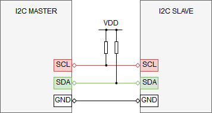

I2C Communication Test
=============

Overview
----------------
This is the I2C communication test which verifies various I2C configuration variants. This test is based on Ice Tea framework. Information how to install and use Ice Tea can be found [here](https://github.com/ARMmbed/icetea). This test transfers data between I2C master and I2C slave.  

Test Setup
----------------

1. **Pre-requirements**  
    - Two Mbed boards (can be different) with I2C support  
    - Both boards must have I2C peripheral available  
    - At least one board must support I2C slave mode  
    - Wire connection between I2C interface on master board and I2C interface on slave board
  
      
    
**Note:**  
Boards need to share common ground, otherwise noises during the transmission are very likely.  
Both SDA and SCL lines must be connected to a positive supply voltage via a pull-up resistor

2. **Running the test**  
    - Adjust pins configuration to your needs in `./TEST_APPS/device/i2c_com/app_config.json` in `"target_overrides"` section
    - Connect I2C interfaces as configured in `./TEST_APPS/device/i2c_com/app_config.json`.  
        - Same boards are used  
            - Run the test using the following command:  
            `mbed test -m BOARD -t TOOLCHAIN --icetea --app-config ./TEST_APPS/device/i2c_com/mbed_app.json -n I2C_COM_MASTER-SLAVE_*`  
        - Different boards are used  
            - Adjust `allowed_platforms` section in `test_i2c_com.py` in order to specify which board should be used as I2C master and which as I2C slave  
            - Build test binaries using the following command:  
            `mbed test -m BOARD -t TOOLCHAIN --icetea --app-config ./TEST_APPS/device/i2c_com/mbed_app.json -n I2C_COM_MASTER-SLAVE_* --compile`  
            - Flash the master and slave boards  
            - Run the test using the following command:  
            `icetea --tcdir  ./TEST_APPS/testcases/i2c_com/ --tc all --reset`

**Note:**
- To run only one test case type its full name.
- Remember to connect also ground pins between the boards.

Test Configuration
----------------
Test configuration file can be found in the following location: `./TEST_APPS/device/i2c_com/app_config.json`.

Configuration parameters:
 - `I2C_MASTER/SLAVE_SCL`: master/slave clock pin
 - `I2C_MASTER/SLAVE_SDA`: master/slave data pin

Test scenario
----------------

Test steps:
- Host collects I2C devices capabilities
- If the testcase configuration is not supported by any of DUT's then testcase is skipped and host tries next one.
- If the testcase configuration is supported by both sides, then host requests to perform the I2C communication test.
- Status of the test is sent back to the host.