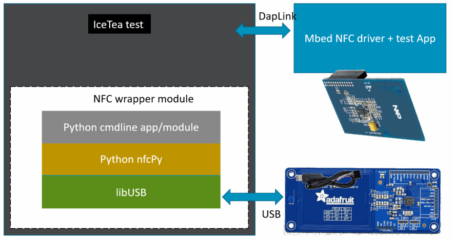
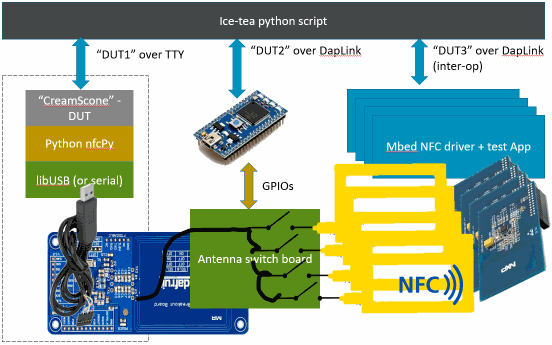
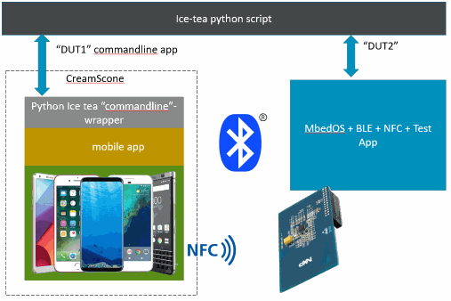

# NFC tests.

A CI test suite for NFC component. These tests validate card mbed emulation cases. The key use case is an NFC smart poster supporting comissioning workflow.
The SUT (system under test) is the NFC target. Tests exercise the framework and NDEF transactions when a NFC controller driver is used, or when the stack is configured for an NFC EEPROM chip in the system integration.

This project is called CreamScone, which is an ice tea framework based cli-driven python test.

<!-- TOC -->

- [NFC tests.](#nfc-tests)
- [Overview](#overview)
- [System Test high level requirement](#system-test-high-level-requirement)
- [Low level design](#low-level-design)
- [User Guide](#user-guide)
  - [Test cases](#test-cases)
  - [cli commands](#cli-commands)
  - [How to](#how-to)
  - [Running the tests](#running-the-tests)
- [Alternate NFC drivers note:](#alternate-nfc-drivers-note)
- [Known issues](#known-issues)

<!-- /TOC -->

# Overview
A set of tests run in CI, which can provide:
- Internal confidence
- Faster iterations
- More efficient work
- Clear escalation path

A [Ice-tea](https://github.com/ARMmbed/mbed-os-5-docs/blob/development/docs/tools/testing/testing_icetea.md) based test suite. In it's simplest form, the suite merely drives API's for the NFC tag reader/writer, and validates a tag simulation running on an idle target, allows test cases in discovery, connection and read/write NDEF records.

In order to mitigate the costs associated with system testing, use existing frameworks or parts and make it easy to test each individually. The [nfcpy](https://nfcpy.readthedocs.io/) Python library is used as the core of the *CreamScone* component which uses a PN53* device [SCL3711 usb reader](https://www.identiv.com/products/smart-card-readers/rfid-nfc-contactless/scl3711/) over USB to read the mbed simulated tag.  This library is used to drive host interactions because it is portable (windows/GNULinux.) Remote NFC interactions will raise events in the mbed application. Connection and read/write events which get handled in user application on the target get wired up to asynchronously return responses and the data values (NDEF messages) to the ice tea framework. These events and data are thus tested/checked in the code (python) running on host. The target test app wraps the API, allowing many new test-scenarios to be written purely in Python.

**NFC compliance**

This suite only assists in NFC forum compliance. Developers must self certify using test tools from a provider to uncover early issues and get an external test vendor to achieve certification.

**Mobiles and inter-op**

Not in scope. Test procedures using a mobile phone app for Android and for IOS were not in scope for this test suite.



Because the comissioning workflow application quality is the end goal, the NFC suite includes learnings to design the CI setup needed for future system testing that bring a mobile phone into the test-rig. The use of a mobile and bluetooth pairing as well as the continous integration system is not included.


# System Test high level requirement
Mitigate risks identified, to the product from an internal view to supporting releases. Help customers develop a driver or a design, and reduce their production risks. In summary:
- Architecture risks and Api breaks 
- Partner cannot NFC forum Certify
- Partner driver has bugs
- Code regressions in O/S
- Arm mbed provided driver or HAL has bugs
- Security vulnerabilities

In short, “Empower engineers to efficiently ship quality code with confidence.”

**Design requirements: **
- Identify and use tools to allow running in CI system, on many targets/configurations
- Be portable (can run in the CI system) using NFC explorer boards in lab for correctly co-located targets.
- Be able to set up and run locally in development

# Low level design
**Components**

API standalone Self tests [test_self.py](TEST_APPS\testcases\nfc\test_self.py)

API E2E (wireless) tests [test_nfc.py](TEST_APPS\testcases\nfc\test_nfc.py)

An [icetea](https://github.com/ARMmbed/icetea/blob/master/README.md) framework test program. Commandline (serial port) driven [target app](TEST_APPS\devices\nfcapp\main.cpp) aka _'CreamScone'_ which allows manual interactions with the driver. The app will send all API return data over serial link.

An icetea plugin [nfc_test_parsers.py](TEST_APPS\icetea_plugins\nfc_test_parsers.py) which parses API responses over the serial port into python variables.

MbedOS cli test app [main.cpp](TEST_APPS\device\nfcapp\main.cpp). The CLI commands return results asynchronously for most commands which get passed to and handled on a driver thread.

**Future: ** A complete inter-op ready design intended to include a switch-box to allow the reader to connect to NFC enabled targets nearby using flying cables and a sticky-back antenna. The switch should allow selecting either alternative tags, or NFC peers, and provide inter-operability coverage. The switch-box may be controlled using GPIO either driven from spare IO pins on the target DUT itself (preferred option), or perhaps from a Raspberry pi.






** Reference: **

[ARMmbed NFC design](https://github.com/ARMmbed/mbed-os/blob/master/docs/design-documents/nfc/nfc_design.md)

[ARMmbed NFC code](https://github.com/ARMmbed/mbed-os/tree/master/features/nfc/nfc)

[ARMmbed NFC example application](https://github.com/ARMmbed/mbed-os-example-nfc/)

[Python NFC library](https://nfcpy.readthedocs.io/en/latest/topics/get-started.html)

[NFC forum](https://nfc-forum.org/)

# User Guide
This section covers the test case specification and how to run the test suite.

The SUT target is rebooted between tests, since tests modify the target hardware state.

## Test cases
CLI commands used by each test case describe the steps in a test.
** Basic local only cases **
- test_nfc_error_codes  : inintnfc , setlastnfcerror \<n> , getlastnfcerror
  - Verify that the test CLI engine can initialize the stack, and can return NFC codes
- test_nfc_eeprom : iseeprom
  - prints "true" if the target has an EEPROM configured stack, else prints "false" diagnostic only
- test_nfc_get_controller_protocols
  - set nfc protocols supported
- test_nfc_set_controller_protocols
  - get nfc protocols supported
- test_nfc_setsmartposter : setsmartposter \<-u> \<url>
  - Sets a smartposter message, does not verify over wireless! (Only https protocol tested.)
- test_nfc_erase : initnfc, erase, readmessage
  - Erase entire EEPROM, (behaviour for controller stack is null)
- test_nfc_write_long : initnfc, erase, writelong \<n>, readmessage
  - Write a very large text T record, and verify expected length written
- test_nfc_reprogrammed : iseeprom, initnfc, erase, wirelessly reprogram, wirelessly verify
  - Use a reader/writer to program the tag using the default M24SR chip password
** End-to-End cases **  
- test_nfce2e_target_found
  - tag can actually be detected wireless
test_nfce2e_type4_found  
  - correct tag detected
- test_nfce2e_discovery_loop
  - Start or Stop discovery loop or disable depending on stack
test_nfce2e_read_stress
  - read large message from device
test_nfce2e_reprogrammed
  - modify large message from device
test_nfce2e_reprogrammed_stress
  - write moderate message wirelessly
test_nfce2e_smartposter
  - as with the basic test, but wirelessly
  
** unimplemented due to limited support **
- test_nfc_iso7816_supported
- test_nfc_add_iso7816_application
- test_nfc_set_tagtype
- test_nfc_get_tagtype


## cli commands
cli commands take parameters, its possible to type help at the cli for a list of commands.
```
mbed sterm --baudrate 115200
help
...
getlastnfcerror last NFC error code
setlastnfcerror self-test
initnfc         init NFC driver
setsmartposter  send smartposter NDEF
iseeprom NFC configEEPROM  present
readmessage     read EEPROM else return last message
erase           erase EEPROM or clear last message
writelong       fill entire FILE with pattern
...
```
Note: Most commands also return a NFC status value (type "getlastnfcerror help" in console) which allow us to build negative test cases.
Note: Some commands only apply to NFC controllers, these commands fail with the appropriate not-supported code NFC_ERR_UNSUPPORTED and additionally return -2 error code to ice-tea. Commands like the erase command is a no-op on a NFC Controller target in the test app, for test-writting convenience.


**unimplemented CLI commands**
commands that were not implemented in the test app
- set/get tag type
- get/set iso7816 app

**Excluded**
- power consumption
- throughput
- memory consumption

## How to
**Wirring diagram for NFC Explorer with PN512**

If using the Raspbery Pi explorer (PN512) board, use this pinout mapping diagram to connect the shield to the reference target. In this case a ST NucleoF401RE pinout is shown.
```
          Nucleo F401RE                Explore NFC                 
         (Arduino header)        (pin1 on shield shown with a <|)
     +-------+     +-------+             +--------+                  
     | [NC]  |     | [B8]  |             |[ 2][ 1]|                  
     | [IOREF|     | [B9]  |             |[ 4][ 3]|                  
     | [RST] |     | [AVDD]|             |[ 6][ 5]|                  
1<---+ [3V3] |     | [GND] |             |[ 8][ 7]|                  
     | [5V]  |     | [A5]  +--->23       |[10][ 9]|                  
     | [GND] |     | [A6]  +--->21       |[12][11]|                  
25<--+ [GND] |     | [A7]  +--->19       |[14][13]|                  
     | [VIN] |     | [B6]  +--->3        |[16][15]|                  
     |       |     | [C7]  |             |[18][17]|                  
26<--+ [A0]  |     | [A9]  |             |[20][19]|                  
16<--+ [A1]  |     | [A9]  |             |[22][21]|                  
     | ...   |     |       |             |[24][23]|                  
     |       |     | [A8]  |             |[26][25]|                  
     +-------+     | ...   |             +--------+                  
                   |       |                               
                   |       |                               
                   +-------+                               
                                         
Patch using jumper wires to the             
indicated pins on the Shield.            
                                         
```
Schematic (https://www.element14.com/community/docs/DOC-76384/l/explore-nfc-board-schematic)
To change pinouts, if your reference design or shield pins differ for the PN512 controller driver, open nfcProcessCtrl.cpp and find the code
```json
NFCProcessController::NFCProcessController(events::EventQueue &queue) :
        // pins: mosi, miso, sclk, ssel, irq, rst
        _pn512_transport(D11, D12, D13, D10, A1, A0), _pn512_driver(
                &_pn512_transport), _queue(queue), _nfc_controller(
                &_pn512_driver, &queue, _ndef_buffer) {
}
```
modify pins as needed.

**Compilation target drivers**

If using the EEPROM driver, the mbed_app.json will contain
```json
    "target_overrides": {
        "DISCO_L475VG_IOT01A": {
            "target.extra_labels_add": ["M24SR"]
        }
    }
...
```
If using the Explorer Shield or PN512 driver mbed_app.json will add
```json
    "target_overrides": {
        "NUCLEO_F401RE": {
            "target.extra_labels_add": ["PN512"]
        }
    }
...
```

## Running the tests
1. Wire an [explorer shield](https://cpc.farnell.com/nxp/explore-nfc/add-on-board-nfc-for-raspberry/dp/SC13404) up to and compile the target application. 
2. Flash the binary to target and verify that it responds with an _`action NDEF record http://www.mbed.com`_ by using a mobile phone to scan over the antenna.
3. Install python (2.7) and install the nfcpy library, [see](https://nfcpy.readthedocs.io/en/latest/topics/get-started.html) . NFC reader can be connected to a serial port, or more commonly a USB dongle. Verify the dongle is functioning.
4. Place the scanner near the explorer shield. Run various test program commands like so:
- python ice_device -command describe

**run the suite**
In a working folder, run

`git clone https://github.com/ARMmbed/mbed-os.git`


If using the EEPROM driver, ( ST Discovery and the M24SR driver), you need the driver:
`git clone https://github.com/ARMmbed/mbed-nfc-m24sr.git'


And copy the files into your mbed root:
`xcopy ..\mbed-nfc-m24sr\*.* .\eeprom_driver\'

To run the End2End tests, type:
`mbed test --icetea --app-config .\TEST_APPS\device\nfcapp\mbed_app.json -n test_nfce2e`

To run only the standalone (readerless tests if you do not have a card reader), type:
`mbed test --icetea --app-config .\TEST_APPS\device\nfcapp\mbed_app.json -n test_nfc_eeprom,test_nfc_error_codes,test_nfc_setsmartposter,test_nfc_erase,test_nfc_write_long`

# Alternate NFC drivers note:

Please see the example json file .\TEST_APPS\testcases\nfc\mbed_app.json . The test does not check that you have any needed shield installed, so if it "hangs" at the point the "initnfc" command is used, the driver or shield may be the fault. The test assumes that MBED_CONF_NFCEEPROM is set to 1, if not it assumes that a NFC Controller driver is in use. To test drivers other than PN512 and M24SR, it is required to make test code changes that reference the driver. The driver can be instantiated once only.

If the new driver you add is for Eeprom, open nfccommands.cpp and find the code and modify line as shown +++
```C++
NFCTestShim* new_testshim() {
#if MBED_CONF_NFCEEPROM
---    mbed::nfc::NFCEEPROMDriver& eeprom_driver = get_eeprom_driver(nfcQueue);

+++    mbed::nfc::NFCEEPROMDriver& eeprom_driver = get_myeeprom_driver(nfcQueue);

    return ( (NFCTestShim *)(new NFCProcessEEPROM(nfcQueue, eeprom_driver)) );
#else
    return ((NFCTestShim *) (new NFCProcessController(nfcQueue)));
#endif // EEPROM
```

If the driver you add is a Controller driver, open nfcProcessCtrl.cpp and find the code
```C++
NFCProcessController::NFCProcessController(events::EventQueue &queue) :
        // pins: mosi, miso, sclk, ssel, irq, rst
        _pn512_transport(D11, D12, D13, D10, A1, A0), _pn512_driver(
                &_pn512_transport), _queue(queue), _nfc_controller(
                &_pn512_driver, &queue, _ndef_buffer) {
}
```
1. You will want to replace this and reference the desired controller driver. Likewise, this code is where pinout changes have to be made if using the supplied Controller driver.
2. Search for occurences of guard macros `#ifdef TARGET_PN512` , and `#endif`. Add a new guard macro and code for your specific controller driver at the same point. 


Note: If the target uses an EEPROM, it need not be powered/running, to be read,  mbedOS is not running at that point.

**Device API error codes**

You can issue the command "getlastnfcerror help" to see a list of error codes that are returned by most commands.
```C++
#define NFC_OK                    0   ///< No error
#define NFC_ERR_UNKNOWN           1   ///< Unknown error
#define NFC_ERR_LENGTH            2   ///< Length of parameter is wrong
#define NFC_ERR_NOT_FOUND         3   ///< Could not find item
#define NFC_ERR_UNSUPPORTED       4   ///< This action is not supported
#define NFC_ERR_PARAMS            5   ///< These parameters are not correct
#define NFC_ERR_BUFFER_TOO_SMALL  6   ///< The buffer is too small to store all data (buffer overflow)
#define NFC_ERR_TIMEOUT           7   ///< Timeout
#define NFC_ERR_CRC               8   ///< Checksum does not match
#define NFC_ERR_NOPEER            9   ///< No target/initiator in vicinity
#define NFC_ERR_PARITY            10  ///< Parity error
#define NFC_ERR_FIELD             11  ///< No RF field detected (or RF field lost)
#define NFC_ERR_COLLISION         12  ///< Collision detected
#define NFC_ERR_WRONG_COMM        13  ///< Communication error
#define NFC_ERR_PROTOCOL          14  ///< Protocol is not conformant
#define NFC_ERR_BUSY              15  ///< Resource is busy
#define NFC_ERR_CONTROLLER        16  ///< Controller failure
#define NFC_ERR_HALTED            17  ///< Target has been halted
#define NFC_ERR_MAC               18  ///< MAC does not match
#define NFC_ERR_UNDERFLOW         19  ///< Could not send data in time
#define NFC_ERR_DISCONNECTED      20  ///< Link has disconnected
#define NFC_ERR_ABORTED           21  ///< Command was aborted
```
# Known issues

1. The test app defines large buffer to store the maximum realistic message of 8K by default. For targets with limited memory (< ~32K) will need to modify the app config. Open mbed_app.config and modify the setting 
`        "TEST_NDEF_MSG_MAX" : 8192` to suit by overriding it on specific targets. The test cases (python code) which stress read/write will need updates if the buffer is reduced to 2K by editing test_nfc.py and modifying the line(s) to fall within the new macro value.
```python
    # Values > 4 k incur large time costs
    STRESS_BUFFLEN = 2050
```

2. The test app and the supplied drivers only support Type4 tags. The test app thus does not exercise the different protocols and always sets iso-dep level functionality (Type4) for NFC Controller initialization.

1. Test test_nfce2e_discovery_loop fails on NFC controller. The NFC controller driver discovery loop cannot be stopped manually. No major functionality is lost, it only prevents a complete disable of NFC at runtime. A bug ticket #IOTPAN-313 was logged to fix the stop function. The Controller still restarts discovery loop normally under app control after a peer disconnects.

1. The smartposter NDEF record wrapper class `smartposter.h` is also provided as part of the NFC examples. The examples are not needed to compile the test app, but this example class may be usefull to customers. This file may thus move into the NFC component in future.
