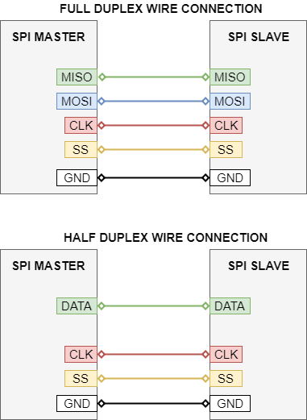
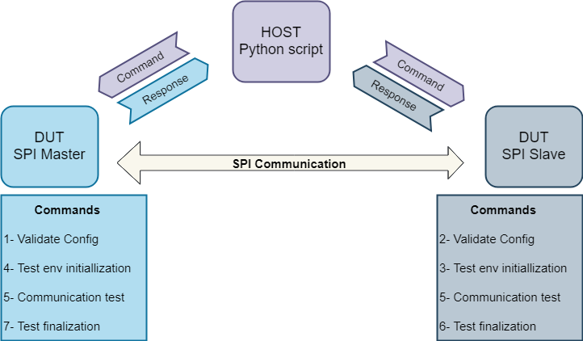
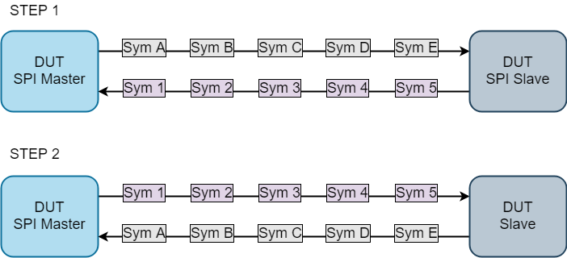

SPI Communication Test
=============

Overview
----------------
This is the SPI communication test which verifies various SPI configuration variants. This test is based on Ice Tea framework. Information how to install and use Ice Tea can be found [here](https://github.com/ARMmbed/icetea). This test transfers data between SPI master and SPI slave.  

Test Setup
----------------

1. **Pre-requirements**  
    - Two Mbed boards (can be different) with SPI support  
    - Both boards must have SPI peripheral available  
    - At least one board must support SPI slave mode  
    - Wire connection between SPI interface on master board and SPI interface on slave board
  
      
    
**Note:**  
Boards need to share common ground, otherwise noises during the transmission are very likely.  

2. **Running the test**  
    - Adjust pins configuration to your needs in `./TEST_APPS/device/spi_com/mbed_app.json.`  
    - Connect SPI interfaces as configured in `./TEST_APPS/device/spi_com/mbed_app.json`.  
        - Same boards are used  
            - Run the test using the following command:  
            `mbed test -m BOARD -t TOOLCHAIN --icetea --app-config ./TEST_APPS/device/spi_com/mbed_app.json -n SPI_COM*`  
        - Different boards are used  
            - Adjust `allowed_platforms` section in `test_spi_com.py` in order to specify which board should be used as SPI master and which as SPI slave  
            - Build test binaries using the following command:  
            `mbed test -m BOARD -t TOOLCHAIN --icetea --app-config ./TEST_APPS/device/spi_com/mbed_app.json -n SPI_COM* --compile`  
            - Flash the master and slave boards  
            - Run the test using the following command:  
            `icetea --tcdir  ./TEST_APPS/testcases/spi_com/ --tc all --reset`  
      

**Note:**  
- Half Duplex test case may need to be run separately since it may require to change the wire connection. 
- To run only one test case type its full name.
- Remember to connect also ground pins between the boards.  
- You may consider to add a pull-down resistor to the clock line. While working on NUCLEO-F429ZI driver some clock noises have been found in half-duplex mode and while testing different clock modes.  

Test Configuration
----------------
Test configuration file can be found in the following location: `./TEST_APPS/device/spi_com/mbed_app.json.`.  
  
Configuration parameters:  
 - `SPI_MASTER/SLAVE_SS`: master/slave slave select pin,    
 - `SPI_MASTER/SLAVE_MOSI`: master/slave mosi pin,  
 - `SPI_MASTER/SLAVE_MISO`: master/slave miso pin,  
 - `SPI_MASTER/SLAVE_MISO`: master/slave clk pin,  
 - `SPI_MASTER_HALF_DUPLEX_DATA`: master/slave data line in half-duplex mode,  
 - `SPI_MASTER_SS_ACTIVE_HIGH`: `true` if SS is asserted when set to logic 1, `false` otherwise,  
 - `SPI_DEBUG`: debug mode (0 or 1). If debug is enabled then tested configuration is dumped and transmission buffers are dumped in case of failure.  

Test scenario
----------------

Test environment is shown on the picture below:  
  
  

Test steps:
- SPI configuration required for the test is transferred to master and slave.  
- Configuration is validated against the capabilities by both sides(master and slave) and propriate status is sent back to the host.  
- If master or slave cannot handle the specific SPI configuration, then it is skipped and host tries next one.  
- If configuration can be handled by both sides, then host requests to perform the SPI communication test.  
- Status of the test is sent back to the host. 

Typical SPI transmission schema(`SPI_COM_SYNC_DEFAULT_CFG`) during the test is shown below:  
  
  

In the first step five predefined(different) symbols are sent in both directions. In the second step master sends data received from slave(in the first step) and slave sends data received from master. After the second step master should receive data sent to slave in the first step and slave should receive data sent to master in the first step.  

What is verified by the test?
----------------

|     | Test case                                                       | Testing                           | Description                                              |
|-----|-----------------------------------------------------------------|-----------------------------------|----------------------------------------------------------|
| 1   | SPI_COM_SYNC_DEFAULT_CFG                                        | Sync/General                      | Verifies most commonly used SPI configuration*           |
| 2   | SPI_COM_SYNC_SYM_SIZE_1                                         | Sync/Symbol sizes                 | Symbol size is equal to 1                                |
| 3   | SPI_COM_SYNC_SYM_SIZE_7                                         | Sync/Symbol sizes                 | Symbol size is equal to 7                                |
| 4   | SPI_COM_SYNC_SYM_SIZE_9                                         | Sync/Symbol sizes                 | Symbol size is equal to 9                                |
| 5   | SPI_COM_SYNC_SYM_SIZE_15                                        | Sync/Symbol sizes                 | Symbol size is equal to 15                               |
| 6   | SPI_COM_SYNC_SYM_SIZE_16                                        | Sync/Symbol sizes                 | Symbol size is equal to 16                               |
| 7   | SPI_COM_SYNC_SYM_SIZE_17                                        | Sync/Symbol sizes                 | Symbol size is equal to 17                               |
| 8   | SPI_COM_SYNC_SYM_SIZE_31                                        | Sync/Symbol sizes                 | Symbol size is equal to 31                               |
| 9   | SPI_COM_SYNC_SYM_SIZE_32                                        | Sync/Symbol sizes                 | Symbol size is equal to 32                               |
| 10  | SPI_COM_SYNC_MODE_CLK_IDLE_HIGH_FIRST_EDGE                      | Sync/Clock polarity/phase         | Clock idle high/sampling on the first edge               |
| 11  | SPI_COM_SYNC_MODE_CLK_IDLE_HIGH_SEC_EDGE                        | Sync/Clock polarity/phase         | Clock idle high/sampling on the second edge              |
| 12  | SPI_COM_SYNC_MODE_CLK_IDLE_LOW_SEC_EDGE                         | Sync/Clock polarity/phase         | Clock idle low/sampling on the first edge                |
| 13  | SPI_COM_SYNC_BIT_ORDERING_LSB_FIRST                             | Sync/Bit order                    | LSB transmitted first                                    |
| 14  | SPI_COM_SYNC_AUTO_SS                                            | Sync/SS handling                  | Internal SS handling by master                           |
| 15  | SPI_COM_SYNC_FREQ_MIN_REQUIRED                                  | Sync/Frequency                    | Minimum required frequency (200 kHz)                     |
| 16  | SPI_COM_SYNC_FREQ_MAX_REQUIRED                                  | Sync/Frequency                    | Maximum required frequency (2 MHz)                       |
| 17  | SPI_COM_SYNC_FREQ_MIN_CAPABILITIES                              | Sync/Frequency                    | Minimum frequency specified in capabilities              |
| 18  | SPI_COM_SYNC_FREQ_MAX_CAPABILITIES                              | Sync/Frequency                    | Maximum frequency specified in capabilities              |
| 19  | SPI_COM_SYNC_BUFFERS_MASTER_TX_UNDEF                            | Sync/Buffers                      | Master TX buffer is undefined (NULL)                     |
| 20  | SPI_COM_SYNC_BUFFERS_MASTER_RX_UNDEF                            | Sync/Buffers                      | Master RX buffer is undefined (NULL)                     |
| 21  | SPI_COM_SYNC_BUFFERS_SLAVE_TX_UNDEF                             | Sync/Buffers                      | Slave TX buffer is undefined (NULL)                      |
| 22  | SPI_COM_SYNC_BUFFERS_SLAVE_RX_UNDEF                             | Sync/Buffers                      | Slave RX buffer is undefined (NULL)                      |
| 23  | SPI_COM_SYNC_BUFFERS_MASTER_TX_GT_RX                            | Sync/Buffers                      | Master TX buffer size is greater than RX buffer size     |
| 24  | SPI_COM_SYNC_BUFFERS_MASTER_TX_LT_RX                            | Sync/Buffers                      | Master TX buffer size is less than RX buffer size        |
| 25  | SPI_COM_SYNC_BUFFERS_SLAVE_TX_GT_RX                             | Sync/Buffers                      | SLAVE TX buffer size is greater than RX buffer size      |
| 26  | SPI_COM_SYNC_BUFFERS_SLAVE_TX_LT_RX                             | Sync/Buffers                      | SLAVE TX buffer size is less than RX buffer size         |
| 27  | SPI_COM_SYNC_BUFFERS_ONE_SYM                                    | Sync/Buffers                      | 1 symbol is transmitted                                  |
| 28  | SPI_COM_SYNC_BUFFERS_LONG                                       | Sync/Buffers                      | 64 symbols are transmitted                               |
| 29  | SPI_COM_SYNC_HALF_DUPLEX                                        | Sync/Duplex                       | Half-Duplex mode (may require different wire connection) |
| 30  | SPI_COM_MASTER_ASYNC_SLAVE_SYNC_DEFAULT_CFG                     | Async master/General              | Verifies most commonly used SPI configuration*           |
| 31  | SPI_COM_MASTER_ASYNC_SLAVE_SYNC_SYM_SIZE_1                      | Async master/Symbol sizes         | Symbol size is equal to 1                                |
| 32  | SPI_COM_MASTER_ASYNC_SLAVE_SYNC_SYM_SIZE_7                      | Async master/Symbol sizes         | Symbol size is equal to 7                                |
| 33  | SPI_COM_MASTER_ASYNC_SLAVE_SYNC_SYM_SIZE_9                      | Async master/Symbol sizes         | Symbol size is equal to 9                                |
| 34  | SPI_COM_MASTER_ASYNC_SLAVE_SYNC_SYM_SIZE_15                     | Async master/Symbol sizes         | Symbol size is equal to 15                               |
| 35  | SPI_COM_MASTER_ASYNC_SLAVE_SYNC_SYM_SIZE_16                     | Async master/Symbol sizes         | Symbol size is equal to 16                               |
| 36  | SPI_COM_MASTER_ASYNC_SLAVE_SYNC_SYM_SIZE_17                     | Async master/Symbol sizes         | Symbol size is equal to 17                               |
| 37  | SPI_COM_MASTER_ASYNC_SLAVE_SYNC_SYM_SIZE_31                     | Async master/Symbol sizes         | Symbol size is equal to 31                               |
| 38  | SPI_COM_MASTER_ASYNC_SLAVE_SYNC_SYM_SIZE_32                     | Async master/Symbol sizes         | Symbol size is equal to 32                               |
| 39  | SPI_COM_MASTER_ASYNC_SLAVE_SYNC_MODE_CLK_IDLE_HIGH_FIRST_EDGE   | Async master/Clock polarity/phase | Clock idle high/sampling on the first edge               |
| 40  | SPI_COM_MASTER_ASYNC_SLAVE_SYNC_MODE_CLK_IDLE_HIGH_SEC_EDGE     | Async master/Clock polarity/phase | Clock idle high/sampling on the second edge              |
| 41  | SPI_COM_MASTER_ASYNC_SLAVE_SYNC_MODE_CLK_IDLE_LOW_SEC_EDGE      | Async master/Clock polarity/phase | Clock idle low/sampling on the first edge                |
| 42  | SPI_COM_MASTER_ASYNC_SLAVE_SYNC_BIT_ORDERING_LSB_FIRST          | Async master/Bit order            | LSB transmitted first                                    |
| 43  | SPI_COM_MASTER_ASYNC_SLAVE_SYNC_AUTO_SS                         | Async master/SS handling          | Internal SS handling by master                           |
| 44  | SPI_COM_MASTER_ASYNC_SLAVE_SYNC_FREQ_MIN_REQUIRED               | Async master/Frequency            | Minimum required frequency (200 kHz)                     |
| 45  | SPI_COM_MASTER_ASYNC_SLAVE_SYNC_FREQ_MAX_REQUIRED               | Async master/Frequency            | Maximum required frequency (2 MHz)                       |
| 46  | SPI_COM_MASTER_ASYNC_SLAVE_SYNC_FREQ_MIN_CAPABILITIES           | Async master/Frequency            | Minimum frequency specified in capabilities              |
| 47  | SPI_COM_MASTER_ASYNC_SLAVE_SYNC_FREQ_MAX_CAPABILITIES           | Async master/Frequency            | Maximum frequency specified in capabilities              |
| 48  | SPI_COM_MASTER_ASYNC_SLAVE_SYNC_BUFFERS_MASTER_TX_UNDEF         | Async master/Buffers              | Master TX buffer is undefined (NULL)                     |
| 49  | SPI_COM_MASTER_ASYNC_SLAVE_SYNC_BUFFERS_MASTER_RX_UNDEF         | Async master/Buffers              | Master RX buffer is undefined (NULL)                     |
| 50  | SPI_COM_MASTER_ASYNC_SLAVE_SYNC_BUFFERS_SLAVE_TX_UNDEF          | Async master/Buffers              | Slave TX buffer is undefined (NULL)                      |
| 51  | SPI_COM_MASTER_ASYNC_SLAVE_SYNC_BUFFERS_SLAVE_RX_UNDEF          | Async master/Buffers              | Slave RX buffer is undefined (NULL)                      |
| 52  | SPI_COM_MASTER_ASYNC_SLAVE_SYNC_BUFFERS_ONE_SYM                 | Async master/Buffers              | 1 symbol is transmitted                                  |
| 53  | SPI_COM_MASTER_ASYNC_SLAVE_SYNC_BUFFERS_LONG                    | Async master/Buffers              | 64 symbols are transmitted                               |
| 54  | SPI_COM_MASTER_SYNC_SLAVE_ASYNC_DEFAULT_CFG                     | Async slave/General               | Verifies most commonly used SPI configuration*           |
| 55  | SPI_COM_MASTER_SYNC_SLAVE_ASYNC_SYM_SIZE_1                      | Async slave/Symbol sizes          | Symbol size is equal to 1                                |
| 56  | SPI_COM_MASTER_SYNC_SLAVE_ASYNC_SYM_SIZE_7                      | Async slave/Symbol sizes          | Symbol size is equal to 7                                |
| 57  | SPI_COM_MASTER_SYNC_SLAVE_ASYNC_SYM_SIZE_9                      | Async slave/Symbol sizes          | Symbol size is equal to 9                                |
| 58  | SPI_COM_MASTER_SYNC_SLAVE_ASYNC_SYM_SIZE_15                     | Async slave/Symbol sizes          | Symbol size is equal to 15                               |
| 59  | SPI_COM_MASTER_SYNC_SLAVE_ASYNC_SYM_SIZE_16                     | Async slave/Symbol sizes          | Symbol size is equal to 16                               |
| 60  | SPI_COM_MASTER_SYNC_SLAVE_ASYNC_SYM_SIZE_17                     | Async slave/Symbol sizes          | Symbol size is equal to 17                               |
| 61  | SPI_COM_MASTER_SYNC_SLAVE_ASYNC_SYM_SIZE_31                     | Async slave/Symbol sizes          | Symbol size is equal to 31                               |
| 62  | SPI_COM_MASTER_SYNC_SLAVE_ASYNC_SYM_SIZE_32                     | Async slave/Symbol sizes          | Symbol size is equal to 32                               |
| 63  | SPI_COM_MASTER_SYNC_SLAVE_ASYNC_MODE_CLK_IDLE_HIGH_FIRST_EDGE   | Async slave/Clock polarity/phase  | Clock idle high/sampling on the first edge               |
| 64  | SPI_COM_MASTER_SYNC_SLAVE_ASYNC_MODE_CLK_IDLE_HIGH_SEC_EDGE     | Async slave/Clock polarity/phase  | Clock idle high/sampling on the second edge              |
| 65  | SPI_COM_MASTER_SYNC_SLAVE_ASYNC_MODE_CLK_IDLE_LOW_SEC_EDGE      | Async slave/Clock polarity/phase  | Clock idle low/sampling on the first edge                |
| 66  | SPI_COM_MASTER_SYNC_SLAVE_ASYNC_BIT_ORDERING_LSB_FIRST          | Async slave/Bit order             | LSB transmitted first                                    |
| 67  | SPI_COM_MASTER_SYNC_SLAVE_ASYNC_AUTO_SS                         | Async slave/SS handling           | Internal SS handling by master                           |
| 68  | SPI_COM_MASTER_SYNC_SLAVE_ASYNC_FREQ_MIN_REQUIRED               | Async slave/Frequency             | Minimum required frequency (200 kHz)                     |
| 69  | SPI_COM_MASTER_SYNC_SLAVE_ASYNC_FREQ_MAX_REQUIRED               | Async slave/Frequency             | Maximum required frequency (2 MHz)                       |
| 70  | SPI_COM_MASTER_SYNC_SLAVE_ASYNC_FREQ_MIN_CAPABILITIES           | Async slave/Frequency             | Minimum frequency specified in capabilities              |
| 71  | SPI_COM_MASTER_SYNC_SLAVE_ASYNC_FREQ_MAX_CAPABILITIES           | Async slave/Frequency             | Maximum frequency specified in capabilities              |
| 72  | SPI_COM_MASTER_SYNC_SLAVE_ASYNC_BUFFERS_MASTER_TX_UNDEF         | Async slave/Buffers               | Master TX buffer is undefined (NULL)                     |
| 73  | SPI_COM_MASTER_SYNC_SLAVE_ASYNC_BUFFERS_MASTER_RX_UNDEF         | Async slave/Buffers               | Master RX buffer is undefined (NULL)                     |
| 74  | SPI_COM_MASTER_SYNC_SLAVE_ASYNC_BUFFERS_SLAVE_TX_UNDEF          | Async slave/Buffers               | Slave TX buffer is undefined (NULL)                      |
| 75  | SPI_COM_MASTER_SYNC_SLAVE_ASYNC_BUFFERS_SLAVE_RX_UNDEF          | Async slave/Buffers               | Slave RX buffer is undefined (NULL)                      |
| 76  | SPI_COM_MASTER_SYNC_SLAVE_ASYNC_BUFFERS_ONE_SYM                 | Async slave/Buffers               | 1 symbol is transmitted                                  |
| 77  | SPI_COM_MASTER_SYNC_SLAVE_ASYNC_BUFFERS_LONG                    | Async slave/Buffers               | 64 symbols are transmitted  
  
Test cases are divided into three parts base on sync/async transmission mode:  
- slave and master uses synchronous(blocking) transmission mode  
- master uses asynchronous transmission mode and slave uses synchronous transmission mode  
- master uses synchronous transmission mode and slave uses asynchronous transmission mode  

**Note**:  
Asynchronous mode does not support half duplex mode and rx tx buffers must have the same size.

`*` - `SPI_COM_XXX_DEFAULT_CFG` test case verifies the most typical SPI configuration which is:  
- Symbol size: 8 bits  
- Clock polarity/phase: Clock idle low/sampling on the first edge  
- Bit order: MSB first  
- SS handling: external (manual)  
- Duplex: Full duplex 
- Frequency: 1 MHz  
- RX, TX buffers defined  
- RX buffer length is equal to TX buffer length (5 symbols are transmitted in both directions)  
  
Other test cases differs from the `SPI_COM_XXX_DEFAULT_CFG` always only by one setting (e.g. `SPI_COM_SYM_SIZE_16` test case has the same scenario, but 16 bit symbols are transmitted).  

Expected result:
----------------
The test exits without errors.  

