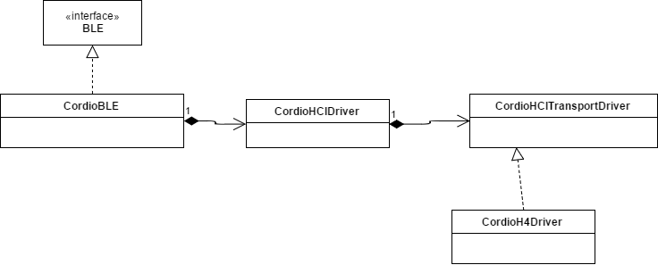

# HCI abstraction architecture

The HCI driver is split into two interfaces:
* `CordioHCIDriver`: It is the driver for a BLE controller. It contains
the primitive necessary to start and initialize the controller.
* `CordioHCITransport`: It is the transport interface which is used by the HCI
driver to communicate with the controller.

A `CordioHCITransport` is injected into a `CordioHCIDriver` at construction
time. A `CordioHCIDriver` is also injected at construction time of a `BLECordio`
instance.

This can be summarized in the following diagram:

## CordioHCITransportDriver

The single responsibility of this driver is to handle the communication with
the Bluetooth module. Basically, sending and reading bytes.

Given that the Bluetooth specification defines standard transport interface, an
implementation of the H4 interface is bundled in this port. It might be extended
in the future with an implementation of the H5 interface. However, there is no
plan to provide the SDIO implementation at the moment.

This interface is defined in the header file
[CordioHCITransportDriver.h](../CordioHCITransportDriver.h)

## CordioHCIDriver

The responsibilities of this driver are:
* Provide the memory which will used by the Bluetooth stack.
* Initialize the Bluetooth controller.
* Handle the reset/startup sequence of the Bluetooth controller.

This interface is defined in the header file
[CordioHCIDriver.h](../CordioHCIDriver.h)

A partial implementation is present in the file
[CordioHCIDriver.cpp](../../../../source/cordio/driver/CordioHCIDriver.cpp). It defines the function
delivering memory to the stack and a complete reset sequence. However, it does
not define any initialization for the Bluetooth controller, this part being
specific to the controller used.

The driver also provides an interface to perform RF testing on the BLE trasnmitter.
This is done using the LE Receiver/Transmitter Test command and LE Test End command
as described in the Bluetooth Core spec in Vol.2, Part E, 7.8.28-30. 

The driver allows to set preferred TX power. This is an optional feature
(check return code) and the support for it and the extent of control is
down to the BLE chip. Chips may have different allowed values, although the
command will pick the closest value no smaller than requested. Please refer
to the controller code or BLE chip documentation.
