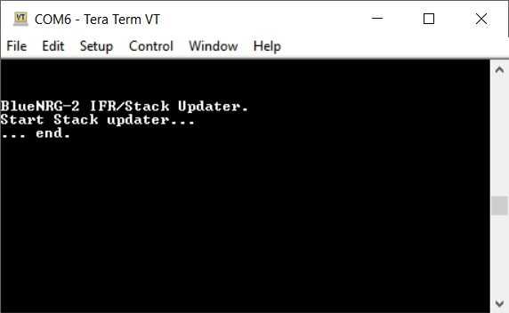
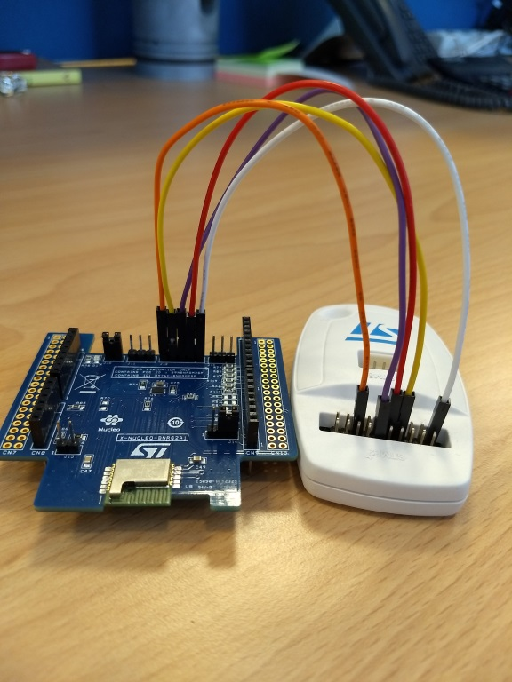
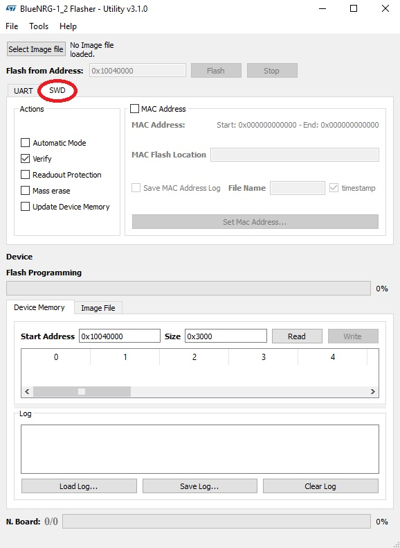
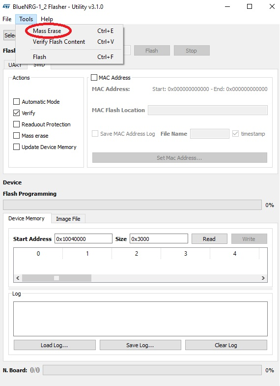
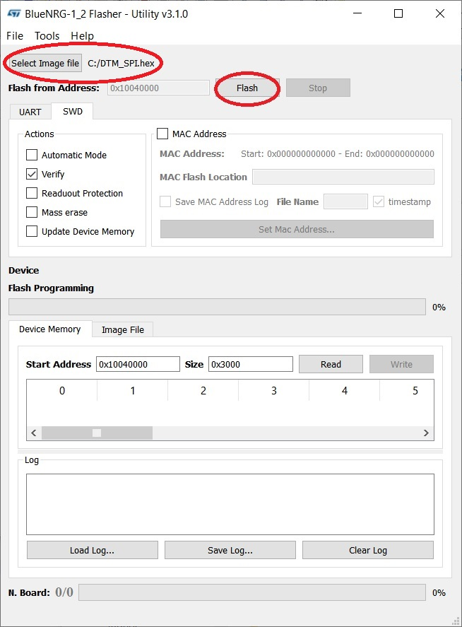

# BlueNRG_2

HCI driver for BlueNRG_2 BLE component

A simple table like this could help:

|Module Name|Processor Name|Bluetooth compliance|Status|Used in shields & boards|Link|
|-------------|-----------|-----|-|-|-|
|SPBTLE-RF    |BlueNRG-MS (network processor) |v4.1 |Not recommended for new designs             |X-NUCLEO-IDB05A1, DISCO-L475VG-IOT01A, DISCO-L562QE | https://www.st.com/en/wireless-transceivers-mcus-and-modules/spbtle-rf.html |
|BlueNRG-M0   |BlueNRG-MS (network processor) |v4.2 |Active (included in ST's Longevity Program) |X-NUCLEO-IDB05A2 | https://www.st.com/en/wireless-transceivers-mcus-and-modules/bluenrg-m0.html |
|BlueNRG-M2SP |BlueNRG-2 (application processor) |v5.0 |Active (included in ST's Longevity Program) |X-NUCLEO-BNRG2A1 | https://www.st.com/en/wireless-transceivers-mcus-and-modules/bluenrg-m2.html |


The library uses ARM Cordio stack. It does not work with the stock firmware that is loaded in the BLUENRG-M2SP BLE module of the X-NUCLEO-BNRG2A1 expansion board.

In order to use this library with X-NUCLEO-BNRG2A1, you need to update the firmware of the BLUENRG-M2SP BLE module mounted on that expansion.

To this aim, attach the X-NUCLEO-BNRG2A1 to the STM32 NUCLEO board through the Arduino Connector. You can use the binary provided for both STM32 NUCLEO-F401RE and STM32 NUCLEO-L476RG.

Download the binaries from the links below:

[BLE2_StackUpdater_F401RE.bin](https://github.com/STMicroelectronics/mbed-ble/blob/master/BlueNRG2_StackUpdater/BLE2_StackUpdater_F401RE.bin)

[BLE2_StackUpdater_L476RG.bin](https://github.com/STMicroelectronics/mbed-ble/blob/master/BlueNRG2_StackUpdater/BLE2_StackUpdater_L476RG.bin)

Before flashing your target board with the respective binary, be careful to properly set the SPI reset on pin **D7** as reported in the picture below:


At the end of the updating procedure, the LED labeled as **LD2** on the STM32 NUCLEO board will be blinking.
You can also check the status of the updating procedure on the serial terminal (baud rate set to 115200).
The picture below shows the log upon success:



If, for some reason, the updating procedure does not succeed you can use a standard ST-Link V2 with 5 jumper wires female-female together with the
[BlueNRG2_FlasherUtility](https://github.com/STMicroelectronics/mbed-ble/blob/master/BlueNRG2_FlasherUtility/en.STSW_BNRGFLASHER.zip) software tool (currently available only for Windows PC).

You need to connect the J12 pins of the X-NUCLEO-BNRG2A1 to the pins of the ST-Link V2 as shown in the picture below:



In particular, we have the following connections:

|Pin number on J12|Pin number on ST/Link V2|
|--------|----------|
|1       |1         |
|2       |9         |
|3       |12        |
|4       |7         |
|5       |15        |

Install the ST BlueNRG-1_2 Flasher Utility and open it, then select the SWD tab:



Erase the flash memory of the BlueNRG-2 chip:



Download the Firmware for the BLE module from the following link:

[DTM_SPI.hex](https://github.com/STMicroelectronics/mbed-ble/blob/master/BlueNRG2_Firmware/DTM_SPI.hex)

Load the Firmware in the ST BlueNRG-1_2 Flasher Utility and then press the "Flash" button:



If you should find some issues during the update process, you can try to repeat the procedure closing the J15 jumper on the X-NUCLEO-BNRG2A1 expansion board.

## Expansion Board

### X-NUCLEO-BNRG2A1

Bluetooth Low Energy Nucleo Expansion Board:

https://os.mbed.com/components/X-NUCLEO-BNRG2A1/

## Driver configuration

In order to use the BlueNRG-M2SP module together with other targets,
you may need to override default settings in your local `mbed_app.json` file

### Arduino Connector Compatibility Warning

Default Arduino connection is using:

```
        "SPI_MOSI":  "D11",
        "SPI_MISO":  "D12",
        "SPI_nCS":   "A1",
        "SPI_RESET": "D7",
        "SPI_IRQ":   "A0",
        "SPI_SCK":   "D3",
        "valid-public-bd-address": false
```

X-NUCLEO-BNRG2A1 is Arduino compatible with an exception: instead of using pin **D13** for the SPI clock, pin **D3** is used.
The default configuration for this library is having the SPI clock on pin **D3**.

You should use the jumper labeled as J14 to change the SPI clock pin configuration.

#### SPI clock jumper settings

|Settings|Pin 1|Pin 2|Pin 3|
|--------|-----|-----|-----|
|**D3**  |Open |Short|Short|
|**D13** |Short|Short|Open |

In case you change the default configuration, then you also have to configure this library to use pin **D13** to drive the SPI clock.
To this aim you need to update your local mbed_app.json file with:

```
    "target_overrides": {
        "XXXX": {
            "SPI_SCK": "D13"
        },
```

If you use pin **D13** for the SPI clock, please be aware that on some STM32 Nucleo boards you may **not** drive the LED,
otherwise you will get a conflict: the LED on STM32 Nucleo boards is connected to pin **D13**.

To correctly set the SPI reset on pin **D7** resistor R117 should be mounted.
Alternatively, pin **D7** of the Arduino connector (**CN9**) and pin #5 of the jumper labeled as J12 should be bridged.

### Target Configuration

To use that library, the target requires some extra configuration in the application `mbed_app.json`. In the `target_overides` section:   

* BlueNRG module has to be enabled

```json
"target.components_add": ["BlueNRG_2"]
```

* BLE feature has to be enabled

```json
"target.features_add": ["BLE"]
```

* Extra labels have to be defined to include the cordio stack and this library: 

```json
"target.extra_labels_add": ["CORDIO"]
```

As an example, the target overide section for the `NUCLEO_F401RE` would be: 

```json
        "NUCLEO_F401RE": {
            "target.components_add": ["BlueNRG_2"],
            "target.features_add": ["BLE"]
            "target.extra_labels_add": ["CORDIO"]
        }
```

### Known limitations

Security does not work with privacy due to pairing failure.