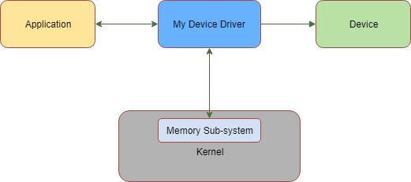
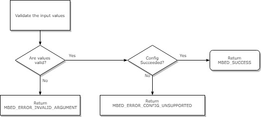
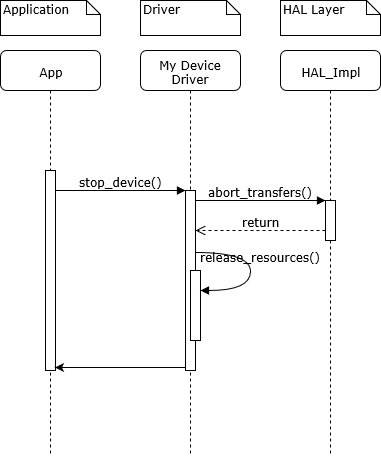

# Mbed OS design document

Write your feature title above. In this case, its "Mbed OS design document."

# Table of contents

1. [Mbed OS design document](#mbed-os-design-document).
1. [Table of contents](#table-of-contents).
    1. [Revision history](#revision-history).
1. [Introduction](#introduction).
    1. [Overview and background](#overview-and-background).
    1. [Requirements and assumptions](#requirements-and-assumptions).
1. [System architecture and high-level design](#system-architecture-and-high-level-design).
    1. [System architecture and component interaction](#system-architecture-and-component-interaction).
1. [Detailed design](#detailed-design).
1. [Usage scenarios and examples](#usage-scenarios-and-examples).
1. [Tools and configuration changes](#tools-and-configuration-changes).
1. [Other information](#other-information).
    1. [Reusability](#reusability).
    1. [Deprecations](#deprecations).
    1. [References](#references).
    1. [Custom headings](#custom-headings).

### Revision history

1.0 - A brief description of this version. For example, Initial revision - Author name - Date. 
**NOTE: You may also specify the Mbed OS version this revision of design document applies to.**
1.1 - Added new section - Author name - Date.

# Introduction

### Overview and background

Provide a background of this feature. Briefly explain why this feature is necessary, what it accomplishes and what problem it solves. If you already have written a requirement for this feature, you may also use the contents of the requirement to provide the user with the overall context of why this feature is necessary.

For example:

This document provides a template for writing software design documents for Mbed OS features.

### Requirements and assumptions

Capture the requirements for this feature to work and other assumptions made. For example, if you are assuming specific hardware capabilities, memory requirements or security assets, such as the presence of a Root of Trust infrastructure, then capture those here. 

For example:

This feature requires a QuadSPI interface on the target because this feature implements a block device driver over the QuadSPI interface. It also assumes the system can provide 16K of memory for buffering.

# System architecture and high-level design

This section provides high-level information about areas or components that need changes or new development to implement this feature. Capture the high-level design goals of this feature for the target reader. Focus on what functionality it provides and not the actual implementation. For example, if you are implementing a new device driver for a communication peripheral or device, then the high-level design goals may look like:

- `Configuring the device` - The driver should provide a specific interface to configure the communication paramaters for the device.
- `Starting and stopping the device` - The driver should provide interfaces to start and stop all the communications.
- `Reading from and Writing to the device` - Read and Write interfaces should be implemented to support sending single and multiple bytes. 
- `Resetting the device` - Functionality to reset the device should be provided.

 Add more description to each high-level design goal if required.

**NOTE: If you already have publicly available supporting architecture documentation in the form of technology documents or other existing documents, please link  to them instead of replicating the documentation.**

For each high-level design goal, provide a detailed software design in the [detailed design](#detailed-design) section, including more details on implementation.

### System architecture and component interaction

Description and diagrams showing overall architecture of how the components and resources interface with one another. This section captures high-level components and their interaction and not the minute details. For example, if the new feature implements a driver and provides interfaces with application and uses memory subsystem in OS to talk to the device, the diagram may look something like:



# Detailed design

This section provides a detailed design on the implementation of each of the high-level design goals. This section also captures each component or module needing changes in detail. The target audience is a developer who can read this section and start the implemention. You can capture the signature of interfaces, flow charts showing how the APIs work, data flow diagrams and so on. The headings for each detailed design section match the headings in the high-level design goals. For example, based on the example above, the headings for the detailed design sections aree `Configuring the device`, `Starting and stopping the device`, `Reading from and Writing to the device` and `Resetting the device`.

### Detailed design 1 (For example, `Configuring the device`)

**API description**

Detailed API description, such as the signature of the interface, explanation of arguments, return codes and so on. For example, if you are defining an interface for configuring the device, you may describe the API like this:

    `Configure API should have following signature:
    mbed_error_status_t configure(int speed, enum flow_control_t flow_control, int parity_bits);`
    where:`
        speed - is an integer value representing the target communication speed
        flow_control - is the enum value representing the flow control to be used
        parity_bits - is an integer value indicating the parity_bits to be used
       
    And the function should return mbed_error_status_t value indicating the result of the call as below:
        MBED_SUCCESS if the call is successful.
        MBED_ERROR_INVALID_ARGUMENT if input values are invalid.`
        MBED_ERROR_CONFIG_UNSUPPORTED if the device doesnt support the requested configuration.`

**Configuration sequence diagram**  

Sequence diagrams, data flow diagrams and so on. For example, the flow chart for configure device API above may look something like:



### Detailed design 2 (For example, `Starting and stopping the device`)

**API description**

Detailed API description, such as the signature of the interface, explanation of arguments, return codes and so on. For example, for start and stop functions exported by the driver.

**Sequence diagrams for `Starting and stopping the device`**

Sequence diagrams, data flow diagrams and so on. For example, the sequence digram for stopping the device may look something like:



### Detailed design 3 (For example, `Reading from and Writing to the device`)

**API description**

Detailed API description, such as the signature of interface, explanation of arguments, return codes and so on.

**Sequence diagram for `Reading from and Writing to the device`**

Sequence diagrams, Data flow diagrams and so on.

### Detailed design N (For example, `Resetting the device`)

**API description**

Detailed API description, such as the signature of the interface, explanation of arguments, return codes and so on.

**Sequence diagram for `Resetting the device`**

Sequence diagrams, data flow diagrams and so on.

# Usage scenarios and examples

Show pseudocode or flowcharts explaining the use of the feature. For example, you may want to include some pseudocode to demonstrate how to use the read functionality with the new driver design you are proposing.

### Scenario 1 (For example, `Reading from the device`)

Mention the specific use scenarios. For example, the below examples shows how to read data from device using the new APIs.

**Scenario 1 example 1. (For example, `Reading a byte from device`**)

Mention the specific use. For example, the below example shows pseudocode for how to read a single byte data from the device using the new APIs.

```C
char in_byte = 0;
int num_bytes_read = read(&in_byte, 1);
if(num_bytes_read == 1) {
    //do something
    ...
}
```

**Scenario 1 example 2 (For example,`Reading multiple bytes from the device`**)

In this example, the pseudocode below shows how to read multiple bytes of data from the device using the new APIs.

```C
char in_bytes[NUM_BYTES];
int num_bytes_read = read(in_bytes, NUM_BYTES);
if(num_bytes_read == NUM_BYTES) {
    //process bytes read
    ...
}
```

### Scenario 2 (For example, `Writing to the device`)

Mention other usage scenarios here. For example, you can demostrate how to write to the deviceand few examples of usage.

**Scenario 2 example 1 (For example,`Writing a byte to device`**)

Demonstrate the specific example, for example, how to write a byte of data to device.

**Scenario 2 example 2 (For example, `Writing multiple bytes to device`**)

Demonstrate another specific example, for example, how to write mutiple bytes of data to device.

# Tools and configuration changes

Explain which tools need to change and the nature of changes. For example, if the feature requires adding a new subcommand to Arm Mbed CLI, capture the details of changes and use. Capture each tool change under its own subheading as below. You can also capture new configuration values that need to be added to the Mbed .json-based configuration system. For each configuration value added, explan
the name of the configuration value, how to use it and its relation to any preprocessor defines in the implementation.

### Tool change 1

For example, command-line additions and changes

### Configuration changes

For example, configuration changes in .json files

# Other information

Add other relevant information you would like to capture. Add custom headings if required.

### Reusability

List the components or pieces of implementation that can be reused for specific design patterns or other implementations.

### Deprecations

List the APIs that may be deprecated as part of this feature.

### References

Capture information, such as specifications, other design documentation and other implementations URLs.

### Custom headings

Add custom headings. For example, you can put security effects of this feature under the heading `Security effects`.
