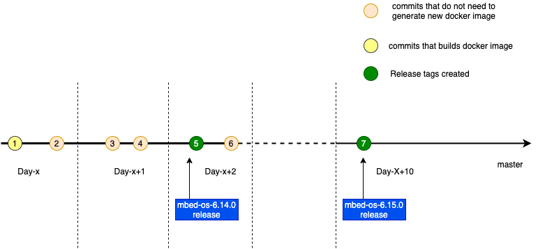

# mbed-os-env Docker management

### Overview and background

The Docker image `mbed-os-env` bundles all the necessary tools to provide a minimal environment to build and test Mbed OS applications. This Docker image shall be used in Continuous Integration pipelines or in other use cases where Mbed OS tools and dependencies are required. This document explains versioning strategy of the Docker image and the GitHub Actions workflows that creates these Docker images.

### Types of Docker images

**Production Docker image**
These are Docker images compatible with a released version of Mbed OS. For example when `mbed-os-6.14.0` is released, a Docker image with tag `mbed-os-6.14-latest` is available.

**Development Docker image**
These are Docker images compatible with a `HEAD` of the Mbed OS master branch. These are tagged with `master-latest`.

### Types of Docker image updates

There are two types of Docker image updates.

**Active Updates** 
Typically these types of changes that involve modifications in Dockerfile or changes in the requirements.txt. Examples: Mbed OS adds support for new compiler version and hence needs a Dockerfile update.

**Passive updates** 
These are scheduled updates on existing mbed-os-env Docker images to provide security and bug fixes of dependent packages. In updates like this, there will be no change in Dockerfile but rebuilding the Dockerfile provides a new docker image with updated tools and packages.

### Types of Docker tags
For the purpose of mbed-os-env Docker management we will need to apply a few Docker tags on the image.

**latest tags**
These tags have the format `<name>-latest`, for example `mbed-os-6-latest`. The `-latest` at the end indicates that the same tag may be reapplied to another image when a Docker image is updated. This obviously means, a user pulling the image with same tag name may get different images at different point of time.

**fixed tags**
Using latest tags, user can retrieve an updated version of Docker image. Troubleshooting could become tricky if Docker images are updated and new images are retrieved in the middle of troubleshooting session. Also, some user could decide not to get updated version and would want to stick to a fixed version.

For reasons stated above, all the Docker images are suffixed with a fixed tag. These tags are only applied to one image and never reused. Tags are of the format `mbed-os-<version>-<date>`, for example `mbed-os-6.14.0-2021.06.19T04.43.51`, `main-2021.06.19T04.43.51` etc.

### Dockerfile versioning
The mbed-os-env image is created with the Dockerfile stored in this repository itself. This provides easy versioning of the Dockerfile as it will follows the same versioning strategy of Mbed OS.

### Docker image versioning

The picture below illustrates a typical situation where Mbed OS accepts changes to the `master` branch on daily basis and makes releases on regular basis.

**On Day-X** There are some changes for [active updates](#Type-of-Docker-image-updates) (for example, the Dockerfile has been changed), so these are the Docker images created or updated

* `mbed-os-env:master-latest`
* `mbed-os-env:<master-day-x>` - This is a fixed tag.

:information_source: `master-latest` tag is checked for [passive updates](#Type-of-Docker-image-updates) as scheduled in the workflow.

**On Day-X+1** Though there are commits to Mbed OS source repository. These do not involve changes to Dockerfile or dependencies like `requirements.txt`. Hence, no Docker image is created at the time of merging the commit.

**On Day-X+2** A new Mbed OS release `mbed-os-6.14.0` is created. This creates an image with following Docker tag.

* `mbed-os-env:mbed-os-6-latest` - This Docker tag could be used to get a compatible image for latest `mbed-os-6` release.
* `mbed-os-env:mbed-os-6.14-latest` - This Docker tag  could be used to work with updated `mbed-os-6.14` release. This image is passively updated till next mbed-os release on the branch (typically till `mbed-os-6.15.0`).
* `mbed-os-env:mbed-os-6.14-day-x` - A fixed Docker tag.

:information_source: `mbed-os-6.14-latest`, and `mbed-os-6-latest` will be passively updated as scheduled in th workflow.

**On Day X+10** Another new release `mbed-os-6.15.0` is made. This creates an image with following Docker tag.

* `mbed-os-6-latest`
* `mbed-os-6.15-latest`
* `mbed-os-6.15-day-x`

:information_source: From this point, `mbed-os-6.14-latest` will no longer be passively updated. From this point, only `mbed-os-6.15-latest` is selected for passive update. Only last release version is passively updated on a branch.

## GitHub Actions Workflows

### Goals of Docker management workflows

* Distribution of Docker image that is compatible with released version of Mbed OS.
* Providing Docker image that is compatible with the `HEAD` of the `master` branch.
* Keeping the released and development Docker image up to date.

There are 4 main workflows

**PR check**
The purpose of this workflow is to make sure build, and test of mbed-os-env Docker image works as expected. Hence this workflow is triggered when Mbed OS PR is created with changes in Dockerfile, test files, or workflow files itself has some modifications. Since most of the Mbed OS PR doesn't contain Docker image related changes, this workflow is not expected to be triggered often.

**Publish Docker image for the HEAD of Mbed OS branch**
The purpose of this workflow is to update development Docker image either when there is an active update or at nightly for passive update.

:bulb: This workflow can also be triggered manually to update the development image. For example, workflow can be triggered manually to update the Docker image during the day.

**Production Docker image Creation/Update**
This workflow will create a new Docker image with versioning strategy describe above. Also, triggered nightly for passive update.

:bulb: This workflow can also be triggered manually to update an old version of released Docker image. For example, this workflow could be manually triggered to update `mbed-os-6.14-latest` after `mbed-os-6.15.0` is released.

**Prune Docker image**
The Docker image in temporary area is pruned by this workflow. Number of dates since updated is used as criteria for pruning.

### Pipeline

The Docker image management goes through typical CI pipeline of build, test, and release stages.

There are some details worth mentioning though.

**Build**

The `docker buildx` command is used for creating multi architecture Docker image. To build Docker image using buildx, one needs to push the image to a remote repository while building it. Since, we need to test before release, the resulting images are pushed to a temporary Docker repository just after building.

The GitHub Container Registry doesn't implement yet all the Docker manifest APIs. Hence, a few features like deleting tag from an image is not available yet. Once these are implemented, we may remove temporary repository and add temporary tags to the image and delete the temporary tags after workflow.

**Test**
After the temporary Docker image is built, GitHub Actions tests the image prior to deploying the image to the production Docker repository. Please refer to the `test-container` job in the workflow for details on the test plan.

**Deploy**
In the `Deploy` job, depending on the result of test job, temporary images are moved to production repository.

### Docker repository
GitHub provides free Docker image storage for public repositories in GitHub packages. The workflows make use of `{{ secrets.GITHUB_TOKEN }}`  https://docs.github.com/en/actions/reference/authentication-in-a-workflow

For deleting images from temporary repository, a new token `GITHUB_DELETE_IMAGE_TOKEN` needs to be added with package delete permissions.

There are two Docker repositories used for managing the Docker images:

**mbed-os-env** This is the public repository user can pull the images from.

**mbed-os-env-tmp** This is a private repository created for temporary management of Docker images while Docker images are being tested. This is a staging area. Unfortunately, the GitHub Container Registry does no support renaming Docker tags, hence the need for a temporary repository.

### Workflow for forks

GitHub by default will disable workflow for forked repositories. It will be up to owner of the forked repositories to enable or disable GitHub Actions as needed.

### Usage in example application
For details on branches and version, please refer to [Mbed OS and example application release workflow](https://os.mbed.com/docs/mbed-os/latest/introduction/versions-and-releases.html).

In Mbed OS example application repositories, `mbed-os-env:master-latest` can be used at the time of `release_candidate`(and `release tag` creation), as at the time of release candidate and release creation, example repositories will be pointing to the `master` branch of Mbed OS.
