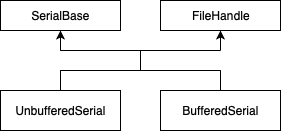

# Serial design document

# Table of contents

1. [Serial design document](#serial-design-document).
1. [Table of contents](#table-of-contents).
    1. [Revision history](#revision-history).
1. [Introduction](#introduction).
    1. [Overview and background](#overview-and-background).
    1. [Requirements and assumptions](#requirements-and-assumptions).
1. [System architecture and high-level design](#system-architecture-and-high-level-design).
    1. [System architecture and component interaction](#system-architecture-and-component-interaction).
1. [Detailed design](#detailed-design).
1. [Usage scenarios and examples](#usage-scenarios-and-examples).
1. [Other Work](#other-work).
    1. [Related work-Simplification of retarget code](#related-work-simplification-of-retarget-code).
    1. [Future Work-Deprecation of Stream](#future-work-deprecation-of-stream).
1. [Roll-out Plan](#roll-out-plan).
1. [Tools and configuration changes](#tools-and-configuration-changes).
1. [Other information](#other-information).
    1. [Deprecations](#deprecations).
    1. [References](#references).


### Revision history

1.0 - Initial version - Evelyne Donnaes - 04/10/2019

# Introduction

### Overview and background

Mbed OS contains multiple serial classes and multiple ways of printing information to the console. Serial classes have evolved over the years to add new functionality to existing classes and compensate for limitations. The result is that there are now multiple variants, not always well documented; therefore it is not clear which class should be used for what purpose. Furthermore, some of the classes pull substantial dependencies whose benefits are not very clear, for example standard library like objects and abstractions, and parts of the system I/O function retarget layer.

This document collects proposals made by various contributors (see [references](#references)) and presents a simplified serial class hierarchy. The aim is to offer two public classes, one for unbuffered I/O and the other for buffered I/O, with a clear definition of which one should be used when. All other serial classes are deprecated and should be removed at a later stage. In addition, the serial classes dependencies will be optimised to only include components that provide valuable functionality.

#### Serial classes in Mbed OS 5.14

**Serial**

`Serial` provides unbuffered I/O and is using blocking HAL calls. It only works for simple printing.

Its main limitations are:
- It uses a mutex lock so it cannot be used from interrupts.
- It wastes a lot of CPU time spinning waiting for serial output and it cannot be used reliably for input because it needs interrupt-speed response on read calls but its high-level API cannot be used from interrupts.
- It lacks buffering so it cannot be used reliably for input and output without flow control.
- It pulls in the C library stdio system because it uses `Stream`.
- Although it is a `FileHandle`, its implementation is blocking only and has incorrect read semantics.

**UARTSerial**

`UARTSerial` provides buffered I/O. It can be used reliably for input from non-interrupt context and to avoid excess spinning waiting for transmission buffer space. It also does better blocking and correct POSIX-like `FileHandle` semantics.

It does not use `Stream` so it has the advantage of not pulling in the C stdio library. The drawback is that it doesn't include built-in printf methods, see [Usage scenarios and examples](#usage-scenarios-and-examples) for an example on how to print to a serial port.

**RawSerial**

`RawSerial` provides unbuffered I/O. It has no locks so it is safe to use in interrupts provided that it is the only instance that is using that serial port. Unlike `Serial` and `UARTSerial`, it is not a `FileHandle`.

### Requirements and assumptions

None

# System architecture and high-level design

Applications will have a choice between two public serial classes:
- `BufferedSerial` should be the default choice for an application, except for specialised cases.
- `UnbufferedSerial` for an interrupt driven application or one that needs to have more control.

### System architecture and component interaction

The below diagram shows the inheritance hierarchy for the serial classes.



# Detailed design

### Detailed design : BufferedSerial

`BufferedSerial` is `UARTSerial` renamed to convey the original purpose of the class. In addition, the new class will allow configurability of the transmit and receive buffer size so that each instance of the class can configure its buffer size according to its intended usage, for example a modem may need a large input buffer and a console may not need any input buffer.

The below diagram shows the detailed inheritance hierarchy for `BufferedSerial`.


```C
class BufferedSerial : private SerialBase, public FileHandle, private NonCopyable<BufferedSerial>
```

`BufferedSerial` privately inherits from `SerialBase`. It means that applications are forced to use the transmit and receive buffers since they cannot access `SerialBase` member functions directly.

**API description**

These are the new constructors for `BufferedSerial`. The first constructor creates the buffers dynamically.

```C
    /** Create a BufferedSerial port, connected to the specified transmit and receive pins, with a particular baud rate.
     *  @param tx Transmit pin
     *  @param rx Receive pin
     *  @param baud The baud rate of the serial port (optional, defaults to MBED_CONF_PLATFORM_DEFAULT_SERIAL_BAUD_RATE)
     *  @param rx_buffer_size The size of the receive buffer (optional, defaults to MBED_CONF_DRIVERS_UART_SERIAL_RXBUF_SIZE)
     *  @param tx_buffer_size The size of the transmit buffer (optional, defaults to MBED_CONF_DRIVERS_UART_SERIAL_TXBUF_SIZE)
     *
     *  @note
     *    Either tx or rx may be specified as NC if unused
     */
    BufferedSerial(PinName tx,
                   PinName rx,
                   int baud = MBED_CONF_PLATFORM_DEFAULT_SERIAL_BAUD_RATE,
                   size_t rx_buffer_size = MBED_CONF_DRIVERS_UART_SERIAL_RXBUF_SIZE,
                   size_t tx_buffer_size = MBED_CONF_DRIVERS_UART_SERIAL_TXBUF_SIZE);
```

The second constructor takes buffer pointers as arguments.

```C
    /** Create a BufferedSerial port, connected to the specified transmit and receive pins, with a particular baud rate.
    *  @param tx Transmit pin
    *  @param rx Receive pin
    *  @param baud The baud rate of the serial port (optional, defaults to MBED_CONF_PLATFORM_DEFAULT_SERIAL_BAUD_RATE)
    *  @param rx_buffer The receive buffer
    *  @param rx_buffer_size The size of the receive buffer
    *  @param tx_buffer The transmit buffer
    *  @param tx_buffer_size The size of the transmit buffer
    *
    *  @note
    *    Either tx or rx may be specified as NC if unused
    */
    BufferedSerial(PinName tx,
                   PinName rx,
                   int baud = MBED_CONF_PLATFORM_DEFAULT_SERIAL_BAUD_RATE,
                   void *rx_buffer,
                   size_t rx_buffer_size,
                   void *tx_buffer,
                   size_t tx_buffer_size);
```

 The rest of the class API is that of `UARTSerial` and is described [here](https://os.mbed.com/docs/mbed-os/v5.14/mbed-os-api-doxy/classmbed_1_1_u_a_r_t_serial.html).


### Detailed design : UnbufferedSerial

`UnbufferedSerial` is a new class that adds a `FileHandle` interface to `RawSerial`. `RawSerial` is the preferred implementation for unbuffered I/O but it lacks a `FileHandle` interface and so it cannot be used by the retarget code. Instead the retarget code uses a non-public `DirectSerial` class which adds to the complexity of classes and should be removed. `UnbufferedSerial` will not provide any of the printf methods that `RawSerial` has; applications should use _fdopen_ to get a _FILE*_ to use the printf function, see [Usage scenarios and examples](#usage-scenarios-and-examples).

The below diagram shows the detailed inheritance hierarchy for `UnbufferedSerial`.


**API description**

This is the proposed API for the `UnbufferedSerial` class.

```C
class UnbufferedSerial: public SerialBase, public FileHandle, private NonCopyable<UnbufferedSerial> {

public:
    /** Create a UnbufferedSerial port, connected to the specified transmit and receive pins, with the specified baud.
     *
     *  @param tx Transmit pin
     *  @param rx Receive pin
     *  @param baud The baud rate of the serial port (optional, defaults to MBED_CONF_PLATFORM_DEFAULT_SERIAL_BAUD_RATE)
     *
     *  @note
     *    Either tx or rx may be specified as NC if unused
     */
    UnbufferedSerial(PinName tx, PinName rx, int baud = MBED_CONF_PLATFORM_DEFAULT_SERIAL_BAUD_RATE);

    virtual ssize_t write(const void *buffer, size_t size);
    virtual ssize_t read(void *buffer, size_t size);
    virtual off_t seek(off_t offset, int whence = SEEK_SET);
    virtual off_t size();
    virtual int isatty();
    virtual int close();
    virtual short poll(short events) const;

#if !(DOXYGEN_ONLY)
protected:

    /* Acquire exclusive access to this serial port
     */
    virtual void lock(void);

    /* Release exclusive access to this serial port
     */
    virtual void unlock(void);
#endif
};
```

# Usage scenarios and examples

### Scenario 1 `Printing to a serial port other than stdout`

The below example shows pseudocode for how to print `Hello` to `device` port using the new API.

```C
UnbufferedSerial device(TX, RX, 115200);
device.write("Hello", 6);
```

Unlike in the case of `Serial::printf`, printf cannot be called directly on a `BufferedSerial` or `UnbufferedSerial` object; instead the application first calls _fdopen_ to get a _FILE*_ to use the printf function.
This allows the usage of more formatting options at the cost of flash memory (about 2300 bytes in a simple blinky application).

```C
BufferedSerial device(TX, RX, 115200);
FILE *out = fdopen(&device, "w");
fprintf(out, "Hello");
```
and similarly for `UnbufferedSerial`

```C
UnbufferedSerial device(TX, RX, 115200);
FILE *out = fdopen(&device, "w");
fprintf(out, "Hello");
```

### Scenario 2 `Printing to stdout`

There is no change in the current APi in regard to printing to stdout.  Applications can call `printf` directly as shown below. The console baud rate can be configured via `platform.stdio-baud-rate` in `mbed_app.json`.

```C
printf("Hello");
```
or
```C
fprintf(stdout, "Hello");
```

Other alternatives to printing to stdout are by calling `puts` or `write`.

```C
puts("Hello");
```
```C
BufferedSerial pc(USBTX, USBRX);
pc.write("Hello", 6);
```

# Other Work

## Related work-Simplification of retarget code

In Mbed, retargeting is implemented by redefining the system I/O functions.
The `FileHandle` abstract class provides an interface with file-like operations, such as read and write that can be redefined by the retarget code. The high-level library functions perform input/output by calling the low-level functions which use the system I/O functions to interface with hardware.

The relationship of `FileHandle` and other APIs is as follows:


The POSIX layer, the memory cost associated with the vtable and virtual functions of the `FileHandle` class, and the static array of `FileHandle*` allocated by the retarget code for file handling has a significant impact on memory. A constrained target that only uses a console does not need file handling and should be able to turn this functionality off.

 A new configuration parameter is introduced to compile the file handling code out. The application can override the default configuration in mbed_app.json as follows:

```C
    "target_overrides": {
        "*": {
            "platform.stdio-minimal-console-only": true
        }
    }
```

There are two approaches to achieve a minimal retarget layer. You can:
1. Redefine the low-level library functions. A detailed description can be found [here](http://infocenter.arm.com/help/index.jsp?topic=/com.arm.doc.dui0475m/chr1358938931411.html)
1. Redefine the system I/O functions.

A minimal console only needs to write a single character at a time. So redefining the default fputc() to directly write to the serial port if the output stream is stdout and bypassing the system I/O functions should achieve higher memory savings. If we take this approach, we will have to rework some error handlers that rely on the POSIX form of `write(STDOUT_FILENO, buf, len)` to do emergency printing.

The second solution keeps the POSIX layer with the main saving coming from dropping the use of `FileHandle` and the file handle table itself. In this case, a `MinimalConsole` class will be implemented as an internal class in the retarget code and `write()` will call `MinimalConsole::putc` in a loop.

```C
class MinimalConsole {
public:
    MinimalConsole(int baud = MBED_CONF_PLATFORM_DEFAULT_SERIAL_BAUD_RATE);
    ~MinimalConsole();
    int getc();
    int putc(int c);
};
```

List of tasks to simplify the retarget code:

- Use `UnbufferedSerial` instead of `DirectSerial`
- Remove `DirectSerial`
- Add a configuration parameter to compile out file handling feature
    - Alternative uses weak console_putc/getc functions

## Future work-Deprecation of Stream

The `Stream` class pulls in the <stdio.h> library. It should be replaced by drivers implementing `FileHandle` directly and applications using `fdopen(FileHandle *)` to get a `FILE*` to use full C/C++ stream features.

`Stream` is currently used by the following classes:
- `Serial`
- `USBKeyboard`
- `USBMouseKeyboard`
- `USBSerial`

Deprecation of `Stream` should be planned in a future release.

# Roll-out Plan

This feature will be implemented in different phases as follows:

Phase 1:
- [Deprecation of APIs](#Deprecations)
- Implementation of new class `UnbufferedSerial`
- Implementation of new class `BufferedSerial`
- Use `UnbufferedSerial` instead of `DirectSerial` in retarget code (as `DirectSerial` is not a public API it can be directly removed)

Phase 2:
- Removal of deprecated APIs

# Tools and configuration changes

### Tool changes

None

### Configuration changes

None

# Other information

### Deprecations

The following APIs will be deprecated:
- `Serial` class
- `RawSerial` class
- `UARTSerial` class

### References

https://github.com/ARMmbed/mbed-os/pull/5655

[Tailoring input/output functions in the C and C++ libraries](http://infocenter.arm.com/help/index.jsp?topic=/com.arm.doc.dui0475m/chr1358938931411.html)
