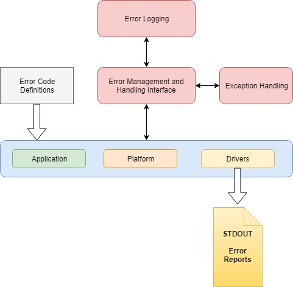
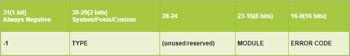
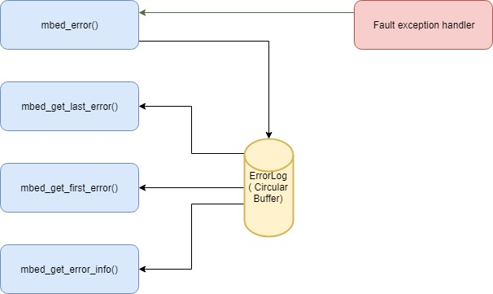
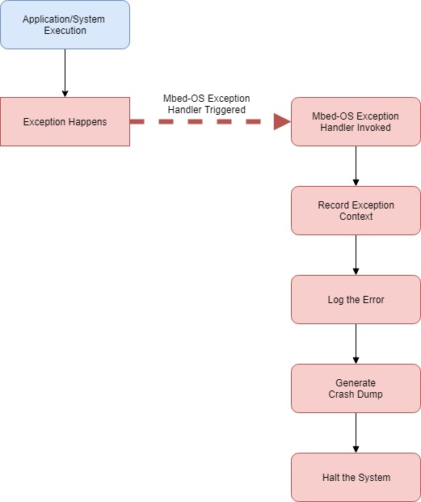
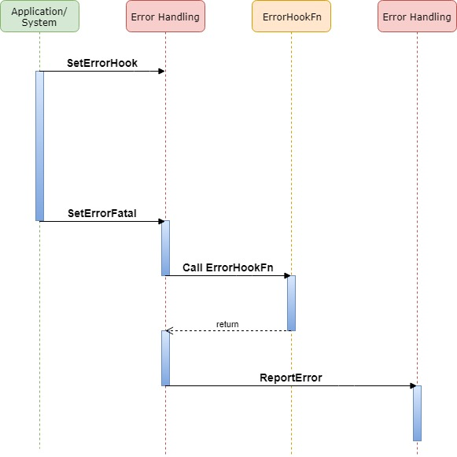

# WARNING: THIS IS AN EXAMPLE DESIGN DOCUMENT

# Standardized error coding and error handling

# Table of contents

1. [WARNING: THIS IS AN EXAMPLE DESIGN DOCUMENT](#warning-this-is-an-example-design-document).
1. [Standardized error coding and error handling](#standardized-error-coding-and-error-handling).
1. [Table of contents](#table-of-contents).
        1. [Revision history](#revision-history).
1. [Introduction](#introduction).
        1. [Overview and background](#overview-and-background).
        1. [Requirements and assumptions](#requirements-and-assumptions).
1. [System architecture and high-level design](#system-architecture-and-high-level-design).
        1. [System architecture and component interaction](#system-architecture-and-component-interaction).
1. [Detailed design](#detailed-design).
1. [Usage scenarios and examples](#usage-scenarios-and-examples).
1. [Tools and configuration changes](#tools-and-configuration-changes).
1. [Other information](#other-information).
        1. [Reusability](#reusability).
        1. [Deprecations](#deprecations).
        1. [References](#references).

### Revision history

1.0 - Initial version - Senthil Ramakrishnan - 7/1/2018

# Introduction

### Overview and background

Presently Mbed OS error handling is not standardized in terms of error codes used and how its handled. This should not be the case as error handling should be unified/standardized and handled in OS level and should be a service available to every component in the system. This makes developing for Mbed OS easier as it enables standard way to describe and communicate error scenarios. This can also enable better error analysis/analytics tools in future. Implementation of standardized error handling should provide APIs for setting the errors and retrieving runtime errors occurred in the system. OS level error handler should collect required data on error scenarios to make it easier for developer to triage the issues later. Error handling implementation should also handle fault exceptions such as Hard Fault, Bus Faults, MemManage faults, Usage Faults to capture the faults context and report them as required and halt the system based on exception type. Sufficient documentation and code comments, in the form of Doxygen comments, should also be provided to enable easy usage of error handling APIs and data structures. This document defines the software design and test strategy for implementing Standardized error codes and error handling in Mbed OS.

### Requirements and assumptions

This feature requires serial terminal support to emit the error report when the system encounters a error scenario. The error reports are printed out for non-release builds only. For release builds, the system still captures the error context (but not printed out) and can be retrieved using error handling APIs.

# System architecture and high-level design

Below are the high-level design goals for "Standardized Error Coding and Error Handling" feature.

**Common error code definitions**

Generic error codes should be defined for common/generic error scenarios. For example, out of memory situation is a common error which needs to be identified with an error code. Any layer of Mbed OS should be able to use these error codes in their implementations to report the errors. It’s up to the receiver/handler of the error code to decide whether the error code should be considered fatal based on current context. Other functionalities, like conversion of error code to human readable string, may also be implemented depending on capability of the target platform like memory available, build profile etc. Applications who should also be able to extend or custom define the error code definitions as required.

**Error handling and management functions**

Implementation should provide necessary APIs for applications and other parts of the system to do the following:

1. Error setting API – An API should be provided for the application to set a system level error using the error code definitions.
1. Error retriever API – Application should be able to read the errors reported over a period, get the number of errors or read the last reported error. 
1. Error clearing API – Application should be able to reset/clear the current set of errors recorded by the system.
1. Fatal Error API – APIs should be provided to handle fatal error scenarios, so that applications can make that call if the error is fatal based on context and the system should record that and halt the system. 

**Error logging**

The implementation should include support for error logging where in the system should capture and log the last N number of errors reported. These errors can be retrieved later for device-health reporting or to analyze the past errors. The error log should also capture the error code, error type and other information as required. The error handling functions mentioned in Section 4.2 should use this logging mechanism to record or retrieve the errors.

**Error reporting**

Implementation should include mechanisms to report errors or fault exceptions to the user through standard input/output or other channels as required when an error scenario happens. The error report should include relevant information to enable efficient triaging of error scenario. There are few different ways to report errors once its captured as below:

1. Print the error report to STDIO/Serial terminal – Almost all development boards have access to serial port as its STDIO and thus reporting it through serial port is required.

**Fault exceptions handling and reporting**

When the system crashes due to fault exceptions, the error handling infrastructure should handle the exception scenario and generate a crash dump containing relevant information for triaging the scenario. The crash dump generated should be reported using the error reporting mechanisms as mentioned in Section 4.4.

**Application hook for error handling**

In many cases, applications developers may want to implement custom error handling for all the errors or custom defined errors. Implementation should include mechanisms to register custom error handler and should call that in the event of an error scenario.

### System architecture and component interaction

The below diagram shows overall architecture of how the above-mentioned components/resources interface with each other.



As shown in the diagram above all software components including Application, Platform code, Drivers can use common error code definitions to represent errors conditions and use that to report the error to Error Handling component. The error handling component interfaces with Error Logging and Error Reporting component to log and report the errors and halt the system if required. Fault exceptions will also be handled by the Exception Handling component and then logged and reported. Also note that a copy of error log may be put in a reserved area in RAM, so that we can report this after a warm reset when the system is back in good state.

# Detailed design

### Common error code definitions

Common error scenarios should be identified and each of them should have corresponding error code defined. The error codes should be extensible by applications needing to define custom error codes.  To facilitate efficient use of memory, 32-bit values should be used to represent each error and encode following information using different fields.

- Code (16 bits) – Unique code identifying the error.
- Entity (8 bits) – Entity or component generating the error.
- Type (2 bits) – System defined error or Custom defined error.
- 31st Bit is always set to make the error code negative.

**NOTE: Remaining bits will be unused and may be used for future expansion/extension.**

The error codes, entity and type should be defined in a platform level header file accessible to all layers of the system (applications, drivers, sdks etc). 

**Capturing POSIX error codes**

Presently many modules (like filesystems) under Mbed OS use Posix error codes to report error back into the system. It’s better to make sure the Posix error code definitions doesn’t overlap with Mbed Error code standardization and make it easier for developers to report Posix error codes into Mbed error coding/handling system if required. Although we support Posix error codes for backward compatibility, its highly encouraged that all future Mbed OS focused implementations use Mbed OS error code definitions so that errors reported works seamlessly with error reporting and handling implementation in Mbed OS. 

To incorporate Posix error code representation into Mbed OS, a portion of error space is allocated for Posix error codes. Since Mbed OS error codes will always be negative, we will capture the negative of the actual Posix error code in the error code defintions. For example, the error code equivalent for EPERM in Mbed OS error code space would be -EPERM. This aligns with Mbed OS error coding convention of using negative values, but the numerical value will be same as the Posix error code.

**Using error codes**

The Mbed OS error codes can be used under 2 circumstances:

1. It can be used as a return value when a function returns indicating the error situation.
A successful return should be either 0 or a positive value. The Mbed OS defined error codes should always be negative as mentioned above.
1. It can also be used to report a fatal/non-fatal error into the Mbed OS error handling system to be reported and recorded in the error log. 

**NOTE: If you are using Posix error code to report into the Mbed OS error handling system make sure you are using the negative of the Posix error code.**

**Error code definitions**

Below are some of the error code definitions to be captured.
ERROR_UNKNOWN                    
ERROR_INVALID_ARGUMENT           
ERROR_INVALID_DATA               
ERROR_INVALID_FORMAT             
ERROR_INVALID_INDEX              
ERROR_INVALID_SIZE               
ERROR_NOT_FOUND                  
ERROR_ACCESS_DENIED              
ERROR_NOT_SUPPORTED              
ERROR_BUFFER_FULL                
ERROR_MEDIA_FULL                 
ERROR_ALREADY_IN_USE             
ERROR_TIMEOUT                    
ERROR_NOT_READY                  
ERROR_FAILED_OPERATION           
ERROR_OPERATION_PROHIBITED       
ERROR_OPERATION_ABORTED          
ERROR_WRITE_PROTECTED            
ERROR_NO_RESPONSE                
ERROR_SEMAPHORE_LOCK_FAILED      
ERROR_MUTEX_LOCK_FAILED          
ERROR_SEMAPHORE_UNLOCK_FAILED    
ERROR_MUTEX_UNLOCK_FAILED        
ERROR_CRC_ERROR                  
ERROR_OPEN_FAILED                
ERROR_CLOSE_FAILED               
ERROR_INITIALIZATION_FAILED      
ERROR_BOOT_FAILURE               
ERROR_OUT_OF_MEMORY              
ERROR_OUT_OF_RESOURCES           
ERROR_ALLOC_FAILED               
ERROR_FREE_FAILED                
ERROR_OVERFLOW                   
ERROR_UNDERFLOW                  
ERROR_STACK_OVERFLOW             
ERROR_ISR_QUEUE_OVERFLOW         
ERROR_TIMER_QUEUE_OVERFLOW       
ERROR_CLIB_SPACE_UNAVAILABLE     
ERROR_CLIB_MUTEX_INIT_FAILURE    
ERROR_CREATE_FAILED              
ERROR_DELETE_FAILED              
ERROR_THREAD_CREATE_FAILED       
ERROR_THREAD_DELETE_FAILED       
ERROR_PROHIBITED_IN_ISR_CONTEXT  
ERROR_PINMAP_INVALID             
ERROR_RTOS_EVENT                 
ERROR_RTOS_THREAD_EVENT          
ERROR_RTOS_MUTEX_EVENT           
ERROR_RTOS_SEMAPHORE_EVENT       
ERROR_RTOS_MEMORY_POOL_EVENT     
ERROR_RTOS_TIMER_EVENT           
ERROR_RTOS_EVENT_FLAGS_EVENT     
ERROR_RTOS_MESSAGE_QUEUE_EVENT   
ERROR_DEVICE_BUSY                
ERROR_CONFIG_UNSUPPORTED         
ERROR_CONFIG_MISMATCH            
ERROR_ALREADY_INITIALIZED        
ERROR_HARDFAULT_EXCEPTION        
ERROR_MEMMANAGE_EXCEPTION        
ERROR_BUSFAULT_EXCEPTION         
ERROR_USAGEFAULT_EXCEPTION       	

**Error type definition**

Below are the error types supported. Mbed OS defined error codes should be classified as system error codes. A platform or implementation can always define their own error codes but should use custom error types to classify those. In addition, Posix error codes should also be supported under error code definitions, handling and reporting. This enables better diagnostics and routing for defects reported by the system. To capture all these error types under negative integer space, each error type will be assigned a range of negative error space. See Section 5.1.6 - Error Codes Values/Ranges for details.

	ERROR_TYPE_SYSTEM,
	ERROR_TYPE_CUSTOM,
	ERROR_TYPE_POSIX ( = 3 )
		
**Entity or component type generating the error**

There should be definitions to capture the origination or location of the error. The below are some of the entity definitions which should be captured by the error handling system to identify where the error is originating from.

ENTITY_ANY ( = 0 ),
ENTITY_APPLICATION,
ENTITY_PLATFORM,
ENTITY_KERNEL,
ENTITY_NETWORK_STACK,
ENTITY_HAL,
ENTITY_MEMORY_SUBSYSTEM,
ENTITY_FILESYSTEM,
ENTITY_BLOCK_DEVICE,
ENTITY_DRIVER,
ENTITY_DRIVER_SERIAL,
ENTITY_DRIVER_RTC,
ENTITY_DRIVER_I2C,
ENTITY_DRIVER_SPI,
ENTITY_DRIVER_GPIO,
ENTITY_DRIVER_ANALOG,
ENTITY_DRIVER_DIGITAL,
ENTITY_DRIVER_CAN,
ENTITY_DRIVER_ETHERNET,
ENTITY_DRIVER_CRC,
ENTITY_DRIVER_PWM,
ENTITY_DRIVER_QSPI,
ENTITY_DRIVER_USB,
ENTITY_TARGET_SDK,

The bit field representation of these fields in unsigned 32-bit integer should be as below. The error code will always be represented as negative.



The platform should define a data type which maps to error status. For example, typedef int MbedErrorStatus;

The implementation should also provide convenient macros to combine Error Code, error type and Entity to build the error status. For example, the following could be the helper macro.

MAKE_ERROR (type, entity_type, code)

For example, the usage would be:

my_new_error_status = MAKE_ERROR (ERROR_TYPE_SYSTEM, ENTITY_DRIVER, ERROR_OUT_OF_MEMORY );

**Error codes values and ranges**

Based on error code definitions below are the error code ranges for each error type.
Posix Error Codes: 1 to 255
System Error Codes: 256 to 4095
Custom Error Codes: 4096 to 65535 

The corresponding error status encoding for entity = 0(ENTITY_ANY) entity should be encoded as below. Note that error statuses are always negative.
Posix Error Statuses: 0xFFFFFFFF – 0xFFFFFF01 – This corresponds to Posix error codes in negative.
System Error Statuses: 0x80000100 – 0x80000FFF - This corresponds to Custom error codes with entity field set to ENTITY_ANY.
Custom Error Statuses: 0x80001000 – 0x8000FFFF - This corresponds to System error codes with entity field set to ENTITY_ANY.

### Error handling and management functions

The implementation should provide necessary APIs for error handling and error management. These APIs are expected to be called from C and C++ code as this will be used by SDK/Target/HAL code as well. The system should also capture each error with some context specified by a data structure. That error context data structure should capture information such as – current thread, filename of the source file where the error is logged from etc. A sample error context data structure may be as below.

**Error context data structure**

Below shows what the Error context data structure may contain.

```C
typedef struct _mbed_error_ctx {
    uint32_t error_function_address;
    uint32_t thread_id;
    uint32_t thread_entry_address;
    uint32_t thread_stack_size;
    uint32_t thread_start_mem;
    uint32_t thread_current_sp;
    char error_filename[n]; 
    uint32_t error_line_number;
} mbed_error_ctx;
```

The filename capture will be in the form of an ascii string and the maximum size of that string depends on memory/resources provided by the platform and can be made a configurable.

Below are some APIs expected to be supported: 

**mbed_error ()**

This call can be used to log a fatal error and halt the system. The caller will not get the control back as the system will be halted. 

The API signature shall be as below, the error_msg is optional and can be NULL.

MbedErrorStatus set_error_fatal(MbedErrorStatus error_status, char *error_msg, unsigned int error_value, char *filename, int line_number);

**mbed_get_last_error ()**

This API is called to get the last error code logged into the system. If there are no errors recorded this function should return ERROR_NOT_FOUND.

The API signature shall be as below:

MbedErrorStatus get_last_error(void)

**mbed_get_error_count ()**

This API should return the total number of errors reported from the last boot. Note that this is different from number of errors we logged which may be only a subset of recent errors reported.

The API signature shall be as below:
int get_error_count ()

**mbed_get_error_log_info ()**

This API is called to retrieve the error context information which is logged as part set_error() call. It should take the index of the error for which the error information is requested. If there is no error information found it should return NULL for error_info, and function should with an error value (ERROR_NOT_FOUND?). If the index is invalid it should return an error code (ERROR_INVALID_INDEX?).  

The API signature shall be as below:

MbedErrorStatus get_error_log_info (int index, mbed_error_ctx *error_info);
Memory for error_info should be pre-allocated by the caller.

**mbed_get_last_error_log_info ()**

This API is called to retrieve the error context information which is logged as part of the last set_error() call. If there is no error information found it should return NULL for error_info, and function should with an error value (ERROR_NOT_FOUND?).

The API signature shall be as below:

MbedErrorStatus get_last_error_log_info (mbed_error_ctx *error_info);

**mbed_get_error_log_count ()**

This API should return the total number of errors in the error log. Note that this will be a set of latest reported errors depending on the size of error log.

The API signature shall be as below:

int get_error_log_count ()

**mbed_clear_all_errors ()**

This API will reset the logged errors and set the error count to 0 as well. This can be useful for testing purposes and initialization.

The API signature shall be as below:

MbedErrorStatus clear_all_errors ()

### Error logging

The implementation should provide an error logging system to record a limited number of most recent errors. The number of entries in the log may be configurable depending on memory constraints. The error log can be implemented as a circular buffer which captures most recent errors. The APIs described above will act on this buffer. The buffer may not be exposed externally, and the users or applications should use the APIs to interact with this buffer. The error log should also be able to record some error data specific to the error being reported maxed at pre-defined number of bytes (For example, 64 bytes? per entry). This may be configurable depending on use case. Below diagram shows the interaction between error log and the APIs which access the log buffer.



### Error reporting

When a subsystem or any component in the system encounters a fatal error, it will be reported to the error reporting subsystem which should print the error information through STDOUT (which is usually the serial terminal) with relevant information. The information printed out should contain the error code, the function (address) which reported the error, the stack trace (raw data from the current stack), the time of crash etc, current task info etc. For example, below shows a sample of what could be reported as part of fatal error handling.

Error Code: error code
Error Function: calling function
File: filename:nnn
Task Info: current task
Stack Dump: dump some words from the stack

The error reporting subsystem may support backing this error log into filesystem, if provided by the platform. Every time we back that up in filesystem, we also clear the current log in RAM. The backing up of Error log into filesystem should be triggered by calling an explicit API such as below.

**mbed_save_error_log()**

This API should be called to save the current error logs to a backup device such as filesystem.

The API to save the error log may be as below:

MbedErrorStatus save_error_log(char *backupFileName)
The backupFileName captures the filename to be used for error log in filesystem.

### Fault Exceptions Handling
Cortex-M based processors trigger fault exceptions when the core encounters an unrecoverable error. Below are the fault exceptions triggered by Cortex-M based processor.

- MemManage Exception - Memory accesses that violate the setup in the MPU and certain illegal memory accesses trigger memory management faults.
- BusFault Exception - When an error response is received during a transfer on the AHB interfaces, it produces bus faults.
- UsageFault Exception - Division by zero, unaligned accesses and trying to execute coprocessor instructions can cause usage faults.
- HardFault Exception - Triggered on all fault conditions or if the corresponding fault handler (one of the above) is not enabled.

Not all faults exceptions are supported by all cores. For example, Cortex-M0/M0+ processors (or any ARMv6M processors) do not have MemManage, BusFault and UsageFault exceptions implemented. In those cases, all exceptions are reported as HardFault exception. For ARMv7M processors, MemManage, BusFault and UsageFault exceptions trigger only if they are enabled in System Handler Control and State Register (SHCSR). When these exceptions happen, they should be handled by proper exception handlers to generate a crash dump and should update the error log with this information. It should also be reported over STDOUT (serial terminal). The crash information should contain register context at the time of exception, exception type, current threads in the system etc. Below diagram depicts how the exception handling works.



### Application hook for error handling

Some applications may need to do custom error handling on some scenarios. To facilitate this, a mechanism should be provided to register a custom error handling/hook function from application side to the error handling sub-system. When such a hook is present, the error handling system should call the registered callback when an error is encountered before handling the error.

**Error hook API**

The API to register a hook function may be as below:

MbedErrorStatus set_error_hook( ErrorHookFunction custom_error_hook )
where ErrorHookFunction is
typedef MbedErrorStatus (*ErrorHookFunction)(unsigned int error_code)

Below sequence diagram shows how the API hook works when an error happens in the system:



# Usage scenarios and examples

Below (pseudocode) are some common usage scenarios using the error handling APIs.

### Defining error codes

**Defining a nonfatal out-of-memory error.**

As shown in the example below, you can fabricate new error codes using MAKE_ERROR macro.

```
    char *dataPtr = malloc( datasize );
	If( dataPtr == NULL )
	{
		// Make a new error code
		uint32 errorCode = MAKE_ERROR(
        ERROR_TYPE_SYSTEM, 
        ENTITY_DRIVER,  
        ERROR_OUT_OF_MEMORY);
		set_error( errorCode, NULL, NULL );
    }
```

Below (pseudocode) are some common usage scenarios using the error handling APIs.

### Defining error codes

**Defining a nonfatal out-of-memory error.**

As shown in the example below, you can fabricate new error codes using MAKE_ERROR macro.

```
    char *dataPtr = malloc( datasize );
	If( dataPtr == NULL )
	{
		// Make a new error code
		uint32 errorCode = MAKE_ERROR(
        ERROR_TYPE_SYSTEM, 
        ENTITY_DRIVER,  
        ERROR_OUT_OF_MEMORY);
		set_error( errorCode, NULL, NULL );
    }
```

### Reporting errors

**Reporting a fatal error using set_error_fatal API**

The below sample code shows how to report a fatal error using set_error_fatal API:

```
    char *dataPtr = malloc( datasize );
	If( dataPtr == NULL )
	{
		// Make a new error code
		uint32 errorCode = MAKE_ERROR(
        ERROR_TYPE_SYSTEM, 
        ENTITY_DRIVER,  
        ERROR_OUT_OF_MEMORY);
		set_error_fatal( errorCode, NULL, NULL );
    }
```

### Setting up an error hook function

**Defining and registering an error hook function**

The below shows a definition for error hook function, followed by Error hook registration from main.

```
MbedErrorStatus MyErrorHookFunction(unsigned int error_code)
{
	printf( “New error received” %X”, error_code );
	//Do more processing
	…
}
//Main function registering the Error hook function.
Main()
{
	set_error_hook(MyErrorHookFunction);
	.. Continue
}
```

### Getting error info

**Getting error info using get_error_log_count and get_error calls.**

The below sample code shows how to retrieve all the recorded error codes from the error log.
int totalErrorsInLog = get_error_log_count();
for( index = 0; index < totalErrorsInLog; index++)
{
	printf( “Error %d: Code = 0X%08X”, get_error(index));
}
Reporting errors

**Reporting a fatal error using set_error_fatal API**

The below sample code shows how to report a fatal error using set_error_fatal API.
char *dataPtr = malloc( datasize );
	If( dataPtr == NULL )
	{
		// Make a new error code
		uint32 errorCode = MAKE_ERROR(
ERROR_TYPE_SYSTEM, 
ENTITY_DRIVER,  
ERROR_OUT_OF_MEMORY);
		set_error_fatal( errorCode, NULL, NULL );
}

### Setting up an error hook function

**Defining and registering an error hook function**

The below shows a definition for error hook function, followed by Error hook registration from main.
MbedErrorStatus MyErrorHookFunction(unsigned int error_code)
{
	printf( “New error received” %X”, error_code );
	//Do more processing
	…
}
//Main function registering the Error hook function.
Main()
{
	set_error_hook(MyErrorHookFunction);
	.. Continue
}

### Getting error info

**Getting error info using get_error_log_count and get_error calls.**

The below sample code shows how to retrieve all the recorded error codes from the error log.
int totalErrorsInLog = get_error_log_count();
for( index = 0; index < totalErrorsInLog; index++)
{
	printf( “Error %d: Code = 0X%08X”, get_error(index));
}

# Tools and configuration changes

### Platform configuration options for error handling infrastruture

Below is the list of new configuration options added to configure error handling functionality. All of these options are capture in mbed_lib.json file in platform folder.

**error-all-threads-info**

Enabling this reports all the threads in the system as part of error report.

**error-filename-capture-enabled**

Enables capture of filename and line number as part of error context capture, this works only for debug and develop builds. On release builds, filename capture is always disabled

**error-hist-enabled**

Enable this option for error history tracking.

**error-hist-size**

This options sets the number of most recent errors the system keeps in its history, needs error-hist-enabled set to true for this to work.

**max-error-filename-len**

Sets the maximum length of buffer used for capturing the filename in error context. This needs error-filename-capture-enabled feature.

# Other information

### Reusability

The error handling implementation is very generic that other components should no longer need to implement their own error codes or handling. For example, fault exception handling implements part of error handling (like halting the system) which is no longer needed and can be switched to use common error handling which handles system behavior on a fatal error.

### Deprecations

### References


