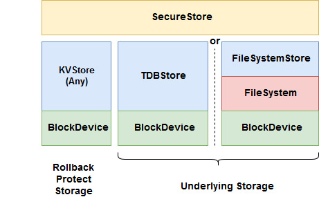
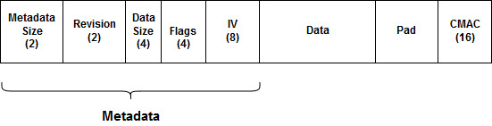

# SecureStore in Mbed OS

- [SecureStore in Mbed OS](#securestore-in-mbed-os)
    + [Revision history](#revision-history)
- [Introduction](#introduction)
    + [Overview and background](#overview-and-background)
    + [Requirements and assumptions](#requirements-and-assumptions)
- [System architecture and high-level design](#system-architecture-and-high-level-design)
  * [Design basics](#design-basics)
    + [Data layout](#data-layout)
    + [Basic implementation concepts](#basic-implementation-concepts)
- [Detailed design](#detailed-design)
    + [Class header](#class-header)
    + [Important data structures](#important-data-structures)
    + [Initialization and reset](#initialization-and-reset)
    + [Core APIs](#core-apis)
    + [Incremental set APIs](#incremental-set-apis)
    + [Key iterator APIs](#key-iterator-apis)
- [Usage scenarios and examples](#usage-scenarios-and-examples)
    + [Standard usage of the class](#standard-usage-of-the-class)
- [Other information](#other-information)
    + [Open issues](#open-issues)


### Revision history

| Revision 	| Date           	| Authors                                                	| Mbed OS version 	| Comments         	|
|----------	|----------------	|--------------------------------------------------------	|-----------------	|------------------	|
| 1.0      	| 02 October 2018	| David Saada ([@davidsaada](https://github.com/davidsaada/)) 	| 5.11+           	| Initial revision 	|

# Introduction

### Overview and background

SecureStore is a [KVStore](../KVStore/KVStore_design.md) based storage solution, providing security features on the stored data, such as encryption, authentication, rollback protection and write once, over an underlying KVStore class. It references an additional KVStore class for storing the rollback protection keys. 

### Requirements and assumptions

SecureStore assumes that the underlying KVStore instances are instantiated and initialized. 

# System architecture and high-level design

## Design basics

SecureStore is a storage class, derived from KVStore. It adds security features to the underlying key value store.
 
As such, it offers all KVStore APIs, with additional security options (which can be selected using the creation flags at set). These include:  

- Encryption: Data is encrypted using the AES-CTR encryption method, with a randomly generated 8-byte IV. Key is derived from [Device Key](../../../../../../mbed-os/features/device_key/README.md), using the NIST SP 800-108 KDF in counter mode spec, where salt is the key trimmed to 32 bytes, with "ENC" as prefix. Flag here is called "require confidentiality flag".  
- Rollback protection: (Requires authentication) CMAC is stored in a designated rollback protected storage (also of KVStore type) and compared to when reading the data under the same KVStore key. A missing or different key in the rollback protected storage results in an error. The flag here is called "Require replay protection flag".
- Write once: Key can only be stored once and can't be removed. The flag here is called "Write once flag".

SecureStore maintains data integrity using a record CMAC. This 16-byte CMAC is calculated on all stored data (including key & metadata) and stored at the end of the record. When reading the record, SecureStore compares the calculated CMAC with the stored one. In the case of encryption, CMAC is calculated on the encrypted data. The key used for generating the CMAC is derived from [Device Key](../../../../../../mbed-os/features/device_key/README.md), where salt is the key trimmed to 32 bytes, with "AUTH" as prefix.  
 


### Data layout

When storing the data, it is stored with a preceding metadata header. Metadata includes flags and security related parameters, such as IV. The CMAC, calculated for authentication, is stored at the end of the data as it is calculated on the fly, so it can't be stored with the metadata.  



Fields are:

- Metadata size: Size of metadata header.
- Revision: SecureStore revision (currently 1).
- Data size: Size of user data.
- Flags: User flags.
- IV: Random generated IV.
- Pad: Pad data to a multiple of 16 bytes (due to encryption).
- CMAC: CMAC calculated on key, metadata and data.

### Basic implementation concepts

Because the code can't construct a single buffer to store all data (including metadata and possibly encrypted data) in one shot, setting the data occurs in chunks, using the incremental set APIs. Get uses the offset argument to extract metadata, data and CMAC separately.  

Rollback protection (RBP) keys are stored in the designated rollback protection storage, which is also of KVStore type. RBP keys are the same as the SecureStore keys.  
This RBP storage is also used for storing the CMAC in write once case, as otherwise an attacker can delete this key from the underlying storage and modify this flag. 

# Detailed design


Functionality, as defined by KVStore, includes the following:

- Initialization and reset.
- Core actions: get, set and remove.
- Incremental set actions.
- Iterator actions.

### Class header

SecureStore has the following header:

```C++
class SecureStore : KVStore {

public:
    SecureStore(KVStore *underlying_kv, KVStore *rbp_kv);
    virtual ~SecureStore();
    	 
    // Initialization and formatting
    virtual int init();
    virtual int deinit();
    virtual int reset();

    // Core API
    virtual int set(const char *key, const void *buffer, size_t size, uint32_t create_flags);
    virtual int get(const char *key, void *buffer, size_t buffer_size, size_t *actual_size = NULL, size_t offset = 0);
    virtual int get_info(const char *key, info_t *info);
    virtual int remove(const char *key);
 
    // Incremental set API
    virtual int set_start(set_handle_t *handle, const char *key, size_t final_data_size, uint32_t create_flags);
    virtual int set_add_data(set_handle_t handle, const void *value_data, size_t data_size);
    virtual int set_finalize(set_handle_t handle);
 
    // Key iterator
    virtual int iterator_open(iterator_t *it, const char *prefix = NULL);
    virtual int iterator_next(iterator_t it, char *key, size_t key_size);
    virtual int iterator_close(iterator_t it);
    
private:
    Mutex _mutex;
    KVStore *_underlying_kv;
    KVStore *_rbp_kv;
    void *_entropy;
    uint8_t *_scratch_buf;
}
```

### Important data structures

```C++
// Record header
typedef struct {
	uint16_t metadata_size;
	uint16_t revision;
	uint32_t data_size;
	uint32_t create_flags;
	uint8_t  iv[8];
} record_metadata_t;

// incremental set handle
typedef struct {
    record_metadata_t metadata;
    bd_size_t offset;
    char *key;
    void *encrypt_handle;
    void *auth_handle;
    KVStore::set_handle_t underlying_handle;
} inc_set_handle_t;

// iterator handle
typedef struct {
    KVStore::iterator_t underlying_it;
} key_iterator_handle_t;
```

### Initialization and reset

**init function**

Header:  

`virtual int init();`

Pseudo code:  

- if `_is_initialized`, return OK.
- Take `_mutex`.
- Initialize `_entropy` with TLS entropy APIs.
- Using `DeviceKey` APIs, get the device key.
- Allocate `_scratch_buf` as a 32 byte array.
- Set `_is_initialized` to true.
- Release `_mutex`.
  
**deinit function**

Header:  

`virtual int deinit();`

Pseudo code:  

- if not `_is_initialized`, return OK.
- Take `_mutex`.
- Deinitialize `_entropy`.
- Deallocate `_scratch_buf`.
- Release `_mutex`.

**reset function**

Header:  

`virtual int reset();`

Pseudo code:  

- Take `_mutex`.
- Call `_underlying_kv` `reset` API.
- Call `_rbp_kv` `reset` API.
- Release `_mutex`.

### Core APIs

**set function**

Header:  

`virtual int set(const char *key, const void *buffer, size_t size, uint32_t create_flags);`

Pseudo code:  

- Call `set_start` with all fields and a local `set_handle_t` variable.
- Call `set_add_data` with `buffer` and `size`.
- Call `set_finalize`.
- Return OK.

**get function**

Header:  

`virtual int get(const char *key, void *buffer, size_t buffer_size, size_t *actual_size = NULL, size_t offset = 0);`

Pseudo code:  

- if not `_is_initialized` return error.
- Take `_mutex`.
- Call `_underlying_kv` `get` API with `metadata` size into a `metadata` local structure.
- If failure:
	- If rollback protection or write once flag set:
		- Call `_rbp_kv` `get` API on a local `rbp_cmac` variable, key is `key`, size 16.
		- If no error, return "RBP authentication" error.
	- Return "Key not found error".
- Derive a key from device key and `key`.
- Allocate and initialize `auth_handle` CMAC calculation local handle with derived key.
- Using `auth_handle` handle, calculate CMAC on `key` and `metadata`.
- If encrypt flag set:
	- Derive a key from device key and `key`.
	- Allocate and initialize a local `enc_handle` AES-CTR local handle with derived key and `iv` field.
- Set `data_size` local variable to data size in metadata.
- Set `actual_size` to the minimum of `buffer_size` and `data_size`.
- Set `current_offset` to 0.
- While `data_size` > 0:
	- If `current_offset` between `offset` and `actual_size`.
		- Set `dest_buf` to `buffer` and `chunk_size` to `actual_size`.
	- Else:
		- Set `dest_buf` to `_scratch_buf` and `chunk_size` to `actual_size`.
	- Call `_underlying_kv` `get` API with `dest_buf` and `chunk_size`.
	- Calculate CMAC on `dest_buf`, using `_auth_handle` handle.
	- If encrypt flag set, decrypt `dest_buf` (in place)  using `_enc_handle` handle.
	- Decrement `data_size` by `chunk_size`.
- Call `_underlying_kv` `get` API with on a local `read_cmac` variable, size 16.
- Generate CMAC on local `cmac` variable .
- Using `mbedtls_ssl_safer_memcmp` function, compare `read_cmac` with `cmac`. Return "data corrupt error" if no match.
- If rollback protection or write once flags set:
	- Call `_rbp_kv` `get` API on a local `rbp_cmac` variable, key is `key`, size 16.
	- If `rbp_cmac` doesn't match `cmac`, clear `buffer` and return "RBP authentication" error.
- Deinitialize and free `auth_handle` and `enc_handle`.
- Release `_mutex`.
- Return OK.

**get_info function**

Header:  

`virtual int get_info(const char *key, info_t *info);`

Pseudo code:  

- If not `_is_initialized`, return error.
- Call `get` API with `key` and 0 in `buffer_size` parameter.
- If failed, return error code.
- Call `_underlying_kv` `get` API with `metadata` size and `key`.
- Fill fields in `info` according to `metadata`.
- Return OK.

**remove function**

Header:  

`virtual int remove(const char *key);`

Pseudo code:  

- If not `_is_initialized`, return error.
- Take `_mutex`.
- Call `_underlying_kv` `get` API with `metadata` size and `key`.
- If not found, return "Not found" error.
- If write once flag set, return "Already exists" error.
- Call `_underlying_kv` `remove` API with `key`.
- If rollback protect flag set, call `_rbp_kv` `remove` API with `key` as key.
- Return OK.

### Incremental set APIs

**set_start function**

Header:  

`virtual int set_start(set_handle_t *handle, const char *key, size_t final_data_size, uint32_t create_flags);`

Pseudo code:
- Take `_mutex`.
- Allocate an `inc_set_handle_t` and assign in handle.
- If flags include write once flag:
	- Call `_underlying_kv` `get_info` API.
	- If key exists, return "already exists" error.
	- Call `_rbp_kv` `get` API with `key` as key. If key exists, return "already exists" error.
- If encrypt flag set:
	- Derive a key from device key and `key` as salt (trimmed to 32 bytes with "ENC" as prefix).
	- Using TLS entropy function on `_entropy` handle, randomly generate `iv` field.
	- Allocate and initialize `enc_handle` AES-CTR handle field with derived key and `iv` field.
- Fill all available fields in `metadata`.
- Derive a key from device key and `key` as salt (trimmed to 32 bytes with "AUTH" as prefix).
- Allocate and initialize `auth_handle` CMAC calculation handle field with derived key.
- Using `auth_handle` handle, calculate CMAC on `key` and `metadata`.
- Call `_underlying_kv` `set_start` API.
- Call `_underlying_kv` `set_add_data` API with `metadata` field.
- Return OK.

**set_add_data function**

Header:  

`virtual int set_add_data(set_handle_t handle, const void *value_data, size_t data_size);`

Pseudo code:

- If `offset` + `data_size` > data size in handle, return error.
- If flags include encryption:
	- Iterate over `value_data` field in chunks of `_scratch_buf` size.
		- Using `enc_handle` handle field, encrypt chunk into `_scratch_buf`.
		- Using `auth_handle` handle field, update CMAC of `_scratch_buf`.
		- Call `_underlying_kv` `set_add_data` API with `_scratch_buf`.
- Else:
	- Using `auth_handle` handle field, update CMAC of `value_data`.
	- Call `_underlying_kv` `set_add_data` API with `value_data`.
- Update `offset` field in handle.    
- Return OK.

**set_finalize function**

Header:  

`virtual int set_finalize(set_handle_t handle);`

Pseudo code:

- Initialize a local `cmac` 16-byte array to 0.
- If authentication flag set, using `auth_handle` handle field, generate `cmac`.
- Call `_underlying_kv` `set_add_data` API with `cmac`.
- Call `_underlying_kv` `set_finalize`.
- If rollback protect or write once flags set, call `_rbp_kv` `set` API with `key` as key and `cmac` as data.
- Deinitialize and free `auth_handle` and `enc_handle`.
- Free `handle`.
- Release `_mutex`.
- Return OK.

### Key iterator APIs

**iterator_open function**

Header:  

`virtual int iterator_open(iterator_t *it, const char *prefix = NULL);`

Pseudo code:

- Allocate a `key_iterator_handle_t` structure into `it`.
- Take `_mutex`.
- Call `_underlying_kv` `iterator_open` with `underlying_it` field.
- Release `_mutex`.
- Return OK.

**iterator_next function**

Header:  

`virtual int iterator_next(iterator_t it, char *key, size_t key_size);`

Pseudo code:

- Take `_mutex`.
- Call `_underlying_kv` `iterator_next` with `underlying_it` field.
- Release `_mutex`.
- Return OK.

**iterator_close function**

Header:  

`virtual int iterator_close(iterator_t it);`

Pseudo code:

- Take `_mutex`.
- Call `_underlying_kv` `iterator_close` with `underlying_it` field.
- Release `_mutex`.
- Deallocate `it`.
- Return OK.

# Usage scenarios and examples

### Standard use of the class

The following example code shows standard use of the SecureStore class:

**Standard usage example**

```C++
// Underlying key value store - here TDBStore (should be instantiated and initialized)
extern TDBStore tdbstore;

// Rollback protect store - also of TDBStore type (should be instantiated and initialized)
extern TDBStore rbp_tdbstore;

// Instantiate SecureStore with tdbstore as underlying key value store and rbp_tdbstore as RBP storage
SecureStore secure_store(&tdbstore, &rbp_tdbstore);

int res;

// Initialize secure_store
res = secure_store.init();

const char *val1 = "Value of key 1";
const char *val2 = "Updated value of key 1";
// Add "Key1" with encryption flag
res = secure_store.set("Key1", val1, sizeof(val1), KVSTore::REQUIRE_CONFIDENTIALITY_FLAG);
// Update value of "Key1" (flags must be the same per key)
res = secure_store.set("Key1", val2, sizeof(val2), KVSTore::REQUIRE_CONFIDENTIALITY_FLAG);

uint_8 value[32];
size_t actual_size;
// Get value of "Key1". Value should return the updated value.
res = secure_store.get("Key1", value, sizeof(value), &actual_size);

// Remove "Key1"
res = secure_store.remove("Key1");

// Incremental write, if need to generate large data with a small buffer
const int data_size = 1024;
char buf[8];

KVSTore::set_handle_t handle;
res = secure_store.set_start(&handle, "Key2", data_size, 0);
for (int i = 0; i < data_size / sizeof(buf); i++) {
	memset(buf, i, sizeof(buf));
	res = secure_store.set_add_data(handle, buf, sizeof(buf));
}
res = secure_store.set_finalize(handle);

// Iterate over all keys starting with "Key"
res = 0;
KVSTore::iterator_t it;
secure_store.iterator_open(&it, "Key*");
char key[KVSTore::KV_MAX_KEY_LENGTH];
while (!res) {
    res = secure_store.iterator_next(&it, key, sizeof(key)e);
}
res = secure_store.iterator_close(&it);

// Deinitialize SecureStore
res = secure_store.deinit();
```

# Other information

### Open issues

- Need to figure a way to prevent mutex abuse in incremental set APIs.
