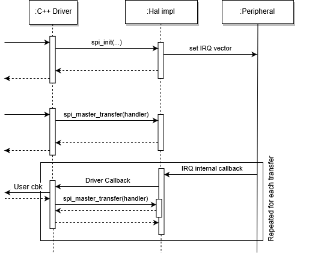

# HAL overhaul : SPI

## Description

This update targets the SPI HAL as the first step of a wide plan for all HAL APIs.

## Motivation

This work is part of the effort to bring well defined specification to APIs in `mbed-os`. Some users have shown interest in some addition to the supported features of this API ([bit ordering selection #4789](https://github.com/ARMmbed/mbed-os/issues/4789)).  
Analysis of previous work also revealed some inconsistencies in the current SPI HAL API that this RFC aims at fixing. Those inconsistencies are listed in the next chapter.  
Finally, `mbed-os` has grown a lot its supported target count and some of the oldest one could benefit quite significantly in maintenance cost from a factorisation of their code base.

### Inconsistencies

- The type used in block transfer functions vary between `(const) void*` and `(const) char*`.
- Some method have a parameter to set the width of the symbols while it is part of the `spi_format` arguments.
- Some method provide a `fill_symbol` parameter as a `char` which would not allow to set a symbol whose width is over 8bits.
- Some method that allow to read more symbol than they write miss an argument to set the `fill_symbol`.
- `spi_master_transfer` takes a `uint32_t` instead of a function pointer type for its `handler` argument.
- Some method have misleading naming (e.g. `spi_slave_receive` and `spi_slave_read`).
- The slave and master API are "almost" identical. There is no `spi_mater_read` nor `spi_master_receive`.
- `spi_format` should use an enum for the mode.

## Use-cases

In order to provide a meaningful API, this RFC will consider the following use cases.

### Use-cases in Mbed-OS
(click for detailed description)
- <details><summary>SPI Master: <a href="https://github.com/ARMmbed/sd-driver">sd-driver</a></summary><ul><li>initial freq  : 100kHz -> 25+MHz</li><li>clock polarity: low</li><li>clock phase : first edge</li><li>symbol size : 8</li><li>Chip select : manual (could be it ? Is it fine to release CS between request and response ?).</li><li>eventually also change the bus to half-duplex and its width to dual/quad</li></ul></details>
- <details><summary>SPI Master: <a href="https://github.com/ARMmbed/dataflash-driver">dataflash-driver</a></summary><ul><li>initial freq  : 50 -> 85+MHz</li><li>clock polarity: ? default</li><li>clock phase : ? default</li><li>symbol size : ? default</li><li>Chip select : manual (could be automated as it is sending/receiving byte by byte).</li></ul></details>
- <details><summary>SPI Master: <a href="https://github.com/ARMmbed/mbed-os/tree/master/features/unsupported/tests/peripherals/C12832">C12832 LCD screen driver</a> and <a href="https://github.com/ARMmbed/mbed-os/tree/master/features/unsupported/tests/peripherals/ADXL345">ADXL345 3 axis accelerometer</a></summary><ul><li>initial freq : 19.2MHz</li><li>clock polarity: high</li><li>clock phase : second edge</li><li>symbol size : 8bits</li><li>Chip select : manual (could be automated).</li></ul></details>
- <details><summary>SPI Master: <a href="https://github.com/ARMmbed/wifi-ism43362">ism43362</a> (WiFi module)</summary><ul><li>initial freq  : 20MHz</li><li>clock polarity: low</li><li>clock phase : first edge</li><li>symbol size : 16bits</li><li>Chip select : manual (could it be automated ? There seem to be some special delays)</li></ul></details>
- <details><summary>SPI Master: <a href="https://github.com/ARMmbed/atmel-rf-driver">atmel-rf</a> (802.15.4)</summary><ul><li>initial freq  : 3.75 -> 7.5MHz</li><li>clock polarity: ? default</li><li>clock phase : ? default</li><li>symbol size : ? default</li><li>Chip select : manual (could be automated)</li></ul></details>
- <details><summary>SPI Master: <a href="https://github.com/ARMmbed/stm-spirit1-rf-driver">stm-spirit1-rf</a> (Sub-1 GHz RF based on the SPSGRF-868 Module)</summary><ul><li>initial freq : 10MHz</li><li>clock polarity: low</li><li>clock phase : first edge</li><li>symbol size : 8bits</li><li>Chip select : manual (could it be automated ? There seem to be some special delays)</li></ul></details> 
- <details><summary>SPI Master: <a href="https://github.com/ARMmbed/ble-x-nucleo-idb0xa1">ble-x-nucleo-idb0xa1</a> (BLE module)</summary><ul><li>initial freq : 8MHz</li><li>clock polarity: low</li><li>clock phase : first edge</li><li>symbol size : 8bits</li><li>Chip select : manual (could be automated as it is sending/receiving byte by byte)</li></ul></details>
- <details><summary>SPI Master: <a href="https://os.mbed.com/cookbook/SPI-communication-with-external-ADC-MCP3">ADC</a></summary><ul><li>initial freq  : 1MHz</li><li>clock polarity: low</li><li>clock phase : first edge</li><li>symbol size : 7bits</li><li>Chip select : manual (could it be automated ? There seem to be some special delays)</li><li>The comment in the code is confusing as it refers to "high steady state" and "second edge capture".</li></ul></details>
- <details><summary>SPI Master: <a href="https://os.mbed.com/users/AppNearMe/code/AppNearMe_MuNFC_PN532">AppNearMe MuNFC PN532</a></summary><ul><li>Initial freq: 5MHz</li><li>clock polarity: Idle High</li><li>clock phase: Data on second edge (aka active to idle edge)</li><li>symbol size: 8bits</li><li>chip select: manual</li><li>use of different tx_len & rx_len + some skip offset.</li></ul></details>

### Other use cases
- SPI Slave  
  In this use case the user wants to receive a command frame and send back an answer frame.  
  Both frames are constructed that way :

  | size     | frame type | variable length frame | crc
  | ---      | ---        | ---                   | ---
  | 2 bytes  | 1 byte     | \<size> bytes         | 1 byte

  Data are sent as 8 bit symbols, little endian, lsb first. The Frame cannot exceed 2048bytes in length.  
  CS has to stay asserted between request and response.  
  The master expect to receive the symbol `0xFF` as a place holder.
- Simultaneous transaction over multiple SPI peripheral.  
  For example: Reading/Writing to an SD Card while using the communication interface over another SPI interface (other peripheral).
- Asynchronous:  
  These are basically the same the regular ones except that the function call should return immediately and a callback should be triggered once the operation is completed.
  - SPI Master block transfer
  - SPI Slave block transfer : Not supported in current API
 
  The asynchronous API is particularly important when dealing with multiple interfaces. Indeed, handling simultaneously two SPI transfers would require two thread with a blocking API while only one is required by the asynchronous API saving kilobytes of RAM.
- Half-duplex mode:
  The [LPS22HB](https://www.st.com/en/mems-and-sensors/lps22hb.html) product family can be controlled through a half-duplex SPI interface (called 3 wire mode in the data sheet).

## API Changes

| Old | New | Motivation
| --- | --- | ---
| `spi_format(spi, bits, mode, slave)` | `spi_format(spi, bits, mode, slave, bit_ordering)` | Add the bit ordering as requested by [#4789](https://github.com/ARMmbed/mbed-os/issues/4789)
| `spi_format(..., int bits, ...)` | `spi_format(..., uint8_t bits, ...)` | `bits` becomes an unsigned 8 bits integer as the value is in the range \[1; 32].
| `spi_format(..., int mode, ...)` | `spi_format(..., spi_mode_t mode, ...)` | SPI mode becomes an enum to sanitize the "magic integer"
| `spi_format(..., int slave, ...)` | `spi_init(..., bool is_slave, ...)` | `slave` becomes a boolean called `is_slave` as it is only a binary value.</br>This argument is also moved to `spi_init()` because it is required to determine if `ssel` should be ignored or not.
| `spi_frequency(..., int hz)` | `spi_frequency(..., uint32_t hz)` | `hz` becomes unsigned as a negative does not make sense in this context.
| ̀`void spi_frequency(...)` | `uint32_t spi_frequency(...)` | ̀`spi_frequency()` now returns the actual frequency that the peripheral will be generating to allow a user adjust its strategy in case the target cannot be reached.
| `uint8_t spi_get_module(spi_t *)` | `SPIName spi_get_module(spi_pin_t *)` | This change will ease tracking of SPI instanced by using a know unique identifier for each peripheral.</br>This will be used by the Driver to Identify the various peripheral and allow multiple SPI transfer on different SPI peripherals.</br>The type change allows to call `spi_get_module()` before calling `spi_init()`
| - | `spi_get_capabilities(...)` | This method is introduce to help select, configure and run test appropriate to the tested target's peripheral.
| - | `#define SPI_COUNT  (___)` | Introduce a macro defined in a header to tell the driver how many peripheral are available on this target. This information will be used by the driver to allocate a global mutex and owner table (one per peripheral).
| `spi_slave_*` and `spi_master_*` | only `spi_*` | Unifying `spi_slave` a `spi_master` API to provide a single way to interact with the peripheral.
| `spi_master_transfer(...)` | renamed to `spi_transfer_async(...)` | This change is to explicitly state that this method is meant for async operations.
| `spi_master_block_write(...)` | renamed to `spi_transfer(...)` | This change is reflect more accurately what the method is actually doing.</br>`_block_write` only implies emission where the in fact that it may also receive data.
| `spi_transfer_async(...)` and `spi_transfer(...);` | changes in arguments list | They now share the same list of arguments (`_async` as some more to handle the asynchronous part) :</br>`spi_t *obj, const void *tx, uint32_t tx_len, void *rx, uint32_t rx_len, const void *fill_symbol`
| `spi_transfer_async(..., uint32_t handler, ...)` | becomes `spi_transfer_async(..., spi_async_handler_f handler)`</br> with `void (*spi_async_handler_f)(spi_t *obj, void *ctx, spi_async_event_t event)` | This change sanitizes the function pointer
| - | introduce `void *ctx` as an argument of `spi_transfer_async` | This argument shall be passed to the invocation of the event handler.
| `void spi_transfer_async(...)` | `bool spi_transfer_async(...)` | `spi_transfer_async(...)` now returns a true if the transfer was scheduled and false otherwise.</br>E.g.: if the peripheral is already busy with another transfer.
| `spi_transfer_async(..., uint32_t event, ...)` | argument removed | the callback will now be invoked on any event with the event as an argument.
| `spi_busy(spi)` | removed | This method is never used outside of some of the hal implementations.
| `spi_master_write(...)` `spi_slave_write(...)` `spi_slave_read(...)` `spi_slave_receive(...)` | removed | Writing data symbol by symbol is very inefficient and should not be encouraged. It can still be achieved by passing a pointer to the symbol to `spi_transfer`.
| `spi_active(spit_t *obj)` | removed | as the async call back is now always invoked on async operation termination (unless cancelled), this status can be tracked from driver layer without any hal request.
| `uint32_t spi_irq_handler_asynch(spi_t *obj)` | removed | as the event is now passed as an argument to the callback this method is no longer required.

### The new API

```c
typedef struct {
    /** Minimum frequency supported must be set by target device and it will be assessed during
     *  testing.
     */
    uint32_t    minimum_frequency;
    /** Maximum frequency supported must be set by target device and it will be assessed during
     *  testing.
     */
    uint32_t    maximum_frequency;
    /** Each bit represents the corresponding symbol length. lsb => 1bit, msb => 32bits.
     *
     * For example, if the peripheral supports 8 bits, 12bits to 16bits and 32bits,
     * the value should be 0x8000F880.
     */
    uint32_t    symbol_length;
    bool        support_slave_mode; /**< If true, the device can handle SPI slave mode using hardware management on the specified ssel pin. */
    bool        half_duplex; /**< If true, the device also supports SPI transmissions using only 3 wires. */
} spi_capabilities_t;

typedef struct {
    /**
     * count of symbol clocked/transferred on the bus.
     */
    uint32_t    transfered;
    bool        error:1;
} spi_async_event_t;

typedef enum _spi_mode_t {
  SPI_MODE_IDLE_LOW_SAMPLE_FIRST_EDGE,
  SPI_MODE_IDLE_LOW_SAMPLE_SECOND_EDGE,
  SPI_MODE_IDLE_HIGH_SAMPLE_FIRST_EDGE,
  SPI_MODE_IDLE_HIGH_SAMPLE_SECOND_EDGE,
} spi_mode_t;

typedef enum _spi_bit_ordering_t {
  SPI_BIT_ORDERING_MSB_FIRST,
  SPI_BIT_ORDERING_LSB_FIRST,
} spi_bit_ordering_t;

typedef void (*spi_async_handler_f)(spi_t *obj, void *ctx, spi_async_event_t *event);

/**
 * Returns a variant of the SPIName enum uniquely identifying a SPI peripheral of the device.
 */
SPIName spi_get_module(PinName mosi, PinName miso, PinName mclk);
/**
 * Fills the given spi_capabilities_t structure with the capabilities of the given peripheral.
 */
void spi_get_capabilities(SPIName name, PinName ssel, spi_capabilities_t *cap);

void spi_init(spi_t *obj, bool is_slave, PinName mosi, PinName miso, PinName mclk, PinName ssel);
void spi_format(spi_t *obj, uint8_t bits, spi_mode_t mode, spi_bit_ordering_t bit_ordering);
uint32_t spi_frequency(spi_t *obj, uint32_t hz);
uint32_t spi_transfer(spi_t *obj, const void *tx, uint32_t tx_len, void *rx, uint32_t rx_len, const void *fill_symbol);
bool spi_transfer_async(spi_t *obj, const void *tx, uint32_t tx_len, void *rx, uint32_t rx_len, const void *fill_symbol, spi_async_handler_f handler, void *ctx, DMAUsage hint);
void spi_transfer_async_abort(spi_t *obj);
void spi_free(spi_t *obj);
```

## Behaviours
### Defined Behaviours

- `spi_get_module()` returns the `SPIName` unique identifier to the peripheral associated to this SPI channel.
- `spi_get_capabilities()` fills the given `spi_capabilities_t` instance
- `spi_get_capabilities()` should consider the `ssel` pin when evaluation the `support_slave_mode` capability.  
  If the given `ssel` pin cannot be managed by hardware in slave mode, `support_slave_mode` should be false.
- At least a symbol width of 8bit must be supported.
- The supported frequency range must include the range [0.2..2] MHz.
- The shortest part of the duty cycle must not be shorter than 50% of the expected period.
- `spi_init()` initializes the pins leaving the configuration registers unchanged.
- `spi_init()` if `is_slave` is false:
    - if `ssel` is `NC` the hal implementation ignores this pin.
    - if `ssel` is not `NC` then the hal implementation owns the pin and its management.
- When managed by the hal implementation, `ssel` is always considered active low.
- When the hardware supports the half-duplex (3-wire) mode, if `miso` (exclusive) or `mosi` is missing in any function that expects pins, the bus is assumed to be half-duplex.
- `spi_free()` resets the pins to their default state.
- `spi_free()` disables the peripheral clock.
- `spi_format()` sets :
  - the number of bits per symbol
  - the mode :
    0. Clock idle state is *low*, data are sampled when the clock becomes *active* (polarity = 0, phase = 0)
    1. Clock idle state is *low*, data are sampled when the clock becomes *inactive* (polarity = 0, phase = 1)
    2. Clock idle state is *high*, data are sampled when the clock becomes *active* (polarity = 1, phase = 0)
    3. Clock idle state is *high*, data are sampled when the clock becomes *inactive* (polarity = 1, phase = 1)
  - the bit ordering (lsb/msb first).
- `spi_format()` updates the configuration of the peripheral except the baud rate generator.
- `spi_frequency()` sets the frequency to use during the transfer.
- `spi_frequency()` returns the actual frequency that will be used.
- `spi_frequency()` updates the baud rate generator leaving other configurations unchanged.
- `spi_init()`, `spi_frequency()` and `spi_format()` must be called at least once each before initiating any transfer.
- `spi_transfer()` :
  - writes `tx_len` symbols to the bus.
  - reads `rx_len` symbols from the bus.
  - if `rx` is NULL then inputs are discarded.
  - if `tx` is NULL then `fill_symbol` is used instead.
  - returns the number of symbol clocked on the bus during this transfer.
  - expects symbols types to be the closest stdint type bigger or equal to its size following the platform's endianness.  
    e.g.:
    - 7bits => uint8_t
    - 15bits => uint16_t
    - 16bits => uint16_t
    - 17bits => uint32_t
  - In Full-duplex mode :
    - if `rx_len` > `tx_len` then it sends `(rx_len-tx_len)` additional `fill_symbol` to the bus.
  - In Half-duplex mode :
    - as master, `spi_transfer()` sends `tx_len` symbols and then reads `rx_len` symbols.
    - as slave, `spi_transfer()` receives `rx_len` symbols and then sends `tx_len` symbols.
- `spi_transter_async()` schedules a transfer to be process the same way `spi_transfer()` would have but asynchronously with the following exceptions:  
    - in async mode only transfers of the same size are allowed (tx size must be equal to rx size)  
    - async mode only supports full-duplex mode  
- `spi_transter_async()` returns immediately with a boolean indicating whether the transfer was successfully scheduled or not.
- The callback given to `spi_transfer_async()` is invoked when the transfer completes (with a success or an error).
- `spi_transfer_async()` saves the handler and the `ctx` pointer.
- The `ctx` is passed to the callback on transfer completion.
- Unless if the transfer is aborted, the callback is invoked on completion. The completion maybe when all symbols have been transmitted
  or when in slave mode the master de-asserts the chip select.
- The `spi_transfer_async()` function may use the `DMAUsage` hint to select the appropriate async algorithm.
- The `spi_async_event_t` must be filled with the number of symbol clocked on the bus during this transfer and a boolean value indicated if an error has occurred.
- `spi_transfer_async_abort()` aborts an on-going async transfer.

### Undefined Behaviours
- Calling `spi_init()` multiple times on the same `spi_t` without `spi_free()`'ing it first.
- Calling any method other than `spi_init()` on a non-initialized or freed `spi_t`.
- Passing both `miso` and `mosi` as `NC` to `spi_get_module` or `spi_init`.
- Passing `miso` or `mosi` as `NC` on target that does not support half-duplex mode.
- Passing `mclk` as `NC`  to `spi_get_module` or `spi_init`.
- Passing an invalid pointer as `cap` to `spi_get_capabilities`.
- Passing pins that cannot be on the same peripheral.
- Passing an invalid pointer as `obj` to any method.
- Giving a `ssel` pin to `spi_init()` when using in master mode.  
  SS must be managed by hardware in slave mode and must **NOT** be managed by hardware in master mode.
- Setting a frequency outside of the range given by `spi_get_capabilities()`.
- Setting a frequency in slave mode.
- Setting `bits` in `spi_format` to a value out of the range given by `spi_get_capabilities()`.
- Passing an invalid pointer as `fill_symbol` to `spi_transfer` and `spi_transfer_async` while they would be required by the transfer (`rx_len != tx_len` or `tx==NULL`).
- Passing an invalid pointer as `handler` to `spi_transfer_async`.
- Calling `spi_transfer_async_abort()` while no async transfer is being processed (no transfer or a synchronous transfer).
- In half-duplex mode, any mechanism (if any is present) to detect or prevent collision is implementation defined.

### Updated flow
The IRQ flow has slightly changed. In the new API the flow is as follow :


## Testing
Any regression will be captured as tests are created and added to CI to cover the newly defined behaviours. However, due to hardware limitations, it will not be possible to test them all in CI.
Some examples will be created in order to cover the remaining behaviours and use-cases. Those examples will be run manually before releases.

## Impact on partners' implementations

The new API does not impact partners much as most of them factorise HAL implementation to family level.  
For example :

| Partner       | #of&nbsp;Implementation | details |
| ---           | ---           | --- |
| ST            | 1             | - |
| Silicon Labs  | 1             | EFM32 family |
| Analog device | 2             | They differ by ~20LoC that enable the ability to set the polarity and phase of the clock. They could most probably be merged as a single implementation. |
| Nordic        | 2             | The first one for NRF51, the other for NRF52.<br>The functions calls are from what I have seen the same, this could be for Nordic a good opportunity to unify their SPI HAL implementation and bump NRF51’s SDK version. |
| Atmel         | 2             | - one for the cortex-m4<br>- one for the cortex-m0+<br>This seems reasonable. |
| Nuvoton       | 4             | implementation for 451, 472 and 480 are similar and look like the evolution of the 451.<br>NANO100's implementation has more "tweaks" but is really similar to the others, they could probably all be merged as 1. |
| Maxim         | 6             | There's actually only 3 different implementations as :<br>- MAX32620<br>- MAX32600 = MAX32610<br>- MAX32630 = MAX32625 = MAX32620C |
| NXP           | 13            | Most of them differ by the pin mapping that is provided in spi_api.c instead of `PeripheralPins.c` as it is done on most of other targets.<br>This number could be easily reduced to 2, maybe 4 in the very worst case. This would still be a huge maintenance gain for NXP DRY’ing their code base. |
| Freescale     | 15            | Some of them are exactly the same. This number could be reduce to something around 5 implementation mostly due to the large number of µC generation (K20/KLXX/MCUXPresso etc). |

The partner the most impacted by these changes is definitely Freescale/NXP but overall, in addition to the few bonus added by this new API, it would give partners' team a good opportunity to overhaul their implementations and factorise the code base.

## Drawbacks
--

## Alternative solutions

## Questions

- To keep consistency between peripherals in terms of design pattern, do we want to expose a peripheral or a communication channel ?  
  The current SPI driver implementation has 1 instance per slave while i²c driver implementation has 1 instance per peripheral. 
  - SPI addresses slave in `spi_init` using the chip select.
  - I²C addresses slave in transfer functions using the address.
  See also: [#7358](https://github.com/ARMmbed/mbed-os/issues/7358)

  The proposed HAL API here allow the SPI driver to have 1 instance per slave while keeping 1 spi_t per peripheral. This gives the user the best of both world.
