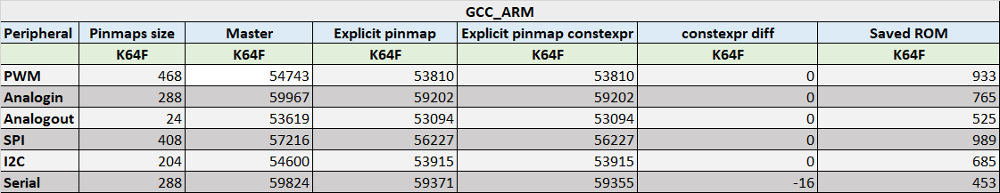
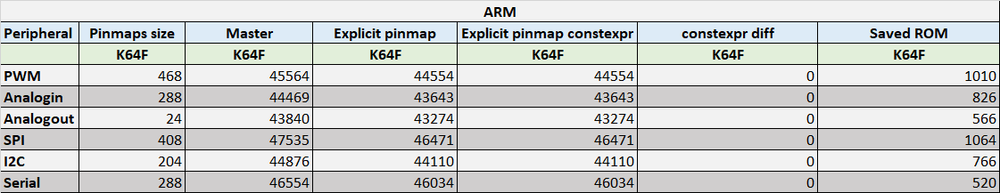
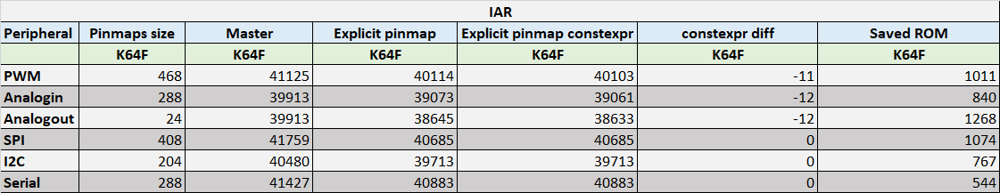

# HAL Explicit PinMap Extension Design Document

# Table of contents

1. [HAL Explicit PinMap Extension Design Document](#hal-explicit-pinmap-extension-design-document).
1. [Table of contents](#table-of-contents).
1. [Introduction](#introduction).
    1. [Overview and background](#overview-and-background).
    1. [Requirements and assumptions](#requirements-and-assumptions).
1. [System architecture and high-level design](#system-architecture-and-high-level-design).
    1. [Explicit pinmap mechanism](#explicit-pinmap-mechanism).
    1. [How much we can save](#how-much-we-can-save).
1. [Detailed design](#detailed-design).
    1. [Pinmap types](#pinmap-types).
    1. [HAL API changes](#hal-api-changes).
    1. [Drivers API changes](#drivers-api-changes).
    1. [`constexpr` utility functions](#constexpr-utility-functions).
    1. [`Example usage](#constexpr-utility-functions).

# Introduction

Making use of the pinmap tables optional by allowing the peripheral configuration (pin/periheral/function) to be explicitly specified in the HAL API function.

### Overview and background

HAL APIs making use of pins take these pins in their constructor and use those pins to lookup which peripheral/function to use. The process of looking up the peripheral/function requires there to be a pinmap table which maps pins to peripherals/functions. This pinmap table takes up ROM which could be saved if the pinmap wasn't used.
The goal is to provide additional HAL API/constructors which takes pinmap as a parameter where pin/peripheral/function is specified explicitly and there is no need to use the pinmap tables.
This extension should give the following savings:
- removed pinmap tables,
- removed `hal\mbed_pinmap_common library` (required for pin lookup mechanism),
- reduced HAL driver code.

### Requirements and assumptions

1. Provide types which will hold explicit pinmaps for peripherals(`PWM`, `AnalogIn`, `AnalogOut`, `SPI`, `I2C`, `UART`, `QSPI`, `CAN`).
2. Provide `xxx_init_direct(xxx_t *obj, explicit_pinmap_t *)` functions to HAL API (these functions will not use pinmap tables).
3. Provide additional constructors in drivers layer which will use the `xxx_init_direct(xxx_t *obj, explicit_pinmap_t*)` HAL functions.
4. Provide default weak implementations of `xxx_init_direct(explicit_pinmap_t *)` functions. These functions will call standard `xxx_init(xxx_t *obj, PinName, ...)` function (backward compatibility for targets which do not support explicit pinmap mechanism).
5. Provide `constexpr` utility functions to lookup for pin mapping in compile time (requires C++14).
6. Initialize console using explicit pinmap mechanism, so `hal\mbed_pinmap_common library` is not needed and can be removed.
7. Modify FPGA tests to verify also `xxx_init_direct(xxx_t *obj, explicit_pinmap_t*)` APIs.

# System architecture and high-level design

### Explicit pinmap mechanism

The explicit pinmap mechanism with backward compatibility is shown below on PWM peripheral example.


For targets which do not provide explicit pinmap support standard initialization will be performed (which uses pinmap tables) even if direct API is selected.

### How much we can save

Tables below show how much ROM we can save using explicit pinmap for each peripheral:





Example memory usage change for ARM/PWM example: master vs constexpr explicit pinmap:

```
| Module                          |        .text |   .data |       .bss |
|---------------------------------|--------------|---------|------------|
| [lib]\c_w.l                     |    11175(+0) |  16(+0) |    348(+0) |
| [lib]\fz_wm.l                   |       34(+0) |   0(+0) |      0(+0) |
| [lib]\m_wm.l                    |       48(+0) |   0(+0) |      0(+0) |
| anon$$obj.o                     |       32(+0) |   0(+0) | 197888(+0) |
| drivers\source                  |      192(+0) |   0(+0) |      0(+0) |
| features\netsocket              |      143(+0) |   0(+0) |      0(+0) |
| hal\mbed_critical_section_api.o |      154(+0) |   0(+0) |      2(+0) |
| hal\mbed_gpio.o                 |       96(+0) |   0(+0) |      0(+0) |
| hal\mbed_pinmap_common.o        |      0(-272) |   0(+0) |      0(+0) |  // removed pinmap lib (this is common for all peripherals)
| hal\mbed_ticker_api.o           |      978(+0) |   0(+0) |      0(+0) |
| hal\mbed_us_ticker_api.o        |      114(+0) |   4(+0) |     65(+0) |
| main.o                          |      70(+32) |   0(+0) |      0(+0) |  // extra space for explicit pinmap structure in application
| platform\source                 |    5683(+46) |  64(+0) |    249(+0) |
| rtos\source                     |     8990(+0) | 168(+0) |   6626(+0) |
| targets\TARGET_Freescale        |  16581(-816) |  12(+0) |    340(+0) |  // removed pinmaps + driver code reduction
| Subtotals                       | 44290(-1010) | 264(+0) | 205518(+0) |
Total Static RAM memory (data + bss): 205782(+0) bytes
Total Flash memory (text + data): 44554(-1010) bytes
```

# Detailed design

### Pinmap types

For peripherals which require only one pin (`AnalogIn`, `AnalogOut`, `PWM`) standard `PinMap` type will be used and for peripherals which use more than one pin (`SPI`, `I2C`, `Serial`, `QSPI`, `CAN`) new types will be added:

```
typedef struct {
    PinName pin;
    int peripheral;
    int function;
} PinMap;
```

Example pinmap type for SPI:

```
typedef struct {
    int peripheral;
    PinName mosi_pin;
    int mosi_function;
    PinName miso_pin;
    int miso_function;
    PinName sclk_pin;
    int sclk_function;
    PinName ssel_pin;
    int ssel_function;
} spi_pinmap_t;
```

### HAL API changes

Below example changes for the HAL API (K64F).

Master:

```
void spi_init(spi_t *obj, PinName mosi, PinName miso, PinName sclk, PinName ssel) 
{
    // determine the SPI to use
    uint32_t spi_mosi = pinmap_peripheral(mosi, PinMap_SPI_MOSI);
    uint32_t spi_miso = pinmap_peripheral(miso, PinMap_SPI_MISO);
    uint32_t spi_sclk = pinmap_peripheral(sclk, PinMap_SPI_SCLK);
    uint32_t spi_ssel = pinmap_peripheral(ssel, PinMap_SPI_SSEL);
    uint32_t spi_data = pinmap_merge(spi_mosi, spi_miso);
    uint32_t spi_cntl = pinmap_merge(spi_sclk, spi_ssel);

    obj->spi.instance = pinmap_merge(spi_data, spi_cntl);
    MBED_ASSERT((int)obj->spi.instance != NC);

    // pin out the spi pins
    pinmap_pinout(mosi, PinMap_SPI_MOSI);
    pinmap_pinout(miso, PinMap_SPI_MISO);
    pinmap_pinout(sclk, PinMap_SPI_SCLK);
    if (ssel != NC) {
        pinmap_pinout(ssel, PinMap_SPI_SSEL);
    }
    /* Set the transfer status to idle */
    obj->spi.status = kDSPI_Idle;

    obj->spi.spiDmaMasterRx.dmaUsageState = DMA_USAGE_OPPORTUNISTIC;
}
```

Explicit pinmap:

```
void spi_init_direct(spi_t *obj, const spi_pinmap_t *pinmap)
{
    obj->spi.instance = pinmap->peripheral;
    MBED_ASSERT((int)obj->spi.instance != NC);

    // pin out the spi pins
    pin_function(pinmap->mosi_pin, pinmap->mosi_function);
    pin_mode(pinmap->mosi_pin, PullNone);
    pin_function(pinmap->miso_pin, pinmap->miso_function);
    pin_mode(pinmap->miso_pin, PullNone);
    pin_function(pinmap->sclk_pin, pinmap->sclk_function);
    pin_mode(pinmap->sclk_pin, PullNone);
    if (pinmap->ssel_pin != NC) {
        pin_function(pinmap->ssel_pin, pinmap->ssel_function);
        pin_mode(pinmap->ssel_pin, PullNone);
    }

    /* Set the transfer status to idle */
    obj->spi.status = kDSPI_Idle;

    obj->spi.spiDmaMasterRx.dmaUsageState = DMA_USAGE_OPPORTUNISTIC;
}

void spi_init(spi_t *obj, PinName mosi, PinName miso, PinName sclk, PinName ssel)
{
    // determine the SPI to use
    uint32_t spi_mosi = pinmap_peripheral(mosi, PinMap_SPI_MOSI);
    uint32_t spi_miso = pinmap_peripheral(miso, PinMap_SPI_MISO);
    uint32_t spi_sclk = pinmap_peripheral(sclk, PinMap_SPI_SCLK);
    uint32_t spi_ssel = pinmap_peripheral(ssel, PinMap_SPI_SSEL);
    uint32_t spi_data = pinmap_merge(spi_mosi, spi_miso);
    uint32_t spi_cntl = pinmap_merge(spi_sclk, spi_ssel);

    int peripheral = (int)pinmap_merge(spi_data, spi_cntl);

    // pin out the spi pins
    int mosi_function = (int)pinmap_find_function(mosi, PinMap_SPI_MOSI);
    int miso_function = (int)pinmap_find_function(miso, PinMap_SPI_MISO);
    int sclk_function = (int)pinmap_find_function(sclk, PinMap_SPI_SCLK);
    int ssel_function = (int)pinmap_find_function(ssel, PinMap_SPI_SSEL);

    const spi_pinmap_t explicit_spi_pinmap = {peripheral, mosi, mosi_function, miso, miso_function, sclk, sclk_function, ssel, ssel_function};

    spi_init_direct(obj, &explicit_spi_pinmap);
}
```

In the version `v5.14.0` we have one init function: `spi_init(spi_t *obj, PinName mosi, PinName miso, PinName sclk, PinName ssel)` which uses pinmap tables to determine associated peripheral/function with the given pins and then initializes the peripheral.

In the new version(`feature-hal-spec-explicit-pinmap`) we will have two init functions:
- `void spi_init(spi_t *obj, PinName mosi, PinName miso, PinName sclk, PinName ssel)`
  This function will use pinmap tables to determine associated peripheral/function with the given pins, populate the pinmap structure and call `void spi_init_direct()` using created pinmap.
- `void spi_init_direct(spi_t *obj, const spi_pinmap_t *pinmap)`
  This function will perform peripheral initialization using given explicit pinmap.


This way we will give user the option to use comfortable, but expensive for ROM traditional peripheral init or to provide pin mappings manually and use the direct API which should give some ROM savings.

Below you can find weak implementation of `void spi_init_direct(spi_t *obj, const spi_pinmap_t *pinmap)` for targets which does not support explicit pinmap:

```
#if DEVICE_SPI
MBED_WEAK void spi_init_direct(spi_t *obj, const spi_pinmap_t *pinmap)
{
    spi_init(obj, pinmap->mosi_pin, pinmap->miso_pin, pinmap->sclk_pin, pinmap->ssel_pin);
}
#endif
```

If direct API is used for the target which does not support the explicit pinmap mechanism, then traditional API will be invoked to initialize the peripheral (no ROM savings).

### Drivers API changes

In the current version (master), all peripheral constructors in drivers layer take pins as parameters and then call `xxx_init(xxx_t *obj, PinName, ...)` HAL function to initialize the peripheral (and find peripheral/function associated with given pin).
Now we will add an extra constructor which will take reference to the explicit pinmap structure and call `void spi_init_direct(spi_t *obj, const spi_pinmap_t *pinmap)` HAL function (in this case pinmap tables are not needed).

Below example changes for the SPI Driver API.

Master:

```
SPI(PinName mosi, PinName miso, PinName sclk, PinName ssel = NC);
SPI(PinName mosi, PinName miso, PinName sclk, PinName ssel, use_gpio_ssel_t);
```

Explicit pinmap:

```
SPI(PinName mosi, PinName miso, PinName sclk, PinName ssel = NC);
SPI(PinName mosi, PinName miso, PinName sclk, PinName ssel, use_gpio_ssel_t);

SPI(const spi_pinmap_t &explicit_pinmap);
SPI(const spi_pinmap_t &explicit_pinmap, PinName ssel);

```

Note that for SPI class currently, we have 2 constructors. One is used when `ssel` is to be driven by hardware and the other one if `ssel` is controlled manually.
In the new version, the second constructor is a bit different. Does not provide `use_gpio_ssel_t`, but has `PinName ssel` instead. This is because in the case when we want to manually handle the `ssel` pin, then `ssel` pin in the given `explicit_pinmap` will be undefined (`NC`) and `ssel` pin must be provided separately. In this case we don't need additional `use_gpio_ssel_t` any more.

### `constexpr` utility functions

C++ 14 provides `constexpr` specifier which can be used to create utility functions to lookup the pinmap tables in compile-time and create the pin-mapping without adding pinmap tables to the image.

Example pinmap lookup function below:

```
constexpr PinMap get_pwm_pinmap(const PinName pin)
{
    for (const PinMap &pinmap : PINMAP_PWM) {
        if (pinmap.pin == pin) {
            return {pin, pinmap.peripheral, pinmap.function};
        }
    }
    return {NC, NC, NC};
}
```

For targets which do not support explicit pinmap the utility functions will populate the pinmap structure only with given pins (backward compatibility):

```
constexpr spi_pinmap_t get_spi_pinmap(const PinName mosi, const PinName miso, const PinName sclk, const PinName ssel)
{
    return {NC, mosi, NC, miso, NC, sclk, NC, ssel, NC};
}
```

C++ 14 is not available on ARM C5, so for backward compatibility when ARM C5 is used the utility functions will be defined as follows: `const PinMap get_pwm_pinmap(const PinName pin)`. Using `const` instead `constexpr` will add pinmap tables to the image (no ROM savings).

### Example usage

```
int main()
{
    /* Regular use (master) */
    SPI spi(D1, D2, D3, D4);

    /* Explicit pinmap */
    const spi_pinmap_t explicit_spi_pinmap = {SPI_1, D1, 2, D2, 2, D3, 2, D4, 2};
    SPI spi(explicit_spi_pinmap);

    /* Explicit pinmap with constexpr */
    constexpr spi_pinmap_t explicit_spi_pinmap = get_spi_pinmap(D1, D2, D3, D4);
    SPI spi(explicit_spi_pinmap);

    return 0;
}
```

Note that the following use of the pinmap utility function: `SPI spi(get_spi_pinmap_t(D1, D2, D3, D4));` on ARM compiler leads to unexpected behavior. In the mentioned case, the pinmap table will be added to the image (no ROM savings). Details below:


Passing temporary pinmap objects to constructors (which lifetime is limited to constructor call) will be forbidden and we will get compilator error in the following case:

```
SPI spi(get_spi_pinmap(PA_7, PA_6, PA_5, PA_4));


[Error] main.cpp@41,9: call to deleted constructor of 'mbed::SPI'
[ERROR] .\main.cpp:41:9: error: call to deleted constructor of 'mbed::SPI'
    SPI spi(get_spi_pinmap(PA_7, PA_6, PA_5, PA_4));
        ^   ~~~~~~~~~~~~~~~~~~~~~~~~~~~~~~~~~~~~~~
./drivers/SPI.h:146:5: note: 'SPI' has been explicitly marked deleted here
    SPI(const spi_pinmap_t &&) = delete;
    ^
1 error generated.
```

This will solve above issue and additionally solve the problem with the classes which require access to pinmap structure beyond the constructor call. This will prevents the bad code generation possibility. Currently some classes provide `suspend/resume` API which requires access to pinmap structure beyond the constructor call and maybe such API will be added to the other classes later.
