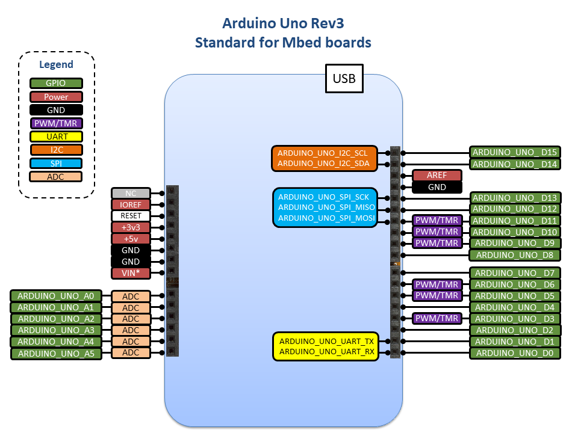

# Arduino Uno Pin Names design document

# Table of contents

1. [Table of contents](#table-of-contents)
    * [Revision history](#revision-history)
1. [Introduction](#introduction)
    1. [Overview and background](#overview-and-background)
    1. [Requirements and assumptions](#requirements-and-assumptions)
1. [Detailed design](#detailed-design)
    1. [Arduino Uno (Rev3) connector pins](#arduino-uno-(rev3)-connector-pins)
    1. [Usage of Arduino Uno pin-names in an application](#usage-of-arduino-uno-pin-names-in-an-application)
1. [Non-valid definitions](#non-valid-definitions)
1. [Testing compliance](#testing-compliance)
1. [Implementation details](#implementation-details)

### Revision history

Initial revision: 1.0

Authors: Malavika Sajikumar (ADI), Sean Doyle (ADI), Kyle Jansen (ADI), Jerome Coutant (ST), Marcelo Salazar (Arm).

This document is written for Mbed OS 6.

# Introduction

### Overview and background

Mbed is designed so that application code written in the platform is portable across different Mbed supported boards with the same hardware capabilities or interfaces. However, the code, in most cases, is not truly portable due to the differences in pin name definitions for the same kind of interfaces across different boards. 

This design document provides rules and guidelines on how to define Arduino Uno connector pins in the board support package of development boards to achieve true code portability across various boards with Arduino Uno connectors.

### Requirements and assumptions

This document applies to the pin standards required for the Arduino Uno connector which is used on multiple Mbed Enabled boards. The Arduino Uno connector has been stable since 2012 at its current revision, which is the Arduino Uno Rev3. All design choices in this document for the Arduino Uno connector are based on the Arduino Uno Rev3 connector implementation.

If the development board is defined as Arduino Uno compliant, the Arduino Uno connector standard has to be followed as described in this document and `ARDUINO_UNO` name should be defined as a supported form factor in targets.json file:

    "supported_form_factors": [
            "ARDUINO_UNO"
        ],

The Arduino Uno connector pins are defined in the PinNames.h file for the specific BSP, usually in the following location (it may vary slightly from one vendor to another):

    targets/MCU_VENDOR/MCU_FAMILY/MCU_NAME/Board/PinNames.h

# Detailed design

To achieve meaningful portability of application code across various Mbed Enabled boards that are Arduino Uno compliant, the pin names used for the connector pins should be common across these boards. This document describes a set of rules on how and where to define these pins in the board support package.

### Arduino Uno (Rev3) connector pins

The following diagrams shows the Arduino Uno Rev3 standard for Mbed boards:

**Digital and Analog pin definition**

The Arduino Uno (Rev3) form factor for Mbed boards must support and define both D0-D15 pins for digital GPIO and A0-A5 pins for analog input as part of the default standard. These pins should be defined in PinNames.h file within a PinName enum. The prefix `ARDUINO_UNO_` distinguishes these pins from pins defined for other custom or common connectors that may have similar pin names. 

The analog input signals in the Arduino Uno connector must be supported on at least the Ax pins.

    // Arduino Uno (Rev3) connector pin connection naming  
    // Px_xx relates to the processor pin connected to the Arduino Uno (Rev3) connector pin

    ARDUINO_UNO_D0 = Px_xx,
    ARDUINO_UNO_D1 = Px_xx,
    ARDUINO_UNO_D2 = Px_xx,
    ARDUINO_UNO_D3 = Px_xx,
    ARDUINO_UNO_D4 = Px_xx,
    ARDUINO_UNO_D5 = Px_xx,
    ARDUINO_UNO_D6 = Px_xx,
    ARDUINO_UNO_D7 = Px_xx,
    ARDUINO_UNO_D8 = Px_xx,
    ARDUINO_UNO_D9 = Px_xx,
    ARDUINO_UNO_D10 = Px_xx,
    ARDUINO_UNO_D11 = Px_xx,
    ARDUINO_UNO_D12 = Px_xx,
    ARDUINO_UNO_D13 = Px_xx,
    ARDUINO_UNO_D14 = Px_xx,
    ARDUINO_UNO_D15 = Px_xx,

    ARDUINO_UNO_A0 = Px_xx,
    ARDUINO_UNO_A1 = Px_xx,
    ARDUINO_UNO_A2 = Px_xx,
    ARDUINO_UNO_A3 = Px_xx,
    ARDUINO_UNO_A4 = Px_xx,
    ARDUINO_UNO_A5 = Px_xx,

If the development board has the Arduino Uno connector in hardware, but does not comply with the Arduino Uno standard, whether it be with alternate functionality pins or non connected pins, the board should not be defined as Arduino Uno compliant and `ARDUINO_UNO` should not be added as a supported form factor in targets.json. Note this may result in a warning being generated at compile time to inform the user.

**I2C, SPI and UART definition**

All I2C, SPI and UART pin name alias definitions for the Arduino Uno (Rev3) connector pins should be defined in ArduinoUnoAliases.h in the Mbed OS HAL (common to all Arduino Uno compliant targets) as follows:

    #ifdef TARGET_FF_ARDUINO_UNO
    // Arduino Uno I2C signals aliases
    #define ARDUINO_UNO_I2C_SDA ARDUINO_UNO_D14
    #define ARDUINO_UNO_I2C_SCL ARDUINO_UNO_D15

    // Arduino Uno SPI signals aliases
    #define ARDUINO_UNO_SPI_CS   ARDUINO_UNO_D10
    #define ARDUINO_UNO_SPI_MOSI ARDUINO_UNO_D11
    #define ARDUINO_UNO_SPI_MISO ARDUINO_UNO_D12
    #define ARDUINO_UNO_SPI_SCK  ARDUINO_UNO_D13

    // Arduino Uno UART signals aliases
    #define ARDUINO_UNO_UART_TX ARDUINO_UNO_D1
    #define ARDUINO_UNO_UART_RX ARDUINO_UNO_D0

    #endif // TARGET_FF_ARDUINO_UNO

**Other pin functions**

In the Arduino Uno standard there are only 6 PWM and timers available on pins D3, D5, D6, D9, D10 and D11.
Mbed boards may support the usage of PWM and timers functions in some Dx pinnames. Although this is recomended as per the Arduino Uno standard, it's not a mandatory as requirement to be compliant with the Arduino Uno standard for Mbed boards.

Note this might be one of the main differencess accross Mbed boards and therefore the application should not assume the same behaviour for PWM and Timers for them.

The Reset signal in the Arduino Uno header is a bidirectional reset that will put both a connected Arduino Uno shield and the Mbed board into a reset state. There is a hardware requirement to wire this signal correctly; however there is no need to define the Reset signal in the BSP for the Mbed board.

The Vin signal is defined in the Arduino Uno standard and should be implemented between 7V to 12V. In some cases this signal may be implemented as a bi-directional power supply.
A warning should be included in the Mbed platform's website if it isn't implemented in the correct voltage range.
Note if a Partner or developer designs an Arduino Uno shield and expects 7V-12V on the Vin, it will have power issues with a controller board supplying less then 7V and will likely cause the Arduino Uno shield to not power up correctly

### Usage of Arduino Uno pin-names in an application

**Configuration**

The pin names defined to each of the MCUs in PinNames.h are considered the default configuration for every target in Mbed OS.
They are picked automatically at compile time and can used in the application.

However, it's possible to override the default configuration. This is the list of configuration files and a description of each of them:

- `PinNames.h`: includes the default configuration for Arduino Uno pins and how they are connected to the MCU as described in this document.
- `mbed_lib.json`: configuration for specific components to use the default Arduino Uno pin-names or select other MCU pins if required. This file can be defined in Mbed OS or in an external library for the component, for [example](https://github.com/ARMmbed/mbed-os/blob/master/storage/blockdevice/COMPONENT_SD/mbed_lib.json).
- `mbed_app.json`: application configuration that inherits the `mbed_lib.json` if exists and can override the pin configuration for the component if required. This file is usually placed at the root directory of the application.
- main application: the `.cpp` application could initialize the drivers with the default Arduino Uno pin-name configution, use the configuration in `mbed_app.json`, or use custom pins if required.

**Examples of usage of Arduino Uno pin names**

This section provides a few examples with guidelines on using Arduino Uno pin names on official example applications. It's not a guide to use Mbed Drivers API (please refer to the [documentation](https://os.mbed.com/docs/mbed-os/latest/apis/drivers.html) for details).

It's possible to use digital signals in both Dx and Ax pins:

    DigitalOut myGPIO1(ARDUINO_UNO_D3); // Output signal
    DigitalIn  myGPIO2(ARDUINO_UNO_D4); // Input signal
    DigitalOut myGPIO3(ARDUINO_UNO_A0); // A0 can be used as digital signal as well

Usage of ADC on the Arduino Uno connector should be done only the Ax pins:

    AnalogIn myADC1(ARDUINO_UNO_A1);    // Analog input

UART can be defined with pin names or aliases (the latter is preferred):

    BufferedSerial serial_port(ARDUINO_UNO_D1, ARDUINO_UNO_D0);
    BufferedSerial serial_port(ARDUINO_UNO_UART_TX, ARDUINO_UNO_UART_RX);

SPI can be defined with pin names or aliases (the latter is preferred):

    SPI spi(ARDUINO_UNO_D11, ARDUINO_UNO_D12, ARDUINO_UNO_D13); // mosi, miso, sclk
    SPI spi(ARDUINO_UNO_SPI_MOSI, ARDUINO_UNO_SPI_MISO, ARDUINO_UNO_SPI_SCK);

I2C can be defined with pin names or aliases (the latter is preferred):

    I2C i2c(ARDUINO_UNO_D14, ARDUINO_UNO_D15);
    I2C i2c(ARDUINO_UNO_I2C_SDA, ARDUINO_UNO_I2C_SCL);
 
The MCU may support the usage of alternate functions not defined in the Arduino Uno standard. These pins shouldn't be used in official example applications developed by Arm nor Partners.
 
Developers could use MCU pin names (Px_xx) or pin name aliases in application code as they wish, althought for clarity we recommended to use the MCU's pin names as shown here:

    AnalogIn myADC2(P5_23);   // Custom usage of ADC

### Non-valid definitions

The following is an example of definitions of pin names and comments on whether they are correctly defined or not.
   
    ARDUINO_UNO_D0 = PB_0,            // D0 signal is valid
    ARDUINO_UNO_D1 = PB_0,            // Not valid as it's duplicate  
    ARDUINO_UNO_D2 = ARDUINO_UNO_D0,  // Not valid as it's duplicate  
    ARDUINO_UNO_D3 = NC               // Not valid as doesn't exist

### Testing compliance

There should be both compile and run time checks to confirm whether a board has valid Arduino Uno pin names. The following checks should be implemented:

- `ARDUINO_UNO_Dx/Ax` pin definition and possible duplicates
- I2C compatibility on `ARDUINO_UNO_D14/D15`
- SPI compatibility on `ARDUINO_UNO_D10/D11/D12/D13`
- UART compatibility on `ARDUINO_UNO_D0/D1`
- PWM compatibility on `ARDUINO_UNO_D3/D5/D6/D9/D10/D11`
- Analog compatibility on `ARDUINO_UNO_A0/A1/A2/A3/A4/A5`

There is a proposal [here](https://github.com/ARMmbed/mbed-os/compare/master...jeromecoutant:DEV_STANDARDIZATION) on how to perform tests on pins.

Additionally, there should be tests on each of the Arduino Uno pins to confirm whether the required funcionality is implemented correctly. This can be achieved by using the FPGA test shield and the existing [tests](https://github.com/ARMmbed/mbed-os/tree/master/hal/tests/TESTS/mbed_hal_fpga_ci_test_shield).

The tests could be compiled and run unsing Greentea as shown here:

    mbed test -t <toolchain> -m <target> -n *test_arduino_uno_pin_names* --compile
    mbed test -t <toolchain> -m <target> -n *test_arduino_uno_pin_names* --run

If the target claims to support the `ARDUINO_UNO` formfactor in targets.json but no valid Arduino Uno pinnames are detected, then an error should be generated.

If an application makes usage of `ARDUINO_UNO_*` pins but the target doesn't not officially support the `ARDUINO_UNO` formfactor in targets.json, then an warning should be generated.

### Implementation details

There are a number of changes and enhancements required to introduce support for the Arduino Uno standard in Mbed OS.

Mbed OS currently includes the `ARDUINO` form factor although it's not considered a standard as it's poorly defined and there are no checks on specific pin names. The configuration for this form factor should continue to be available, although should be marked as deprecated amd aimed to be removed in the next version of Mbed OS.

The following files should be created or updated with a Arduino Uno specific implementation:

- https://github.com/ARMmbed/mbed-os/blob/master/hal/ArduinoUnoAliases.h (new)
 - https://github.com/ARMmbed/mbed-os/blob/master/hal/mbed_pinmap_default.cpp 
 - https://github.com/ARMmbed/mbed-os/blob/master/hal/mbed_gpio.c
- https://github.com/ARMmbed/mbed-os/blob/master/targets/targets.json
- https://github.com/ARMmbed/mbed-os/blob/master/hal/pinmap.h
- https://github.com/ARMmbed/mbed-os/tree/master/TESTS/arduino_uno_pin_names (new)
- https://github.com/ARMmbed/mbed-os/tree/master/TESTS/mbed_hal_fpga_ci_test_shield
