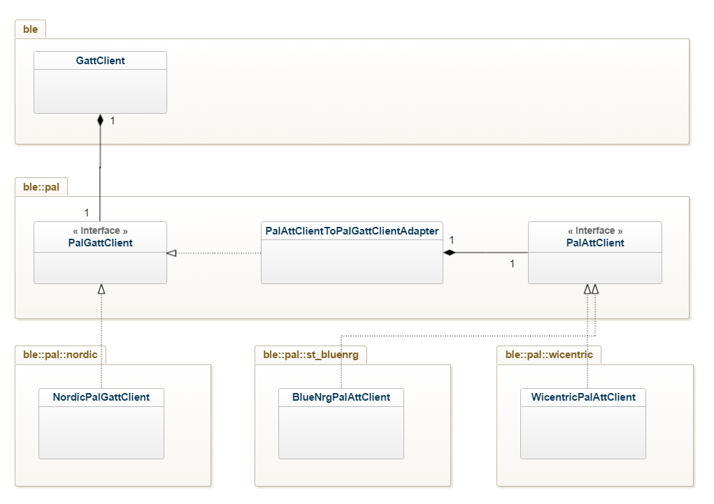
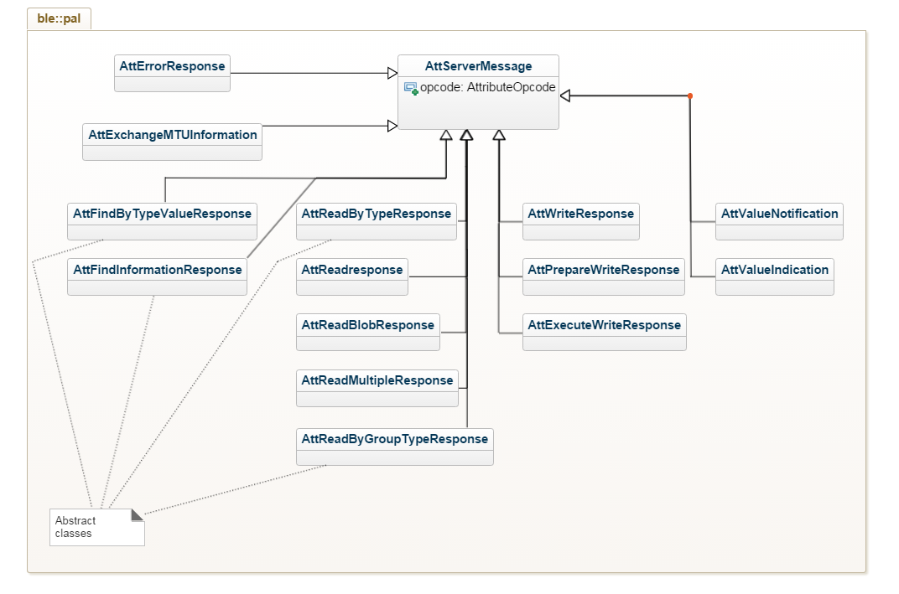

<!-- TOC -->

- [Introduction](#introduction)
- [Motivation](#motivation)
- [Software architecture](#software-architecture)
    - [Software modules](#software-modules)
    - [Design](#design)
        - [Client interfaces](#client-interfaces)
        - [Server Messages Interface](#server-messages-interface)
- [Software interfaces](#software-interfaces)
    - [Client](#client)
        - [pal::AttClient](#palattclient)
        - [pal::GattClient](#palgattclient)
        - [pal::AttClientToGattClientAdapter](#palattclienttogattclientadapter)
    - [Server Messages](#server-messages)
- [Sample implementations](#sample-implementations)

<!-- /TOC -->

# Introduction 

This RFC describes the architecture of the porting layer needed by mbed BLE to 
realize a GATT client. It explain how a stack vendor can implement this porting 
layer and expose implementations for several stacks.

# Motivation 

For a long time, the GattClient class has been a weak spot in mbed BLE. 

From a user perspective, a lot of functionalities like mtu management, long read 
or write and others are missing, the error handling is complicated and 
incorrect and finally the discovery process is complex and non intuitive. 

From a vendor perspective, the implementation is complex and error prone because 
functions like `GattClient::discoverService` does not follow BLE logic. As a 
results vendors have to implement complex logic in there port and a lot of code 
is (more or less) duplicated accross the various port of mbed BLE.

From an mbed BLE developer (and maintainer) perspective, the lack of separation 
between port and API is detrimental because it becomes very complicated to 
provide new API or higher level API without work from vendors. The implementation 
and the abstraction being two faces of the same coin.

This rfc tackle GattClient issues from a vendor perspective. It introduce a 
simple, low level, logic free, complete porting layer of primitives necessary to 
implement a consistent GATT client following scrupulously Bluetooth GATT and ATT 
specifications. 

The full fledged GATT client used by the end developer is implemented by mbed 
BLE (rather than the vendor) and rely on primitives exposed by the porting layer 
to implement. Given that the porting layer covers the whole spectrum of GATT/ATT 
procedure it become possible to provide new abstractions and features missing 
in mbed BLE without any work from the vendor.

# Software architecture

## Software modules

mbed BLE is divided in three layers: 
* BLE API: The user facing API, it allows a developper using mbed to develop 
easily a BLE application running on various BLE capable hardware. 
* Platform Abstraction Layer: This layer expose a low level and simple interface 
to the BLE stack. 
* Vendor: Contains vendor implementation of the PAL.

This organization is reflected in C++ namespace: 
* BLE API is in the namespace `ble`.
* The platform abstraction layer definition is in the namespace `ble::pal`.
* Vendors implementation of the pal are in the namespace `ble::pal::<vendor name>`.

## Design 

The Attribute Protocol defines four type of procedures between a client and the 
server: 

* Client initiated: 
  - Request: The client sends a request to the server and the server reply to it 
    with a response. 
  - Commands: The client sends a command to the server for which it won't 
    receive any acknowledgement from the server.
* Server initiated: 
  - Indication: The server indicates a characteristic value to the GATT 
    client and expects an acknowledgment (a confirmation) that the indication 
    was successfully received.
  - Notification: The server notifies a characteristic value to the GATT client 
    without expecting any acknowledgment that the notification was successfully
    received.

The design of the abstraction layer for a GATT client reflect this organization,
a client interface is in charge of sending client request and commands to the 
server while Responses, Indication and Notification from the server are catch 
by a callback registered in the client interface.  

### Client interfaces

The Bluetooth specification describe GATT (Generic Attribute Profile) as a 
service framework using the Attribute Protocol (ATT) for discovering services 
and their characteristics as well as reading and writing characteristic values. 

The ATT protocol on the other hand is a protocol for discovering, reading and 
writing attributes on a peer device. 

In other word ATT is a protocol working on attributes while GATT is a framework 
describing how these attributes are organized in services, characteristic and 
characteristic descriptors it also describes how ATT procedures should be used 
to interract with these higher level construct (as opposed to attributes). 

In that context it would have been logic to express the `pal` for the GATT 
client as an interface of the Attribute Protocol. Unfortunatelly not all vendor 
BLE stacks expose an interface to the Attribute Protocol. These stacks expose 
partial implementation of ATT procedures restricted to GATT context. 

To accomodate every vendor the `pal` for the GattClient can be expressed in term 
of a plain ATT interface named `AttClient` or an truncated ATT interface 
restricted to GATT usage named `GattClient`. BLE API use a `pal::GattClient`
instance to implement the GATT protocol and vendors can export a `pal::AttClient`
to the higher level as a `pal::GattClient` by using the addapter: 
`pal::AttClientToGattClientAdapter`.

This can be sumarized in the following diagram: 

If the vendor ble stack support all ATT procedures then it should provide an 
implementation of `pal::AttClient` in its port otherwise, `pal::GattClient` 
should be implemented.

### Server Messages Interface

The messages replied by the server to the client are modeled after the ATT 
specification. 

The base class for these messages is `pal::AttServerMessage` every ATT PDU from 
the following types: *Response*, *Notification* and *Indication* is modeled by a
class inheriting from `pal::AttServerMessage`. 

The class hierarchy can be resumed in the following diagram: 

As indicated in the diagram, some of the messages are abstract classes. Once 
again it is to accomodate every BLE vendor stack. Stacks which doesn't expose an 
ATT interface can also abstract the ATT responses PDU. 

A simple implementation of those class is provided by the pal, it should 
accomodate stacks exposing a pure Att interface. 

# Software interfaces 

## Client 

The client can be implemented by a vendor either by subclassing the class 
`pal::AttClient` or the class `pal::GattClient`. 

They share common functions but one does not inherit from the other or from a 
base class, they're not quite the same kind of entity, the `pal::GattClient` has 
to be made to answer a practical deficiencies of some *real world* stacks. In 
that regard, it is more flexible to have different hierarchies for these 
entities. 

`pal::AttClient` can be adapted into a `pal::GattClient` by using the adapter 
`pal::AttClientToGattClientAdapter` available in 
[source/ble/pal/AttClientToGattClientAdapter.h](source/ble/pal/AttClientToGattClientAdapter.h).

### pal::AttClient

The `pal::AttClient` interface is availalble in 
[pal/AttClient.h](source/ble/pal/AttClient.h).
It follows the Attribute Protocol specification defined in the Bluetooth 
specification Version 5.0 | Vol 3, Part F.

Client requests and commands are modeled as member functions that has to be 
implemented by vendor. 

Server events (response, notification and indications) are handled by non 
virtual function `AttClient::on_server_event` that the vendor implementation has 
to call whenever it receive a valid server event. 

The mapping of ATT procedure to C++ function and object is as: 

|    Attribute Procedure    |           Initiating function           |                  Response Expected                 |
|---------------------------|-----------------------------------------|----------------------------------------------------|
| MTU Exchange              | `AttClient::exchange_mtu_request`       | `AttExchangeMTUResponse` or `AttErrorResponse`     |
| Find Information          | `AttClient::find_information_request`   | `AttFindInformationResponse` or `AttErrorResponse` |
| Find By Type Value        | `AttClient::find_by_type_value_request` | `AttFindByTypeValueResponse` or `AttErrorResponse` |
| Read By Type              | `AttClient::read_by_type_request`       | `AttReadByTypeResponse` or `AttErrorResponse`      |
| Read                      | `AttClient::read_request`               | `AttReadResponse` or `AttErrorResponse`            |
| Read Blob                 | `AttClient::read_blob_request`          | `AttReadBlobResponse` or `AttErrorResponse`        |
| Read Multiple             | `AttClient::read_multiple_request`      | `AttReadMultipleResponse` or `AttErrorResponse`    |
| Read By Group Type        | `AttClient::read_by_group_type_request` | `AttReadByGroupTypeResponse` or `AttErrorResponse` |
| Write                     | `AttClient::write_request`              | `AttWriteResponse` or `AttErrorResponse`           |
| Write Command             | `AttClient::write_command`              | N/A                                                |
| Signed Write Command      | `AttClient::signed_write_command`       | N/A                                                |
| Prepare Write             | `AttClient::prepare_write_request`      | `AttPrepareWriteResponse` or `AttErrorResponse`    |
| Execute Write             | `AttClient::execute_write_request`      | `AttExecuteWriteResponse` or `AttErrorResponse`    |
| Handle Value Notification | N/A                                     | `AttValueNotification`                             |
| Handle Value Indication   | N/A                                     | `AttValueIndication`                               |

### pal::GattClient

The `pal::GattClient` interface is available in 
[ble/pal/GattClient.h](source/ble/pal/GattClient.h).
It defines the bare minimum of procedures necessary to handle GATT procedures. 

As for the `pal::AttClient`, client requests and commands are modeled as member 
functions that has to be implemented by vendor and server events (response, 
notification and indications) are handled by non virtual function 
`GattClient::on_server_event` that the vendor implementation has to call whenever 
it receive a valid server event. 

| GATT Procedure                            | Member function primitive(s)                                            | Server Events primitive(s)                                                 |
|-------------------------------------------|-------------------------------------------------------------------------|----------------------------------------------------------------------------|
| Exchange MTU                              | `GattClient::exchange_mtu_request`                                      | `AttExchangeMTUResponse` or `AttErrorResponse`                             |
| Discover All Primary Services             | `GattClient::discover_primary_service`                                  | `AttReadByGroupTypeResponse` or `AttErrorResponse`                         |
| Discover Primary Services By Service UUID | `GattClient::discover_primary_service_by_service_uuid`                  | `AttFindByTypeValueResponse` or `AttErrorResponse`                         |
| Find Included Service                     | `GattClient::find_included_service`                                     | `AttReadByTypeResponse` or `AttErrorResponse`                              |
| Discover All Characteristics of a Service | `GattClient::discover_characteristics_of_a_service`                     | `AttReadByTypeResponse` or `AttErrorResponse`                              |
| Discover Characteristic by UUID           | `GattClient::discover_characteristics_of_a_service`                     | `AttReadByTypeResponse` or `AttErrorResponse`                              |
| Discover All Characteristic Descriptors   | `GattClient::discover_characteristics_descriptors`                      | `AttFindInformationResponse` or `AttErrorResponse`                         |
| Read Characteristic Value                 | `GattClient::read_attribute_value`                                      | `AttReadResponse` or `AttErrorResponse`                                    |
| Read Using Characteristic UUID            | `GattClient::read_using_characteristic_uuid`                            | `AttReadByTypeResponse` or `AttErrorResponse`                              |
| Read Long Characteristic Values           | `GattClient::read_attribute_blob`                                       | `AttReadBlobResponse` or `AttErrorResponse`                                |
| Read Multiple Characteristic Values       | `GattClient::read_multiple_characteristic_values`                       | `AttReadMultipleResponse` or `AttErrorResponse`                            |
| Write Without Response                    | `GattClient::write_without_response`                                    | N/A                                                                        |
| Signed Write Without Response             | `GattClient::signed_write_without_response`                             | N/A                                                                        |
| Write Characteristic Value                | `GattClient::write_attribute`                                           | `AttWriteResponse` or `AttErrorResponse`                                   |
| Write Long Characteristic Value           | `GattClient::queue_prepare_write` and `GattClient::execute_write_queue` | `AttPrepareWriteResponse`, `AttExecuteWriteResponse` or `AttErrorResponse` |
| Characteristic Value Reliable Writes      | `GattClient::queue_prepare_write` and `GattClient::execute_write_queue` | `AttPrepareWriteResponse`, `AttExecuteWriteResponse` or `AttErrorResponse` |
| Characteristic Value Notification         | N/A                                                                     | `AttValueNotification`                                                     |
| Characteristic Value Indication           | N/A                                                                     | `AttValueIndication`                                                       |
| Read Characteristic Descriptors           | `GattClient::read_attribute_value`                                      | `AttReadResponse` or `AttErrorResponse`                                    |
| Read Long Characteristic Descriptors      | `GattClient::read_attribute_blob`                                       | `AttReadBlobResponse` or `AttErrorResponse`                                |
| Write Characteristic Descriptors          | `GattClient::write_attribute`                                           | `AttWriteResponse` or `AttErrorResponse`                                   |
| Write Long Characteristic Descriptors     | `GattClient::queue_prepare_write` and `GattClient::execute_write_queue  | `AttPrepareWriteResponse`, `AttExecuteWriteResponse` or `AttErrorResponse` |

### pal::AttClientToGattClientAdapter

The `pal::AttClientToGattClientAdapter` adapter is available in 
[pal/AttClientToGattClientAdapter.h](source/ble/pal/AttClientToGattClientAdapter.h).

It adapt a `pal::AttClient` instance into a `pal::GattClient` instance. 

The operation is done by the constructor of the 
`pal::AttClientToGattClientAdapter` which expect a reference to a 
`pal::AttClient` in input. Every call to the adapter instance will be 
appropriately forwarded to the inner instance of the `pal::AttClient`.

Messages from the server will be forwarded as is.

| GattClient                                             | AttClient                               | Arguments bound                                                                                    |
|--------------------------------------------------------|-----------------------------------------|----------------------------------------------------------------------------------------------------|
| `GattClient::exchange_mtu_request`                     | `AttClient::exchange_mtu_request`       | N/A                                                                                                |
| `GattClient::discover_primary_service`                 | `AttClient::read_by_group_type_request` | `uuid` equal to `SERVICE_TYPE_UUID` and attribute range cover [discovery_range_begining to 0xFFF]. |
| `GattClient::discover_primary_service_by_service_uuid` | `AttClient::find_by_type_value_request` | `type` equal to `SERVICE_TYPE_UUID` and value equal to the UUID of the service.                    |
| `GattClient::find_included_service`                    | `AttClient::read_by_type_request`       | `type` equal to `INCLUDE_TYPE_UUID`                                                                |
| `GattClient::discover_characteristics_of_a_service`    | `AttClient::read_by_type_request`       | `type` equal to `CHARACTERISTIC_TYPE_UUID`                                                         |
| `GattClient::discover_characteristics_descriptors`     | `AttClient::find_information_request`   | N/A                                                                                                |
| `GattClient::read_attribute_value`                     | `AttClient::read_request`               | N/A                                                                                                |
| `GattClient::read_using_characteristic_uuid`           | `AttClient::read_by_type_request`       | `uuid` mapped to the `type` of attribute to read.                                                  |
| `GattClient::read_attribute_blob`                      | `AttClient::read_blob_request`          | N/A                                                                                                |
| `GattClient::read_multiple_characteristic_values`      | `AttClient::read_multiple_request`      | N/A                                                                                                |
| `GattClient::write_without_response`                   | `AttClient::write_command`              | N/A                                                                                                |
| `GattClient::signed_write_without_response`            | `AttClient::signed_write_command`       | N/A                                                                                                |
| `GattClient::write_attribute`                          | `AttClient::write_request`              | N/A                                                                                                |
| `GattClient::queue_prepare_write`                      | `AttClient::prepare_write_request`      | N/A                                                                                                |
| `GattClient::execute_write_queue`                      | `AttClient::execute_write_request`      | N/A                                                                                                |

## Server Messages 

Messages received (response, notification or indication) from the server has to 
be converted to an appropriate object before being forwarded to the member 
function `on_server_event` present in `pal::AttClient` and `pal::GattClient`. 
All messages declaration can be found in the file 
[pal/AttServerMessage.h](source/ble/pal/AttServerMessage.h).

The mapping between Attribute PDU and `AttServerMessage` types is as follow:

| Attribute PDU               | C++ Object                        |
|-----------------------------|-----------------------------------|
| Error Response              | `pal::AttErrorResponse`           |
| Exchange MTU Response       | `pal::AttExchangeMTUResponse`     |
| Find Information Response   | `pal::AttFindInformationResponse` |
| Find By Value Type response | `pal::AttFindByTypeValueResponse` |
| Read By Type Response       | `pal::AttReadByTypeResponse`      |
| Read Response               | `pal::AttReadResponse`            |
| Read Blob Response          | `pal::AttReadBlobResponse`        |
| Read Multiple Response      | `pal::AttReadMultipleResponse`    |
| Read By Group Type Response | `pal::AttReadByGroupTypeResponse` |
| Write Response              | `pal::AttWriteResponse`           |
| Prepare Write Response      | `pal::AttPrepareWriteResponse`    |
| Execute Write Response      | `pal::AttExecuteWriteResponse`    |
| Handle Value Notification   | `pal::AttHandleValueNotification` |
| Handle Value Confirmation   | `pal::AttHandleValueIndication`   |

Most of the messages expose a complete and trivial implementation but it is not 
the case for all of them. Four of them might require an implementation from the 
vendor in order to deal with stack doesn't exposing a proper ATT interface. 

Those messages are `pal::AttFindInformationResponse`, 
`pal::AttFindByTypeValueResponse`, `pal::AttReadByTypeResponse` and 
`pal::AttReadByGroupTypeResponse`. 

A default implementation for stacks complying with ATT is exposed in the file 
[pal/SimpleAttServerMessage.h](source/ble/pal/SimpleAttServerMessage.h).

# Sample implementations

Sample implementations for various stacks are defined in this RFC: 
* Nordic: [NRFGattClient.h](source/targets/nordic/NRFGattClient.h)
* ST BlueNRG: [BlueNRGAttClient.h](source/targets/st/BlueNRGAttClient.h)
* Wicentric: [WicentricAttClient.h](source/targets/wicentric.WicentricAttClient.h)
* NXP: [NXPAttClient.h](source/targets/nxp/NXPAttClient.h)