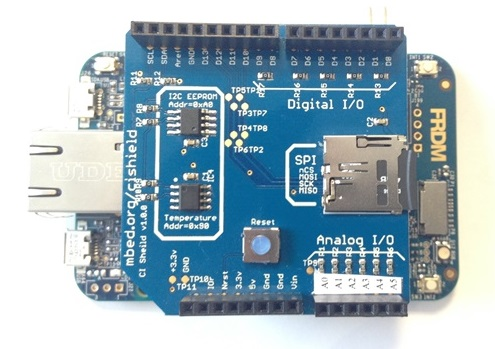

# FAT32 Filesystem Support README #

Simon Hughes

20170228

Version 1.00


# Executive Summary

These notes are intended to help developers adopt the mbedOS POSIX File API support. The notes cover:

- Brief notes on how to setup the mbedOS development environment, including links to other resources.
- How to work with the sd-driver and mbedOS to build the test cases.
- How to run the POSIX File API test cases.

Note the following:

- The mbedOS FAT32/SDCard support implements a POSIX File API for off-chip, persistent file storage. 
- The mbedOS repository contains the FAT32 filesystem code and associated wrapper code to implement the POSIX API.
- The SDCard driver is maintained in a separate repository (the sd-driver repo) and hence the 2 repositories have to be used together to deliver the FAT32 Filesystem/SDCard support.
  This document explains how to do this.

  
# Getting Started

This section describes how to build and run the POSIX file API test case. The following steps are covered:

- [Installing the Tools](#installing-the-tools). This section briefly describes how to setup the mbedos development environment.
- [Create the FAT/SDCard Application Project](#create-fat-sdcard-application-project). This section describes how to git clone the mbedOS repository containing the FAT32/SDCard and POSIX File API test case of interest.
- [Build the mbedOS Test Cases](#build-the-mbedos-test-cases). This section describes how to build the mbedOS test cases.
- [Insert a microSD Card Into the K64F](#insert-sdcard-into-k64f).This section describes how to format (if required) a microSD card prior to running the tests.
- [Run the POSIX File Test Case](#run-the-posix-file-test-cases).This section describes how to run the POSIX file test case basic.cpp.

### <a name="installing-the-tools"></a> Installing the Tools 

The following tools should be installed:

- arm-none-eabi-gcc. See [mbedOS Development Environment Setup Howto Notes][MBED_DEVENV_NOTES] for guidance.
- Python 2.7.9 or later. See [mbedOS Development Environment Setup Howto Notes][MBED_DEVENV_NOTES] for guidance.
- mbed Greentea. This is the mbedOS test tool.
- Git Bash.  See [mbedOS Development Environment Setup Howto Notes][MBED_DEVENV_NOTES] for guidance.
- mbed-cli. This is the tool used to make mbedOS application and test builds.

Using a Git Bash terminal, setup mbed-cli in the following way:

    simhug01@E107851:/d/demo_area$ git clone git@github.com:/armmbed/mbed-cli
    <trace removed>
    simhug01@E107851:/d/demo_area$ pushd mbed-cli
    simhug01@E107851:/d/demo_area/mbed-cli/$ python.exe setup.py install
    simhug01@E107851:/d/demo_area/mbed-cli/$ popd

Using a Git Bash terminal, setup Greentea in the following way:

    simhug01@E107851:/d/demo_area$ git clone git@github.com:/armmbed/greentea
    <trace removed>
    simhug01@E107851:/d/demo_area$ pushd greentea
    simhug01@E107851:/d/demo_area/greentea/$ python.exe setup.py install
    simhug01@E107851:/d/demo_area/greentea/$ popd
    simhug01@E107851:/d/demo_area/$


### <a name="create-fat-sdcard-application-project"></a> Create the FAT/SDCard Application Project

This section describes how to create an applicaton project combining the mbed-os and sd-driver repositories in a single project. 
In summary the following steps will be covered in this section:

- A top level application project directory is created. The directory name is ex_app1.
- In the ex_appp1 directory, the mbed-os repository is cloned.
- In the ex_appp1 directory at the same level as the mbed-os directory, the sd-driver repository is cloned.
- The mbed_app.json file is copied from the sd-driver/config/mbed_app.json to the ex_app1 directory.

First create the top level application directory ex_app1 and move into it:

    simhug01@E107851:/d/demo_area$ mkdir ex_app1
    simhug01@E107851:/d/demo_area$ pushd ex_app1

Next, get a clone of public mbedOS repository in the following way:

    simhug01@E107851:/d/demo_area/ex_app1$ git clone git@github.com:/armmbed/mbed-os
    <trace removed>
    simhug01@E107851:/d/demo_area/ex_app1$

Next, get a clone of the sd-driver repository:

    simhug01@E107851:/d/demo_area/ex_app1$ git clone git@github.com:/armmbed/sd-driver
    <trace removed>
    simhug01@E107851:/d/demo_area/ex_app1$
    
Finally, copy the mbed_app.json application configuration file from sd-driver/config/mbed_app.json to the ex_app1 directory:

    simhug01@E107851:/d/demo_area/ex_app1$ cp sd-driver/config/mbed_app.json .
    simhug01@E107851:/d/demo_area/ex_app1$


### <a name="build-the-mbedos-test-cases"></a> Build the mbedOS Test Cases

The sd-driver master HEAD and the mbed-os master HEAD should be compatible with one another and therefore no specific tagged version need to be checked out.
However, in the case that you experience problems building, checkout out the same tagged version of each repository:

    simhug01@E107851:/d/demo_area/ex_app1$ pushd mbed-os
    simhug01@E107851:/d/demo_area/ex_app1$ git checkout tags/mbed-os-5.4.0
    simhug01@E107851:/d/demo_area/ex_app1$ popd 
    simhug01@E107851:/d/demo_area/ex_app1$ pushd sd-driver
    simhug01@E107851:/d/demo_area/ex_app1$ git checkout tags/mbed-os-5.4.0
    simhug01@E107851:/d/demo_area/ex_app1$ popd 

Build the test cases for the K64F target using the following commands:

    simhug01@E107851:/d/demo_area/ex_app1$ mbed -v test --compile -t GCC_ARM -m K64F --app-config mbed_app.json 2>&1 | tee build_tests_gcc_20161219_1007.txt
    <trace removed>
    simhug01@E107851:/d/demo_area/ex_app1$

The build trace is quite extensive but on a successful build you should see the following output at the end of the log:

    <trace removed>
    Build successes:
      * K64F::GCC_ARM::MBED-BUILD
      * K64F::GCC_ARM::MBED-OS-FEATURES-FEATURE_LWIP-TESTS-MBEDMICRO-NET-CONNECTIVITY
      * K64F::GCC_ARM::MBED-OS-FEATURES-FEATURE_LWIP-TESTS-MBEDMICRO-NET-GETHOSTBYNAME
      * K64F::GCC_ARM::MBED-OS-FEATURES-FEATURE_LWIP-TESTS-MBEDMICRO-NET-TCP_ECHO
      * K64F::GCC_ARM::MBED-OS-FEATURES-FEATURE_LWIP-TESTS-MBEDMICRO-NET-TCP_ECHO_PARALLEL
      * K64F::GCC_ARM::MBED-OS-FEATURES-FEATURE_LWIP-TESTS-MBEDMICRO-NET-TCP_HELLO_WORLD
      * K64F::GCC_ARM::MBED-OS-FEATURES-FEATURE_LWIP-TESTS-MBEDMICRO-NET-UDP_DTLS_HANDSHAKE
      * K64F::GCC_ARM::MBED-OS-FEATURES-FEATURE_LWIP-TESTS-MBEDMICRO-NET-UDP_ECHO
      * K64F::GCC_ARM::MBED-OS-FEATURES-FEATURE_LWIP-TESTS-MBEDMICRO-NET-UDP_ECHO_PARALLEL
      * K64F::GCC_ARM::MBED-OS-FEATURES-FRAMEWORKS-UTEST-TESTS-UNIT_TESTS-BASIC_TEST
      * K64F::GCC_ARM::MBED-OS-FEATURES-FRAMEWORKS-UTEST-TESTS-UNIT_TESTS-BASIC_TEST_DEFAULT
    <trace removed>
      * K64F::GCC_ARM::MBED-OS-FEATURES-TESTS-FILESYSTEM-HEAP_BLOCK_DEVICE
      * K64F::GCC_ARM::MBED-OS-FEATURES-TESTS-FILESYSTEM-UTIL_BLOCK_DEVICE
    <trace removed>
      * K64F::GCC_ARM::SD-DRIVER-FEATURES-TESTS-FILESYSTEM-BASIC
      * K64F::GCC_ARM::SD-DRIVER-FEATURES-TESTS-FILESYSTEM-FOPEN
  
    <trace removed>


Notice the following tests in the sd-driver tree are listed above:     

  * K64F::GCC_ARM::SD-DRIVER-FEATURES-TESTS-FILESYSTEM-BASIC
  * K64F::GCC_ARM::SD-DRIVER-FEATURES-TESTS-FILESYSTEM-FOPEN


### <a name="insert-sdcard-into-k64f"></a> Testing with an SDCard on Target XYZ

The standard way to test is with the mbed CI Test Shield plugged into the target board. This pin mapping for this configuration is parameeterised in the mbed_app.json file.

The following is an example of the mbed_app.json file that was defined in the project at the time of writing:

    {
        "config": {
            "UART_RX": "D0",
            "UART_TX": "D1",
            "DIO_0": "D0",
            "DIO_1": "D1",
            "DIO_2": "D2",
            "DIO_3": "D3",
            "DIO_4": "D4",
            "DIO_5": "D5",
            "DIO_6": "D6",
            "DIO_7": "D7",
            "DIO_8": "D8",
            "DIO_9": "D9",
            "SPI_CS": "D10",
            "SPI_MOSI": "D11",
            "SPI_MISO": "D12",
            "SPI_CLK": "D13",
            "I2C_SDA": "D14",
            "I2C_SCL": "D15",
            "I2C_TEMP_ADDR":"0x90",
            "I2C_EEPROM_ADDR":"0xA0",
            "AIN_0": "A0",
            "AIN_1": "A1",
            "AIN_2": "A2",
            "AIN_3": "A3",
            "AIN_4": "A4",
            "AIN_5": "A5",
            "AOUT" : "A5",
            "PWM_0": "D3",
            "PWM_1": "D5",
            "PWM_2": "D6",
            "PWM_3": "D9",
            "DEBUG_MSG": 0,
            "DEVICE_SPI": 1,
            "FSFAT_SDCARD_INSTALLED": 1
        },
        "target_overrides": {
            "DISCO_F051R8": {
                 "SPI_MOSI": "SPI_MOSI",
                 "SPI_MISO": "SPI_MISO",
                 "SPI_CLK":  "SPI_SCK",
                 "SPI_CS":   "SPI_CS"
            },
            "K20D50M": {
                 "SPI_MOSI": "PTD2",
                 "SPI_MISO": "PTD3",
                 "SPI_CLK":  "PTD1",
                 "SPI_CS":   "PTC2"
            },
            "KL22F": {
                 "SPI_MOSI": "PTD6",
                 "SPI_MISO": "PTD7",
                 "SPI_CLK":  "PTD5",
                 "SPI_CS":   "PTD4"
            },
            "KL25Z": {
                 "SPI_MOSI": "PTD2",
                 "SPI_MISO": "PTD3",
                 "SPI_CLK":  "PTD1",
                 "SPI_CS":   "PTD0"
            },
            "KL43Z": {
                 "SPI_MOSI": "PTD6",
                 "SPI_MISO": "PTD7",
                 "SPI_CLK":  "PTD5",
                 "SPI_CS":   "PTD4"
            },
            "KL46Z": {
                 "SPI_MOSI": "PTD6",
                 "SPI_MISO": "PTD7",
                 "SPI_CLK":  "PTD5",
                 "SPI_CS":   "PTD4"
            },
            "K64F": {
                 "SPI_MOSI": "PTE3",
                 "SPI_MISO": "PTE1",
                 "SPI_CLK":  "PTE2",
                 "SPI_CS":   "PTE4"
            },
            "K66F": {
                 "SPI_MOSI": "PTE3",
                 "SPI_MISO": "PTE1",
                 "SPI_CLK":  "PTE2",
                 "SPI_CS":   "PTE4"
            },
            "LPC11U37H_401": {
                 "SPI_MOSI": "SDMOSI",
                 "SPI_MISO": "SDMISO",
                 "SPI_CLK":  "SDSCLK",
                 "SPI_CS":   "SDSSEL"
            },
            "LPC2368": {
                 "SPI_MOSI": "p11",
                 "SPI_MISO": "p12",
                 "SPI_CLK":  "p13",
                 "SPI_CS":   "p14"
            },
            "NUCLEO_L031K6": {
                 "SPI_MOSI": "SPI_MOSI",
                 "SPI_MISO": "SPI_MISO",
                 "SPI_CLK":  "SPI_SCK",
                 "SPI_CS":   "SPI_CS"
            },
            "nRF51822": {
                 "SPI_MOSI": "p12",
                 "SPI_MISO": "p13",
                 "SPI_CLK":  "p15",
                 "SPI_CS":   "p14"
            },
            "RZ_A1H": {
                 "SPI_MOSI": "P8_5",
                 "SPI_MISO": "P8_6",
                 "SPI_CLK":  "P8_3",
                 "SPI_CS":   "P8_4"
            }
        }
    }

Note the following things about the mbed_app.json file:

- The mbed_app.json is used to define target specific symbols for the SPI pins used to connect the SDCard slot to the target MCU:
    - "SPI\_CS".
    - "SPI\_MOSI".
    - "SPI\_MISO".
    - "SPI\_CLK".
- The default configuration is defined in the "config" section for mappings to the standard Arduino header pins for the SPI bus. 
  The "config" section defines a dictionary which maps functional names to target board Arduino header pins: 
    - "SPI\_CS": "D10". This causes the MBED\_CONF\_APP\_SPI\_CS symbol to be defined in mbed\_config.h as D10, which is used in the filesystem test implementation.
      D10 is defined in the target specific PinNames.h file.
    - "SPI\_MOSI": "D11". This causes the MBED\_CONF\_APP\_SPI\_MOSI symbol to be defined in mbed\_config.h.
    - "SPI\_MISO": "D12". This causes the MBED\_CONF\_APP\_SPI\_MISO symbol to be defined in mbed\_config.h.
    - "SPI\_CLK": "D13". This causes the MBED\_CONF\_APP\_SPI\_CLK symbol to be defined in mbed\_config.h.
- The ""target_overrides" is used to override the "SPI\_xxx" symbols for specific target boards, which may have an SDCard slot, for example.
  This is the case for the K64F, where the "SPI\_xxx" are mapped to the pin names for the on-board SDCard

  ```
    "K64F": {
         "SPI_MOSI": "PTE3",
         "SPI_MISO": "PTE1",
         "SPI_CLK":  "PTE2",
         "SPI_CS":   "PTE4"
    }
    ```  
- Thus, in the absence of any target specific definitions in the "target_overrides" section, all boards will default to 
  use the Arduino header configuration. For those platforms with a "target_overrides" section then this configuration
  will be used in preference. 
- Hence in the case that you want to test a platform fitted with a CI shield (with an SDCard inserted)
  and there is a "target_overrides" section present in the mbed_app.json, then delete the "target_overrides"
  section before building. This will result in the default configuration being used (suitable for the CI
  Test Shield).
- Note when inserting the v1.0.0 CI Test Shield into the Arduino header of the target platform, the shield pins D0 and
  D1 should be bent to be parallel to the shield PCB so they are not inserted into the Arduino header. This is because
  some boards use the same UART on DAPLINK and D0/D1, which means the serial debug channel breaks and hence the mbed greentea
  test suite will not work correctly. This is mainly on older ST boards and should not be a problem on 
  `K64F`, `NUCLEO_F429ZI` and `UBLOX_EVK_ODIN_W2`. Note also that the v2.0.0 CI Test Shield doesn't suffer from this
  problem and the pins don't need to be bent.  
- When inserting the SDCard into the card slot on the CI test shield, make sure the card is fully inserted. 
  On insertion, there should be a small clicking sound when the card registers, and the back edge of the card
  should protrude no more than ~1mm over the edge of the CI test shield PCB. If the SDCard fails to register, 
  try gently pushing the metal flexible strip in the shape of a space at the top edge of the SDCard metal slot
  casing with a pair of tweezers, bending it a little to lower it into the slot casing. This helps with the
  insertion mechanism.

#### Target K64F wi CI Test Shield fitted



**Figure 1. The figure shows the K64F platform with the CI shield fitted.**

The above figure shows the K64F with the v1.0.0 CI test shield fitted. Note:

- The pins D0/D1 (top right of CI test shield) are bent sideways so as not to insert into the header.
- The SDCard is fully inserted into the slot and overhangs the PCB by ~1mm.  
  
#### <a name="insert-sdcard-into-k64f"></a> Insert SDCard into K64F

The test cases have been run on a K64F with the following microSDHC cards:

- Kingston 2GB mircoSDHC card.  
- Kingston 8GB mircoSDHC card.  
- SanDisk 16GB mircoSDHC ultra card.  

If the card requires formatting then the following procedure is known to work:

- Insert microSD card into SD adapter in USB stick (or similar) so the microSD card can be insert into windows PC.
- Within file explorer, right click/Format on the USB drive.
- Select FAT32, 4096 cluster size, Quick Format.
- Format the drive.

The microSD card should then be ready for use in the K64F.


### <a name="run-the-posix-file-test-cases"></a> Run the POSIX File Test Case

To setup for running the test cases, complete the following steps:

- Insert a micro SDCard into K64F SDCard socket.
- Connect the K64F development board to your PC using a suitable USB cable.

All tests can be run using the following command:

    simhug01@E107851:/d/demo_area/ex_app1$ mbedgt -VS
    <trace removed>

However, it's possible to run a particular test case using the following form of the mbedgt command:

    simhug01@E107851:/d/demo_area/ex_app1$ mbedgt -VS --test-by-names=<test-name>
    
The names of the tests can be listed using: 

    simhug01@E107851:/d/demo_area/ex_app1$ mbedgt -VS --list

For example, to run the basic test use:
    
    simhug01@E107851:/d/demo_area/ex_app1$ mbedgt -VS --test-by-names=sd-driver-features-tests-filesystem-basic 2>&1 | tee run_tests_basic.txt

To run the fopen test use:

    simhug01@E107851:/d/demo_area/ex_app1$ mbedgt -VS --test-by-names=sd-driver-features-tests-filesystem-fopen 2>&1 | tee run_tests_fopen.txt
    

On a successful run, results similar to the following will be shown:

    mbedgt: test suite 'mbed-os-features-storage-feature_storage-tests-fs-fat-basic' ..................... OK in 15.86 sec
        test case: 'FSFAT_test_00: fopen()/fgetc()/fprintf()/fclose() test.' ......................... OK in 0.90 sec
        test case: 'FSFAT_test_01: fopen()/fseek()/fclose() test.' ................................... OK in 0.32 sec
    mbedgt: test case summary: 2 passes, 0 failures
    mbedgt: all tests finished!
    mbedgt: shuffle seed: 0.7720862854
    mbedgt: test suite report:
    +--------------+---------------+-------------------------------------------------------------+--------+--------------------+-------------+
    | target       | platform_name | test suite                                                  | result | elapsed_time (sec) | copy_method |
    +--------------+---------------+-------------------------------------------------------------+--------+--------------------+-------------+
    | K64F-GCC_ARM | K64F          | mbed-os-features-storage-feature_storage-tests-fs-fat-basic | OK     | 15.86              | shell       |
    +--------------+---------------+-------------------------------------------------------------+--------+--------------------+-------------+
    mbedgt: test suite results: 1 OK
    mbedgt: test case report:
    +--------------+---------------+-------------------------------------------------------------+---------------------------------------------------------+--------+--------+--------+--------------------+
    | target       | platform_name | test suite                                                  | test case                                               | passed | failed | result | elapsed_time (sec) |
    +--------------+---------------+-------------------------------------------------------------+---------------------------------------------------------+--------+--------+--------+--------------------+
    | K64F-GCC_ARM | K64F          | mbed-os-features-storage-feature_storage-tests-fs-fat-basic | FSFAT_test_00: fopen()/fgetc()/fprintf()/fclose() test. | 1      | 0      | OK     | 0.9                |
    | K64F-GCC_ARM | K64F          | mbed-os-features-storage-feature_storage-tests-fs-fat-basic | FSFAT_test_01: fopen()/fseek()/fclose() test.           | 1      | 0      | OK     | 0.32               |
    +--------------+---------------+-------------------------------------------------------------+---------------------------------------------------------+--------+--------+--------+--------------------+
    mbedgt: test case results: 2 OK
    mbedgt: completed in 16.53 sec
    

The full [test output log][RUN-TESTS-GCC-20161219-1011] is available for reference.


### Known mbed-os and sd-driver Compatible Versions

The following versions of mbed-os and sd-driver are known to work together: 

- {mbed-os, sd-driver} = {mbed-os-5.4.0-rc2, sd-driver-0.0.1-mbed-os-5.4.0-rc2}. 
  `K64F`, `NUCLEO_F429ZI` and `UBLOX_EVK_ODIN_W2` fopen and basic filesystem tests working.

    
# POSIX File API

mbedOS supports a subset of the POSIX File API, as outlined below:

- [clearerr()][MAN_CLEARERR].
    - STATUS: Basic testing implemented. Working.
- [fclose()][MAN_FCLOSE].
    - STATUS: Basic testing implemented. Working.
- [ferror()][MAN_CLEARERR].
    - STATUS: Basic testing implemented. 
    - STATUS: GCC_ARM: Working. 
    - STATUS: ARMCC: ARMCC has problem with ferror(filep) where filep is NULL. Appears to work for non-NULL pointer.
- [fgetc()][MAN_FGETS].
    - STATUS: Basic testing implemented. Working.
- [fgets()][MAN_FGETS].
    - STATUS: Basic testing implemented. Working.
- [fputc()][MAN_FPUTS].
    - STATUS: Unknown.
- [fputs()][MAN_FPUTS].
    - STATUS: Basic testing implemented. Working.
- [fprintf()][MAN_FPRINTF].
    - STATUS: Basic testing implemented. Working.
- [fopen()][MAN_FOPEN].
    - STATUS: Basic testing implemented. Working. 
- [freopen()][MAN_FOPEN].
    - STATUS: This is not tested.
- [fread()][MAN_FREAD].
    - STATUS: Basic testing implemented. Working.
    - STATUS: n x 25kB stress test working.
- [ftell()][MAN_FTELL].
    - STATUS: Basic testing implemented. Working.
- [fwrite()][MAN_FWRITE].
    - STATUS: Basic testing implemented. Working.
    - STATUS: n x 25kB stress test working.
- [fseek()][MAN_FSEEK]
    - STATUS: Basic testing implemented. Working.
- [getc()][MAN_FGETS].
    - STATUS: Basic testing implemented. Working.
- [gets()][MAN_FGETS].
    - STATUS: Unknown.
- [putc()][MAN_FPUTS].
    - STATUS: Unknown.
- [puts()][MAN_FPUTS].
    - STATUS: Unknown.
- [remove()][MAN_REMOVE]
    - STATUS: Basic testing implemented. Working.
- [rewind()][MAN_REWIND].
    - STATUS: Basic testing implemented. Working. 
- [stat()][MAN_STAT]
    - STATUS: Implemented. Working.
    - STATUS: Not supported by ARMCC/IAR libc.
- tmpfile()
    - STATUS: Not implemented.
- tmpnam() 
    - STATUS: Not implemented.

Supported directory related operations are as follows:

- closedir().
    - STATUS: Implemented. Working.
- mkdir(). 
    - STATUS: Basic testing implemented. Working.
- opendir(). 
    - STATUS: Implemented. Working.
- readdir().
    - STATUS: Implemented. Working.
- [remove()][MAN_REMOVE]
    - STATUS: Basic testing implemented. Working.
- rename()
    - STATUS: Implemented. Not tested.
- rewinddir().
    - STATUS: Implemented. Found not to work. Test case not present in repo.
- seekdir()
    - STATUS: Implemented. Found not to work. Test case not present in repo. 
- telldir().
    - STATUS: Implemented. Found not to work. Test case not present in repo.

## errno 

Basic errno reporting is supported, tested and known to be working. This will be extended 
as further test cases are implemented.


## Miscellaneous Information

The FAT32/SDCard support is at the following location in the source code tree:

    <mbed-os_src_root>\features\storage\FEATURE_STORAGE\fs
    
The FAT32/SDCard test cases are at following locations in the source code tree:

    <mbed-os_src_root>\features\storage\FEATURE_STORAGE\TESTS\filesystem\basic\basic.cpp
    <mbed-os_src_root>\features\storage\FEATURE_STORAGE\TESTS\filesystem\fopen\fopen.cpp


# Further Reading

* The [mbedOS Development Environment Setup Notes][MBED_DEVENV_NOTES].
* The example mbedOS build log [BUILD-TESTS-GCC-20161219-1007][BUILD-TESTS-GCC-20161219-1007] for reference.
* The example mbedOS test run log [RUN-TESTS-GCC-20161219-1011][RUN-TESTS-GCC-20161219-1011] for reference.


[MBED_DEVENV_NOTES]: https://github.com/ARMmbed/meVo/blob/master/docs/ARM_MBED/TN/ARM_MBED_TN_0017/12-mbed_devenv_setup_how_to_notes.docx
[BUILD-TESTS-GCC-20161219-1007]: https://github.com/ARMmbed/meVo/blob/master/docs/ARM_MBED/TN/ARM_MBED_TN_0017/build_tests_gcc_20161219_1007.txt
[RUN-TESTS-GCC-20161219-1011]: https://github.com/ARMmbed/meVo/blob/master/docs/ARM_MBED/TN/ARM_MBED_TN_0017/run_tests_master_gcc_ex_app2_fat_basic_20161219_1011.txt
[MAN_CLEARERR]: https://linux.die.net/man/3/clearerr
[MAN_FCLOSE]: https://linux.die.net/man/3/fclose
[MAN_FGETS]: https://linux.die.net/man/3/fgets
[MAN_FOPEN]: https://linux.die.net/man/3/fopen
[MAN_FPRINTF]: https://linux.die.net/man/3/fprintf
[MAN_FPUTS]: https://linux.die.net/man/3/fputs
[MAN_FREAD]: https://linux.die.net/man/3/fread
[MAN_FSEEK]: https://linux.die.net/man/3/fseek
[MAN_FWRITE]: https://linux.die.net/man/3/fwrite
[MAN_REMOVE]: https://linux.die.net/man/3/remove
[MAN_REWIND]: https://linux.die.net/man/3/rewind
[MAN_STAT]: https://linux.die.net/man/2/stat
[MAN_FTELL]: https://linux.die.net/man/3/ftell
