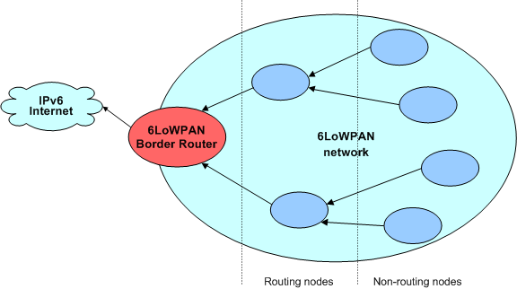
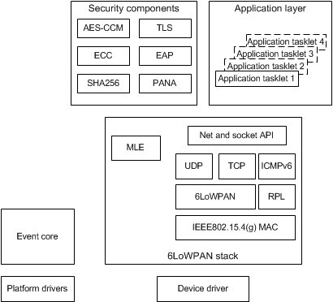
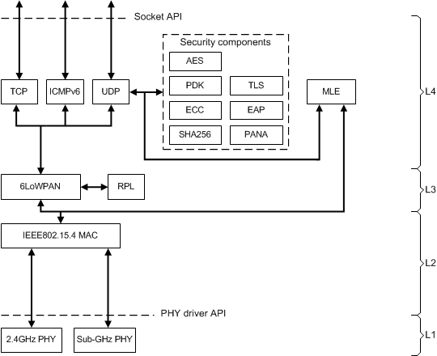

Introduction
============

This chapter introduces the _6LoWPAN stack architecture_. It contains the following sections:

- [_Architecture._](#architecture)
- [_6LoWPAN stack._](#6lowpan-stack)

## Architecture

_IPv6 Low power Wireless Personal Area Network_ (6LoWPAN) is an adaptation layer that enables the use of IPv6 over low power wireless and supports IPv6 and _User Datagram Protocol_ (UDP) header compression. The Internet Protocol (IP) header compression allows 6LoWPAN packets to be compact, making it robust and, ideal for low power and lossy networks. It also handles fragmentation and reassembly of packets in scenarios where payloads larger than the _Maximum Transmission Unit_ (MTU) of the supported interface are transferred (a maximum of 1280 bytes).

The industry leading ARM 6LoWPAN stack is both highly scalable and reliable, but also provides an unrivaled feature set to include a compact source code base and optimal memory usage. Additionally, the 6LoWPAN stack can be supplied with optional software modules for security and embedded web services (mbed Device Server). The modular structure of the design makes it possible for ARM to accommodate most requirements.

The combination of 6LoWPAN stack and 6LoWPAN border router _Access Point_ (AP) software enables developers to use the extremely flexible and multi-purpose mesh communication solution for most applications (see _Figure 1-1_).

**Figure 1-1 6LoWPAN network architecture**

## 6LoWPAN stack

The 6LoWPAN stack is modular in design and uses an extremely lightweight event environment that allows the developer to run the stack completely in standalone mode without a need for a third-party _Operating System_ (OS). Additional benefits of the model are lower hardware requirements in the terms of flash and RAM usage. This approach significantly reduces integration effort and, thus, reduces your time-to-market. The stack can also be used in a configuration so that the developer can run it as a task or thread, for example, within a full _Real-time Operating System_ (RTOS). However, this will inevitably increase the system resource requirement because additional resources are required by the RTOS.

The stack architecture can be divided into four high-level components:

- Stack core (the event environment).
- Protocol modules.
- Security components (optional).
- Application modules.

These components are illustrated in _Figure 1-2_.

**Figure 1-2 The components that comprise the 6LoWPAN stack architecture**

**Note**: For simplicity, the event core is shown to be part of the same component, alongside  the protocol modules.

### Event core

The event core is responsible for the low level events, scheduling and system timer functions. The core module provides all the basic functionality that the rest of the modules need  (with the exception of the application modules) and is undertaken with a low resource requirement. The design objective has been to reserve and use minimal resources of the hardware platform and, instead, leave all unnecessary timers, for example, unused so that the developer has full control over these resources from the application layer.

The event system provides the application with the tools and functionality that it needs, for example, to post timed events to itself and create events with specific callback functions.

The event system relies on Platform API to provide portable set of functions that it needs. These platform drivers are then ported for each operating system or embedded platform you want to run the 6LoWPAN stack.

### Protocol modules

The 6LoWPAN stack implements a wide range of protocols as individual modules, which is illustrated in _Figure 1-2_. These modules are designed to use an internal data structure that is used to exchange packets. The stack uses a no-copy design wherever possible because in some modules a packet may be copied to provide a re-transmission functionality, as mandated by related standards.

The  modular design of the 6LoWPAN stack allows some modules to be omitted from the build, for example, excluding the _Transmission Control Protocol_ (TCP) module would disable the TCP transport mechanism.

At the upper-edge of the 6LoWPAN stack, the Socket _Application Programming Interface_ (API) is exposed (see _Figure 1-2_). This API is designed to provide a _Berkeley Software Distribution_ (BSD) socket-like interface for the application to receive and transmit packets using standard IPv6 address and port number definitions. The function names also roughly follow the BSD socket definitions with some minor modifications due to the nature of the event environment. The intention is to clearly indicate to the developer that minute differences exist between the embedded socket interface and a full BSD socket interface.

### Optional security components

The 6LoWPAN stack can be delivered with optional security components. These components provide strong security mechanisms that offer data authentication, device authentication and authorization, and data encryption. The stack supports the following standards:

- PANA (requires EAP, TLS and SHA-256)
- EAP (requires TLS and SHA-256)
- TLS1.2 (requires SHA-256)
- SHA-256
- ECC (ECDSA and ECDHE) (requires X509.3)
- X509.3 (requires ECC)

The _Elliptic Curve Cryptography_ (ECC) component supports the EEC curve NIST-P256 as defined in the Smart Grid standards collection of the _National Institute of Standards and Technology_ (NIST); see [NIST](http://www.nist.gov/smartgrid/). The stack also provides full x509.3 certificate support along with certificate chaining.

The stack essentially allows the end device to be a part of a full _Public Key Infrastructure_ (PKI) security scheme.

**Note**: The 6LoWPAN stack is dependent of the _Advanced Encryption Standard_ (AES)-_Counter Mode Cipher_* (CCM*) component that is part of the core stack.

### Application modules

The 6LoWPAN stack runs on a lightweight event-based system that allows low power consumption and minimal latency. Application logic is implemented in a specific event handler called tasklet. The 6LoWPAN stack allows the developer to define multiple tasklets to ease the task of application design. Each of these tasklets can then have full access to the network stack and its features. The system relies on events and does not attempt to provide real multi-thread services, so the developer does not need to be concerned about multiple access to resources.

One of the most important aspects of an application tasklet design is for the developer to understand how the event environment impacts it. The system does not support the capability for a multi-thread environment.

The application tasklet must be designed so that it cannot block the execution for an extended period of time. A simple design rule is that a tasklet needs to be implemented in a state machine fashion. The tasklet receives an event that it processes, performs an action, such as reading a sensor value, builds a packet and transmits it, sets up a new timed event, and eventually returns. When the tasklet returns, the event core system schedules the networking stack to take care of the actual transmission of the packet. The delay between the actual transmission of the packet and the `socket_sendto( )` function at the application layer depends on the overall loading of the device at that time. In an otherwise idle situation, the delay is subject to the performance of the processor, but is typically negligible.

_Figure 1-3_ shows the various protocol modules that make up the 6LoWPAN stack, which are placed alongside the Open Systems Interconnect (OSI) model.

**Figure 1-3 The 6LoWPAN stack placed alongside the OSI model**

### Protocol layers and related standards

The related standards supported by the stack are:

- 6LoWPAN:
	* RFC4944
	* RFC6282
	* RFC6775
- IPv6:
	* RFC2460
	* RFC2464
	* RFC3168 (parts)
	* RFC4291 (parts)
	* RFC6040
	* RFC6437
	* RFC6946
- UDP:
	* RFC768
- TCP:
	* RFC793 (parts)
- RPL:
	* RFC6550
	* RFC6552
	* RFC6553
	* RFC6554
	* RFC6719
	* RFC2473 (parts)
- ICMPv6:
	* RFC4443 (parts)
	* RFC4861 (parts)
	* RFC4862 (parts)
- MLE:
	* IETF draft-kelsey-intarea-mesh-link-establishment-06
	* IEEE802.15.4
	* IEEE802.15.4-2006 (certified)
	* IEEE802.15.4g (parts)
- MPL:
	* IETF draft-ietf-roll-trickle-mcast-12 (parts)
- AES:
	* FIPS 197
	* SP 800-38C
- PANA:
	* RFC5191
	* RFC6345
	* RFC6786
- EAP:
	* RFC3748
	* RFC5216
- TLS:
	* RFC4279
	* RFC5216
	* RFC5246
	* RFC6655
	* IETF draft-mcgrew-tls-aes-ccm-ecc-05
- ECC:
	* RFC4492
	* RFC5289
	* IETF draft-mcgrew-tls-aes-ccm-ecc-05

### Interfaces

The 6LoWPAN stack offers application developers programming interfaces for configuring the 6LoWPAN network, defining security levels and sending and receiving packets. The 6LoWPAN stack requires the developers to provide functions for platform specific tasks and network drivers for physical layer. For more information on programming interfaces, see [_ARM mbed 6LoWPAN API Reference Manual_](05_reference.md).

### Operation modes

In 6LoWPAN network, the following roles are described in RFCs:
<dl>
<dt><b>6LoWPAN Node (6LN)</b></dt>
<dd>A 6LoWPAN Node is any host or router participating in a network. This term is used when referring to situations in which either a host or router can play the role described.</dd>

<dt><b>6LoWPAN Router (6LR)</b></dt>
<dd>A node that can route packets. This role is required to form a topological or mesh network.</dd>

<dt><b>6LoWPAN Border Router (6LBR)</b></dt>
<dd>A border router located in between a 6LoWPAN network and IPv6 network. A 6LBR is the responsible authority for IPv6 Prefix propagation for the 6LoWPAN network it is serving.</dd>
</dl>

A device running a 6LoWPAN stack can be configured in runtime to be in one of three modes:

- Router:
	* Is effectively a 6LoWPAN Router (6LR).
	* Routes packets to and from other devices in the network.
	* Typically always-on, that is, radio always on.
	* Stack automatically reduces power consumption by placing the processor into sleep when in idle, so that no packets are routed or processed.
- Host:
	* Is a 6LoWPAN node (6LN) with no routing capability.
	* Does not route packets to and from other devices in the network.
	* Typically RF always on.
	* Can sleep, but parent router does not cache packets destined to this device.
- Sleepy host:
	* Is a 6LoWPAN node (6LN) with no routing capability and utilizes prolonged sleep periods.
	* Does not route packets to and from other devices in the network.
	* Typically in sleep for prolonged time periods.
	* Duty cycle often less than 1%.
	* Wakes up due to timer trigger or external interrupt, performs some action, polls for data from parent router and goes back to sleep.
	* An MLE protocol or alternative is required.
	* May shut down the radio when sleeping.

