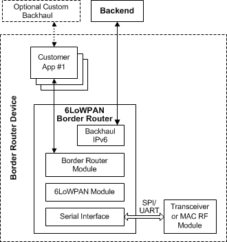

Usage
=====

This chapter describes the application usage of the 6LoWPAN stack. It contains the following sections:

- [_Application support_](#application-support)
- [_Transmitting and receiving data_](#transmitting-and-receiving-data)
- [_Features_](#features)
- [_Hardware requirements_](#hardware-requirements)
- [_Delivery models_](#delivery-models)
- [_Interoperability with the 6LoWPAN border router_](#interoperability-with-the-6lowpan-border-router)

## Application support

The application running on top of the 6LoWPAN stack will follow some basic principles. Most crucially, all functions must return following any call. The exact time, that is, how long the application tasklet can block the operation varies according to how congested the network is. If the device is a router, meaning that it routes packets to and from other devices, the network is locally under heavy load and the stack will require additional time to perform routing.

## Transmitting and receiving data

TCP, UDP, or ICMP packets can be sent and received using the socket interface APIs that are exposed by the 6LoWPAN stack. Data can be sent using the `socket_send()` and `socket_sendto()` functions for TCP and UDP/ICMP, respectively.

For UDP/ICMP, a socket is ready to send and receive data after a successful call to `socket_open()` and when the `NET_READY` event has been received.

For TCP, when a socket is opened it is in _closed_ state. It must be set to either _listen_ or _connect_ state before using it for receiving or transmitting data. To receive data, the socket can be set to listen mode by calling `socket_listen()`. After that, the socket can accept an incoming connection from a remote host. To send data, `socket_connect()` is called with a set of arguments. When the socket event has confirmed the state change of the socket, data can then be sent using `socket_send()`. The function call `socket_shutdown()` is used to shut down the socket.

## Features

This section describes the typical features that are available to developers within the 6LoWPAN stack.

### Link security

There are three methods of using security with the 6LoWPAN stack, of which the first two use AES-128 encryption:

- Pre-shared network key (where the network key is provisioned at manufacturing).
- Certificate-based security using _Protocol for carrying Authentication for Network Access_ (PANA) and _Extensible Authentication Protocol (EAP)-Transport Layer Security_ (TLS), in which case the PANA Server defines the network key material.
- No security.

### Power saving features

The power saving features of the 6LoWPAN stack are enabled by default. For router devices, the stack automatically reduces power consumption by placing the processor into sleep when in idle, that is, no packets to route or process.

There are two sleep modes available:

- Default sleep mode:
	* This is where the host node wakes up periodically every ~7.5 seconds to check for packets being relayed from its parent router.
- Long sleep mode:
	* This is where the application can control how long the node will sleep by using a timer event or external event such as an external interrupt to trigger the wake-up process.

## Hardware requirements

The 6LoWPAN stack is designed to support most platforms, even those with modest hardware resources. It supports the Cortex-M architecture, ranging from Cortex-M0 to more powerful Cortex-M4 processors.

The minimum recommended code space for a full featured 6LoWPAN stack is roughly 256KB on a 32-bit processor architecture without the optional security modules; including the security components adds approximately 17KB to the code size.

The data memory requirements are driven mainly by the scalability throughput requirements. Minimal stack features along with a simple application template can be supported on platforms with 8KB of memory. Additional features such as high security or embedded web services (mbed Device Server) will increase the memory requirement.

## Delivery models

The most common delivery method of the 6LoWPAN stack contains source code for a specific CPU, example applications, and device drivers for multiple MCUs and RF transceivers. The source code, drivers and applications are provided as an example for developers to get familiar with the 6LoWPAN stack.

The 6LoWPAN stack is built so that it eventually supports multiple toolchains. However, some RF drivers require compiler-specific code or headers. Therefore, driver support per each toolchain varies.

The initial release of ARM 6LoWPAN stack only supports the ARM GCC compiler for ARM Cortex-M class microcontrollers.

## Interoperability with the 6LoWPAN border router

The 6LoWPAN stack is designed to operate in RPL enabled networks, which means that the network must have a 6LoWPAN border router access point present.

Each M2M network uses an access point (or edge router) that allows it to connect seamlessly to a standard IP network. ARM 6LoWPAN border router software provides seamless handling of routing packets between the 6LoWPAN and the IP network. The 6LoWPAN border router software is available as an embedded C implementation running on Cortex M3/M4 processors (see _Figure 1-4_).

**Figure 1-4 6LoWPAN border router architecture with an embedded C implementation**

