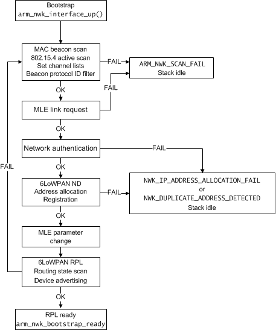

An Event-driven Scheduling Model & Eventing API
================================
This chapter describes the event-driven scheduling model. It contains the following sections:

- [_API Headers_](#api-headers)
- [_About events_](#about-events)
- [_Dynamic tasklet_](#dynamic-tasklet)
- [_Event structure_](#event-structure)
- [_Events sent by the stack_](#events-sent-by-the-stack)
- [_Sending application-specific events_](#sending-application-specific-events)

## API Headers

To use the eventing API, include the following headers to your application:

```
#include eventOS_event.h
#include net_interface.h
```

## About events

The 6LoWPAN stack uses an event-driven scheduling model and this section  describes the event functionality at the application layer.

### Handling events

An application should register at least one event handler. The tasklets are then used to send and receive events between the stack or between other tasklets. Also socket events are sent to a tasklet that opened them.

The following is a prototype of a tasklet:

```
void tasklet (arm_event_t *)
```

Parameter|Description
---------|-----------
`arm_event_t`|A pointer to the event structure that contains the event information.


The most important event information is the event type. There are four main types of events that a tasklet may receive. _Table 3-2_ lists the event types.

**Table 3-2 Event types**

Event type|Description
----------|-----------
`ARM_LIB_TASKLET_INIT_EVENT`|Can be used as an initialization event to a tasklet, when it is created. The initialization event is called only once.
`ARM_LIB_NWK_INTERFACE_EVENT`|These event types give information about networking bootstrap to the application layer.
`ARM_LIB_SYSTEM_TIMER_EVENT`|These events are user-launched timer events. They are used for timing events on an application.
`APPLICATION_EVENT`|These events are sent from another tasklet and they do not originate from the stack. These are used for communicating between tasklets.


The rest of the information is stored in the event structure received by the tasklet. For more information on the structure content, see section [_Event structure_](#event-structure).

The following example shows the basic structure of an empty tasklet:

```
void tasklet(arm_event_t *event)
{
	switch(event->event_type) {
	case ARM_LIB_TASKLET_INIT_EVENT:
		// Initialization tasks
		break;
	case ARM_LIB_NWK_INTERFACE_EVENT:
		// Network bootstrap events
		break;
	case ARM_LIB_SYSTEM_TIMER_EVENT:
		// Timers
		break;
	case APPLICATION_EVENT:
		// Application specific events
		break;
	}
}
```

## Dynamic tasklet

With a dynamic tasklet, you can easily generate a small tasklet for an application.

### Register a tasklet

To register a tasklet handler:

```
int8_t eventOS_event_handler_create
(
	void (*tasklet_func_ptr)(arm_event_t*),
	uint8_t init_event_type
)
```

Parameter|Description
---------|-----------
`tasklet_func_ptr`|A function pointer to a tasklet event handler.
`init_event_type`|An event type to be created when a tasklet handler is created. Usually, `ARM_LIB_TASKLET_INIT_EVENT`.

<dl>
<dt>Return value</dt>
<dd>>=0 Tasklet ID.</dd>
<dd><0 Tasklet allocation fails.</dd>
</dl>

## Event structure

Event structure is used to transfer information between the stack and tasklet or between tasklets. This structure is received by the tasklet when the event arrives. The tasklet uses this structure to find all information about the received event. The event structure comprises the following members:

```
typedef struct arm_event_s
{
	int8_t receiver;
	int8_t sender;
	uint8_t event_type;
	uint8_t event_id;
	void *data_ptr;
	arm_library_event_priority_e priority;
	uint32_t event_data;
} arm_event_t;
```

Member|Description
------|-----------
`receiver`|Event tasklet handler ID.
`sender`|Event tasklet sender ID. Zero means the sender is the stack.
`event_type`|Represents the `typecast arm_library_event_type_e`.
`event_id`|Timer ID, NWK interface ID or an application-specific ID.
`data_ptr`|Application's ability to share a data pointer tasklet with a tasklet.
`priority`|Event priority.
`event_data`|Extra event data. Used in network events.

### Reference events

_Tables 3-3, 3-4 and 3-5_ below show some examples of different events within the system.

**Table 3-3 System timer event for timer ID 1**

Name|Value
----|-----
`receiver`|`tasklet id for timer order`
`sender`|`0 (zero means the stack)`
`event_type`|`ARM_LIB_SYSTEM_TIMER_EVENT:`
`event_id`|`1`

**Table 3-4 Network ready event**

Name|Value
----|-----
`receiver`|`tasklet id for interface owner`
`sender`|`0`
`event_id`|`interface id for current event`
`event_type`|`ARM_LIB_NWK_INTERFACE_EVENT:`
`event_data`|`(arm_nwk_interface_status_type_e) event information for interface`

**Table 3-5 Tasklet init event**

Name|Value
----|-----
`receiver`|`tasklet id for timer order`
`sender`|`0`
`event_type`|`ARM_LIB_TASKLET_INIT_EVENT:`

## Events sent by the stack

This section describes all the events sent by the stack.

### Tasklet initialization event

When creating a tasklet, an initialization event type is defined as a parameter in a function call. The tasklet receives it after the startup. Usually, `ARM_LIB_TASKLET_INIT_EVENT` is used for this purpose. Typically, when an initialization event has been received, the application will set up all interfaces and open up the sockets for network communication.

### Timer events
For information on timer events, see Chapter [_Library Timer API_](10_API_timer.md).

### Network interface event

Network interface events `ARM_LIB_NWK_INTERFACE_EVENT` are enabled after the interface has been started with an `arm_nwk_interface_up()` function call or after an indicated network failure status. The stack uses the events to inform the application of the network connection status. Possible event types are described in _Table 3-6._

**Table 3-6 Possible event types for network interface event**

Event type|Description
----------|-----------
`ARM_NWK_BOOTSTRAP_READY`|The interface configured bootstrap is ready.
`ARM_NWK_SCAN_FAIL`|The interface has not detected any valid network or previously connected network lost.
`ARM_NWK_IP_ADDRESS_ALLOCATION_FAIL`|IP address allocation fails (ND, DHCPv4 or DHCPv6).
`ARM_NWK_DUPLICATE_ADDRESS_DETECTED`|The user-specific GP16 was invalid.
`ARM_NWK_AUHTENTICATION_START_FAIL`|An invalid authentication server was detected behind an access point.
`ARM_NWK_AUHTENTICATION_FAIL`|Network authentication fails by handshake.
`ARM_NWK_PARENT_POLL_FAIL`|Sleepy host poll fails three times.
`ARM_NWK_PHY_CONNECTION_DOWN`|The interface PHY cable is off or the serial port interface does not respond anymore.

When an `ARM_NWK_SCAN_FAIL`, `ARM_NWK_IP_ADDRESS_ALLOCATION_FAIL` or `ARM_NWK_DUPLICATE_ADDRESS_DETECTED` event type occurs, the stack will enter an IDLE state automatically. If the `ARM_NWK_CONNECTION_DOWN` event type is received, the stack will start scanning automatically for a new network; however, the application must wait for the result of the `arm_nwk_interface_up()` call before transmitting data.

_Table 3-7_ describes how to analyze the status events of a network interface.

**Table 3-7  Network status events**

Event structure field|Description
---------------------|-----------
`receiver`|The tasklet ID that has generated the interface.
`sender`|This is always 0 (sent by the stack).
`event_type`|`ARM_LIB_NWK_INTERFACE_EVENT`
`event_id`|Indicates a network interface ID.
`data_ptr`|`NULL.` Always when the sender is the stack.
`event_data`|Defines the interface status. Typecast to `arm_nwk_interface_status_type_e.`


### An Example: 6LoWPAN network bootstrap

When the network interface is brought up, the stack will perform a bootstrap process, as illustrated in **Figure 3-3** _The 6LoWPAN network bootstrapping process_. The result of the bootstrap phase is signaled to the tasklet that registered the network interface. Those phases and events are described in the following paragraphs.

In the _Media Access Control (MAC) beacon scan_ state, the stack will scan all channels that have been pre-defined. The stack will select the best available network coordinator and store the network setup and channel.

After a successful beacon scan and link layer coordinator selection, the stack will perform a _Mesh Link Establishment_ (MLE) request to the coordinator and to other nodes that responded to the active scan on the same channel. If the selected coordinator does not respond to the MLE request, the stack will select a new one if there are more coordinator devices that were returned in the scan result list. If the MLE request phase fails, the stack returns an `ARM_NWK_SCAN_FAIL` response event to the application.

After a successful scan and MLE request operation, the stack will initiate the _IPv6 over Low power Wireless Personal Area Network - Neighbor Discovery_ (6LoWPAN-ND) process. If no networks are available, the stack will report a failure event with the `ARM_NWK_SCAN_FAIL` status. During the ND process, the stack scans for ND routers, learns 6LoWPAN-ND parameters and performs _Internet Protocol_ (IP)v6 address allocation and registration. If the node does not reach any valid router device, it will report an `ARM_NWK_IP_ADDRESS_ALLOCATION_FAIL` or `ARM_NWK_DUPLICATE_ADDRESS_DETECTED` event to the application.

Alternatively, the node will proceed to advertise its own MLE security parameters and start the _Routing Protocol for Low power and Lossy networks_ (RPL) process. In the 6LoWPAN RPL state, the node will scan for RPL routers and join the best available DAG. The metric according to which the node will perform the RPL router or DAG selection is defined by the used objective function. After a successful completion of the join process, the stack will report an `ARM_NWK_BOOTSTRAP_READY` event to the application. If the RPL join process fails, the stack will re-start the bootstrap process.

**Figure 3-3 The 6LoWPAN network bootstrapping process**



## Sending application-specific events

This section describes how an application can transmit events to itself. This is useful if the application wants to, for example, receive a signal from an interrupt. _Table 3-8_ provides a generic description of the parameters an event can have.

**Table 3-8 Possible event parameters**

Name|Value
----|-----
`receiver`|Tasklet ID for the selected tasklet.
`sender`|Tasklet ID for the sender.
`priority`|Relative delivery priority (low, medium or high)
`event_type`|Developer-defined event type.
`event_data`|Developer can give a 32-bit data value, if required.
`event_id`|Developer-defined ID.
`data_ptr`|Developer can pass a data pointer using this field, if required.

### Event send API

To send an event:

```
int8_t eventOS_event_send
(
	const arm_event_t *event
)
```

Parameter|Description
---------|-----------
`event`|A pointer to an event to be sent.

<dl>
<dt>Return value</dt>
<dd>0 Process OK.</dd>
<dd>-1 Memory allocation failed.</dd>
</dl>

An example of sending an event from interrupt:

```
void xx_button_interrupt_handler(void)
{
	arm_event_t event = {0};
	/*Example of sending event to the application.
	event.event is user-defined event.
	In this application S1_BUTTON event is sent when IRQD interrupt occurs */
	event.receiver = main_tasklet_id
	event.sender = main_tasklet_id;
	event.priority = ARM_LIB_MED_PRIORITY_EVENT;
	event.event_type = APPLICATION_EVENT;
	event.event_id = S1_BUTTON;
	eventOS_event_send(&event);
}
```

To end a user-allocated event, avoiding the possibility of memory
allocation failure:

```
void eventOS_event_send_user_allocated
(
	arm_event_storage_t *event
)
```

This sends an event, but without taking a copy of the event data. The event
structure must remain valid until the event is delivered. See the
documentation comments on the declaration for more details.

To send periodic events or events after a timeout, refer to [Library Timer API](10_API_timer.md).

### Cancelling an event

To cancel and event or timer before it is executed, call `eventOS_cancel()`

```
void eventOS_cancel(arm_event_storage_t *event);
```

Queued events are removed from the event-loop queue and/or the timer queue.
Passing a NULL pointer is allowed, and it does nothing.

Event pointers are valid from the time they are queued until the event has stopped running or is cancelled. 
Cancelling a currently running event is only useful when you want to stop scheduling it, provided that it is on a periodic timer; 
it has no other effect.

Cancelling an already cancelled or already run single-shot event is undefined behaviour.
