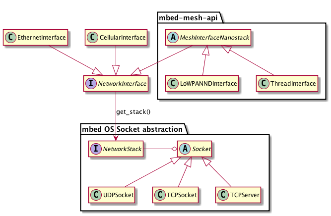

Porting 6LoWPAN Stack
=====================

This chapter describes porting the 6LoWPAN stack to a new platform. It contains the following sections:

- [_Porting 6LoWPAN Stack to a new platform_](#porting-6lowpan-stack-to-a-new-platform)
- [_Platform API_](#platform-api)

## Porting 6LoWPAN stack to a new platform

The 6LoWPAN stack has two sets of drivers that you must be aware of when porting it to a new platform. The drivers are divided into platform drivers and device drivers.

The platform drivers are a set of functions that the underlying platform must provide to run an event loop in a specific environment. These functions abstract away the underlying hardware and they can be ported to run on bare metal or from a full-featured operating system. Because the 6LoWPAN stack is provided as part of mbed OS you already have the platform drivers. Therefore, you do not need to port them yourself. See section [_How Nanostack runs inside mbed OS_](#how-nanostack-runs-inside-mbed-os)

Device drivers are a set of functions for providing PHY layer devices for the 6LoWPAN stack:

- registering the device
- receiving function
- a set of device controlling functions

For more detailed information on the device drivers, see [_Device driver API_](driver_api.md).

### How Nanostack runs inside mbed OS

The mbed OS port of Nanostack consist of a few helper modules that provide easier API for users and Platform API for working inside the operating system.


* [mbed Mesh API](https://github.com/ARMmbed/mbed-os/tree/master/features/nanostack/FEATURE_NANOSTACK/mbed-mesh-api) controls and initializes Nanostack on mbed OS.
    * Security settings.
    * Channel configuration.
    * Connection and reconnection logic.
* [nanostack-hal-mbed-cmsis-rtos](https://github.com/ARMmbed/mbed-os/tree/master/features/FEATURE_COMMON_PAL/nanostack-hal-mbed-cmsis-rtos) implements Platform API for mbed OS.
    * An internal event handler is initialized when the stack starts.
    * The event handler is running in its own thread. Not visible for users.
* [NanostackInterface](https://github.com/ARMmbed/mbed-os/tree/master/features/nanostack/FEATURE_NANOSTACK/nanostack-interface) class implements the network stack abstration for the socket layer.
    * Initializes the RF driver. See [Providing RF driver](#providing-rf-driver-for-mbed-os-applications).

In mbed OS, Socket API hides the differences between the networking stacks. Users will only use one of its high level APIs:

* UDPSocket
* TCPSocket
* TCPServer



For an example of a simple application using Nanostack, see [Example mesh application for mbed OS](https://github.com/ARMmbed/mbed-os-example-mesh-minimal).

For documentation of Socket API see the following links

* [Socket API: Getting started](https://developer.mbed.org/teams/NetworkSocketAPI/wiki/Getting-Started)
* [Socket API: Doxygen](https://developer.mbed.org/teams/NetworkSocketAPI/code/NetworkSocketAPI/docs/tip/)

#### Providing RF driver for mbed OS applications

For mbed OS 5, the RF driver implements the `NanostackRfPhy` API.
`MeshInterfaceNanostack` requires the driver object to be provided when
initializing.


Applications use only `LoWPANNDInterface`, `ThreadInterface` or `NanostackEthernetInterface`
directly to set up the network and provide a driver. Rest of the classes provide an abstration
between Nanostack and Socket layers of mbed OS.

See [NanostackRfPhy.h](https://github.com/ARMmbed/mbed-os/blob/master/features/nanostack/FEATURE_NANOSTACK/nanostack-interface/NanostackRfPhy.h) for an up-to-date header file and API.

Driver API used for communication between the driver and Nanostack is documented in section [_Device Driver API_](driver_api.md).

## Platform API

This section introduces the API for platform drivers. These functions must be implemented to run the 6LoWPAN stack in a given platform. Here the platform may refer to a specific CPU or operating system.

### Required resources

The following resources are required for a platform driver API:

- A system timer and a MAC timer (a network timer):
	* Used as a source for SYSTEM TIMER TICK and MAC TIMER.
	* SYSTEM TIMER TICK multiplexed to CORE TIMER.
	* Resolution: 50us.
	* 16-bit or 32-bit resolution (platform specific).
	* Implementation guide: set the timer running and use the compare interrupt functionality of the timer.
- A sleep timer (optional, application specific):
	* Accuracy: 1ms.
	* 32-bit resolution.
- AES:
	* Implementation is optional.
	* SW or HW accelerated AES.
	* This function performs `Si=E[key,Ai]` (a simple ECB block).
- A pseudorandom number generator:
	* 8-bit, 16-bit, 32-bit and n-bit (using length and pointer).
	* Statistically valid.
- An RF interface:
	* PHY data flow API.
	* Extension to set Channel, Link ON/OFF, Reset, ED_SCAN, ShortAddress, PAN ID, PendingBit.
	* Calculate LQI from RSSI.
	* Energy detection.
- An Ethernet interface (optional):
	* PHY data flow API.
	* Extension for BAUDRATE Read.
	* Link ON/OFF detection (cable ON and OFF detection).
- `platform_enter_critical` and `platform_exit_critical`:
	* Recursive, general interrupt control.
- CPU power mode control (optional, application specific).
- Idle, sleep timer, external wakeup modes.

### 6LoWPAN stack event OS port

_Table 4-1_ describes the functions that the 6LoWPAN stack event base system requires for porting.

**Table 4-1 Functions required for porting**

Function|Desciption
--------|----------
`eventOS_scheduler_wait()`|Stack enters idle state and starts waiting for a signal.
`eventOS_scheduler_signal()`|Stack wakes from idle.
`eventOS_scheduler_sleep()`|CPU deep sleep for a given time.
`platform_enter_critical()`|Disables global interrupts.
`platform_exit_critical()`|Enables global interrupts.

For more information on the functions, see section [_Process API_](#process-api).

### 6LoWPAN stack peripherals API port

The 6LoWPAN stack requires the following peripherals for porting:

- 1 timer.
- Random number seed for a pseudorandom generator.
- AES Encode block for Si=E[key,Ai].

The 6LoWPAN stack only needs one timer that must give a 50us resolution for an ordered timer counter. For more information on the timer, see section [_NET timer API definition_](#net-timer-api-definition).


### NET timer API definition

Timer Platform API is used for platform porting. _Table 4-2_ introduces the timer functions the 6LoWPAN stack is using.

**Table 4-2 Timer functions**

Function|Description
--------|-----------
`platform_timer_enable()`|Initializes the timer.
`platform_timer_set_cb()`|API for setting the timer interrupt handler for the stack.
`platform_timer_start()`|Starts the timer for a given period.
`platform_timer_disable()`|Stops the timer.

#### Initialize platform timer peripheral

To initialize the peripheral driver of the 6LoWPAN stack timer:

```
void platform_timer_enable
(
	void
)
```

#### Disable platform timer

To stop the system timer source of the driver:

```
void platform_timer_disable
(
	void
)
```

#### Set compare timer

To set the compare timer event for the stack:

```
void platform_system_timer_start
(
	uint16_t slots
)
```

Parameter|Description
---------|-----------
`slots`|The number of 50us time slots the timer event stack wants.

#### Callback function set

To set the timer interrupt handler for the stack:

```
void platform_system_timer_set_cb
(
	void
	(*new_fp)(void)
)
```

Parameter|Description
---------|-----------
`new_fp`|A function pointer for stack giving timer handler.

### AES 128-bit block encode API

To perform a 128-bit `Si=E[key,Ai]` block encoding for given `Ai` data using the supplied key:

```
void platform_aes128_block_encode
(
	uint8_t * key_ptr ,
	uint8_t * Ai_ptr,
	uint8_t * Si_ptr
)
```

Parameter|Description
---------|-----------
`key_ptr`|A pointer to a 128-bit key.
`Ai_ptr`|A pointer to a 128-bit data block that is to be decoded.
`Si_ptr`|A pointer to a 128-bit data block where the encoded result is stored in.

<dl>
<dt>Return value</dt>
<dd>None.</dd>
</dl>

### Random number API

To return a 32-bit seed for a pseudorandom generator:

```
uint32_t platform_random_seed_get
(
	void
)
```

<dl>
<dt>Return value</dt>
<dd>A 32-bit random initialization seed value.</dd>
</dl>

The pseudorandom generator requests this seed on initialization.

### Global interrupt control API

The platform driver code must provide protection for the stack when there are critical code sections. Some stack interfaces might be called within interrupts or from multiple threads, so protection is required. On some platform, these disable interrupts. On some platform, it is only a recursive mutex.

When the stack is about to enter a critical section, it uses the following function call:

```
void platform_enter_critical
(
	void
)
```

When the stack exits a critical section, it uses the following function call:

```
void platform_exit_critical
(
	void
)
```

### Process API

The functions described here provide a portable layer for handling idle states for the stack.

This function is called when the stack enters idle state and starts waiting for a signal. The 6LoWPAN stack calls this function whenever the event queue is empty. The function disables the current task or the CPU as follows:

1. Use pure 6LoWPAN stack 1 thread system:
	* Sets the global parameter to wait for a signal state and sets the CPU to idle.
2. RTOS or any multithread:
	* Stops the running thread and waits for a signal.

```
void eventOS_scheduler_wait
(
	void
)
```

The 6LoWPAN stack calls this function when it receives an external event and wakes from idle. The function wakes the sleeping thread currently used by the OS.

```
void eventOS_scheduler_signal
(
	void
)
```

This function is called when the stack enters deep sleep state for a period of time. This function enables thread sleep or the CPU deep sleep for a given time. It may also set specific peripherals to sleep mode, if they are not required.

```
uint32_t eventOS_scheduler_sleep
(
	uint32_t sleep_time_ms
)
```

Parameter|Description
---------|-----------
`sleep_time_ms`|Sleep time in milliseconds.

<dl>
<dt>Return value</dt>
<dd>Time slept in milliseconds.</dd>
</dl>
