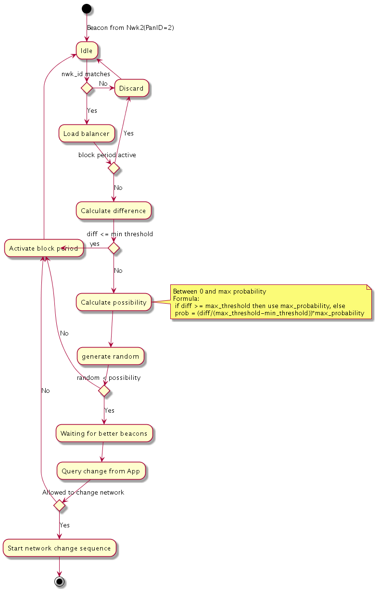

The Load balancing API
==================

This chapter describes the functions of the load balancing layer. It contains the following sections:

- [_Load balancing API_](#load-balancing-api)
- [_Load balancing activity diagram_](#load-balancing-activity-diagram)

## API header

To use the Load balancing API, include the following header:

```
#include "net_load_balance_api.h"
```

## Load balancing API

This section describes the functions of the load balancing layer where each function is presented with its valid parameters.

**Table 1-1 The load balancing API features and related functions**

Feature|API function
-------|------------
Load balancer creation|`net_load_balance_create()`
Load balancer deletion|`net_load_balance_delete()`
Callback function type definition|`net_load_balance_network_switch_notify()`
Callback setting function|`net_load_balance_network_switch_cb_set()`
Load balancer thresholds setter function|`net_load_balance_threshold_set()`
Load balancer maximum probability setter function|`net_load_balance_set_max_probability()`
Load level automatic update enabling|`net_load_balance_load_level_update_enable()`
Load level automatic update disabling|`net_load_balance_load_level_update_disable()`

### Create load balancer

Periodic beacon interval can be used to speed up the load balancing feature. The suggested value is `True`. Beacon sending interval is (usually) very long to prevent flooding in network.

To enable the load balancer feature, use the following function:

```
int8_t net_load_balance_create
(
	int8_t interface_id,
	bool enable_periodic_beacon_interval
)
```

Where:
<dl>
<dt><code>interface_id</code></dt>
<dd>The network interface ID.</dd>

<dt><code>enable_periodic_beacon_interval</code></dt>
<dd>Beacon interval is calculated from RPL config (Imax of the RPL DIO timer).</dd>
<dd>True: The load balancing device advertises the network by sending periodic beacons.</dd>
<dd>False: The load balancing is based on devices hearing beacons from other networks.</dd>

<dt><code>Return value</code></dt>
<dd>0 Creation OK.</dd>
<dd>-1 An unknown interface ID.</dd>
<dd>-2 Out of memory.</dd>
<dd>-3 Load balancing already active for this interface ID.</dd>
</dl>

### Delete load balancer

To delete the load balancer, use the following function:

```
int8_t net_load_balance_delete
(
	int8_t interface_id
)
```

Where:
<dl>
<dt><code>interface_id</code></dt>
<dd>The network interface ID.</dd>

<dt><code>Return value</code></dt>
<dd>0 Delete OK.</dd>
<dd>-1 An unknown interface ID.</dd>
</dl>

### Callback function

To define a callback function for selecting whether a network switch is allowed or not, use the following `typedef`:

```
typedef bool net_load_balance_network_switch_notify
(
)
```

Where:
<dl>
<dt><code>Return value</code></dt>
<dd>True: Network change is allowed.</dd>
<dd>False: Network change is not allowed.</dd>
</dl>

An example of a callback:

```
bool my_decision(int8_t interface_id)
{
	if (is_ok_to_change) {
		return true;
	}
	return false;
}
```

### Use the callback 

<span class="notes">**Note:** If the callback is not set, the load balancer changes the network automatically and the application only gets `ARM_LIB_NWK_INTERFACE_EVENT` with `event_id` of either `ARM_NWK_BOOTSTRAP_READY` or some error.</span>

To use the callback, use the following function:

```
int8_t net_load_balance_network_switch_cb_set
(
	int8_t interface_id,
	net_load_balance_network_switch_notify *network_switch_notify
)
```

Where:
<dl>
<dt><code>interface_id</code></dt>
<dd>The network interface ID.</dd>

<dt><code>network_switch_notify</code></dt>
<dd>The callback function to be called when the load balancer is about to start the network change sequence.</dd>

<dt>Return value</dt>
<dd>0 Set OK.</dd>
<dd>-1 An unknown interface id.</dd>

</dl>

### Set the network threshold values

Threshold is used to limit the network changes. The difference between networks is calculated using joining priorities from network data. If the difference is less than the minimum threshold, the network change is never allowed. However, if the difference is more than the maximum threshold, the device does not necessarily change the network. Instead, the maximum probability will be used. This is described in the subsequent function description.

```
if diff <= threshold_min: no change
else if diff >= threshold_max: probability = max_probability
else probability = (diff/(threshold_max-threshold_min))*max_probability
```
<span class="notes">**Note:**  Suggested values are 32-64 for min and 64-96 for max. The border router must set both values to zero.</span>

To set the network threashold values, use the following function:

```
int8_t net_load_balance_threshold_set
(
	int8_t interface_id,
	uint8_t threshold_min,
	uint8_t threshold_max
)
```

Where:
<dl>
<dt><code>interface_id</code></dt>
<dd>The network interface ID.</dd>

<dt><code>threshold_min</code></dt>
<dd>The minimum difference needed between networks to allow network change.</dd>

<dt><code>threshold_max</code></dt>
<dd>The minimum difference needed to reach max probability (see <code>net_load_balance_set_max_probability</code>).</dd>

<dt><code>Return value</code></dt>
<dd>0 Set OK.</dd>
<dd>-1 An unknown interface ID.</dd>
</dl>

### Set the network change max probability

Maximum probability is used to prevent all devices from changing network when they hear a better one. There is a specific timeout before which the network statistics are changed to all nodes in the network (depending on the hop count of nodes). If all devices changed the network, that could cause some unwanted churn. The max probability value is very much dependent on the size of the actual networks. The suggested value is between 10 and 25. The lower the value, the slower the balancing of network loads. If the value was 99 it would cause the devices to switch the networks very agressively (depending on the threshold values). The default value 25 is suitable for two-hop networks.

To set the maximum probability for a device to change the network, use the following function:

```
int8_t net_load_balance_set_max_probability
(
	int8_t interface_id,
	uint8_t max_p
)
```

Where:
<dl>
<dt><code>interface_id</code></dt>
<dd>The network interface ID.</dd>

<dt><code>max_p</code></dt>
<dd>The maximum probability for a device to change the network. The default value is 25(%).</dd>

<dt><code>Return value</code></dt>
<dd>0 Set OK.</dd>
<dd>-1 An unknown interface ID.</dd>
</dl>

### Set automatic calculation of DoDAG preference for the border router

<span class="notes">**Note:** This function should not do anything if the device is not a border router!</span>

To set automatic calculation of DoDAG preference for the border router, use the following function:

```
int8_t net_load_balance_load_level_update_enable
(
	int8_t interface_id,
	uint16_t expected_device_count
)
```

Where:
<dl>
<dt><code>interface_id</code></dt>
<dd>The network interface ID.</dd>

<dt><code>expected_device_count</code></dt>
<dd>Device count when DoDAG preference goes to worst possible.</dd>

<dt><code>Return value</code></dt>
<dd>0 Set OK.</dd>
<dd>-1 An unknown interface ID.</dd>
<dd>-2 Out of memory.</dd>
</dl>

### Disable automatic calculation of DoDAG preference for the border router

<span class="notes">**Note:** This function should not do anything if the device is not a border router!</span>

To disable automatic calculation of DoDAG preference for the border router, use the following function:

```
int8_t net_load_balance_load_level_update_disable
(
	int8_t interface_id
)
```

Where:
<dl>
<dt><code>interface_id</code></dt>
<dd>The network interface ID.</dd>

<dt><code>Return value</code></dt>
<dd>0 Disable OK.</dd>
<dd>-1 An unknown interface ID.</dd>
</dl>

## Load balancing activity diagram

Here is the activity diagram of the load balancer:



Where:

1. Idle state indicates that a device has joined a network having `PanID=1` and the device is doing "normal" operations.
2. `nwk_id` check is mandatory to prevent joining a wrong network.
3. The load balancer is handling incoming beacons and deciding whether the device should change the network.
4. If the load balancer is in block period, no beacons are handled.
5. The difference is calculated by comparing the priority values of the networks.
6. If the difference is less than the minimum threshold, the network change is not possible and the load balancer goes to block period state.
7. The possibility is calculated by counting a linear probability multiplier (0..1) between the minimum and maximum threshold. If the network difference is higher than the maximum, the multiplier is 1. The multiplier is then multiplied with the maximum probability to get the possibility for the network change.
8. A random value is generated and if it is higher than the probability, the load balancer goes to block state. Otherwise, the load balancer goes to waiting state.
9. `Waiting for better beacons` is the active state of the load balancer, when a device is given a chance to hear better beacons. After a timeout period, the load balancer continues to the next state.
10. In the `Query change from App` state, the application's callback function (if set) is called and if the returned value is false, the load balancer goes to block state. Otherwise, it continues to the change network state.
11. The load balancer has got a permission to change the network. The sequence for the change starts.


