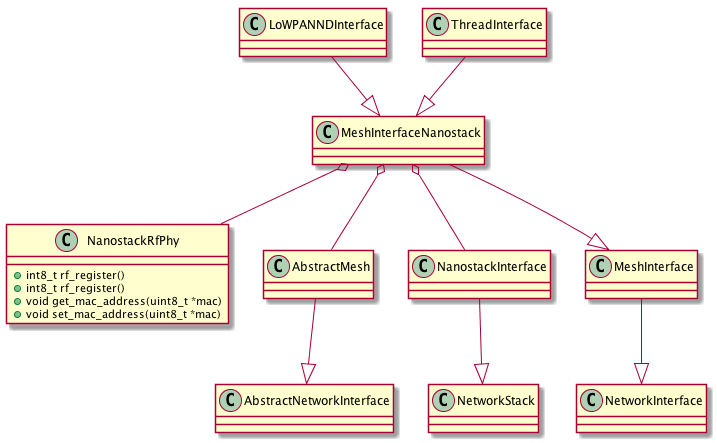
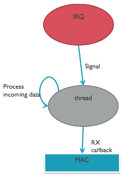

# Device Driver API

The 6LoWPAN stack uses Device Driver API to communicate with different physical layer drivers. The 6LoWPAN stack supports different device types for PHY layer and special cases where raw IPv6 datagrams are forwarded to a driver.

The driver must first be registered with the 6LoWPAN stack using the `phy_device_driver_s` structure defined in section [_PHY device driver register_](#phy-device-driver-register). This structure defines all the functions that the stack uses when calling a device driver. When the device driver must call the driver API from the stack, it uses the ID number received in the registration phase to distinct between different devices. The following sections define the contents of the driver structures and API interfaces that the driver can use.

See Doxygen documentation for the latest [Device Drive API](https://docs.mbed.com/docs/arm-ipv66lowpan-stack/en/latest/api/arm__hal__phy_8h.html).

## Providing RF driver for Mbed OS applications

For Mbed OS 5, the RF driver implements the `NanostackRfPhy` API. `MeshInterfaceNanostack` requires the driver object to be provided when initializing.



Applications use only `LoWPANNDInterface`, `ThreadInterface` or `NanostackEthernetInterface`
directly to set up the network and provide a driver. The rest of the classes provide an abstration
between Nanostack and the socket layers of Mbed OS.

See [NanostackRfPhy.h](https://github.com/ARMmbed/mbed-os/blob/master/features/nanostack/FEATURE_NANOSTACK/nanostack-interface/NanostackRfPhy.h) for an up-to-date header file and API.

### How to create a new RF driver

The following steps describe how you can create a new RF driver:

1. Read through the section [_Example RF driver_](#example-rf-driver). You can use this example code as your starting point.

1. Fill in the actual transceiver-specific parts of the RF driver.

1. Register the driver to the 6LoWPAN stack on your application. You can use the example node applications with your driver.

1. Create a MAC that is suitable for your purpose (802.15.4, Ethernet or serial).

1. Configure the interface. See instructions in the chapter [_6LoWPAN stack Initialisation_](07_API_initialize.md#how-to-configure-a-network-interface).

1. Implement the `NanostackRfPhy` API.

1. Check with a RF sniffer tool that you can see RF packets transmitted when you start your device. The 6LoWPAN bootstrap should start with IEEE 802.15.4 Beacon Request packets.

#### Worker thread for Mbed OS

Nanostack's interfaces use mutexes for protecting the access from multiple threads. In Mbed OS, the mutex cannot be used
from an interrupt. The same applies to all APIs that have internal locking and multithread support. Therefore, each driver must implement their own worker thread to handle the interrupt requests.



Example: Use worked thread and signals from an interrupt

```
// Signals from interrupt routines
#define SIG_RADIO       1
#define SIG_TIMER       2

// Worker thread
Thread irq_thread;

// Interrupt routines
static void rf_interrupt(void)
{
    irq_thread.signal_set(SIG_RADIO);
}

static void rf_timer_signal(void)
{
    irq_thread.signal_set(SIG_TIMER);
}


// Worker thread
void rf_worker_thread(void)
{
    for (;;) {
        osEvent event = irq_thread.signal_wait(0);
        if (event.status != osEventSignal) {
            continue;
        }

        if (event.value.signals & SIG_RADIO) {
            rf_process_irq();
        }
        if (event.value.signals & SIG_TIMER) {
            rf_process_timer();
        }
    }
}

...
// Somewhere in the initialization code
irq_thread.start(rf_if_irq_task);

```

### RF driver states

_Figure 11-1_ below shows the basic states of the RF driver.

The basic states in more detail:

State|Description
-----|-----------
`DOWN`|This is the initial state of the driver. The radio is not used in this state.
`RX ACTIVE`|In this state, the driver has the radio turned on and it can receive a packet or ACK from the radio. The driver can also go from this state to the `TX ACTIVE` state to transmit a packet.
`TX ACTIVE`|In this state, the driver will try to start a transmission:<br>1. It must first check that it is not currently busy doing something else.<br>2. It must check that the channel is free.<br>3. Finally, it can try to transmit the packet.
`SNIFFER`|This mode can be implemented to enable using the device as a packet sniffer. In this state, the RX is always on and the received packets are sent to the application layer but nothing is transmitted back.
`ED SCAN`|This mode can be implemented to enable energy scan. It enables scanning the energy from channels one by one and nothing else.
`ANY STATE`|This state represents all the states in the state machine.

<span class="notes">**Note**: The driver [initialization and registration](#phy-device-driver-register) using the function `arm_net_phy_register` must be performed before the driver is functional.</span>

For more details on the TX process, see _Figure 4-1_.

**Figure 4-1 RF driver states**


In sniffer mode, the device only receives packets, never ACKs or sends them.

The following commands are received as a parameter of the function `state_control` defined in the struct of type `phy_device_driver_s`:

- `PHY_INTERFACE_UP`
- `PHY_INTERFACE_DOWN`
- `PHY_INTERFACE_RESET`
- `PHY_INTERFACE_RX_ENERGY_STATE`
- `PHY_INTERFACE_SNIFFER_STATE`

The following commands are received as a parameter of the function `extension` defined in the struct of type `phy_device_driver_s`:

- `PHY_EXTENSION_READ_CHANNEL_ENERGY`
- `PHY_EXTENSION_SET_CHANNEL`

_Figure 4-2_ describes the TX process.

The following describes the states in more detail:

State|Description
-----|-----------
`CCA PROCESS`|In the _Clear Channel Assessment_ (CCA) process, the radio checks that the channel is free before it starts sending anything to avoid collisions. Before starting the actual CCA process, the driver checks that it is not currently receiving a packet from the radio, in which case the CCA process fails.
`SEND PACKET`|In this state, the driver commands the radio to send the data given to the driver as a parameter from the function tx defined in the struct of type `phy_device_driver_s`.

**Figure 4-2 TX process**


### PHY device driver register

This function is for the dynamic registration of a PHY device driver. The 6LoWPAN stack allocates its own device driver list internally. This list is used when an application creates network interfaces to a specific PHY driver.

To register a PHY driver to the stack:

```
int8_t arm_net_phy_register(phy_device_driver_s *phy_driver);
```

See the [Doxygen](https://docs.mbed.com/docs/arm-ipv66lowpan-stack/en/latest/api/arm__hal__phy_8h.html#aff06eaa736d3784c956dc6eda9f27419) for the description.


### PHY data RX API

This is a callback that is a part of the device driver structure and initialized by the stack when a driver is registered.

The driver calls this function to push the received data from a PHY to the stack:

```
typedef int8_t arm_net_phy_rx_fn(const uint8_t *data_ptr, uint16_t data_len, uint8_t link_quality, int8_t dbm, int8_t driver_id);
```

See [Doxygen: arm_net_phy_rx_fn](https://docs.mbed.com/docs/arm-ipv66lowpan-stack/en/latest/api/arm__hal__phy_8h.html#a962b27c1de3163a37d0e298e5107ab6f) for detailed description.

### PHY data TX done API

This is a callback that is a part of the device driver structure and initialized by the stack when a driver is registered.

The driver calls this function when it has completed a transmit attempt:

```
typedef int8_t arm_net_phy_tx_done_fn(int8_t driver_id, uint8_t tx_handle, phy_link_tx_status_e status, uint8_t cca_retry, uint8_t tx_retry);
```
See [Doxygen: arm_net_phy_tx_done_fn](https://docs.mbed.com/docs/arm-ipv66lowpan-stack/en/latest/api/arm__hal__phy_8h.html#a045291825cbb1f29aec30891d44e8e52) for detailed description.

When the PHY device handles the CSMA-CA and auto-retry, the stack needs to know the total number of CCA attempts or TX attempts made in case of error. The stack retries the CCA phase 8 times and the TX attempt 4 times. These may be handled by the hardware.

If the CSMA-CA is handled by the hardware, the `cca_retry` should return a value larger than 7 if returning `PHY_LINK_CCA_FAIL` status to the stack. If the total number of CCA retries is less than 8, the stack initiates a new CCA phase.

When the hardware handles the auto-retry mode, the error cases should report the number of TX attempts made in the `tx_retry` parameter. If the total number of retries is less that 4, the stack initiates a retransmission.

### PHY driver structure and enumeration definitions

This section introduces driver API specific structures and enumerations.

#### PHY TX process status code

This enumeration defines the PHY TX process status code:

```
typedef enum phy_link_tx_status_e
{
	PHY_LINK_TX_DONE,
	PHY_LINK_TX_DONE_PENDING,
	PHY_LINK_TX_SUCCESS,
	PHY_LINK_TX_FAIL,
	PHY_LINK_CCA_FAIL
} phy_link_tx_status_e;
```

Parameter|Description
---------|-----------
`TX_DONE`|TX process is Ready and ACK RX.
`TX_DONE_PENDING`|TX process is OK with an ACK pending flag.
`TX_SUCCESS`|MAC TX complete MAC will make a decision to enter a wait ack or TX Done state.
`TX_FAIL`|The link TX process fails.
`CCA_FAIL`|RF link CCA process fails.

#### PHY interface control types

This enumeration defines the PHY interface control types:

```
typedef enum phy_interface_state_e
{
	PHY_INTERFACE_RESET,
	PHY_INTERFACE_DOWN,
	PHY_INTERFACE_UP
} phy_interface_state_e;
```

Parameter|Description
---------|-----------
`RESET`|Resets a PHY driver and sets it to idle.
`DOWN`|Disables the PHY interface driver (RF radio disabled).
`UP`|Enables the PHY interface driver (RF radio receiver ON).


#### PHY device driver

This PHY device driver structure comprises the following members:

```
typedef struct phy_device_driver_s
{
	phy_link_type_e link_type;
	driver_data_request_e data_request_layer;
	uint8_t *PHY_MAC;
	uint16_t phy_MTU;                                               /**< Define MAX PHY layer MTU size. */
	char * driver_description;
	uint16_t phy_MTU;
	uint8_t phy_tail_length;
	uint8_t phy_header_length;
	int8_t (*state_control)(phy_interface_state_e, uint8_t);
	int8_t (*tx)(uint8_t *,uint16_t,uint8_t, data_protocol_e);
	int8_t (*address_write)(phy_address_type_e ,uint8_t *);
	int8_t (*extension)(phy_extension_type_e,uint8_t *);
	const phy_device_channel_page_s *phy_channel_pages;

	//Upper layer callbacks, set with arm_net_phy_init();
	arm_net_phy_rx *phy_rx_cb;
	arm_net_phy_tx_done *phy_tx_done_cb;
	//Virtual upper layer rx/tx functions
	arm_net_virtual_rx *arm_net_virtual_rx_cb;
	arm_net_virtual_tx *arm_net_virtual_tx_cb;
	uint16_t tunnel_type;
} phy_device_driver_s;
```

Member|Description
------|-----------
`link_type`|Defines the device driver type.
`data_request_layer`|Defines the interface Data OUT protocol.
`PHY_MAC`|A pointer to a 48-bit or 64-bit MAC address.
`PHY_MTU`|The size of the maximum transmission unit.
`driver_description`|A short driver-specific description in Null-terminated string format.
`phy_MTU`|The maximum MTU size of the physical layer.
`phy_tail_length`|The tail length used by the PHY driver.
`phy_header_length`|The header length used by the PDU PHY driver.
`state_control`|A function pointer to the interface state control.
`tx`|A function pointer to the interface TX functionality.
`address_write`|A function pointer to the interface address writing (PAN ID, short address).
`extension`|A function pointer to the interface extension control.
`phy_channel_pages`|This pointer must be set only when the interface type is:<br>`NET_INTERFACE_WIFI`<br>`NET_INTERFACE_RF_6LOWPAN`<br>`NET_INTERFACE_RF_ZIGBEEIP`
`phy_rx_cb`|A function pointer to the upper layer RX callback. Must be initialized to NULL, is set by MAC layer.
`phy_tx_done_cb`|A function pointer to the upper layer TX callback. Must be initialized to NULL, is set by MAC layer.
`arm_net_virtual_rx_cb`|A function pointer to the upper layer RX callback. Only needed by a virtual RF driver! Must be initialized to NULL, is set by MAC layer or virtual RF driver.
`arm_net_virtual_tx_cb`|A function pointer to the upper layer tx callback. Only needed by virtual RF driver! Must be initialized to NULL, is set by MAC layer or virtual RF driver
`tunnel_type`|TUN driver type this is only valid when link type is PHY_TUN

See [Doxygen: Device Drive API](https://docs.mbed.com/docs/arm-ipv66lowpan-stack/en/latest/api/arm__hal__phy_8h.html) for up to date descriptions.

#### PHY device channel page information

This structure defines the PHY device channel page information and comprises the following members:

```
typedef struct phy_device_channel_page_s
{
	channel_page_e channel_page;
	const phy_rf_channel_configuration_s *rf_channel_configuration;
} phy_device_channel_page_s;
```

Member|Description
------|-----------
`channel_page`|The supported channel page(s).
`rf_channel_configuration`|The used RF configuration for the channel page.

#### PHY device link type

This enumeration defines the PHY device link types:

```
typedef enum phy_link_type_e
{
	PHY_LINK_ETHERNET_TYPE,
	PHY_LINK_15_4_2_4GHZ_TYPE,
	PHY_LINK_15_4_SUBGHZ_TYPE,
	PHY_LINK_TUN,
	PHY_LINK_SLIP,
} phy_link_type_e;
```

Parameter|Description
---------|-----------
`ETHERNET_TYPE`|The standard IEEE 802 Ethernet type.
`15_4_2_4GHZ_TYPE`|The standard 802.15.4 2.4GHz radio.
`15_4_SUBGHZ_TYPE`|The standard 802.15.4 sub-1GHz radio 868/915MHz.
`TUN`|The Linux virtual TUN interface.
`SLIP`|The SLIP interface.

#### PHY device RF channel configuration

This structure defines the PHY device RF configuration:

```
typedef struct phy_rf_channel_configuration_s
{
	uint32_t channel_0_center_frequency;
	uint32_t channel_spacing;
	uint32_t datarate;
	uint16_t number_of_channels;
	phy_modulation_e modulation;
} phy_rf_channel_configuration_s;
```

Member|Description
------|-----------
`channel_0_center_frequency`|The first channel center frequency.
`channel_spacing`|The RF channel spacing.
`datarate`|The RF datarate.
`number_of_channels`|The number of supported channels.
`modulation`|The RF modulation method.

#### PHY device RF modulation methods

This enumeration defines the PHY device RF modulation methods:

```
typedef enum phy_modulation_e
{
	M_OFDM,
	M_OQPSK,
	M_BPSK,
	M_GFSK,
	M_UNDEFINED
} phy_modulation_e;
```

Parameter|Description
---------|-----------
`M_OFDM`|The OFDM modulation method.
`M_OQPSK`|The OQPSK modulation method.
`M_BPSK`|The BPSK modulation method.
`M_GFSK`|The GFSK modulation method.
`M_UNDEFINED`|The RF modulation method undefined.

### Example RF driver

The following code example is not a complete driver but shows you how to use the API to create a RF driver.

```
static uint8_t mac_address[8];
static phy_device_driver_s device_driver;
static int8_t rf_radio_driver_id = -1;

const phy_rf_channel_configuration_s phy_2_4ghz = {2405000000, 5000000, 250000, 16, M_OQPSK};
const phy_rf_channel_configuration_s phy_subghz = {868300000, 2000000, 250000, 11, M_OQPSK};

static phy_device_channel_page_s phy_channel_pages[] = {
	{CHANNEL_PAGE_0, &phy_2_4ghz},
	{CHANNEL_PAGE_0, NULL}
};

int8_t rf_device_register(void)
{
    /* Do some initialization */
    rf_init();
    /* Set pointer to MAC address */
    device_driver.PHY_MAC = mac_address;
    /* Set driver Name */
    device_driver.driver_description = "Example";

    if(subghz_radio) /* Configuration for Sub GHz Radio */
    {
        /*Type of RF PHY is SubGHz*/
        device_driver.link_type = PHY_LINK_15_4_SUBGHZ_TYPE;
        phy_channel_pages[0].channel_page = CHANNEL_PAGE_2;
        phy_channel_pages[0].rf_channel_configuration = &phy_subghz;
    }
    else /* Configuration for 2.4 GHz Radio */
    {
        /*Type of RF PHY is 2.4 GHz*/
        device_driver.link_type = PHY_LINK_15_4_2_4GHZ_TYPE;
        phy_channel_pages[0].channel_page = CHANNEL_PAGE_0;
        phy_channel_pages[0].rf_channel_configuration = &phy_2_4ghz;
    }

    /*Maximum size of payload is 127*/
    device_driver.phy_MTU = 127;
    /*No header in PHY*/
    device_driver.phy_header_length = 0;
    /*No tail in PHY*/
    device_driver.phy_tail_length = 0;

    /*Set up driver functions*/
    device_driver.address_write = &rf_address_write;
    device_driver.extension = &rf_extension;
    device_driver.state_control = &rf_interface_state_control;
    device_driver.tx = &rf_start_cca;
    /*Set supported channel pages*/
    device_driver.phy_channel_pages = phy_channel_pages;
    //Nullify rx/tx callbacks
    device_driver.phy_rx_cb = NULL;
    device_driver.phy_tx_done_cb = NULL;
    device_driver.arm_net_virtual_rx_cb = NULL;
    device_driver.arm_net_virtual_tx_cb = NULL;

    /*Register device driver*/
    rf_radio_driver_id = arm_net_phy_register(&device_driver);

    return rf_radio_driver_id;
}

void rf_handle_rx_end(void)
{
    uint8_t rf_lqi;
    int8_t rf_rssi;
    uint16_t rf_buffer_len;
    uint8_t *rf_buffer;

    /* Get received data */
    rf_buffer_len = rf_get_rf_buffer(rf_buffer);
    if(!rf_buffer_len)
        return;

    /* If waiting for ACK, check here if the packet is an ACK to a message previously sent */

    /* Get link information */
    rf_rssi = rf_get_rssi();
    rf_lqi = rf_get_lqi();

    /* Note: Checksum of the packet must be checked and removed before entering here */

    /* Send received data and link information to the network stack */
    if( device_driver.phy_rx_cb ){
    	device_driver.phy_rx_cb(rf_buffer, rf_buffer_len, rf_lqi, rf_rssi, rf_radio_driver_id);
    }
}

int8_t rf_start_cca(uint8_t *data_ptr, uint16_t data_length, uint8_t tx_handle, data_protocol_e data_protocol)
{
    /*Check if transmitter is busy*/
    if(transmitter_busy)
    {
        /*Return busy*/
        return -1;
    }
    else
    {
        /*Check if transmitted data needs to be ACKed*/
        if(*data_ptr & 0x20)
            need_ack = 1;
        else
            need_ack = 0;
        /*Store the sequence number for ACK handling*/
        tx_sequence = *(data_ptr + 2);

        /* Store date and start CCA process here */
        /* When the CCA process is ready send the packet */
        /* Note: Before sending the packet you need to calculate and add a checksum to it, unless done automatically by the radio */
    }

    /*Return success*/
    return 0;
}

static int8_t rf_interface_state_control(phy_interface_state_e new_state, uint8_t rf_channel)
{
    int8_t ret_val = 0;
    switch (new_state)
    {
        /*Reset PHY driver and set to idle*/
        case PHY_INTERFACE_RESET:
            rf_reset();
            break;
        /*Disable PHY Interface driver*/
        case PHY_INTERFACE_DOWN:
            rf_shutdown();
            break;
        /*Enable PHY Interface driver*/
        case PHY_INTERFACE_UP:
            rf_channel_set(rf_channel);
            rf_receive();
            break;
        /*Enable wireless interface ED scan mode*/
        case PHY_INTERFACE_RX_ENERGY_STATE:
            break;
        /*Enable Sniffer state*/
        case PHY_INTERFACE_SNIFFER_STATE:
            rf_setup_sniffer(rf_channel);
            break;
    }
    return ret_val;
}

static int8_t rf_extension(phy_extension_type_e extension_type, uint8_t *data_ptr)
{
    switch (extension_type)
    {
        /*Control MAC pending bit for Indirect data transmission*/
        case PHY_EXTENSION_CTRL_PENDING_BIT:
        /*Return frame pending status*/
        case PHY_EXTENSION_READ_LAST_ACK_PENDING_STATUS:
            *data_ptr = rf_if_last_acked_pending();
            break;
        /*Set channel, used for setting channel for energy scan*/
        case PHY_EXTENSION_SET_CHANNEL:
            break;
        /*Read energy on the channel*/
        case PHY_EXTENSION_READ_CHANNEL_ENERGY:
            *data_ptr = rf_get_channel_energy();
            break;
        /*Read status of the link*/
        case PHY_EXTENSION_READ_LINK_STATUS:
            *data_ptr = rf_get_link_status();
            break;
    }
    return 0;
}

static int8_t rf_address_write(phy_address_type_e address_type, uint8_t *address_ptr)
{

    switch (address_type)
    {
        /*Set 48-bit address*/
        case PHY_MAC_48BIT:
            /* Not used in this example */
            break;
        /*Set 64-bit address*/
        case PHY_MAC_64BIT:
            rf_set_mac_address(address_ptr);
            break;
        /*Set 16-bit address*/
        case PHY_MAC_16BIT:
            rf_set_short_adr(address_ptr);
            break;
        /*Set PAN Id*/
        case PHY_MAC_PANID:
            rf_set_pan_id(address_ptr);
            break;
    }

    return 0;
}
```
