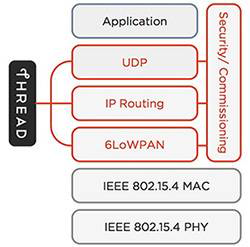

# Introduction to mbed OS Thread

## Why to use Thread

Thread was designed with one goal in mind; to create the best way to connect and control products in home. The key features of Thread are:

- Designed for home.
- Built-in security.
- Optimized for battery-operated devices.
- Utilizes IPv6 protocols.
- Robust mesh network.
- Simple to set up and use.

[Read more here](http://threadgroup.org/What-is-Thread/Connected-Home).

The Thread stack is built on IPv6 over Low power Wireless Personal Area Networks (6LoWPAN), which itself builds on IEEE 802.15.4 to offer IP-based networking. Internet Protocol (IP) provides the core mechanism for relaying datagrams across IP networks, and its routing capabilities enable internetworking.

 
Read more at the [Thread Group site](http://www.threadgroup.org/).

## Why mbed OS with Thread stack

ARM mbed OS is an open source embedded operating system designed specifically to facilitate the creation and deployment of commercial, standards-based IoT solutions at scale. mbed OS features full support for Thread to simplify development of secure IoT applications in home and to ease the Thread product certification. The mbed OS Thread stack is a Thread Group certified component.

### mbed Thread is based on the mbed OS key elements

The key elements of mbed OS are:

- Hardware platform agnostic layer that allows easy adaptation of new hardware components.
- Modular approach, which allows including the necessary libraries based on the application needs.
- Multilayer build (SW/HW) in security that helps you to protect your IoT solutions.
- mbed RTOS (ARM CMSIS-RTOS) providing the real time software execution.
- Toolchain and IDE support.

mbed Thread is implemented in the Nanostack library, which also supports the 6LoWPAN protocol. In mbed OS, the Thread stack runs in its own RTOS thread using an internal event scheduler. mbed OS provides the [mesh C++ API](https://github.com/ARMmbed/mbed-os/tree/master/features/nanostack/FEATURE_NANOSTACK/mbed-mesh-api/mbed-mesh-api) for building Thread applications.

- To connect to the Thread network, use the [Thread interface API](https://github.com/ARMmbed/mbed-os/blob/master/features/nanostack/FEATURE_NANOSTACK/mbed-mesh-api/mbed-mesh-api/ThreadInterface.h).
- For the socket communication over the Thread network, use the [mbed sockets API](https://github.com/ARMmbed/mbed-os/tree/master/features/netsocket).

Nanostack provides a set of C API headers with more functionalities. The following header files are located [here](https://github.com/ARMmbed/mbed-os/tree/master/features/nanostack/FEATURE_NANOSTACK/sal-stack-nanostack/nanostack):

- `thread_management_if.h` for initializing the stack and managing the network data.
- `thread_commissioning_api.h` for implementing an on-mesh or a native Thread commissioner.
- `thread_border_router_api.h` for implementing a Thread border router.
- `thread_diagcop_lib.h` for building and parsing the Thread diagnostics protocol TLV messages.
- `thread_meshcop_lib.h` for building and parsing the Thread mesh commissioning protocol TLV messages.
- `thread_net_config_api.h` for making neighbour discovery (ND) data requests. 

### Thread devices you can build on mbed OS

The mbed OS mesh API allows you to define 3 types of devices:

- Router enabled device (REED), which can become an active router.
- Sleepy end device (SED).
- Minimal end device (MED).

In addition the Nanostack API allows you to define the Full end device (FED) device type.

In most cases, the REED, MED and SED configurations are enough to build a network. In a SED device, the radio is switched off during the sleep times. To take the full advantage of the SED configuration, the application developer must implement the sleep procedures in the device.

For an end device or a router example, see [mesh minimal example](https://github.com/ARMmbed/mbed-os-example-mesh-minimal).

#### End devices

mbed OS offers separate configurations for different Thread end device types. Usually, the end devices are the most constrained devices in the Thread network. They serve as last hop in the mesh topology. Devices such as plain sensors, controls and switches can be implemented as end devices only. For the most constrained hardware, the minimal end device (MED) or the sleepy end device (SED) is an optimal selection as the implementation requires the smallest amount of flash and RAM memory due to the limited functionality. Note that a sleepy end device also requires more resources on the parent device. End devices communicate through a parent and can switch to another parent if the current connection is broken.

A Thread network does not work with end devices only. There must be router devices, that can route the traffic between nodes and to 
the back-end network through the border router.

Minimal end device (MED):

- Registers its address to a single parent.
- Relies all routing and address queries on the parent.
- Must start a new scan if the parent is lost; longer disconnect from network.

Sleepy end device (SED) is like MED, but:

- Does not keep the radio on all the time.
- Uses a polling mechanism to receive packets from the parent (polling time configurable).
- Requires the parent to store packets when in sleep.
- Can be temporarily switched to MED to transfer large amounts of data.

Full End Device (FED):

- Does not register addresses to the parent.
- Makes address queries.
- Listens to multicast messages from other devices (others than parent).
- Reduces the parent device's load and memory requirements compared to MED and SED.

#### Routers

In Thread networks, devices operate in several specific roles separated by the services they provide. All router devices provide mesh routing and they can switch the state between an active router and a REED device without any user interaction. The first router on a network becomes a leader, that manages:

- Router ID assignment.
- Thread network data registration.
- Network data distribution. 
- Commissioner petition. 

Additionally, a router can act as a border router (must be configured in build time), that provides services for devices within the Thread mesh network and the backbone network.

mbed OS offers a separate build for a Thread border router. The border router routes IPv6 traffic to the external IPv6 networks. Currently, our border router uses an Ethernet connection to the backbone IP network, but also other means of connectivity are available (cellular or WiFi).

See an example of a Thread border router [here](https://github.com/ARMmbed/nanostack-border-router).

#### Commissioning

Commissioning takes place when new devices need to be added to the Thread network. All mbed OS Thread devices (end nodes and routers) can join to any certified Thread network. In Thread, there can be one commissioner, that allows new devices to join the network. There are three types of commissioners:

- A native commissioner uses the 802.15.4 radio interface, but does not belong to the Thread network.
- An on-mesh commissioner is a Thread device already joined in the Thread network.
- An external commissioner connects to the Thread network through the border router, that is connected to the backbone.

**Example use case for external commissioning**

An external commissioner uses mDNS-SD service discovery to find a list of available Thread networks. When you select the network to connect to, the application asks for the network passphrase. The passphrase is usually placed on a label on the border router box (like in WiFi).

The commissioner application generates PSKc from:

- The network passphrase.
- The Thread network name.
- The extended PAN ID.

The Thread network name and the extended PAN ID are received in the scanning phase. The commissioner application can now start a DTLS session using the generated PSKc.

After the authentication phase, the commissioner requests the Thread network leader to petition the commissioner to become an authorized commissioner. Here, the border router works as an arbitrator in the middle.

Now, the Thread network is ready to accept new joiner devices. 

1. The commissioner application scans the QR code, which is PSKd (Pre-Shared Key for device) + EUI64, from the device's label and informs the Thread network that this device is accepted to the network. 
2. The joiner device detects in the scanning response that it can now join the network and starts a DTLS session using PSKd.
3. The session is created through the Thread network (via the joiner router and the border router) to the commissioner application. 
4. The commissioner authenticates the device and accepts it to the network. 
5. The device receives the Thread configuration, which allows it to join.

**Note:** Thread uses hashing and elliptic curve algorithms for the secure communication. PSKd(s) and EUI64(s) are never transmitted in plain text over the peer to peer connection.

#### How to start on mbed OS

The mbed OS Thread stack supports all three types of commissioners. You can create an external commissioner application by using the Thread MeshCoP protocol or use the mbed OS APIs (`thread_commissioning_api.h`) to implement a native or an on-mesh commissioner. Currently, there is no reference implementation for native or on-mesh commissioners. External commissioning is supported through the [Nanostack border router](https://github.com/ARMmbed/nanostack-border-router). An external Commissioning application (Android) is already available [here](https://play.google.com/store/apps/details?id=org.threadgroup.commissioner). Also an IOS version will be available soon.

See [Thread commissioning guide](thread_commissioning.md) how to commission a Thread device to the network in practise.

## The maturity of the mbed OS Thread implementation

ARM mbed OS provides a certified Thread 1.1 stack implementation.

In addition to the Thread Group certification, where the focus is to ensure interoperability with different implementations, the ARM mbed team is focused on delivering a high quality implementation of the software components required in the Thread implementation. We have invested in the automated test environment, where we can verify all the change requests as well as the regular releases.

To ensure high quality the ARM mbed OS Thread stack is tested daily including:

- The non-functional test sets (stability, reliability, performance, stress, recovery).
- The functional test cases using Valgrind memory analysis tool.
- The code coverage measurement using LCov.
- Automated certification test cases to ensure the certification validation all the time.
- The RAM/ROM and performance measurements with trend charts.

To ensure the production ready delivery we also check:

- Security vulnerabilities using Defensics automated testing tool.
- Static code analysis using the Coverity tool.
- Interoperability against other vendors using the official Thread certification harness.
