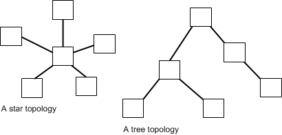
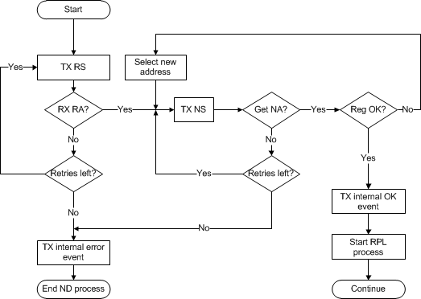
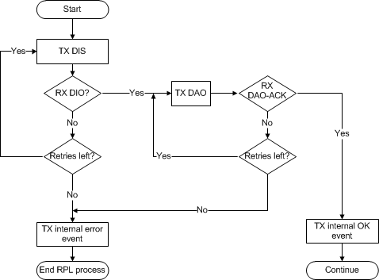
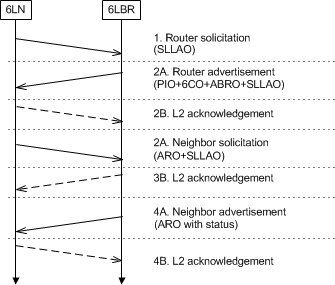

Networking
==========

This chapter discusses the networking topology and the protocols used. It contains the following sections:

- [_Networking topology_](#networking-topology)
- [_MAC_](#mac)
- [_UDP_](#udp)
- [_TCP_](#tcp)
- [_RPL routing_](#rpl-routing)
- [_Network join process_](#network-join-process)
- [_Network rejoin process_](#network-rejoin-process)
- [_Automatic network healing process_](#automatic-network-healing-process)

## Networking topology

The 6LoWPAN stack uses two types of networking topology, namely the star and tree topologies, as shown in _Figure 1-5_.

**Figure 1-5 Networking topologies supported by the 6LoWPAN stack ecosystem**

## MAC

The _Media Access Control_ (MAC) implementation is based on the IEEE802.15.4-2006 standard (see [MAC]) and is used for MAC layer communication between nodes such as beacon scans and responses, and data requests and indications. The MAC implementation has already been certified on multiple platforms.

The MAC implements the non-beacon enabled modes of the standard. It does not implement _Guaranteed Time Slot_ (GTS).

## UDP

The 6LoWPAN stack supports the UDP transport protocol. Applications can use the Socket API to send and receive data using UDP sockets. UDP is typically used by applications to deliver short messages over IP. It is an unreliable, connectionless protocol, but can be used for broadcast and multicast messages. The advantage of UDP is that it does not require any kind of connection formation or handshake process to take place prior to communication. UDP is the classic fire-and-forget transport mechanism that combines inherent low reliability, requiring minimal overhead.

A disadvantage of UDP can easily be mitigated by using a simple application layer, end-to-end acknowledgment scheme. As an efficient and scalable example of such a solution, see the _Constrained Application Protocol_
(CoAP) _Acknowledgement_ (ACK) mechanism as defined in [CoAP](http://tools.ietf.org/html/rfc7252).

## TCP

The 6LoWPAN stack supports the _Transmission Control Protocol_ (TCP) and applications can use the socket interface APIs of the stack to send and receive data using TCP sockets. Applications requiring a reliable, ordered transport for a stream of bytes can typically use TCP. However, TCP is not suitable for every application because it only supports unicast communication and reacts badly to packet loss. TCP is not suitable for very short transactions because the ratio of overhead to application data typically increases fairly quickly. Additionally, the use of TCP can have very adverse effects on the power consumption of a device because of the duration of the TCP handshake process.

## RPL routing

_Routing Protocol for Low power and Lossy networks_ (RPL) is a distance vector IPv6 routing protocol defined in the _Internet Engineering Task Force_ (IETF) for low power and lossy networks that specifies how to build a _Destination Oriented Directed Acyclic Graph_ (DODAG) using an objective function and a set of metrics and constraints. RPL is optimized for a many-to-one topology. Neighbors keep route records of the edge router as a final destination. The reverse route, or source route, is kept by the edge router and is used for sending data to any node in the network it has a route for. When a node sends a packet to another node, the packet travels up to a common ancestor in the DAG, at which point it is forwarded in the down direction to the destination.

## Network join process

The developer has full control as to when the 6LoWPAN stack attempts to join a network. The developer has the possibility to configure a channel, _Personal Area Network Identifier_ (PANID) and 128-bit _Network Identifier_ (NWKID) masks to filter out both unwanted channels or networks. With a few simple function calls the developer can inform the stack to initiate either a passive energy scan or a beacon scan to select channels. Network PANIDs and NWKIDs will be filtered and non-matching networks will be silently discarded. The stack will then proceed to perform the network level bootstrapping according to [6LOWPAN-ND](https://datatracker.ietf.org). When the stack joins a network or no network is found, the developer is notified using a standard system event. If the stack has not joined a network, the developer has the option to 1) select alternative parameters; 2) cease further attempts to join a network or 3) continue to retry the joining process. The stack will make no attempt to join a network when it informs the application layer of an unsuccessful attempt. However, the stack may choose to retry using the initial parameters.

**Figure 1-6 High level view of the network bootstrap process when using network authentication**

### Join a 6LoWPAN network

The initial process of joining a network involves a MAC level association where the node will perform a MAC beacon scan using the channels in its channel list. The resulting beacon will ignore responses from neighboring nodes using the beacon protocol ID filter where the node will associate with the best parent router in the network, typically the highest _Link Quality Indicator_ (LQI) that has a matching PANID. The node will then perform a _Mesh Link Establishment_ (MLE) request to the parent router, as well as other routers that have responded to the initial beacon scan. If the chosen router did not respond to the MLE request, the node will select a new router from the beacon scan results.

Subsequently, a node in a 6LoWPAN mesh network initiates the _6LoWPAN Neighbor Discovery_ (6LoWPAN-ND) process. The neighbor discovery protocol handles address assignment including _Duplicate Address Detection_ (DAD) and registration with the edge router. The edge router keeps a whiteboard of all nodes that have joined the 6LoWPAN network. In a 6LoWPAN mesh, the registration process is repeated over multiple hops for routers or host devices that are not adjacent to the edge router. The RPL is only for the router.

The last step, excluding anything above the RPL modules, is the RPL topology formation. The RPL DODAG formation is a multiphase process where the joining node actively attempts to find the best available parent to use for registration to the _6LoWPAN border router_ (6LBR).

_Figure 1-7_ shows the _6LoWPAN Node_ (6LN) join process to a 6LBR using a _6LoWPAN Router_ (6LR) in a mesh topology configuration. In the illustration, the vertical axis represents time. The 6LN will typically receive multiple
_Router Advertisement_ (RA) messages.

**Figure 1-7 The join process for a mesh topology**

**Figure 1-8 High level state machine description for network bootstrap**

_Figure 1-9_ shows the RPL layer registration and topology formation process message flow for a scenario where the joining node may use multiple hops from the 6LBR.

**Note**: The joining device can receive multiple DIO messages.

**Figure 1-9 RPL routing layer message flow for multiple hops**

**Figure 1-10 High level view of a mesh topology**

### Join a star network

The joining process for a node in a 6LoWPAN star network uses the same process as mentioned in _Join a 6LoWPAN network_. However, a star network differs insofar as the registration process is only undertaken as a one-hop sequence with the edge router.

_Figure 1-11_ shows the _Wireless Personal Area Network_ (WPAN) node (6LN) join process to a 6LBR in a star topology configuration. In the illustration, the vertical axis represents time.

**Note**: Typically the 6LN will receive multiple RA messages.

**Figure 1-11 6LoWPAN join process to a border router**

Figure 1-12_ shows the RPL layer registration and topology formation process message sequence for a scenario where the joining node is a single hop from the 6LBR.

**Note**: The joining device can receive multiple DIO messages.

**Figure 1-12 The RPL layer registration formation process**

## Network rejoin process

If a device with the 6LoWPAN stack is forced into sleep mode for an extended period of time so that its registration with the 6LBR has expired, the stack will automatically detect this and update its registration. The stack is then ready for communication without any further action from the application when the device wakes up.

The exact time that it takes for the stack to refresh the registration depends on whether a full mesh network topology or a star topology is used. Additionally, in the mesh network scenario the exact location of the device (depth from the 6LBR to be specific) in the mesh has a small impact on the time when full networking capabilities are restored.

## Automatic network healing process

It is fairly common for the RF channel to change even if the physical location of the actual mesh network has not. The network must then adapt to the new channel immediately and with ease.

The standards that the 6LoWPAN stack uses provide feedback from multiple protocol layers, such as, the MAC, network, and routing layers. This multiple layer approach provides the stack with numerous sources of information that can be used to make automatic decisions as to when network reconfiguration can be initiated. It can also be delivered to other devices in the IP network using standard _Internet Control Message Protocol_ (ICMP)v6 messages. More specifically, these messages can either be ICMPv6 Destination Unreachable or No Route To Host types.

### MAC layer

When repeated notifications of _layer two_ (L2) ACKs are not passed up to the higher layers, a possible lost connection has occurred. If the ACK messages are lost from a parent device in the routing topology, this results in one of the following actions: 1) switch to a secondary parent, that is, an alternative parent that has been stored for backup; or 2) the stack should initiate a local network reconfiguration.

If the L2 ACKs are missing from a child node, the routing node typically transmits an ICMPv6 error message to the originator of the packet. If an application on the device itself is the originator, the application is notified of the error using a system event.

### Network layer

If the MAC layer informs _layer three_ (L3) of a connectivity issue toward the parent network, it becomes the responsibility of L3 to reconfigure the network. This is achieved simply by transmitting multicast _Router Solicitation_ (RS) messages using the configured channel in an attempt to find an alternative parent. Since 6LR and 6LBR devices that have already joined the RPL DODAG reply to RS messages with RA messages, the scanning device can be certain that all replies come from devices that are capable of routing packets. This step essentially ensures that the device can join a new network if the 6LBR, of the previously used network, has become unusable. It is important to understand that the 6LoWPAN-ND process is not used to form the network topology, but merely to establish the IPv6 prefix context information and the identities of the available
(direct or multihop) 6LBR devices.

### Routing layer

If the device has made the decision to perform local reconfiguration and has updated the 6LoWPAN network information using the 6LoWPAN-ND process, the next step is to (re-)join the RPL DODAG. To achieve this, the device will follow the standard RPL network join process as described in [_Join a 6LoWPAN network_](#join-a-6lowpan-network).

