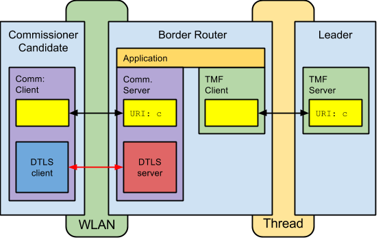
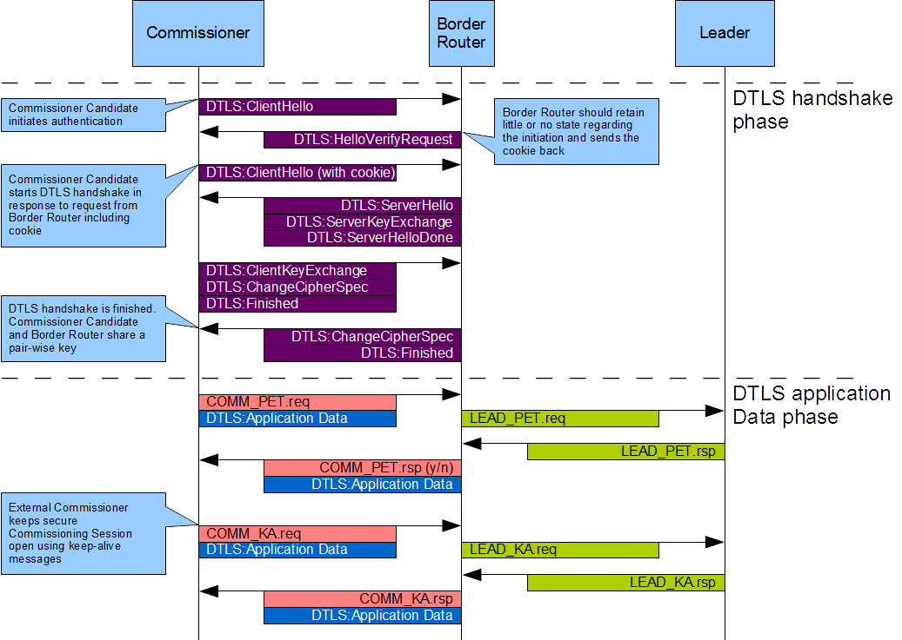
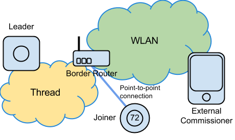

 Commissioning process
============

The commissioning process has two phases:

*  Petitioning
*  Joining

Petitioning must occur before any joiner can join, that is, there must be one sole authorized commissioner - an authenticator for subsequent joiners.

## Mesh Commissioning Protocol (MeshCoP)

The Mesh Commissioning Protocol (MeshCoP) is based on CoAP [RFC 7252](https://tools.ietf.org/html/rfc7252) and performs petitioning, maintenance, management and relay functions. It uses WLAN as an access technology for non-Thread networks whereas within a Thread network it uses the Thread Management Framework.

## Petitioning

### External commissioner candidate

If a commissioner candidate uses a WLAN network interface for commissioning or exists outside Thread network, it is known as an external commissioner candidate. An external commissioner has to petition the Thread network through a representative (the Border Router) to become the sole authorized commissioner. The commissioner candidate must use an authentication handshake with the Border Router to prove its eligibility to become the sole authorized commissioner and set up a secure commissioning session. The commissioner candidate petitions the Leader via the Border Router. If petitioning succeeds, the commissioner candidate becomes the sole authorized external commissioner. As the secure commissioning session is set up, the representative Border Router will be made known throughout the Thread network and all subsequent communication with other Thread devices will now be done through the Border Router. A periodic keep-alive message is sent on the secure commissioning session to ensure it remains open with the commissioner.

**Figure 2-3 External Commissioner Petitioning**

* The process starts with the Border Router being aware of the commissioner credential. This can be entered directly into the Border Router device itself or into any trusted Thread device and sent to the Border Router.

* After a while, the same commissioner credential will be entered into the commissioner candidate that will initiate the registration process, starting with a DTLS handshake. If the DTLS handshake is successful, the Border Router will authenticate the commissioner candidate based on the information of the shared commissioner credential.

* The Border Router will arbitrate with the Leader on behalf of the commissioner candidate to authorize the commissioner candidate to be the sole commissioner and authenticator for subsequent joiners. If there is already an authorized commissioner, the commissioner candidate will be denied authorization.

* The authorized commissioner will keep a secure commissioning session open with the Border Router. The session uses the DTLS record layer for encryption and authentication, based on keys derived from the master key established between the commissioner (as the commissioner candidate) and the Border Router as a result of the DTLS handshake. This commissioning session will be used for various purposes and it communicates CoAP messages carrying petitioning, management and relay messages between the commissioner and the Border Router.

**Figure 2-4 External Commissioner Petitioning Sequence**

### Native commissioner candidate

If the commissioner candidate uses a Thread Network Interface for commissioning, it is known as a native commissioner. A native commissioner has to petition the Thread network through a representative (the Commissioner Router) to become the sole authorized commissioner. The commissioner candidate must use an authentication handshake with the Commissioner Router to prove it is eligible to become the sole authorized commissioner and set up a secure commissioning session. The candidate petitions the Leader via the Commissioner Router. If petitioning succeeds, the commissioner candidate becomes the sole authorized native commissioner. However, the commissioner subsequently joins the Thread network and becomes an active
device (on-mesh commissioner) and all communication with other Thread devices takes place directly with the commissioner.

**Figure 2-5 Native Commissioner Petitioning**

* The process starts with the Commissioner Router being aware of the commissioner credential. This can be entered directly into the Commissioner Router device itself or into any trusted Thread device and sent to the Commissioner Router.

* After a while, the same commissioner credential will be entered into the commissioner candidate and it will initiate the registration process, starting with a DTLS handshake. If the DTLS handshake is successful, the Commissioner Router will authenticate the commissioner candidate based on the information of the shared commissioner credential.

* The Commissioner Router will arbitrate with the Leader on behalf of the commissioner candidate to authorize the commissioner candidate to be the sole commissioner and authenticator for subsequent joiners. If there is already an authorized commissioner, the commissioner candidate will be denied authorization.

* The authorized commissioner will subsequently join the Thread network and thus be able to communicate directly with all Thread devices.

**Figure 2-6 Native Commissioner Petitioning Sequence**

### Petitioning authorization

When a Border Router or Commissioner Router receives a petitioning request from the commissioner candidate, the Border Router or Commissioner Router relays the petitioning request to the Leader with the ID of the commissioner candidate. The Leader will respond by accepting or rejecting the request and the Border Router will relay the response accordingly. If the commissioner candidate is external, the Leader will also advertise the Border Router acting on behalf of the commissioner to the rest of the Thread network so any potential Joiner Router knows where to relay the DTLS handshake messages originating by the joiner. In addition, the beacon information will be updated through a notification so all Thread Routers alter their beacon, assisting the steering of the joiner.

**Figure 2-7 Petitioning Authorization**

## Joining Process

When there is an authorized commissioner associated with the Thread network, Thread devices are allowed to join the Thread network securely. These devices are known as joiners. The actual joining process depends on the system topology that can be identified as one of the following scenarios:

* External commissioner is connected via WLAN
	* Border Router is not a Joiner Router
	* Border Router is a Joiner Router

* Native commissioner is connected via Thread network
	* Joiner Router is not a commissioner
	* Joiner Router is a commissioner

This implies that the commissioner will be in one of the following states:

### External commissioner

In this case, the petitioning process as described in [External commissioner candidate](#external-commissioner-candidate) must have taken place initially to provide a secure commissioning session from Border Router to commissioner bound to the petitioning process. This secure session is then used in the joining process to relay the joining DTLS handshake through to the commissioner. Once the joiner has received the network parameters it needs to attach to the Thread network. This closes the secure commissioning session.

**Case 1: Border Router is not a Joiner Router**

This is the most complex case out of the four presented scenarios. In this case, there are three separate and distinct paths the authentication traffic (the DTLS handshakes) has to go through:

* Joiner to Joiner Router point-to-point
* Joiner Router to Border Router through Thread network
* Border Router to commissioner through WLAN

These paths are effectively connected to each other and the Joiner Router and Border Router's relay agents and client-server bindings manage the authentication traffic accordingly.

**Figure 2-8 External commissioner connected to the WLAN, Border Router is not a Joiner Router**

**Case 2: Border Router is a Joiner Router**

This case is simpler because there is no need to relay from a Joiner Router to a Border Router. However, the Border Router uses its relay agent to police unauthenticated traffic as a Joiner Router. There are two separate and distinct paths the authentication traffic (the DTLS handshakes) have to go through:

* Joiner to Border Router point-to-point.
* Border Router to commissioner through WLAN.

**Figure 2-9 External commissioner connected to the WLAN, Border Router is a Joiner Router**

### Native commissioner

In this case, either the petitioning process as described in [Native commissioner candidate](#native-commissioner-candidate)
must have taken place initially, or the commissioner has already joined the Thread network, either by starting it or by using an out-of-band process. Once the joiner has received the network parameters it needs to attach to the Thread network. This closes the secure commissioning session.

**Case 1: Joiner Router Is Not a commissioner**

This case is simpler as there is no need to relay from the Border Router to the commissioner. There are two separate and distinct paths the authentication traffic (the DTLS handshakes) has to go through:

* Joiner to Joiner Router point-to-point.
* Joiner Router to commissioner through Thread network.

**Figure 2-10 Native commissioner connected to the Thread network, Joiner Router is not a commissioner**

**Case 2: Joiner Router is a commissioner**

This case is the simplest because there is no need to relay from the Border Router to the commissioner and there is not a distinct Joiner Router. There is only one distinct path the DTLS handshake has to go through:

* Joiner to Border Router point-to-point.

**Figure 2-11 Native commissioner connected to Thread network, Joiner Router is a commissioner**

