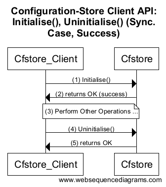
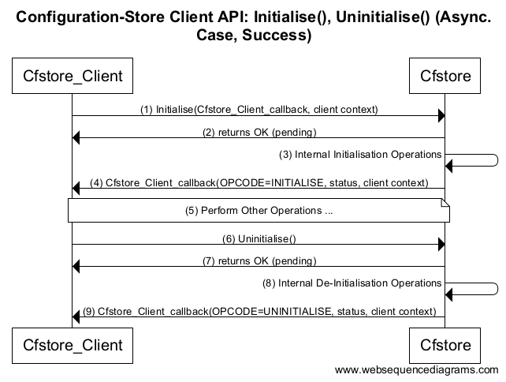
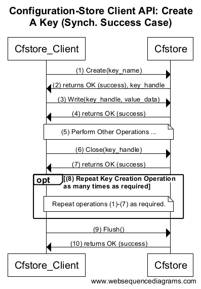
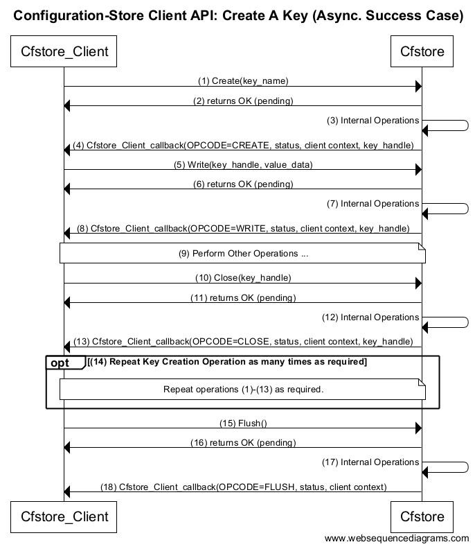
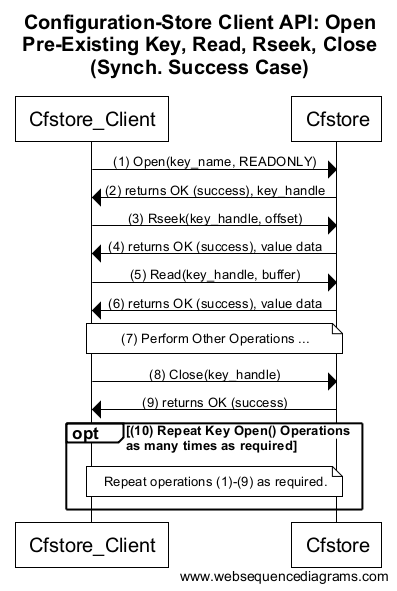
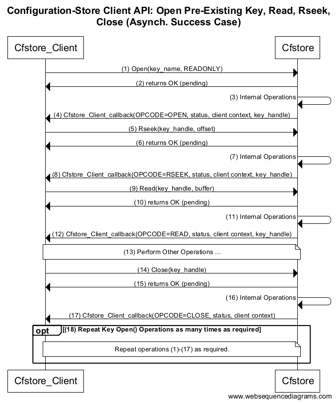
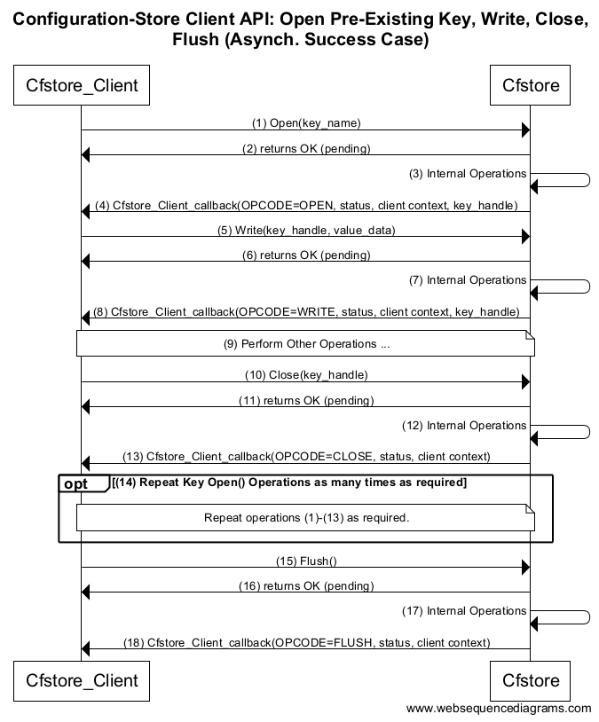
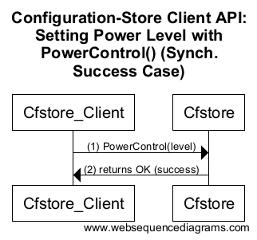

# Configuration Store High Level Design
Author: Simon Hughes

# Overview

## Executive Summary

This document is the High Level Design for the first version of the 
Configuration Store (CFSTORE). The configuration store is a secure, 
associative key-value (KV) store C-Language Hardware Abstraction Layer. 
CFSTORE's main function is storing and managing (key, value) pairs in 
persistent storage media. It implements a subset of the requirements as listed 
in the supported requirements section.

CFSTORE provides the secure and persistent storage for:

- Storing encryption keys data.
- Storing configuration data.
- Storing firmware, firmware updates and incremental firmware blocks for assembling into a firmware update.

i.e. CFSTORE is a general purpose registry for storing code and data objects.

These services are presented to clients with:

- A conceptually simple, file-like interface for storing and managing data using (key, value) pairs in 
  persistent storage media. 
- A simple, hardware-independent API to promote portability across multiple platforms and a low attack surface. 
- A very small code/memory footprint. CFSTORE is capable of running on highly-constrained memory systems (~10kB free memory)
  where typically available SRAM << NV storage. 
- A simple (low complexity) storage capability such that CFSTORE only supports the storage of binary blobs.  


## Terminology

The terminology used throughout this document is defined in the following: [CFSTORE Terminology for definition of terms used in CFSTORE documents.][CFSTORE_TERM]


## Document Scope

The scope of this document is the High Level Design (HLD) of the 
Configuration Store (CFSTORE) component which includes the following features: 

- The creation of new key-value (KV) pairs in the store for writing. 
  The values are binary blobs with no type structure.
- The opening of pre-existing KV pairs for reading/writing/deletion.
- The searching of KVs with keys matching a search string with wildcards.
- The synchronous and asynchronous completion of the above functions.
- The committing of KV pair changes to non-volatile backing stores. 
- The secure storage and management of KV pairs according to access permissions and uvisor supported security features.
- CFSTORE alignment with the CMSIS-Driver Model.


The [overview](#Overview) section provides an introduction to this document including an executive summary, an
outline of sections and a list of outstanding issues.    

The [motivation](#CFSTORE-Motivation,-Design-Considerations-and-Key-Concepts) section discusses the 
rationale for the CFSTORE design including considerations of security, complexity, KV
storage, KV ownership, access control, error handling, and KV operations including creating, reading, writing and
finding. 

The [use cases](#Use-Cases) section describes the important CFSTORE client use cases, in particular the 
FOTA use case.   

The [software architecture](#Configuration-Store-Software-Architecture) section describes the 
entities in the CFSTORE software stack including the CFSTORE clients (e.g. FOTA), CFSTORE, the 
flash-abstraction layer, the CMSIS-Driver Flash driver layer, uvisor and the hardware/software 
interface.

The [CFSTORE API](#Configuration-Store-Application-Programming-Interface-(CFSTORE-API)) section describes the
application programming interface to the CFSTORE component. This includes sequence diagrams
describing the client-CFSTORE API call sequences to use the interface for common
operations e.g. CFSTORE initialization/de-initialization, creating a key and finding KVs 
that match a given search string.

The [miscellaneous issues](#Consideration-of-Miscellaneous-CFSTORE-API-Issues) section discusses a number
of API design considerations including how to increase/decrease the size of a pre-existing KV value 
blob, operating with severely limited SRAM, and changing a key-values ACL permissions. 

The [error handling](#Error-Handling) section discusses procedures for error recovery when a CFSTORE
API function returns an error.

The [known limitations](#Known-Limitations) section describes the limitations of the current design.


## Outstanding Issues With This Document

There are no outstanding issues with this document.


# CFSTORE Motivation, Design Considerations and Key Concepts

## Rationale/Motivation

A persistent store is a building block of many embedded systems, forming the 
central repository where configuration for many modules can be managed. 
The store hides the complexity of implementing a similar system 
from each module and encourages rich configuration interfaces for the developer.

A consideration of the wide variety of data types requiring persistent storage provides the
motivation and rationale for a number of CFSTORE features. For example, 
CFSTORE provides persistent storage for:

- Sensitive data including encryption keys, passwords, and certificates, requiring secure storage.
- Application configuration data requiring updating and management as the application requires.
- Firmware images, firmware updates and incremental firmware blocks for assembling into a firmware update.
- Network stack configuration e.g. MAC addresses, static IP address/gateway configuration.
- Bootloader environment variables e.g. which kernel/filesystem/application image to boot, 
  system initialisation parameters to supply to running image.
- Storing peripheral configuration data.
- Storing Management Information Base (MIB) objects. 

i.e. CFSTORE is a general purpose registry for storing code and data objects.

These services are presented to clients in the following way:

- A simple, hardware-independent API to promote portability across multiple platforms and a low attack surface.
- A very small code/memory footprint so CFSTORE is capable of scaling from highly-constrained memory systems (~10kB free memory)
  where typically available SRAM << NV storage, to less constrained systems with more memory.
- A simple (low complexity) storage capability such that CFSTORE only supports the storage of binary blobs.  


## CFSTORE Security Considerations

For security reasons the uVisor security model allows applications (general purpose code) 
only restricted access to NV (flash) storage. This ensures modifications to OS or application 
code are tightly controlled to ensure:

- Malware cannot become resident in the system.
- Security measures like Access Control Lists (ACLs) cannot be modified or circumvented by malicious code.


## Low Complexity of CFSTORE and the Implied Security Benefits

The design concept behind the secure key-value store is one of simplicity to ensure a 
low attack surface. The design reflects the smallest possible common denominator 
for storing data and code blocks in a mutually-distrustful operating system.

Complex access restrictions are implemented in additional uvisor boxes as 
CFSTORE clients i.e. "on top of" the secure CFSTORE key-value storage. An example of a complex
access restriction is given as follows: 

> The following key can be only updated from Monday to Thursday by a remote 
> server matching the following valid public key. 

The additional secure uvisor box is used to wrap values with box-specific 
ACLs and marks these keys as accessible only to the owner box. 
Restricting access in this way guarantees domain-specific 
key-access restrictions can be reliably enforced by each security context.


## CFSTORE Implied Shifting of Complexity to Other (Higher Layer) Components

The same is true for supporting custom or complex data types beyond the simple octet blob supported by CFSTORE.
For sophisticated configuration storage 
systems arbitrary types can be supported by wrapping values with a type identifier. 
This ensures that every programming language can be adequately and safely supported by 
the key-value storage.


## Key Value Storage

The CFSTORE KV storage has the following characteristics:

- The only supported key-value payload type is a binary blob. 
- All values are referenced by a global name-spaced key string. 
- The key_name is required to be unique on a device. 
- Although by design the key_name format does not provide the notion of hierarchical key-trees, 
  key-hierarchies can be reflected in key path strings.
- Allowable characters in a key path directory entry are only ASCII letters, digits, and the '-' character.
- Path directory entries are separated by the path delimiter ('.').
- Path directory entries are indicated to be part 'lists' by adding one or more list indexes enclosed by curly brackets ('{ }').
  Index names are composed with allowable characters (see previous point).
- Key name sizes are limited to 220 bytes (excluding zero termination).

The following illustrates valid name examples:

```

    'com.arm.mbed.wifi.accesspoint{5}.essid' = 'AccessNG'

    'com.arm.mbed.wifi.accesspoint{home}.essid' = 'HomeSweetHome'

    'com.arm.mbed.your-registry-module-name.your-value' = 'XYZ'

    'com.arm.mbed.hello-world.animal{dog}{foot}{3}' = 'dirty'
```


## Key Ownership

Key ownership is tied to the name of the key.

- If a client security context (uvisor box) needs to create CFSTORE KV entries, it must 
  have a (mandatory) key name prefix. This is called the security_prefix_name.
- When a client security context creates a KV pair, the security_prefix_name is "enforced" 
  for created values i.e. the security_prefix_name must be the prefix of the key_name. 
- Therefore, the CFSTORE key_name namespace owned by a client security context is defined by the 
  clients security_prefix_name.

Consider the following example:

- The client security context (uvisor box) has the security_prefix_name "com.arm.mbed.tls". 
  This security_prefix_name is registered with uvisor as part of box creation. 
- The client security context creates a CFSTORE KV with client_key_name='com.arm.mbed.tls.cert{5}.key'.
- CFSTORE queries uvisor for the client security_prefix_name and computes the client_key_name_prefix by
  post-pending '.' to give "com.arm.mbed.tls.".  
- CFSTORE only creates the KV if the client security_prefix_name (i.e. "com.arm.mbed.tls.") 
  matches the leading characters of the client_key_name (i.e. "com.arm.mbed.tls.cert{5}.key").
  In this case there is a match so CFSTORE creates the KV.
- The client "com.arm.mbed.tls" uvisor box is regarded as the owner of the newly created key.

Uvisor box security_prefix_name's are not allowed to overlap.


## Access Control Security ###

Access control lists (ACL) enforce access for the following security groups: 

- Owner.
- Other. 

The permissions for these two groups are:

- Reading.
- Writing.
- Execution. 

The resulting matrix can be represented by a 6-bit binary field:

- Owner (i.e. the caller during key creation):
  - Read permission bit. 
  - Write permission bit.
  - Execute permission bit.
- Other (i.e. everybody else):
  - Read permission bit.
  - Write permission bit.
  - Execute permission bit.

Note the following: 

- A writable field is not allowed to be executable. 
- The executable bit is not supported till further notice and is reserved for performing modular firmware updates at a later point.
- The high level API provides a function for listing accessible values, but ensures that only values with 
  read or write access will be listed to the caller.
- The caller is able to choose between listing just the KVs he owns, or the KVs of others he has read or write access to.


## Finding Keys

Whenever a key is read, the CFSTORE is scanned for active keys with suitable access permissions key-by-key. 
Wild card searches are explicitly supported. The reserved character asterisk ('*') is used to indicate a wild 
card search to the API. Wild card operations are only supported for finding keys, not for accessing keys. 
The wild card operator can occur once at any point in the search string.

The following shows examples of valid key_name query strings to the Find() method:

```

    'com.arm.mbed.wifi.accesspoint*.essid'

    'com.arm.mbed.your-registry-module-name.*'

    'com.arm.mbed.hello-world.animal{dog}{foot}{*}'

    'com.arm.mbed.hello-world.animal{dog}{foot}*'

    'com.arm.mbed.hello-world.animal{dog*3}'

```

Note that whenever a search returns a key candidate, the search can be resumed to return further matches.

 
## Creating & Opening Keys for Writing

Keys must be explicitly created using Create() with the following parameters:

- Security ACLs (owner & others).
- The intended retention levels.
- The expected Device Data Security Protection Features.
- The value size.
- Mode flags.

Note the following:

- Pre-existing keys are opened using Open().
- The returned handle allows write access to the value by default.
- Wild cards are not allowed for creating or opening keys. 
- Failing to meet expected retention levels or security levels result in the API call failing.
- An executable key is always treated as 'continuous' by the API even if the 'continuous' flag is not set by the caller. 
- Non-executable values can be optionally 'continuous'.


# Use Cases

The design addresses the requirements of the following use cases:

- CFSTORE Initialisation and Factory Initialisation. 
- FOTA

## FOTA Use Case

- FOTA receives new firmware image incrementally in data blocks.
- Firmware image sizes are in the range 32-512kB. 
- FOTA may choose to manage an image in blocks e.g. size 16kB chunks 
  so a 512kB image would be made up of 32 data blocks i.e. 32 x 16kB=512kB.
- FOTA is responsible for receiving the 16kB blocks.
- FOTA may have 32 keys in the registry each storing 16kBs.
- A number of CFSTORE keys may be open simultaneously.
- FOTA may be writing incrementally to the key values, as data is received.
- FOTA block data may be stored in memory initially.


## Network Configuration

Network configuration varies by network type. As a result, presenting a common 
interface for network configuration is difficult. Using a pointer to a 
configuration blob simplifies the Network API and concentrates complexity 
and knowledge about the network implementation in the network driver and 
the configuration mechanism in the application.

Networks need hierarchical configuration. A flat model starts to fail 
when multiple interfaces with similar parameters are used. Most networks 
need non-volatile, runtime configuration, but Wi-Fi demonstrates this 
need the best: configuring a Wi-Fi network on a device requires, at 
minimum, selecting a SSID and entering a password. These must persist 
past power cycles. 

Network configuration also needs to support overrides. 
When configuring a network device, it should be possible to recover 
old configuration until new configuration is committed to non-volatile 
storage. A network device should ship with sensible default 
configuration (e.g. DHCP), but this should be overridden when necessary.

Network configuration requires many kinds of value types: integer 
(Channel number), string (SSID), binary blob (hashed password). 
There is an argument for floating point (transmit power), but this can 
be done via integer and fixed-point.


## Credential Storage

Storing credentials requires secure access to the storage. As a result, 
it must be possible to apply permissions to parts or the whole of the 
tree.


## System Initialization

It is conceptually possible to reduce the number of code versions by 
using more configuration. For example, clock configuration can be 
done using the config mechanism. If this is the case, then the permanent 
config store must be accessible early in the boot process, when clocks 
are configured.

It may be necessary to provide a list of modules that explicitly require an 
init function to be called. To make this possible, those functions 
could be listed, in order in the configuration store. This has some 
advantages over conventional approaches, such as linker sections, in 
that it provides a much more readable way to inspect the modules that 
are being initialized.

## Resource Management

In the future, a resource manager may be an integral part of mbed OS. 
In this instance, the resource manager needs in-depth information about 
how peripherals are connected to clocks and power domains. 
CFSTORE should contain this information.


## Peripheral Configuration

If the system interface API were aware of the CFSTORE, 
then it would be straight-forward to encode 
defaults via config. This would allow the interface API to extract 
application-dependent, but still sensible defaults from the config 
store when they are omitted. This could be combined with Resource 
Management to automatically correct for clock scaling of buses or the core.


# Configuration Store Software Architecture

```C
    
    +-+-+-+-+-+-+-+-+-+-+-+-+-+-+-+-+     
    |  Configuration Store Client   |     
    |  e.g. FOTA                    |
    +-+-+-+-+-+-+-+-+-+-+-+-+-+-+-+-+     

    +-+-+-+-+-+-+-+-+-+-+-+-+-+-+-+-+     +-+-+-+-+-+-+-+-+-+-+-+-+-+-+-+-+
    |  Configuration Store          |     |  uvisor                       |
    +-+-+-+-+-+-+-+-+-+-+-+-+-+-+-+-+     |                               |
                                          |                               |
    +-+-+-+-+-+-+-+-+-+-+-+-+-+-+-+-+     |                               |
    |  Flash Abstraction Layer      |     |                               |
    +-+-+-+-+-+-+-+-+-+-+-+-+-+-+-+-+     |                               |
                                          |                               |
    +-+-+-+-+-+-+-+-+-+-+-+-+-+-+-+-+     |                               |
    |  Flash Driver Layer           |     |                               |
    |  e.g. CMSIS-Driver            |     |                               |
    +-+-+-+-+-+-+-+-+-+-+-+-+-+-+-+-+     +-+-+-+-+-+-+-+-+-+-+-+-+-+-+-+-+

    SW
    -----------------------------------------------------------------------
    HW

    +-+-+-+-+-+-+-+-+-+-+-+-+-+-+-+-+
    |  NV Storage Media e.g. Flash  |
    +-+-+-+-+-+-+-+-+-+-+-+-+-+-+-+-+

	Configuration Store Software Architecture

```

The above figure shows the following entities:

- NV Storage Media. These are the physical storage media. 
- Flash Driver layer e.g. CMSIS-Driver.
- Flash Abstraction Layer, portable across the driver layer.
- Configuration Store, the associative KV pair store.
- A Configuration Store client e.g. FOTA.


# Configuration-Store Application Programming Interface (CFSTORE-API)

The main API methods for creating, reading and writing CFSTORE KV are as follows:

- (*Create)() creates a new KV in the store.
- (*Open)() opens a pre-existing KV in the store. KVs can be opened read-only or read-write.
- (*Read)() permits the random-access reading of the value data from the 'file-like' read location. 
- (*Rseek)() permits the setting of the 'file' read location, the offset from the start of the value data where the next Read() will read from.
- (*Write)() permits the sequential-access writing of value data with the start of the write always starting from the beginning of the data value storage area.  
- (*Flush)() permits the writing of CFSTORE changes to the backing store.  

Note that the above methods show similarities with a file system interface, but CFSTORE is not intended to be a 
file system e.g. CFSTORE does not implement volume management or directory structures required for a file system. 

Additionally, the API supports also includes the following support methods:

- (*GetCapabilities)() to get the capabilities of the CFSTORE implementation (e.g. whether CFSTORE is synchronous or asynchronous).
- (*GetKeyName)() to get the name of a key given an opaque handle.  
- (*GetStatus)() to get the status of an in-progress  asynchronous transaction.
- (*GetValueLen)() to get the length of the value data area of a KV pair.
- (*GetVersion)() to get the version of the CFSTORE API.
- (*Find)() queries the CFSTORE for keys matching a search string. The function returns an opaque handle to the first matching search
  result. The function can be used to iterate over the entries, supplying a previously returned key handle to retrieve the next, until
  the null handle is returned indicating there are no more matches.
- Initialize() permitting the client to initialize CFSTORE for use and to subscribe for asynchronous event notifications.
- PowerControl() permitting the client to set the power control level.
- Uninitialize() permitting the client to de-initialize CFSTORE.
  
The API is aligned with the CMSIS-Driver Model in which the CFSTORE API functions are presented as `ARM_CFSTORE_DRIVER` dispatch methods.

## CMSIS-Driver Model

The CFSTORE is aligned with the CMSIS-Driver Model pattern as follows:

- The interface is implemented using an `ARM_CFSTORE_DRIVER` structure with dispatch functions for the API interface methods.
- The following CMSIS-Driver common methods are adopted: 
  - (*GetCapabilities)().
  - (*GetStatus)().
  - (*GetVersion)().
  - Initialize().
  - PowerControl().
  - Uninitialize().

This document refers to invocation of the `ARM_CFSTORE_DRIVER` dispatch methods using a notional pointer 'drv' to the `ARM_CFSTORE_DRIVER` object instance.
Thus drv->Initialize() refers to the invocation of the CFSTORE API Initialize() method. 

See the [CFSTORE low level Design][CFSTORE_LLD] for the detailed specification for function prototypes. 
See the [CMSIS-Driver Documentation][KEIL_CMSIS_DRIVER] for more information.


## CFSTORE API Functions Use Opaque Handles (`ARM_CFSTORE_HANDLE` hkey) 

In common with a file interface, CFSTORE API functions return an opaque file handle for accessing a particular KV. In general terms:

- Create() may cause CFSTORE to instantiate in-memory data structures (context) for accessing a KV. On success, CFSTORE returns a valid opaque buffer 
  containing references (handles) to these data structres. The client then "owns" the associated CFSTORE context, which
  CFSTORE updates in response to other API calls using the handles. The client returns ownership of the handles to CFSTORE by calling Close(hkey). 
  This causes CFSTORE to free in-memory data structures associated with accessing the KV. 
- Find() may cause CFSTORE to instantiate in-memory data structures (context) for a KV matching the key name query string. On success, 
  CFSTORE returns a valid opaque buffer containing references (handles) to these data structres. 
  The client then "owns" the CFSTORE context, which CFSTORE updates in response to other API calls using the handles. 
  The client returns ownership of the handles to CFSTORE in the following ways:
  - By calling Find() again but this time supplying the previously returned 'next' ARM_CFSTORE_HANDLE as the 'previous' argument. 
  - By calling Close(next). 
     

## API Call Sequence Diagram for GetVersion(), GetCapabilities() 

<p align="center">
  
</p>

\image html cfstrore_hld_seqdiag_getversion_getcapabilities_sync.png "Call Sequence Diagram for GetVersion(), GetCapabilities()"

The above diagram shows the client-CFSTORE call sequence demonstrating how the client discovers API and CMSIS-Driver versions supported by the API.

1. The client calls drv->GetVersion() which returns an `ARM_DRIVER_VERSION` structure. GetVersion() is a synchronous function. 
2. The client calls drv->GetCapabilities() which returns an `ARM_CFSTORE_CAPABILITIES` structure
   which reports whether the CFSTORE implementation is either:
  - Synchronous or,
  - Asynchronous. 
  
### Synchrononous Mode

In synchronous mode `ARM_CFSTORE_DRIVER::Dispatch_Method_Xxx()` will return:

- `RETURN_CODE >= ARM_DRIVER_OK` implies CFSTORE Dispatch_Method_Xxx() completed successfully.
- `RETURN_CODE < ARM_DRIVER_OK` implies CFSTORE Dispatch_Method_Xxx() did not complete successfully.
  The value of the return code supplies further details of the failure cause.


### Asynchronous Mode

In asynchronous mode `ARM_CFSTORE_DRIVER::Dispatch_Method_Xxx()` will return:

- `RETURN_CODE = ARM_DRIVER_OK` (==0) implies CFSTORE Dispatch_Method_Xxx()
  completion is pending. Dispatch_Method_Xxx completion status will be indicated via
  an asynchronous call to the `ARM_CFSTORE_CALLBACK` registered with
  `ARM_CFSTORE_DRIVER::(*Initialize)()`.
- `RETURN_CODE` > 0 => CFSTORE Dispatch_Method_Xxx() completely
  synchronously and successfully. The `RETURN_CODE` has specific
  meaning for the Dispatch_Method_Xxx() e.g. for the Read() method
  the `RETURN_CODE` is the number of bytes read.
- otherwise `RETURN_CODE` < 0 implies CFSTORE Dispatch_Method_Xxx()
  completed unsuccessfully. The return code supplies further details of the cause of the failure.

The client registered asynchronous callback method `ARM_CFSTORE_CALLBACK` is
registered by the client using:

```C
ARM_CFSTORE_DRIVER::(*Initialize)(ARM_CFSTORE_CALLBACK callback, void* client_context)
```                                 
                                
The registered callback has the following prototype:


```C
typedef void (*ARM_CFSTORE_CALLBACK)(int32_t status, ARM_CFSTORE_OPCODE cmd_code, void *client_context, ARM_CFSTORE_HANDLE handle);
```

Before an asynchronous notification is received, a client can check on the
status of the call by calling `ARM_CFSTORE_DRIVER::(*GetStatus)()`.


See the [CFSTORE low level Design][CFSTORE_LLD] for the detailed specification for function prototypes.

 
## API Call Sequence Diagram for Initialize()/Uninitialize() (Sync, Success)

<p align="center">
  
</p>

\image html cfstrore_hld_seqdiag_init_uninit_sync.png "Call Sequence Diagram for Initialize()/Uninitialize() (Sync, Success)"

The above diagram shows the client-CFSTORE call sequence for Initializing/Uninitializing the CFSTORE for a synchronous CFSTORE implementation 
(drv->GetCapabilites() has returned an `ARM_CFSTORE_CAPABILITIES` structure with the synchronous flag set).

1. The client calls drv->Initialize() without supplying an asynchronous callback method or client context. 
2. CFSTORE returns OK, which in this case means success.
3. Once initialized, the client can call any other CFSTORE methods, as required.
4. After all client operations have been performed, the client calls drv->Uninitialize() to terminate use of CFSTORE.
5. CFSTORE returns OK, which in this case means success.

See the [CFSTORE low level Design][CFSTORE_LLD] for the detailed specification for function prototypes.


## API Call Sequence Diagram for Initialize()/Uninitialize() (Async, Success)

<p align="center">
  
</p>

\image html cfstrore_hld_seqdiag_init_uninit_async.png "Call Sequence Diagram for Initialize()/Uninitialize() (Async, Success)"

The above diagram shows the client-CFSTORE call sequence for Initializing/Uninitializing the CFSTORE for an asynchronous CFSTORE implementation 
(drv->GetCapabilites() has returned an `ARM_CFSTORE_CAPABILITIES` structure with the asynchronous flag set).

1. The client calls drv->Initialize() to subscribe to command completion events by supplying the following arguments:
   - a callback method `Cfstore_Client_callback()` which will be invoked by CFSTORE for asynchronous notification of command completion events.
   - a client context which will be supplied as an argument to the `Cfstore_Client_callback()` call.  
2. CFSTORE returns OK, which in this case means the CFSTORE operation is pending asynchronous completion.
3. CFSTORE completes internal initialization operations necessary to initialize. 
4. Once internal initialization has been completed, CFSTORE invokes `Cfstore_Client_callback(OPCODE=INITIALISE, status, client_context)` 
  to notify the client of the completion status. The previously registered `client_context` is supplied as an argument.
5. Once initialized, the client can call any of the other CFSTORE methods.
6. After all client operations have been performed, the client calls drv->Uninitialize() to terminate use of CFSTORE.
7. CFSTORE returns OK, which in this case means the operation is pending asynchronous completion.
8. CFSTORE completes internal operations necessary to de-initialize.
9. Once internal de-initialization has been completed, CFSTORE invokes 
  `Cfstore_Client_callback(OPCODE=UNINITIALISE, status, client_context)` 
  to notify the client of the completion status. The previously registered `client_context` is supplied as an argument.
  CFSTORE will not invoke the callback method again. 

Note this example is the pathological case where all CFSTORE methods return OK i.e. the transactions are pending. 
In reality, some calls will be completed synchronous and successfully, indicated by returning a value > 0. 

See the [CFSTORE low level Design][CFSTORE_LLD] for the detailed specification for function prototypes.


## API Call Sequence Diagram for Create() Key (Sync, Success)

<p align="center">
  
</p>

\image html cfstrore_hld_seqdiag_create_sync.png "Call Sequence Diagram for Create() Key (Sync, Success)"

The above diagram shows the client-CFSTORE call sequence for creating a KV for a synchronous CFSTORE implementation 
(drv->GetCapabilites() has returned an `ARM_CFSTORE_CAPABILITIES` structure with the synchronous flag set).

1. The client calls drv->Create(key_name, value_len, key_descriptor, key_handle) to request CFSTORE to create the KV pair.  
2. CFSTORE returns OK, which in this case means the Create() has been completed successfully.
3. The client calls drv->Write(key_handle, data, len) to set the data value in the KV.  
4. CFSTORE returns OK, which in this case means the Write() has been completed successfully.
5. The client can call any other CFSTORE methods for the KV using key_handle, as required.
6. When the client has finished KV pair operations, the client calls drv->Close(key_handle) to return the opaque key context to CFSTORE.  
7. CFSTORE returns OK, which in this case means the Close() has been completed successfully.
8. The client can repeat operation (1)-(7) to create all KV pairs, as required.
9. Once all CFSTORE KV changes have be made, the client calls drv->Flush() to commit the changes to backing store.
10. CFSTORE returns OK, which in this case means the Flush() has been completed successfully.

See the [CFSTORE low level Design][CFSTORE_LLD] for the detailed specification for function prototypes.


## API Call Sequence Diagram for Create() Key (Async, Success)

<p align="center">
  
</p>

\image html cfstrore_hld_seqdiag_create_async.png "Call Sequence Diagram for Create() Key (Async, Success)"

The above diagram shows the client-CFSTORE call sequence for creating a KV for an asynchronous CFSTORE implementation 
(drv->GetCapabilites() has returned an `ARM_CFSTORE_CAPABILITIES` structure with the asynchronous flag set).

1. The client calls drv->Create(key_name, value_len, key_descriptor, key_handle) to request CFSTORE create the KV pair.  
2. CFSTORE returns OK, which in this case means the Create() is a pending transaction.
3. CFSTORE completes internal operations necessary to create the KV pair. 
4. Once internal create operations have been completed, CFSTORE invokes `Cfstore_Client_callback(OPCODE=CREATE, status, client_context, key_handle)` 
   to notify the client of the completion status. The previously registered client_context is supplied as an argument. For status == OK, key_handle
   is an opaque handle to the newly created open key. 
5. The client calls drv->Write(key_handle, data, len) to set the data value in the KV.  
6. CFSTORE returns OK, which in this case means the Write() is a pending transaction.
7. CFSTORE completes internal operations necessary to write to the KV pair. 
8. Once internal write operations have been completed, CFSTORE invokes `Cfstore_Client_callback(OPCODE=WRITE, status, client_context, key_handle)` 
   to notify the client of the completion status. The previously registered client_context is supplied as an argument. For status > 0, the value
   of status indicates the number of bytes successfully written. 
9. The client can perform other operations on the KV pair using the key_handle.  
10. The client calls drv->Close(key_handle) to close the recently created key.  
11. CFSTORE returns OK, which in this case means the close is a pending transaction.
12. CFSTORE completes internal operations necessary to close to the KV pair. 
13. Once internal close operations have been completed, CFSTORE invokes `Cfstore_Client_callback(OPCODE=CLOSE, status, client_context, key_handle)` 
    to notify the client of the completion status. The previously registered client_context is supplied as an argument. For status == OK, the 
    key has successfully been closed and key_handle is NULL. The previously used key_handle should no longer be used.
14. The client can repeat operation (1)-(13) to create, write and close all KV pairs, as required.
15. Once all CFSTORE KV changes have be made, the client calls drv->Flush() to commit the changes to backing store.  
16. CFSTORE returns OK, which in this case means the Flush() is a pending transaction.
17. CFSTORE completes internal operations necessary to flush the changes. 
18. Once internal flush operations have been completed, CFSTORE invokes `Cfstore_Client_callback(OPCODE=FLUSH, status, client_context, NULL)` 
    to notify the client of the completion status. The previously registered client_context is supplied as an argument. For status == OK, the 
    flush operation was completed successfully.

Note this example is the pathological case where all CFSTORE methods return OK i.e. the transactions are pending. 
In reality, some calls will be completed synchronous and successfully, indicated by returning a value > 0. 

See the [CFSTORE low level Design][CFSTORE_LLD] for the detailed specification for function prototypes.


## API Call Sequence Diagram for Open()/Read() Key (Sync, Success)

<p align="center">
  
</p>

\image html cfstrore_hld_seqdiag_open_read_sync.png "Call Sequence Diagram for Open()/Read() Key (Sync, Success)"

The above diagram shows the client-CFSTORE call sequence for opening and reading a pre-existing key in the CFSTORE for a synchronous CFSTORE implementation 
(drv->GetCapabilites() has returned an `ARM_CFSTORE_CAPABILITIES` structure with the synchronous flag set).

1. The client calls drv->Open(key_name, flags, key_handle) to request CFSTORE to open the KV pair in read-only mode.  
2. CFSTORE returns OK, which in this case means the Open() has been completed successfully. key_handle is now set to a valid opaque handle to the open KV. 
3. The client calls drv->Rseek(key_handle, offset) to set the read location within the value data. The Read() method supports random-access.  
4. CFSTORE returns OK, which in this case means the Rseek() has been completed successfully.
5. The client calls drv->Read(key_handle, data, len) to read the data value in the KV.  
6. CFSTORE returns OK, which is this case means the Read() has been completed successfully.
7. The client can call other CFSTORE methods (except Write() as this key_handle is a read-only) for the KV using key_handle, as required.
8. When the client has finished KV pair operations, the client calls drv->Close(key_handle) to return the opaque key context to CFSTORE.  
9. CFSTORE returns OK, which in this case means the Close() has been completed successfully.
10. The client can repeat operation (1)-(9) to read all KV pairs, as required.

See the [CFSTORE low level Design][CFSTORE_LLD] for the detailed specification for function prototypes.


## API Call Sequence Diagram for Open()/Read() Key (Async, Success)

<p align="center">
  
</p>

\image html cfstrore_hld_seqdiag_open_read_async.png "Call Sequence Diagram for Open()/Read() Key (Async, Success)"

The above diagram shows the client-CFSTORE call sequence for opening and reading a pre-existing key in the CFSTORE for an asynchronous CFSTORE implementation 
(drv->GetCapabilites() has returned an `ARM_CFSTORE_CAPABILITIES` structure with the asynchronous flag set).

1. The client calls drv->Open(key_name, flags, key_handle) to request CFSTORE to open the KV pair.  
2. CFSTORE returns OK, which in this case means the Open() is a pending transaction.
3. CFSTORE completes internal operations necessary to open the KV pair. 
4. Once internal open operations have been completed, CFSTORE invokes `Cfstore_Client_callback(OPCODE=OPEN, status, client_context, key_handle)` 
   to notify the client of the completion status. The previously registered client_context is supplied as an argument. For status == OK, 
   key_handle is a valid opaque handle to the newly opened KV.
5. The client calls drv->Rseek(key_handle, offset) to set the read location within the value data. The Read() method supports random-access.  
6. CFSTORE returns OK, which in this case means the Rseek() is a pending transaction.
7. CFSTORE completes internal operations necessary to Rseek to read location. 
8. Once internal Rseek operations have been completed, CFSTORE invokes `Cfstore_Client_callback(OPCODE=RSEEK, status, client_context, key_handle)` 
  to notify the client of the completion status. The previously registered client_context is supplied as an argument.
9. The client calls drv->Read(key_handle, data, len) to read the data value in the KV at the read location.  
10. CFSTORE returns OK, which in this case means the Read() is a pending transaction.
11. CFSTORE completes internal operations necessary to read the value data. 
12. Once internal read operations have been completed, CFSTORE invokes `Cfstore_Client_callback(OPCODE=READ, status, client_context, key_handle)` 
  to notify the client of the completion status. The previously registered client_context is supplied as an argument.
13. The client can call other CFSTORE methods for the KV using key_handle, as required.
14. The client calls drv->Close(key_handle) to close the KV handle.  
15. CFSTORE returns OK, which in this case means the Close() is a pending transaction.
16. CFSTORE completes internal operations necessary to close to the KV pair. 
17. Once internal close operations have been completed, CFSTORE invokes `Cfstore_Client_callback(OPCODE=CLOSE, status, client_context, key_handle)` 
  to notify the client of the completion status. The previously registered client_context is supplied as an argument. For status == OK, the 
  close operation completed successfully, key_handle is null and the previously stored key_handle value is no longer valid.
18. The client can repeat operation (1)-(17) to create, write and close all KV pairs, as required.

Note this example is the pathological case where all CFSTORE methods return OK i.e. the transactions are pending. 
In reality, some calls will be completed synchronous and successfully, indicated by returning a value > 0. 

See the [CFSTORE low level Design][CFSTORE_LLD] for the detailed specification for function prototypes.


## API Call Sequence Diagram for Open()/Write() Key (Sync, Success)

<p align="center">
  
</p>

\image html cfstrore_hld_seqdiag_open_write_sync.png "Call Sequence Diagram for Open()/Write() Key (Sync, Success)"

The above diagram shows the client-CFSTORE call sequence for opening and writing a pre-existing key in the CFSTORE for a synchronous CFSTORE implementation 
(drv->GetCapabilites() has returned an `ARM_CFSTORE_CAPABILITIES` structure with the synchronous flag set).

1. The client calls drv->Open(key_name, flags, key_handle) to request CFSTORE to open the KV pair (read-write access is the default access mode).  
2. CFSTORE returns OK, which in this case means the Open() has been completed successfully.
3. The client calls drv->Write(key_handle, data, len) to set the data value in the KV. Note that Write() 
  only supports sequential-access and that len must not exceed the value_len field specified when the KV pair was created.
4. CFSTORE returns OK, which in this case means the Write() has been completed successfully.
5. The client can call other CFSTORE methods for the KV using key_handle, as required.
6. When the client has finished KV pair operations, the client calls drv->Close(key_handle) to return the opaque key context to CFSTORE.  
7. CFSTORE returns OK, which in this case means the Close() has been completed successfully.
8. The client can repeat operation (1)-(7) to create all KV pairs, as required.
9. Once all CFSTORE KV changes have be made, the client calls drv->Flush() to commit the changes to the backing store.
10. CFSTORE returns OK, which in this case means the Flush() has been completed successfully.

See the [CFSTORE low level Design][CFSTORE_LLD] for the detailed specification for function prototypes.


## API Call Sequence Diagram for Open()/Write() Key (Async, Success)

<p align="center">
  
</p>

\image html cfstrore_hld_seqdiag_open_write_async.png "Call Sequence Diagram for Open()/Write() Key (Async, Success)"

The above diagram shows the client-CFSTORE call sequence for opening and writing a pre-existing key in the CFSTORE for an asynchronous CFSTORE implementation 
(drv->GetCapabilites() has returned an `ARM_CFSTORE_CAPABILITIES` structure with the asynchronous flag set).

1. The client calls drv->Open(key_name, flags, key_handle) to request CFSTORE to open the KV pair.  
2. CFSTORE returns OK, which in this case means the Open() is a pending transaction.
3. CFSTORE completes internal operations necessary to create the KV pair. 
4. Once internal create operations have been completed, CFSTORE invokes `Cfstore_Client_callback(OPCODE=OPEN, status, client_context, key_handle)` 
  to notify the client of the completion status. The previously registered client_context is supplied as an argument. For status == OK, 
  key_handle is a valid handle to the open KV.
5. The client calls drv->Write(key_handle, data, len) to set the data value in the KV. Note that Write() 
  only supports sequential-access and that len must not exceed the value_len field specified when the KV pair was created.
6. CFSTORE returns OK, which in this case means the Write() is a pending transaction.
7. CFSTORE completes internal operations necessary to write to the KV pair. 
8. Once internal write operations have been completed, CFSTORE invokes `Cfstore_Client_callback(OPCODE=WRITE, status, client_context, key_handle)` 
  to notify the client of the completion status. The previously registered client_context is supplied as an argument.
9. The client can perform other operations on the KV pair using the key_handle.  
10. The client calls drv->Close(key_handle) to close the KV key_handle.  
11. CFSTORE returns OK, which in this case means the close is a pending transaction.
12. CFSTORE completes internal operations necessary to close to the KV pair. 
13. Once internal close operations have been completed, CFSTORE invokes `Cfstore_Client_callback(OPCODE=CLOSE, status, client_context, key_handle)` 
  to notify the client of the completion status. The previously registered client_context is supplied as an argument. For status == OK, the close
  operation was successfully, key_handle is NULL and if the key_handle value was previously stored it is no longer valid.  
14. The client can repeat operation (1)-(13) to create, write and close all KV pairs, as required.
15. Once all CFSTORE KV changes have be made, the client calls drv->Flush() to commit the changes to backing store.  
16. CFSTORE returns OK, which in this case means the Flush() is a pending transaction.
17. CFSTORE completes internal operations necessary to flush the changes. 
18. Once internal flush operations have been completed, CFSTORE invokes `Cfstore_Client_callback(OPCODE=FLUSH, status, client_context, NULL)` 
  to notify the client of the completion status. The previously registered client_context is supplied as an argument.

Note this example is the pathological case where all CFSTORE methods return OK i.e. the transactions are pending. 
In reality, some calls will be completed synchronous and successfully, indicated by returning a value > 0. 

See the [CFSTORE low level Design][CFSTORE_LLD] for the detailed specification for function prototypes.


## API Call Sequence Diagram for Find() Key (Sync, Full and Part Walk Success)

<p align="center">
  
</p>

\image html cfstore_hld_seqdiag_find_full_part_sync.png "Call Sequence Diagram for Find() Key (Sync, Full and Part Walk Success)"

The above diagram shows the client-CFSTORE call sequence for finding pre-existing keys in the CFSTORE for a synchronous CFSTORE implementation.
(drv->GetCapabilites() has returned an `ARM_CFSTORE_CAPABILITIES` structure with the synchronous flag set). The example shows a complete 
walk of all the find results.

1. The client calls drv->Find(key_name_search_string, &next, prev=NULL) to request CFSTORE to find matching KV pairs.  
2. CFSTORE returns OK, which in this case means the Find() has been completed successfully. next points to an open key 
  handle for the first KV with key_name matching the key_name_search_string. 
3. The client decides this KV requires no new changes so iterates to get the next match. It sets prev to be the previously return key handle i.e. prev=next.
4. The client calls drv->Find(key_name_search_string, &next, prev) to request CFSTORE to find matching KV pairs. Calling Find() with the open key handle prev
  returns the key handle to CFSTORE which closes the handle.  
5. CFSTORE returns OK, which in this case means the Find() has been completed successfully. next points to an open key 
  handle for the second KV with key_name matching the key_name_search_string. 
6. The client decides this KV requires no new changes so iterates to get the next match. It sets prev to be the previously return key handle i.e. prev=next.
7. The client calls drv->Find(key_name_search_string, &next, prev) to request CFSTORE to find matching KV pairs. Calling Find() with the open key handle prev
  returns the key handle to CFSTORE which closes the handle.  
8. CFSTORE returns OK, which in this case means the Find() has been completed successfully. next points to an open key 
  handle for the third KV with key_name matching the key_name_search_string.

For the top alternative "Use Case for Full Walk of All Matching Results": 

- 9. The client decides this KV requires new changes and calls additional operations on this KV to change the value data, for example. 
- 10. The client repeats operations as indicated by (6)-(8) for other matching keys.
- 11. After the penultimate call to Find() the client sets prev to be the previously return key handle i.e. prev=next. 
- 12. The client calls drv->Find(key_name_search_string, &next, prev) to request CFSTORE to find matching KV pairs. Calling Find() with the open key handle prev
  returns the key handle to CFSTORE which closes the handle.    
- 13. CFSTORE returns OK, which in this case means the Find() has been completed successfully. However, next is set to NULL 
  indicating there are no more KVs matching key_name_search_string. The iteration has completed.

For the bottom alternative "Use Case for Partial Walk of All Matching Results": 

- 9. The client has found the desired KV and performs operations on the KV as required.  
- 10. To terminate the iteration, the client calls drv->Close(next) for CFSTORE to close the open file handle.
- 11. CFSTORE returns OK, which in this case means the Close() has been completed successfully.


See the [CFSTORE low level Design][CFSTORE_LLD] for the detailed specification for function prototypes.

  
## API Call Sequence Diagram for Find() Key (Async, Full and Part Walk Success)

<p align="center">
  
</p>

\image html cfstore_hld_seqdiag_find_full_part_async.png "Call Sequence Diagram for Find() Key (Async, Full and Part Walk Success)"

The above diagram shows the client-CFSTORE call sequence for finding pre-existing keys in the CFSTORE for an asynchronous CFSTORE implementation. 
(drv->GetCapabilites() has returned an `ARM_CFSTORE_CAPABILITIES` structure with the synchronous flag set). The example shows a complete walk
of all the find results.

1. The client calls drv->Find(key_name_search_string, &next, prev=NULL) to request CFSTORE to find matching KV pairs.  
2. CFSTORE returns OK, which in this case means the Find() transaction is pending. 
3. CFSTORE completes internal operations necessary to find the next matching KV pair.
4. Once internal operations have been completed, CFSTORE invokes `Cfstore_Client_callback(OPCODE=FIND, status, client_context, next)` 
  to notify the client of the completion status. The previously registered client_context is supplied as an argument. 
  For status == OK, next is an open key handle to a KV matching the key_name_search_string. 
5. The client decides this KV requires no new changes so iterates to get the next match. 
  It sets prev to be the previously return key handle i.e. prev=next.
6. The client calls drv->Find(key_name_search_string, &next, prev) to request CFSTORE 
  to find matching KV pairs. Calling Find() with the open key handle prev
  returns the key handle to CFSTORE which closes the handle.  
7. CFSTORE returns OK, which in this case means the Find() transaction is pending. 
8. CFSTORE completes internal operations necessary to find the next matching KV pair.
9. Once internal operations have been completed, CFSTORE invokes `Cfstore_Client_callback(OPCODE=FIND, status, client_context, next)` 
  to notify the client of the completion status. The previously registered client_context is supplied as an argument.  
  For status == OK, next is an open key handle to a KV matching the key_name_search_string. 

For the top alternative "Use Case for Full Walk of All Matching Results": 

- 10. The client decides this KV requires changes so it makes other CFSTORE calls to modify the KV. Operations (6)-(9) are 
  repeated to find and operate upon other matching KVs.
- 11. Operations (10)-(15) are repeated to find and operate upon other matching KVs.
- 12. After the penultimate call to Find() the client sets prev to be the previously return key handle i.e. prev=next. 
- 13. The client calls drv->Find(key_name_search_string, &next, prev) to request CFSTORE to find matching KV pairs. Calling Find() with the open key handle prev
  returns the key handle to CFSTORE which closes the handle.    
- 14. CFSTORE returns OK, which in this case means the Find() transaction is pending. 
- 15. CFSTORE completes internal operations necessary to find the next matching KV pair.
- 16. CFSTORE returns OK, which in this case means the Find() has been completed successfully. However, next is set to NULL 
  indicating there are no more KVs matching key_name_search_string. The iteration has completed.

For the bottom alternative "Use Case for Partial Walk of All Matching Results": 

- 10. The client decides this KV requires changes so it makes other CFSTORE calls to modify the KV. 
- 11. To terminate the iteration, the client calls drv->Close(next) for CFSTORE to close the open file handle.
- 12. CFSTORE returns OK, which in this case means the Close() transaction is pending. 
- 13. CFSTORE completes internal operations necessary to find the next matching KV pair.
- 14. Once internal close operations have been completed, CFSTORE invokes `Cfstore_Client_callback(OPCODE=CLOSE, status, client_context, key_handle)` 
      to notify the client of the completion status. The previously registered client_context is supplied as an argument.

Note this example is the pathological case where all CFSTORE methods return OK i.e. the transactions are pending. 
In reality, some calls will be completed synchronous and successfully, indicated by returning a value > 0. 

See the [CFSTORE low level Design][CFSTORE_LLD] for the detailed specification for function prototypes.

## API Call Sequence Diagram for PowerControl() (Sync, Success)

<p align="center">
  
</p>

\image html cfstrore_hld_seqdiag_power_control_sync.png "API Call Sequence Diagram for PowerControl() (Sync, Success)"

The above diagram shows the client-CFSTORE call sequence for setting the CFSTORE PowerControl() setting. The call is synchronous.
 
1. The client calls drv->PowerControl(level) requesting the desired power level.
2. CFSTORE returns that the power control level has been set.
   
   
# Error Handling

## Overview of Error Handling

The following provides general notes on the handling of errors:

- CFSTORE is intended to "Fail-Safe" i.e. if errors occur then the system should be recoverable from such errors. 
- "Fail-Safe" requires CFSTORE storage backends must support the flushing of data in an atomic operation. 
  This requirement is necessary so that the loss of power during a flush operation to the CFSTORE backend 
  does not result in the stored data being in an indeterminate state.
- Supported backends may include non-volatile storage (flash) and SRAM.
- For example. if a non-volatile storage (flash) backend is supported, then the flushing of data to the NV store must be atomic.
  This may require that flushing of data to flash is commited using an atomic write operation e.g. of a CRC32 value for the 
  commit data. If power loss occured during the atomic write then the CRC32 would be invalid, the previously written data would
  not be valid, and the system would have to revert to a previous version of the data that has successfully commited the correct CRC32
  value. 
  

## Synchronous/Asynchronous API Calls and Error Handling

The CFSTORE has 2 modes of operations:

- Synchronous (SYNC) mode.
- Asynchronous (ASYNC) mode.

The mode is determined by inspecting the results of the GetCapabilites() API call.

All CFSTORE API calls (apart from specific exclusions listed below) return an int32_t return code designated ```RETURN_CODE```.

- A ```RETURN_CODE``` < 0 always indicates an error.
- A ```RETURN_CODE``` >= 0 always indicates success. 

 - In SYNC mode the operation has completed successfully. 
 - In ASYNC mode the transaction has been queued successfully, pending completion sometime in the future. 
   The transaction status of the completed tranaction ```RETURN_CODE_ASYNC``` is supplied to the client 
   registered callback handler (if such a callback handler has been registered).
- Specific API calls may assign meaning to ```RETURN_CODE``` or ```RETURN_CODE_ASYNC``` when >=0. For example ```RETURN_CODE``` or ```RETURN_CODE_ASYNC```
  for a successful Read() call may be interpretted as the number of octets read. Consult the documentation for specific API calls
  for further details.    

In ASYNC mode:

- The client may register a callback handler for asynchronous completion notifications i.e. to receive the final
  return status code ```RETURN_CODE_ASYNC```.
- API calls may return synchronously. A client may be able to determine whether an operation has completed 
  synchronously through knowledge of the assigned meaning of the ```RETURN_CODE```. For example, if ```RETURN_CODE```=100 
  for a successful Read() call with a supplied buffer length of 100 bytes, then the client infers the call 
  completed synchronously.  
- If a callback handler is registered then it will receive asynchronous notififications for all API calls irrespective 
  of whether they completed synchronously or asynchronously. 

CFSTORE API calls that do not return int32_t return values (i.e. exclusions to the foregoing) are as follows:

- GetCapabilities().
- GetStatus().
- GetVersion().


## Recovering From Errors

CFSTORE clients must check all ```RETURN_CODE``` values for errors and act accordingly if an error is detected.

Some API calls may return values < 0 as a part of the their normal operations. For example, when iterating over 
a list of Find() results matching a wildcard, Find() may return ```RETURN_CODE``` < 0 to indicate no more matches are found

If a ```RETURN_CODE``` error indicates a system failure then the CFSTORE client should implement the following
recovery procedure:

- Call Uninitialize() which returns ```RETURN_CODE_UNINIT```. If ```RETURN_CODE_UNINIT``` < 0, abort any further action.
  All client maintained state variables (e.g. hkeys) are then invalid.
- Call Initialize() which returns ```RETURN_CODE_REINIT```. If ```RETURN_CODE_REINIT``` < 0, abort any further action.
- Proceed to use CFSTORE.


# Known Limitations

## CFSTORE An OS System Component.

Note the following:

- The current design envisages only 1 instance of the CFSTORE per System. The global KV namespaces
  must therefore be partitioned between CFSTORE clients.
- The flash block used by CFSTORE for KV data storage should not also be used for 
  storing firmware images so as to avoid Read While Write errors.  
- CFSTORE is not re-entrant i.e. it doesn't support concurrent access from multiple clients. 


## Maximum Storage Data Size 

This design intends that all available NV storage made available to CFSTORE be readable/writable by
CFSTORE clients. However, in the case that available NV storage (holding CFSTORE data) 
is much larger than available SRAM then it is not possible for all KV pairs to be resident 
in SRAM simultaneously. A developer may elect to use only a restricted portion of a large 
backing store for a simplified implmentation.  
   

# Consideration of Miscellaneous CFSTORE API Issues

## CFSTORE Client Increases/Decreases the Size of the KV Value Blob

In order to increase the size of the pre-existing KV={key_name, value1, len1} to 
{key_name, value2, len2} where len2 != len1 then the client should 
call Create() on a pre-existing key, supplying NULL for the key descriptor argument 
and the new length for the value_len argument.

The procedure can be realised in the following way (in the synchronous case) to double
the size of a pre-existing KV value blob to hold a duplicate of the data:

```C
    ARM_CFSTORE_HANDLE hkey
    ARM_CFSTORE_FMODE flags = 0;
    const char *key_name = "mykeyname";
    uint32_t len = 0;
    uint32_t value_len = 0;
    void* data = NULL;
    ARM_CFSTORE_KEYDESC kdesc;
    
    // Open a pre-existing KV to find the length and read the value data 
    drv->Open(key_name, flags, &hkey);
    // store key_name and value 
    drv->GetValueLen(hkey, &value_len);
    data = malloc(value_len);
    len = value_len;
    drv->Read(hkey, data, &len)
    // Read() returns bytes read in len.  Assume that Read() call has read all the data
    drv->Close(hkey)
    
    // Call Create() with kdesc=NULL to grow the value length to increase 
    // the blob size.
    drv->Create(key_name, 2 * value_len, NULL, &hkey);
    // store the data. This first Write() writes bytes 0 to value_len-1 in the 
    // value blob (sequential-access). 
    len = value_len;
    drv->Write(hkey, data, &len)
    // Write() returns bytes written in len. Assume write has written value_len bytes
    // write supports sequential access. The second Write() writes bytes 
    // value_len to 2*value_len -1 in the value blob. 
    len = value_len;
    drv->Write(hkey, data, &len)
    // Write() returns bytes written in len. Assume write has written value_len bytes
    drv->Close(hkey)

    // de-init
    free(data);
```   

## CFSTORE Client Writes KV Value Blob Size > Available SRAM

Consider the case where a client needs to write a value blob whose size exceeds the 
available SRAM. When writing a data buffer of size N bytes, CFSTORE may require
N bytes of SRAM plus some additional overhead for setting up the storage transaction. 
In the case that N exceeds the available SRAM remaining, the client can 
split the writing of the value into M writes, where N/M is smaller than available memory.

In the case the the Write() call fails with return code `ARM_CFSTORE_DRIVER_ERROR_OUT_OF_MEMORY`
then the client may retry the write transaction with a smaller length (less bytes).

Further, a client of the Write() function should alway check the returned value of the
len argment as this records the actual number of bytes written. CFSTORE may be able to 
write a number of bytes less that the total number in the data buffer supplied by the 
client. The unwritten bytes should be supplied to a second call to Write(). 


## CFSTORE Client Changes the Access Permissions of a KV

In order to change the Access Control List permissions of the pre-existing 
KV={key_name, value1, len1, kdesc1} to 
{key_name, value1, len1, kdesc2} where kdesc1 != kdesc2 then the client should use the following
procedure:

- Open the pre-existing KV1
- Read and store the value length, value data and permissions (if required)
- Delete the pre-existing key KV1
- Create a new key KV2 with the same name as KV1 but with new permissions kdesc2.
- Write the saved value data into KV2
- Close KV2. 

The procedure can be realised as illustrated in the following example code:

```C
    /*  brief   function to changes the permissions on KV pair
     * 
     *  param   key_name
     *          pre-existing KV key name for which the permissions will be 
     *          changed. 
     *  param   kdesc
     *          key descriptor describing the new properties including 
     *          permissions. 
     */
    void myclient_change_kv_perms(const char *key_name, ARM_CFSTORE_KEYDESC kdesc)
    {
     
        ARM_CFSTORE_HANDLE hkey
        ARM_CFSTORE_FMODE flags = 0;
        uint32_t value_len = 0;
        void* data = NULL;
        
        // Get KV data from store
        drv->Open(key_name, flags, &hkey);
        // store key_name and value 
        drv->GetValueLen(hkey, &value_len);
        data = malloc(value_len);
        drv->Read(hkey, data, value_len)
        drv->Delete(hkey)
        drv->Close(hkey)
        
        // Re-create new KV with same name and new permissions
        drv->Create(key_name, value_len, &kdesc, &hkey);
        // store key_name and value 
        drv->Write(hkey, data, value_len)
        drv->Close(hkey)
        
        // de-init
        free(data);
    }
```   


## A CFSTORE GetKeyDesc() Method is Not Supported 

The Create() method uses a key descriptor to request storage properties for the KV pair. 
For example, the descriptor may include the following attributes:

- The NV storage retention level e.g. whether the KV is stored on internal or external NV storage, 
  battery backed or internal SRAM memory.
- The access control list for the supported groups of owner and other.
- The NV storage security settings e.g. whether the storage should implement hardening against
  side channel attacks.

Associative store APIs often include a GetKeyDesc() convenience method permitting clients to 
retrieve the KV descriptor after creation. This is not included in the CFSTORE API for the 
following reasons:

- On Create() the key descriptor specifies options for KV creation e.g. the 
  descriptor may include both of the following options:
  - The KV may be created/stored in internal NV storage with software hardening.   
  - Alternatively, the KV may be created/stored in external NV storage with software hardening.

  Upon KV creation the CFSTORE may elect to store the KV in internal NV storage. However, over time
  internal storage space may come at a premium and CFSTORE may decide to move the KV to a less used 
  external NV store. The movement of the KV from internal to external storage requires: 
  - Greater software support (locking against race conditions) to ensure a client always receives 
    correct information about where the KV is currently stored.  
  - The storing of the descriptor settings supplied to Create() and the subsequent current descriptor
    settings. 
- The actual utility of the KV descriptor information to a client after KV creation is limited. The
  design philosophy is that the client trusts CFSTORE correctly stores and manages the 
  KV and that the descriptor attributes should not change after creation. 


## CFSTORE Cancel() Method For Terminating In-Progress Async Transactions is Not Supported

Associative store APIs often include a Cancel() method for terminating in-flight asynchronous 
transactions. This is not supported in the current API to simplify the implementation. All 
asynchronous transactions will have associated guard timers to guarantee the termination of errored
transactions. 


# Contributors

This document was made possible through the contributions of the following people:

- Rohit Grover
- Simon Hughes
- Milosch Meriac


# References 

* The [CFSTORE Product Requirements][CFSTORE_PRODREQ]
* The [CFSTORE Engineering Requirements][CFSTORE_ENGREQ]
* The [CFSTORE High Level Design Document][CFSTORE_HLD]
* The [CFSTORE Low Level Design Document][CFSTORE_LLD]
* The [CFSTORE Terminology for definition of terms used in CFSTORE documents][CFSTORE_TERM]


[CFSTORE_PRODREQ]: doc/design/configuration_store_product_requirements.md
[CFSTORE_ENGREQ]: doc/design/configuration_store_requirements.md
[CFSTORE_LLD]: doc/design/configuration_store_lld.md
[CFSTORE_HLD]: doc/design/configuration_store_hld.md
[CFSTORE_TERM]: doc/design/configuration_store_terminology.md
[KEIL_CMSIS_DRIVER]: http://www.keil.com/pack/doc/CMSIS/Driver/html/index.html