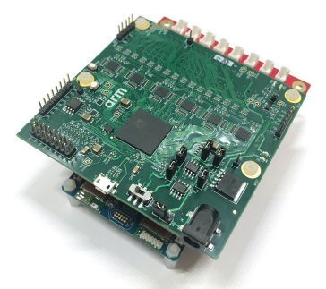

# Testing with FPGA CI TEST shield

## Setup



```
mbed test -n "hal-tests-tests*fpga*" --app-config TESTS/configs/fpga.json
```

The `FPGA_FORCE_ALL_PORTS` macro can be defined to force all pinouts of all peripherals to be tested. Some FPGA tests only test one pinout of one peripheral by default, to save time.

```
mbed test -n "hal-tests-tests*fpga*" --app-config TESTS/configs/fpga.json -DFPGA_FORCE_ALL_PORTS
```

FPGA_CI_TEST_SHIELD needed macro  
and specific test capabilities per target  
are defined in:  
https://github.com/ARMmbed/mbed-os/blob/master/TESTS/configs/fpga.json


## MBED-OS

Tested from factor is defined by MBED_CONF_TARGET_DEFAULT_FORM_FACTOR  
"default-form-factor" default value is null.

When "default-form-factor" is not set, ARDUINO form factor is used.

Default ff_arduino_pins is defined in:
https://github.com/ARMmbed/mbed-os/blob/master/hal/source/mbed_pinmap_default.cpp#L28-L32

Default ff_arduino_names is defined in:
https://github.com/ARMmbed/mbed-os/blob/master/hal/source/mbed_pinmap_default.cpp#L34-L38

Default empty_gpio_pinmap is defined in:
https://github.com/ARMmbed/mbed-os/blob/master/hal/source/mbed_gpio.c#L89-L114

Some pins are restricted:
https://github.com/ARMmbed/mbed-os/blob/master/hal/source/mbed_pinmap_default.cpp#L69-L73

Some peripherals are restricted:
https://github.com/ARMmbed/mbed-os/blob/master/hal/source/mbed_pinmap_default.cpp#L94-L100


## Known issues


## LINKS

https://github.com/ARMmbed/fpga-ci-test-shield

https://github.com/ARMmbed/fpga-ci-test-shield-updater

https://github.com/ARMmbed/fpga-ci-test-shield-terminal

