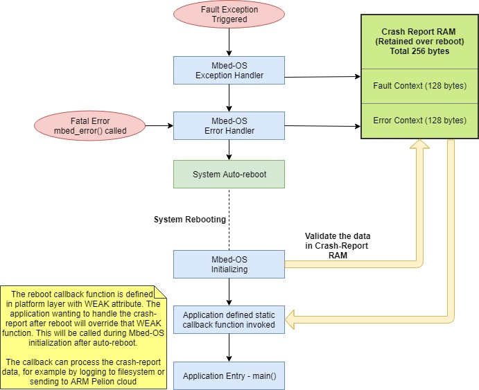
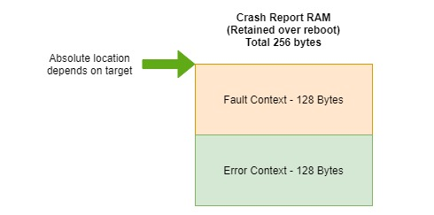
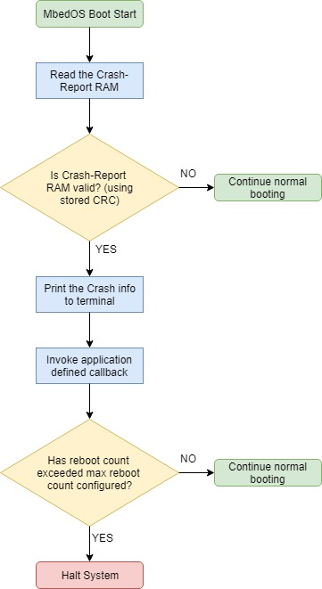

# Crash Reporting

# Table of contents

- [Crash Reporting](#crash-reporting)
- [Table of contents](#table-of-contents)
    - [Revision history](#revision-history)
- [Introduction](#introduction)
    - [Overview and background](#overview-and-background)
    - [Requirements and assumptions](#requirements-and-assumptions)
- [System architecture and high-level design](#system-architecture-and-high-level-design)
    - [System architecture and component interaction](#system-architecture-and-component-interaction)
- [Detailed design](#detailed-design)
- [Usage scenarios and examples](#usage-scenarios-and-examples)
- [Tools and configuration changes](#tools-and-configuration-changes)
- [Other information](#other-information)
    - [Reusability](#reusability)
    - [Deprecations](#deprecations)
    - [References](#references)

### Revision history

1.0 - Initial version - Senthil Ramakrishnan - 10/22/2018

# Introduction

### Overview and background

MbedOS currently implements error/exception handlers which gets invoked when the system encounters a fatal error or processor exceptions. The error and exception handlers capture information such as type of error, location of error, register context, thread info etc and these are valuable information required to debug the problem later. This information is currently printed over the serial port, but in many cases the serial port is not accessible and the serial terminal log is not captured, particularly in the case of field deployed devices. We cannot save this information by sending it over network or writing to a file, as the state of the system might be unstable after the fatal error. And thus a different mechanism is needed to record and report this data. The idea here is to auto-reboot the system after a fatal error has occurred to bring the system back in stable state, without losing the RAM contents where we have the error information collected, and we can then save this information reliably to be logged externally(E.g:- ARM Pelion cloud) or can be written to file system. 

### Requirements and assumptions

This feature requires 256 bytes of dedicated RAM allocated for storing the error and fault context information.

Following are some common terminologies used in this document:
Fault exception - This refers to processor exceptions such as HardFault, BusFault, MemManage fault or Usage fault.
Fatal error - This refers to any error reported by calling mbed_error().
Crash - This refers to the scenario where a fault exception or fatal error leading to system error handler(mbed_error()) being invoked.

# System architecture and high-level design

Below are the high-level goals for "Crash Reporting" feature:

**Error information collection including fault exception context**

The current error handling implementation in MbedOS already collects error and fault exception context. With this feature the above mentioned data structures should be placed in an uninitialized RAM region so that the data is retained after an auto-reboot(warm-reset).

**Mechanism to auto reboot(also called warm-reset) the system without losing RAM contents where error info is stored**

Implement auto-reboot functionality to reboot the system automatically after a fatal error. Note that the auto-reboot feature should be configurable.

**Mechanism to retrieve the error data after reboot**

Provide platform APIs to read the saved error information after reboot.

**Mechanism to report the error data after reboot**

During reboot the system should check if the reboot is caused by a fatal error and report the same using callback mechanism. 

**Implementation should provide a mechanism to prevent constant reboot loop by limiting the number of auto-reboots**

System should implement mechanism to track number of times the system has auto-rebooted and be able to stop auto-reboot when a configurable limit is reached. That is, once the limit is reached the application main()
will not be entered and the system will halt execution.

**Implementation should provide following configuration options**

1. Configuration option to enable or disable this feature
1. Configuration option to enable or disable auto-reboot when the system enters a fatal error scenario
1. Configuration option to limit the number of auto-reboots

### System architecture and component interaction

The below diagram shows overall architecture of crash-reporting implementation.



As depicted in the above diagram, when the system gets into fatal error state the information collected by error and fault handlers are saved into RAM space allocated for Crash-Report. This is followed by a auto-reboot triggered from error handler. On reboot the the initialization routine validates the contents of Crash-Report space in RAM. This validation serves two purposes - to validate the captured content itself and also it tells the system if the previous reboot was caused by a fatal error. It then reads this information and calls an application defined callback function passing the crash-report information. The callback is invoked just before the entry to main() and thus the callback implementation may access libraries and other resources as other parts of the system have already initialized(like SDK, HAL etc) or can just capture the error information in application space to be acted upon later.

# Detailed design

### Error information collection including fault exception context

Current error and fault-exception handling implementation in Mbed OS already collects error and fault-exception context. But currently these data structures are implemented as statically allocated memory locations. With this feature these data structures should be placed in an uninitialized RAM region so that the data is retained after auto-reboot(warm-reset). So, this should be allocated as a dedicated region using linker command file(or in scatter file) for the corresponding target for each toolchain. Also note that this region should be marked as uninitialized region(not zero initialized) using the right toolchain attributes. For example, for ARM compiler we can define a new section as below:
```
RW_m_crash_data m_crash_report_ram_start EMPTY m_crash_report_ram_size { ; Dedicated Region to store crash report data m_crash_report_ram_size = 256 bytes
} 
```
Note that the actual location of the data should be carefully chosen without affecting the current usage of other regions such as interrupt table region, flash configuration area etc. The absolute location of this Crash-Report RAM region may also differ for each target. The size of this RAM region should be 256 bytes. And internally the implementation would use the 256 byte region as two sub-areas with 128 bytes each. The upper 128 bytes will be used to store the fault context and the lower 128 bytes for error context, as shown in the diagram below.



### Mechanism to auto reboot(also called warm-reset) the system without losing RAM contents where error info is stored

The current mbed_error() implementation should be modified to cause an auto-reboot at the end of error handling if this feature is enabled. The mechanism used for rebooting should make sure it doesn't cause a reset of RAM contents. This can be done by calling system_reset() function already implemented by MbedOS which cause the system to warm-reset without resetting the RAM. The mbed_error() implementation also should make sure it updates the error context stored in Crash-Report RAM with the right CRC value. The CRC value is calculated across all the members of mbed_error_ctx structure and the CRC is appended at the end of that structure. mbed_error() should also update the reboot count on every auto-reboot caused by fatal errors. The current mbed error context structure should be updated as below to capture reboot count, error processed status and the CRC value. The CRC value should be the last word in the struture.

```
typedef struct _mbed_error_ctx {

    ...

    //Below are the new struct members   
    int32_t error_reboot_count; //everytime we write this struct we increment this value by 1, irrespective of time between reboots. Note that the data itself might change, but everytime we reboot due to error we update this count by 1
    int32_t is_error_processed; //once this error is processed set this value to 1
    uint32_t crc_error_ctx; //crc_error_ctx should always be the last member in this struct
} mbed_error_ctx;
```

The below pueudo-code shows how the mbed_error() implementation should be modified.

```
mbed_error_status_t mbed_error( ... )
{
    //Handle the error just as we do now and then do the following to save the context into Crash-Report RAM and reset
    
    Read the current Crash Report and calculate CRC
	If CRC matches what's in Crash-Report RAM: 
		Update the location with new error information
		Update Reboot Count
		Calculate new CRC
		Update with new CRC value
	Else (if CRC doesn't match) 
		//This is the case when we dont have a crash report already stored.
		Update the location with new error information
		Set Reboot count to 1
		Calculate new CRC
		Update with new CRC value

    Do a system reset //using system_reset() function
}

```
The Crash-Report RAM region should also be used for tracking other pieces of information such as the CRC value and the
auto-reboot count. 

### Mechanism to retrieve and reset the error data after reboot

MbedOS error handling system should implement necessary APIs for application to retrieve and reset the error and/or fault context of the previous fatal error after auto-reboot.
The below APIs should be implemented.

The below API can be called by application to retrieve the error context captured in the Crash-Report RAM. The error context is copied into the location pointed by *error_info*. Note that the caller should allocate the memory for this location.
The function should return MBED_ERROR_NOT_FOUND if there is no error context currently stored.
```C
//Retrieve the reboot error context
mbed_error_status_t mbed_get_reboot_error_info(mbed_error_ctx *error_info)
```

The below API can be called by application to retrieve the fault context captured in the Crash-Report RAM. The error context is copied into the location pointed by *fault_context*. Note that the caller should allocate the memory for this location. Note that the fault context is valid only if the previous reboot was caused by a fault exception. Whether the previous reboot was caused by a fault exception can be determined from the error code stored in error context information retrieved using mbed_get_reboot_error_info() API above.
The function should return MBED_ERROR_NOT_FOUND if there is no fault context currently stored.
```C
//Call this function to retrieve the last reboot fault context
mbed_error_status_t mbed_get_reboot_fault_context (mbed_fault_context_t *fault_context);
```

The below API can be called by application to reset the error context captured in the Crash-Report RAM.
The function should return MBED_ERROR_NOT_FOUND if there is no error context currently stored.
```C
//Reset the reboot error context
mbed_error_status_t mbed_reset_reboot_error_info()
```

The below API can be called by application to reset(to be set to 0) the error reboot count captured in the Crash-Report RAM.
The function should return MBED_ERROR_NOT_FOUND if there is no error context currently stored.
```C
//Reset the reboot error context
mbed_error_status_t mbed_reset_reboot_count()
```

### Mechanism to report the error data after reboot

MbedOS initialization sequence should check if the reboot is caused by a fatal error and should report the same to the application using callback mechanism.

MbedOS initialization sequence should be modified as shown in below diagram to report the crash report and invoke the callback.



Below should be the signature of the callback for reporting the error information.

The error handing system in MbedOS will call this callback function if it detects that the current reboot has been caused by a fatal error. This function will be defined with MBED_WEAK attribute by default and applications wanting to process the error report should override this function in application implementation.
```CS
void mbed_error_reboot_callback(mbed_error_ctx *error_context);
```

### System should implement mechanism to track number of times the system is auto-rebooted and be able to stop auto-reboot when a configurable limit is reached

Many a times rebooting may be a solution to bring the erroring device back into good state(after a fatal error for example)but there might be scenarios when the system has a permanent issue causing it to run into fatal error on every boot. In such scenarios, auto-reboot mechanism can cause a constant reboot loop situation. In order to avoid this, implementation should provide a mechanism to prevent constant reboot loop by limiting the number of auto-reboots. The number of times auto-reboot happens on fatal errors should be configurable. A configuration option should be provided to configure the
maximum number of auto-reboots(warm-resets). In order to implement this, system should track the number of times auto-reboot was effected using the Crash-Report RAM region.

### Implementation should provide following configuration options

Crash reporting implementation should provide enough parameters to control different aspects of crash reporting behavior so that developers can configure this feature to conform to their system design. Implementation should provide following configuration options to control the behavior as below.

1. Configuration option to enable or disable error the entire feature
1. Configuration option to enable or disable auto-reboot when the system enters a fatal error scenario
1. Configuration option to limit the number of auto-reboots

# Usage scenarios and examples

Below (pseudo code) are some common usage scenarios using the new error reporting APIs.

### Implementing crash reporting callback
In order to implement the callback the user can override the default callback function(*mbed_error_reboot_callback()*) implemented with MBED_WEAK attribute in platform layer as below. 

```C
mbed_error_ctx my_error_ctx;
//Callback during reboot
void mbed_error_reboot_callback(mbed_error_ctx *error_context) 
{
    printf("Error callback received");
    //Copy the error context in a local struct for processing it later
    memcpy(&my_error_ctx, error_context, sizeof(mbed_error_ctx));
}
```
The above function will be called during boot with a pointer to *error_context* structure.

### Retrieving error info after reboot
The error context captured can be retrieved using mbed_get_reboot_error_info() API. See the below code
for example usage of that API. In the example below, a status variable reboot_error_detected has been used to track the presence of error context capture.

```C
mbed_error_ctx error_ctx;
int reboot_error_detected = 0;

//Callback during reboot
void mbed_error_reboot_callback(mbed_error_ctx *error_context) 
{
    printf("error callback received");
    reboot_error_detected = 1;
}

// main() runs in its own thread in the OS
int main() 
{
    if (reboot_error_detected == 1) {
        if (MBED_SUCCESS == mbed_get_reboot_error_info(&error_ctx)) {
            printf("\nSuccessfully read error context\n");
    }
    //main continues...
}
```

### Retrieving fault context after reboot
The fault context captured can be retrieved using mbed_get_reboot_fault_context() API. See the below code
for example usage of that API. The example code below checks for error_status using the error context and then
retrieves the fault context using mbed_get_reboot_fault_context() API.

```C
mbed_error_ctx error_ctx;
mbed_fault_context_t fault_ctx;
int reboot_error_detected = 0;

//Callback during reboot
void mbed_error_reboot_callback(mbed_error_ctx * error_context) 
{
    printf("error callback received");
    reboot_error_detected = 1;
}

// main() runs in its own thread in the OS
int main() 
{
    if (reboot_error_detected == 1) {
        if (MBED_SUCCESS == mbed_get_reboot_error_info(&error_ctx)) {
            printf("\nRead in reboot info\n");
            if (error_ctx.error_status == MBED_ERROR_HARDFAULT_EXCEPTION) {
               if (MBED_SUCCESS == mbed_get_reboot_fault_context(&fault_ctx)) {
                   printf("\nRead in fault context info\n");
               }
            }
        }
    }
    //main continues...
}
```

# Tools and configuration changes

### Platform configuration options for error reporting infrastruture

Below is the list of new configuration options needed to configure error reporting functionality. All of these configuration options should be captured in mbed_lib.json file in platform directory.

**crash-capture-enabled**

Enables crash context capture when the system enters a fatal error/crash. When this is disabled it should also disable other dependent options.

**fatal-error-auto-reboot-enabled**

Enables auto-reboot on fatal errors.

**error-reboot-max**

Maximum number of auto reboots permitted when an error happens.

# Other information

### Reusability

### Deprecations

### References

