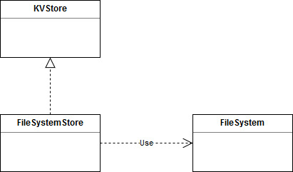

# FileSystemStore in Mbed OS

- [FileSystemStore in Mbed OS](#filesystemstore-in-mbed-os)
    + [Revision history](#revision-history)
- [Introduction](#introduction)
    + [Overview and background](#overview-and-background)
    + [Requirements and assumptions](#requirements-and-assumptions)
- [System architecture and high-level design](#system-architecture-and-high-level-design)
  * [Design basics](#design-basics)
- [Detailed design](#detailed-design)
    + [Class header](#class-header)
    + [Important data structures](#important-data-structures)
    + [Initialization and reset](#initialization-and-reset)
    + [Core APIs](#core-apis)
    + [Incremental set APIs](#incremental-set-apis)
    + [Key iterator APIs](#key-iterator-apis)
- [Usage scenarios and examples](#usage-scenarios-and-examples)
    + [Standard usage of the class](#standard-usage-of-the-class)
- [Other information](#other-information)
    + [Open issues](#open-issues)


### Revision history

| Revision 	| Date           	| Authors                                                	| Mbed OS version 	| Comments         	|
|----------	|----------------	|--------------------------------------------------------	|-----------------	|------------------	|
| 1.0      	| 20 September 2018	| David Saada ([@davidsaada](https://github.com/davidsaada/)) 	| 5.11+           	| Initial revision 	|

# Introduction

### Overview and background

FileSystemStore is a lightweight implementation of the [KVStore](../KVStore/KVStore_design.md) interface over file systems.

### Requirements and assumptions

FileSystemStore assumes the underlying file system qualities for resilience and file validation. This means that if the underlying file system has no protection against power failures, then neither would FileSystemStore have.

When initializing this class, it is assumed that the underlying FileSystem is initialized and mounted. 

# System architecture and high-level design

## Design basics

FileSystemStore implements the get/set interface using files, where a single file represents each key. A key is represented by the file name, and its value is stored as file data. Therefore, FileSystemStore imitates the get/set actions using simple file operations. Set is achieved using open-write-close, get using open-read-close and so on.  

All files are concentrated under a single directory, whose name is hard coded. So actions such as "reset" are mapped to the deletion of all files under this directory, and iteration actions use file system APIs to traverse the directory.  

### Data layout

When storing the data, it is stored with a preceding 16-byte metadata header. Metadata includes flags and other parameters for basic validity checks.  


Fields are:

- Magic: A constant value, for quick validity checking.
- Metadata size: Size of metadata header.
- Revision: FileSystemStore revision (currently 1).
- User flags: Flags received from user. Currently only write once is dealt with (others are ignored).
 
# Detailed design

FileSystemStore fully implements the KVStore interface over a file system. As such, it uses the FileSystem class interface for file operations. 



Functionality, as defined by KVStore, includes the following:

- Initialization and reset.
- Core actions: get, set and remove.
- Incremental set actions.
- Iterator actions.

### Class header

FileSystemStore has the following header:

```C++
class FileSystemStore : KVStore {

public:
    FileSystemStore(FileSystem *fs);
    virtual ~FileSystemStore();
    	 
    // Initialization and reset
    virtual int init();
    virtual int deinit();
    virtual int reset();

    // Core API
    virtual int set(const char *key, const void *buffer, size_t size, uint32_t create_flags);
    virtual int get(const char *key, void *buffer, size_t buffer_size, size_t *actual_size = NULL, size_t offset = 0);
    virtual int get_info(const char *key, info_t *info);
    virtual int remove(const char *key);
 
    // Incremental set API
    virtual int set_start(set_handle_t *handle, const char *key, size_t final_data_size, uint32_t create_flags);
    virtual int set_add_data(set_handle_t handle, const void *value_data, size_t data_size);
    virtual int set_finalize(set_handle_t handle);
 
    // Key iterator
    virtual int iterator_open(iterator_t *it, const char *prefix = NULL);
    virtual int iterator_next(iterator_t it, char *key, size_t key_size);
    virtual int iterator_close(iterator_t it);
    
private:
    Mutex _mutex;
    FileSystem *_fs;
    bool _is_initialized;
}
```

### Important data structures

```C++
// Key metadata
typedef struct {
    uint32_t magic;
    uint16_t metadata_size;
    uint16_t revision;
    uint32_t flags;
} key_metadata_t;

// incremental set handle
typedef struct {
    char *key;
    uint32_t create_flags;
} inc_set_handle_t;

// iterator handle
typedef struct {
    void *dir_handle;
    char *prefix;
} key_iterator_handle_t;
```

### Initialization and reset

**init function**

Header:  

`virtual int init();`

Pseudo code:  

- If `_is_initialized`, return OK.
- Create and take `_mutex`.
- Create the FileSystemStore directory if it doesn't exist.
- Set `_is_initialized` to true.
- Release `_mutex`.
  
**deinit function**

Header:  

`virtual int deinit();`

Pseudo code:  

- If not `_is_initialized`, return OK.
- Take `_mutex`.
- Set `_is_initialized` to false.
- Release `_mutex`.

**reset function**

Header:  

`virtual int reset();`

Pseudo code:  

- Take `_mutex`.
- Delete all files under the FileSystemStore directory.
- Set `_num_keys` to 0.
- Release `_mutex`.

### Core APIs

**set function**

Header:  

`virtual int set(const char *key, const void *buffer, size_t size, uint32_t create_flags);`

Pseudo code:  

- If not `_is_initialized`, return "not initialized" error.
- Call `set_start` with all fields and a local `set_handle_t` variable.
- Call `set_add_data` with `buffer` and `size`.
- Call `set_finalize`.
- Return OK.

**get function**

Header:  

`virtual int get(const char *key, void *buffer, size_t buffer_size, size_t *actual_size = NULL, size_t offset = 0);`

Pseudo code:  

- If not `_is_initialized`, return "not initialized" error.
- Take `_mutex`.
- Using the `stat` API, extract file size.
- Open file `key` for reading to achieve a file handle.
- If failed, release `_mutex` and return "not found" error.
- Read from file into a `key_metadata_t` structure.
- Using `size` API, achieve file size.
- Seek to `offset` + metadata size.
- Set `actual_size` as the minimum of buffer size and remainder of data.
- Read data from file to `buffer`, size is `actual_size`.
- Close file.
- Release `_mutex`.
- Return OK.

**get_info function**

Header:  

`virtual int get_info(const char *key, info_t *info);`

Pseudo code:  

- If not `_is_initialized`, return "not initialized" error.
- Find file `key` under the FileSystemStore directory. If not existing, return "not found" error.
- Take `_mutex`.
- Open file `key` for reading to achieve a file handle.
- If failed, release `_mutex`, and return "not found" error.
- Using `size` API, achieve file size.
- Read from file into a `key_metadata_t` structure.
- Fill `info` structure with all relevant fields.
- Close file.
- Return OK.

**remove function**

Header:  

`virtual int remove(const char *key);`

Pseudo code:  

- If not `_is_initialized`, return "not initialized" error.
- Take `_mutex`.
- Open file `key` for reading, and read data into a `key_metadata_t` structure.
- If not existing, return "not found error".
- If flag "write once" is preset, return "write once" error.
- Delete file `key`.
- Release `_mutex`.
- Return OK.

### Incremental set APIs

**set_start function**

Header:  

`virtual int set_start(set_handle_t *handle, const char *key, size_t final_data_size, uint32_t create_flags);`

Pseudo code:

- Find file `key` under the FileSystemStore directory. If not existing, increase `_num_keys` by 1.
- Take `_mutex`.
- Open file for reading, and read data into a `key_metadata_t` structure.
- If existing and flag "write once" is preset, return "write once" error.   
- Close file.
- Allocate an `inc_set_handle_t` structure into `handle`.
- Duplicate `key` in `handle`.
- Update `create_flags` in `handle`.
- Fill `key_metadata_t` structure with all relevant values (`create_flags` from handle).
- Open file `key` for writing to achieve a file handle.
- Write metadata structure to the file.
- Close file.

**set_add_data function**

Header:  

`virtual int set_add_data(set_handle_t handle, const void *value_data, size_t data_size);`

Pseudo code:

- Open file `key` for appending to achieve a file handle.
- Write `value_data` to the file.
- Close file.

**set_finalize function**

Header:  

`virtual int set_finalize(set_handle_t handle);`

Pseudo code:

- Free `key` in `handle` and then `handle`.
- Release `_mutex`.

### Key iterator APIs

**iterator_open function**

Header:  

`virtual int iterator_open(iterator_t *it, const char *prefix = NULL);`

Pseudo code:

- Take `_mutex`.
- Allocate a `key_iterator_handle_t` structure into `it`.
- Duplicate `prefix` into same field in iterator.
- Using directory `open` API, open FileSystemStore directory, and store dir handle in the handle's `dir_handle` field.
- Release `_mutex`.

**iterator_next function**

Header:  

`virtual int iterator_next(iterator_t it, char *key, size_t key_size);`

Pseudo code:

- Take `_mutex`.
- Using direcory `read` API on handle's `dir_handle` field, read next file in directory.
- While not reached end of directory.
	- If name matches prefix:
		- Copy file name to `key`, and return OK.
	- Using direcory `read` API on handle's `dir_handle` field, read next file in directory.
- Return "not found" error.
- Release `_mutex`.

**iterator_close function**

Header:  

`virtual int iterator_close(iterator_t it);`

Pseudo code:

- Using directory `close` API on `dir_handle` close handle.
- Release `prefix` field in iterator and structure allocated at `it`.

# Usage scenarios and examples

### Standard usage of the class

The following example code shows standard use of the FileSystemStore class :

**Standard usage example**

```C++

// External file system of LittleFS type. Should be initialized.
extern LittleFileSystem fs;

// Instantiate fsstore with our file system
FileSystemStore fsstore(&fs);

int res;

// Initialize fsstore
res = fsstore.init();

// Add "Key1"
const char *val1 = "Value of key 1";
const char *val2 = "Updated value of key 1";
res = fsstore.set("Key1", val1, sizeof(val1), 0);
// Update value of "Key1"
res = fsstore.set("Key1", val2, sizeof(val2), 0);

uint_8 value[32];
size_t actual_size;
// Get value of "Key1". Value should return the updated value.
res = fsstore.get("Key1", value, sizeof(value), &actual_size);

// Remove "Key1"
res = fsstore.remove("Key1");

// Incremental write, if need to generate large data with a small buffer
const int data_size = 1024;
char buf[8];

KVSTore::set_handle_t handle;
res = fsstore.set_start(&handle, "Key2", data_size, 0);
for (int i = 0; i < data_size / sizeof(buf); i++) {
	memset(buf, i, sizeof(buf));
	res = fsstore.set_add_data(handle, buf, sizeof(buf));
}
res = fsstore.set_finalize(handle);

// Iterate over all keys starting with "Key"
res = 0;
KVSTore::iterator_t it;
fsstore.iterator_open(&it, "Key*");
char key[KVSTore::KV_MAX_KEY_LENGTH];
while (!res) {
    res = fsstore.iterator_next(&it, key, sizeof(key));
}
res = fsstore.iterator_close(&it);

// Deinitialize FileSystemStore
res = fsstore.deinit();
```

# Other information

### Open issues

- Need to figure a way to prevent mutex abuse in incremental set APIs. 
