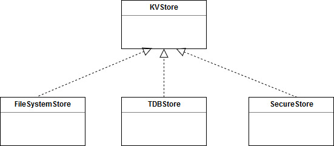

# KVStore in Mbed OS

- [KVStore in Mbed OS](#kvstore-in-mbed-os)
    + [Revision history](#revision-history)
- [Introduction](#introduction)
    + [Overview and background](#overview-and-background)
    + [Requirements and assumptions](#requirements-and-assumptions)
- [System architecture and high-level design](#system-architecture-and-high-level-design)
  * [Design basics](#design-basics)
    + [Derived implementations](#derived-implementations)
  * [Global Key Value interface](#global-key-value-interface)
- [Detailed design](#detailed-design)
  * [KVStore class design](#kvstore-class-design)
    + [KVStore Class header](#kvstore-class-header)
  * [Global Key Value interface design](#global-key-value-interface-design)
    + [Global Key Value APIs](#global-key-value-apis)
  * [Mapping APIs](#mapping-apis)
  * [Implementation](#implementation)
    + [Important data structures](#important-data-structures)
    + [Global Key Value API implementation](#global-key-value-api-implementation)
    + [Attachment API implementation](#attachment-api-implementation)
- [Usage scenarios and examples](#usage-scenarios-and-examples)
    + [Standard usage of the KVStore class](#standard-usage-of-the-kvstore-class)
    + [Standard usage of the Global Key Value interface](#standard-usage-of-the-global-key-value-interface)
- [Other information](#other-information)
    + [Open issues](#open-issues)


### Revision history

| Revision 	| Date           	| Authors                                                	| Mbed OS version 	| Comments         	|
|----------	|----------------	|--------------------------------------------------------	|-----------------	|------------------	|
| 1.0      	| 26 September 2018	| David Saada ([@davidsaada](https://github.com/davidsaada/)) 	| 5.11+           	| Initial revision 	|

# Introduction

### Overview and background

KVStore is an interface class whose purpose is to define APIs for a Key Value Store like storage over a block device. 

### Requirements and assumptions

# System architecture and high-level design

## Design basics

KVStore defines a key value store like API set using this interface class. Classes implementing this interface store pairs of keys and values, where the keys are represented as character strings and the values are represented as binary blobs. Core APIs here are *get* and *set*, providing read and write access by key to the value in a single call. *remove* completes the set of core APIs. This simplifies the interface for the cases we need an actual key value store (like configurations).  

APIs also support an "incremental set" mode, allowing the implementing class to aggregate chunks of data for the set operation. This is for when the case the caller needs to generate large portions of data but doesn't wish to allocate large buffers for a single set operation. Note that *get* API doesn't have or require this functionality. Instead, it has an offset parameter (defaulting to 0) allowing the calling layer to extract portions of the data.  

Interface also includes iteration APIs, to let you iterate over all available keys, given a prefix.  

As some of the implementations use files as keys, key names must comply to file naming rules, meaning that characters like * , / etc. are not allowed in key names.

### Derived implementations



KVStore has a few derived implementations:

- [TDBStore](../TDBStore/TDBStore_design.md) is the default solution because it gives the best performance, flash wear leveling and lowest overhead for a limited number of keys.
- [FileSystemStore](../FileSystemStore/FileSystemStore_design.md) is the preferred solution if you already have a file system and don't wish to have an additional one, or if specific POSIX features (such as file seeking) are required. It's also preferred if you don't have a limitation on the number of keys. 
- [SecureStore](../SecureStore/SecureStore_design.md) adds security features such as encryption, rollback protection and authentication. It uses one of the other KVStore solutions as the underlying storage type.

## Global Key Value interface

A parallel key-value API is provided as global C-style functions (for all functions, except for the incremental set ones). This API performs a limited type of mapping of partition or mount point names present in the keys. For each of the APIs defined in KVStore, the global version extracts a partition prefix from the key name. The prefix must be in the form "/partition/key-name". Then a lookup is performed to map the partition name to a concrete KVStore instance, and the API call is routed to that instance. The routed key name has the partition prefix stripped, leaving only "key-name".

In the case of iteration APIs, the prefix must include the partition (in the form of "/partition/prefix").  
 
# Detailed design

## KVStore class design

As an interface class, KVStore has no implementation, just a class header.

### KVStore class header

```C++
class KVStore {

    enum create_flags {
        WRITE_ONCE_FLAG                     = (1 << 0),
        REQUIRE_CONFIDENTIALITY_FLAG        = (1 << 1),
        REQUIRE_REPLAY_PROTECTION_FLAG      = (1 << 3),
    };
 
    static const uint32_t MAX_KEY_LENGTH = 128;
 
    typedef struct _opaque_set_handle *set_handle_t;
 
    typedef struct _opaque_key_iterator *iterator_t;
 
    typedef struct info {
        size_t size;
        uint32_t flags;
    } info_t;
 
    // Initialization and reset
    virtual int init();
    virtual int deinit();
    virtual int reset();

    // Core API
    virtual int set(const char *key, const void *buffer, size_t size, uint32_t create_flags);
    virtual int get(const char *key, void *buffer, size_t buffer_size, size_t *actual_size = NULL, size_t offset = 0);
    virtual int get_info(const char *key, info_t *info);
    virtual int remove(const char *key);
 
    // Incremental set API
    virtual int set_start(set_handle_t *handle, const char *key, size_t final_data_size, uint32_t create_flags);
    virtual int set_add_data(set_handle_t handle, const void *value_data, size_t data_size);
    virtual int set_finalize(set_handle_t handle);
 
    // Key iterator
    virtual int iterator_open(iterator_t *it, const char *prefix = NULL);
    virtual int iterator_next(iterator_t it, char *key, size_t key_size);
    virtual int iterator_close(iterator_t it);
}
```

## Global Key Value interface design

As mentioned above, each KVStore API has a parallel C-style API, used globally with a partition name preceding the key name. 

### Global Key Value APIs

```C
enum kv_create_flags {
    KV_WRITE_ONCE_FLAG                      = (1 << 0),
    KV_REQUIRE_CONFIDENTIALITY_FLAG         = (1 << 1),
    KV_REQUIRE_REPLAY_PROTECTION_FLAG       = (1 << 3),
};
 
static const uint32_t KV_MAX_KEY_LENGTH = 128;
typedef struct _opaque_set_handle *kv_set_handle_t;
typedef struct _opaque_key_iterator *kv_key_iterator_handle_t;
 
typedef struct info {
    size_t size;
    uint32_t flags;
} kv_info_t;
 
// Core API
int kv_set(const char *full_name_key, const void *buffer, size_t size, uint32_t create_flags);
int kv_get(const char *full_name_key, void *buffer, size_t buffer_size, size_t *actual_size);
int kv_get_info(const char *full_name_key, kv_info_t *info);
int kv_remove(const char *full_name_key);
 
// Key iterator
int kv_iterator_open(kv_key_iterator_handle_t *it, const char *full_prefix = nullptr);
int kv_iterator_next(kv_key_iterator_handle_t it, char *key, size_t key_size);
int kv_iterator_close(kv_key_iterator_handle_t it);
```

## Mapping APIs

To use the global C style APIs, you need APIs to map the partition name to the instance of the implementing KVStore class, typically called once at initialization time. So, for example a `"/tdbstore/key1"` name means that you wish to access `"key1"` key in a TDBStore instance. This means that you need to attach `"tdbstore"` string to the TDBStore instance at initialization time.  

These APIs are part of a different header file ("kv_map.h") because they serve the integration code and not the KVStore user code:

```C
// Attach and detach
int kv_init();
int kv_attach(const char *partition_name, KVStore *kv_instance);
int kv_detach(const char *partition_name);

// Full name lookup and then break it into KVStore instance and key
int kv_lookup(const char *full_name, KVStore& *kv_instance, char *key);
```

## Implementation

Below is the implementation of the Global Key Value interface and of the attachment APIs. KVStore class has no implemetation because it's an interface class:

### Important data structures

```C
// incremental set handle
typedef struct {
    KVStore *kvstore_intance;
    KVStore::set_handle_t *set_handle;
} kv_inc_set_handle_t;

// iterator handle
typedef struct {
    KVStore *kvstore_intance;
    KVStore::iterator_t *iterator_handle;
} kv_key_iterator_handle_t;

const int MAX_ATTACHED_KVS 16

typedef struct {
    char *partition_name;
    KVStore *kvstore_instance;
} kv_map_entry_t;

// Attachment table
kv_map_entry_t kv_map_table[MAX_ATTACHED_KVS];
int kv_num_attached_kvs;
```

### Global Key Value API implementation

**kv_set function**

Header:  

`int kv_set(const char *full_name_key, const void *buffer, size_t size, uint32_t create_flags);`

Pseudo code:  

- Using `kv_lookup`, break `full_name_key` into `key` and `kvs_instance`.
- Call `kvs_instance` `set` method with `key` and the rest of the arguments.

**kv_get function**

Header:  

`int kv_get(const char *full_name_key, void *buffer, size_t buffer_size, size_t *actual_size);`

Pseudo code:  

- Using `kv_lookup`, break `full_name_key` into `key` and `kvs_instance`.
- Call `kvs_instance` `get` method with `key` and the rest of the arguments.

**kv_get_info function**

Header:  

`int kv_get_info(const char *full_name_key, kv_info_t *info);`

Pseudo code:  

- Using `kv_lookup`, break `full_name_key` into `key` and `kvs_instance`.
- Call `kvs_instance` `get_info` method with `key` and the rest of the arguments.

**kv_remove function**

Header:  

`int kv_remove(const char *full_name_key);`

Pseudo code:  

- Using `kv_lookup`, break `full_name_key` into `key` and `kvs_instance`.
- Call `kvs_instance` `remove` method with `key` and the rest of the arguments.

**kv_set_start function**

Header:  

`int kv_set_start(kv_set_handle_t *handle, const char *full_name_key, size_t final_data_size);`

Pseudo code:

- Allocate an `kv_inc_set_handle_t` structure into `handle`.
- Using `kv_lookup`, break `full_name_key` into allocated `key` and `kvs_instance` (in `handle`).
- Call `kvs_instance` `set_start` method with `key` and the rest of the arguments.

**kv_set_add_data function**

Header:  

`int kv_set_add_data(kv_set_handle_t handle, const void *value_data, size_t data_size);`

Pseudo code:

- Extract `kvs_instance` and `set_handle` from `handle`.
- Call `kvs_instance` `set_add_data` method with `set_handle` and the rest of the arguments.

**kv_set_finalize function**

Header:  

`int kv_set_finalize(kv_set_handle_t handle);`

Pseudo code:

- Extract `kvs_instance` and `set_handle` from `handle`.
- Call `kvs_instance` `set_finalize` method with `set_handle`.
- Free `key` and `handle`.

**kv_iterator_open function**

Header:  

`int kv_iterator_open(kv_key_iterator_handle_t *it, const char *full_prefix = nullptr);`

Pseudo code:

- Allocate a `kv_key_iterator_handle_t` structure into `it`.
- Using `kv_lookup`, break `full_name_key` into allocated `prefix` and `kvs_instance` (in `handle`).
- Call `kvs_instance` `iterator_open` method with `iterator_handle`, `prefix` and the rest of the arguments.
 
**kv_iterator_next function**

Header:  

`int kv_iterator_next(kv_key_iterator_handle_t it, char *key, size_t key_size);`

Pseudo code:

- Extract `kvs_instance` and `iterator_handle` from `handle`.
- Call `kvs_instance` `iterator_next` method with `iterator_handle` and the rest of the arguments.
 
**kv_iterator_close function**

Header:  

`int kv_iterator_close(kv_key_iterator_handle_t it);`

Pseudo code:

- Extract `kvs_instance` and `iterator_handle` from `handle`.
- Call `kvs_instance` `set_finalize` method with `iterator_handle`.
- Free `prefix` and `handle`.

### Attachment API implementation

**kv_init function**

Header:  

`int kv_init();`

Pseudo code:  

- Set `kv_num_attached_kvs` to 0.

**kv_attach function**

Header:  

`int kv_attach(const char *partition_name, KVStore *kv_instance);`

Pseudo code:  

- Duplicate `partition_name` and `kv_instance` to last entry in `kv_map_table`.
- Increment `kv_num_attached_kvs`.

**kv_detach function**

Header:  

`int kv_detach(const char *partition_name);`

Pseudo code: 

- Look for entry with `partition_name` in `kv_map_table`.
- Deallocate `partition_name` in this entry.
- Copy all preceding entries back one position.
- Decrement `kv_num_attached_kvs`.

**kv_lookup function**

Header:  

`int kv_lookup(const char *full_name, KVStore& *kv_instance, char *key);`

Pseudo code:

- Break `full_name` string to `partition_name` and `key`.
- Look for entry with `partition_name` in `kv_map_table`.
- Extract `kv_instance` from table entry.

# Usage scenarios and examples

### Standard use of the KVStore class

The following example code shows standard use of the KVStore, using the TDBStore class:

**Standard usage example - with class APIs**

```C++
// Underlying block device. Here, SPI Flash is fully used.
// One can use SlicingBlockDevice if we want a partition.
SPIFBlockDevice bd(PTE2, PTE4, PTE1, PTE5);

// Instantiate tdbstore with our block device and a maximum of 64 keys 
kvstore = new TDBStore(64, &bd);

int res;

// Initialize storage
res = kvstore->init();

const char *val1 = "Value of key 1";
const char *val2 = "Updated value of key 1";
// Add "Key1"
res = kvstore->set("Key1", val1, sizeof(val1), 0);
// Update value of "Key1"
res = kvstore->set("Key1", val2, sizeof(val2), 0);

uint_8 value[32];
size_t actual_size;
// Get value of "Key1". Value should return the updated value.
res = kvstore->get("Key1", value, sizeof(value), &actual_size);

// Remove "Key1"
res = kvstore->remove("Key1");

// Incremental write, if need to generate large data with a small buffer
const int data_size = 1024;
char buf[8];

KVSTore::set_handle_t handle;
res = kvstore->set_start(&handle, "Key2", data_size, 0);
for (int i = 0; i < data_size / sizeof(buf); i++) {
	memset(buf, i, sizeof(buf));
	res = kvstore->set_add_data(handle, buf, sizeof(buf));
}
res = kvstore->set_finalize(handle);

// Iterate over all keys starting with "Key"
res = 0;
KVSTore::iterator_t it;
kvstore->iterator_open(&it, "Key*");
char key[KVSTore::KV_MAX_KEY_LENGTH];
while (!res) {
    res = kvstore->iterator_next(&it, key, sizeof(key));
}

// Deinitialize TDBStore
res = kvstore->deinit();
```

### Standard usage of the Global Key Value interface

The following example code shows how to use the previous example with the global key value interface. Here, `tdtbstore` is mapped to `"/tdbstore/"`. 

**Standard usage example - with global C-style APIs**

This example assumes this code exists somewhere and is called during initialization:

```C
// Assume TDBtore is already instantiated and initialized
extern TDBStore tdbstore;

int res;

// Attachment code. Should be called at initialization
res = kv_init();
res = kv_attach("tdbstore", &tdbstore);

```

This example shows how to access KVStore using C global APIs:

```C
const char *val1 = "Value of key 1";
const char *val2 = "Updated value of key 1";

// Add "Key1", now with full name, including "/tdbstore/" prefix.
res = kv_set("/tdbstore/Key1", val1, sizeof(val1),  0);
// Update value of "Key1"
res = kv_set("/tdbstore/Key1", val2, sizeof(val2), 0);

uint_8 value[32];
size_t actual_size;
// Get value of "Key1". Value should return the updated value.
res = kv_get("/tdbstore/Key1", value, sizeof(value), &actual_size);

// Remove "Key1"
res = kv_remove("/tdbstore/Key1");

// Incremental write, if need to generate large data with a small buffer
const int data_size = 1024;
char buf[8];

kv_set_handle_t handle;
res = kv_set_start(&handle, "/tdbstore/Key2", data_size, 0);
for (int i = 0; i < data_size / sizeof(buf); i++) {
	memset(buf, i, sizeof(buf));
	res = kv_set_add_data(handle, buf, sizeof(buf));
}
res = kv_set_finalize(handle);

// Iterate over all keys starting with "Key" in tdbstore
res = 0;
kv_key_iterator_handle_t it;
kv_iterator_open(&it, "/tdbstore/Key");
char key[KV_MAX_KEY_LENGTH];
while (!res) {
    res = kv_iterator_next(&it, key, sizeof(key));
}
res = kv_iterator_close(&it);
```
