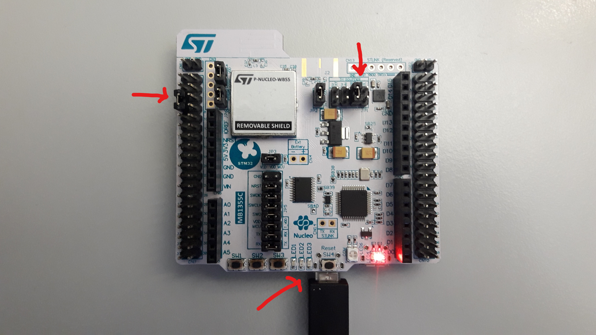

# STM32WB family

[st.com STM32WB family page](https://www.st.com/en/microcontrollers-microprocessors/stm32wb-series.html)

This ST MCU family is dual-core : based on an Arm Cortex-M4 core and an Arm Cortex-M0+ core.

- M4 core is dedicated to application (mbed-os)
- M0 core is dedicated to BLE FW (only binary, source files not provided)

# Supported boards

## NUCLEO_WB55RG

[st.com STM32WB55RG MCU page](https://www.st.com/en/microcontrollers-microprocessors/stm32wb55rg.html)

[st.com NUCLEO page](https://www.st.com/en/evaluation-tools/p-nucleo-wb55.html)

- Total FLASH is 1MB, but note that it is shared by M4 and M0 cores.
    - mbed-os application size is then limited to 768 KB

- RAM: 256 KB
    - SRAM1: 192 KB
    - SRAM2a: 32 KB
    - SRAM2b: 32 KB


# BLE

## MBED-OS support

BLE feature is based on Cordio stack and API (above HCI) implementation.

Note that the BLE controller firmware running on the cortex-M0 is the same as in STcubeFW solution

- within mbed, the controller will run only the below-HCI part
- within STcubeFW (and STM32WPAN middleware), it can run also up to GATT / GAP layers ...

## mbed-trace support

trace group: BLE_WB

example:
````
[INFO][BLE_WB]: WIRELESS COPROCESSOR FW VERSION ID = 1.4.0
[INFO][BLE_WB]: WIRELESS COPROCESSOR FW STACK TYPE = 1
[DBG ][BLE_WB]: mbox_write type:1, len:3
[INFO][BLE_WB]: TX>> BLE CMD
[DBG ][BLE_WB]:   Type 0x1
[DBG ][BLE_WB]:    Cmd 0xc03
[DBG ][BLE_WB]:    Len 0D]
````

## BLE FW update

Latest information :
https://github.com/STMicroelectronics/STM32CubeWB/blob/master/how_to_program_wireless_stacks.txt

Latest BLE FW :
https://github.com/STMicroelectronics/STM32CubeWB/blob/master/Projects/STM32WB_Copro_Wireless_Binaries/stm32wb5x_BLE_Stack_fw.bin

## BLE FW flashing procedure

Release Note and complete flashing procedure:
https://htmlpreview.github.io/?https://github.com/STMicroelectronics/STM32CubeWB/blob/master/Projects/STM32WB_Copro_Wireless_Binaries/Release_Notes.html


- STEP 1: Use STM32CubeProgrammer

https://www.st.com/en/development-tools/stm32cubeprog.html

````
FLASHPATH="C:\Program Files (x86)\STMicroelectronics\STM32Cube\STM32CubeProgrammer\bin"
export PATH=$FLASHPATH:$PATH
````

- STEP 2: Access to Bootloader USB Interface (system flash)

    * Boot0 pin set to VDD : Jumper between CN7.5(VDD) and CN7.7(Boot0)
    * Jumper JP1 on USB_MCU
    * Power ON via USB_USER



- STEP 3 : Delete current wireless stack :

```
$ ./STM32_Programmer_CLI.exe -c port=usb1 -fwdelete
      -------------------------------------------------------------------
                       STM32CubeProgrammer v2.3.0
      -------------------------------------------------------------------


USB speed   : Full Speed (12MBit/s)
Manuf. ID   : STMicroelectronics
Product ID  : DFU in FS Mode
SN          : 207F38933036
FW version  : 0x011a
Device ID   : 0x0495
Device name : STM32WBxx
Flash size  : 1 MBytes
Device type : MCU
Device CPU  : Cortex-M0+/M4


FUS state is FUS_ERROR

FUS status is FUS_NOT_RUNNING

FUS state is FUS_IDLE

FUS status is FUS_NO_ERROR
Deleting firmware ...
Firmware delete finished
fwdelete command execution finished
```

- STEP 4 : Read and upgrade FUS Version

```
$ ./STM32_Programmer_CLI.exe -c port=usb1 -r32 0x20030030 1
      -------------------------------------------------------------------
                       STM32CubeProgrammer v2.3.0
      -------------------------------------------------------------------


USB speed   : Full Speed (12MBit/s)
Manuf. ID   : STMicroelectronics
Product ID  : DFU in FS Mode
SN          : 207F38933036
FW version  : 0x011a
Device ID   : 0x0495
Device name : STM32WBxx
Flash size  : 1 MBytes
Device type : MCU
Device CPU  : Cortex-M0+/M4


Reading 32-bit memory content
  Size          : 4 Bytes
  Address:      : 0x20030030

0x20030030 : 00050300
```

- STEP 5 : Download new FUS :

```
$ ./STM32_Programmer_CLI.exe -c port=usb1 -fwupgrade stm32wb5x_FUS_fw.bin 0x080EC000 firstinstall=0
      -------------------------------------------------------------------
                       STM32CubeProgrammer v2.3.0
      -------------------------------------------------------------------


USB speed   : Full Speed (12MBit/s)
Manuf. ID   : STMicroelectronics
Product ID  : DFU in FS Mode
SN          : 207F38933036
FW version  : 0x011a
Device ID   : 0x0495
Device name : STM32WBxx
Flash size  : 1 MBytes
Device type : MCU
Device CPU  : Cortex-M0+/M4


FUS state is FUS_IDLE

FUS status is FUS_NO_ERROR

Old Firmware delete ...

Deleting firmware ...
Firmware delete finished

FUS state is FUS_SERVICE_ONGOING

FUS status is FUS_IMAGE_NOT_FOUND

FUS state is FUS_IDLE

FUS status is FUS_NO_ERROR
Download firmware image at address 0x80ec000 ...

Memory Programming ...
Opening and parsing file: stm32wb5x_FUS_fw.bin
  File          : stm32wb5x_FUS_fw.bin
  Size          : 24492 Bytes
  Address       : 0x080EC000


Erasing memory corresponding to segment 0:
Erasing internal memory sectors [236 241]
erasing sector 0236 @: 0x080ec000 done
erasing sector 0237 @: 0x080ed000 done
erasing sector 0238 @: 0x080ee000 done
erasing sector 0239 @: 0x080ef000 done
erasing sector 0240 @: 0x080f0000 done
erasing sector 0241 @: 0x080f1000 done
Download in Progress:

File download complete
Time elapsed during download operation: 00:00:00.512

FUS state is FUS_IDLE

FUS status is FUS_NO_ERROR

Firmware Upgrade process started ...

Updating firmware ...
Waiting for firmware upgrade end

FUS state is FUS_UPGRADE_ONGOING

FUS status is FUS_NO_ERROR

FUS state is FUS_UPGRADE_ONGOING

FUS status is FUS_IMAGE_NOT_AUTHENTIC
Error: Firmware not authentic!
```

- STEP 4 (to check) : Read and upgrade FUS Version

```
$ ./STM32_Programmer_CLI.exe -c port=usb1 -r32 0x20030030 1
      -------------------------------------------------------------------
                       STM32CubeProgrammer v2.3.0
      -------------------------------------------------------------------


USB speed   : Full Speed (12MBit/s)
Manuf. ID   : STMicroelectronics
Product ID  : DFU in FS Mode
SN          : 207F38933036
FW version  : 0x011a
Device ID   : 0x0495
Device name : STM32WBxx
Flash size  : 1 MBytes
Device type : MCU
Device CPU  : Cortex-M0+/M4


Reading 32-bit memory content
  Size          : 4 Bytes
  Address:      : 0x20030030

0x20030030 : 01000200
```

- STEP 6 : Download new wireless stack :


```
$ ./STM32_Programmer_CLI.exe -c port=usb1 -fwupgrade stm32wb5x_BLE_Stack_fw.bin 0x080CB000 firstinstall=1
      -------------------------------------------------------------------
                       STM32CubeProgrammer v2.3.0
      -------------------------------------------------------------------


USB speed   : Full Speed (12MBit/s)
Manuf. ID   : STMicroelectronics
Product ID  : DFU in FS Mode
SN          : 207F38933036
FW version  : 0x011a
Device ID   : 0x0495
Device name : STM32WBxx
Flash size  : 1 MBytes
Device type : MCU
Device CPU  : Cortex-M0+/M4

Download firmware image at address 0x80cb000 ...


Memory Programming ...
Opening and parsing file: stm32wb5x_BLE_Stack_fw.bin
  File          : stm32wb5x_BLE_Stack_fw.bin
  Size          : 165772 Bytes
  Address       : 0x080CB000


Erasing memory corresponding to segment 0:
Erasing internal memory sectors [203 243]
Download in Progress:

File download complete
Time elapsed during download operation: 00:00:03.537

FUS state is FUS_IDLE

FUS status is FUS_NO_ERROR

Firmware Upgrade process started ...

Updating firmware ...
Waiting for firmware upgrade end

FUS state is WIRELESS_STACK_UPGRADE_ONGOING

FUS status is FUS_NO_ERROR

FUS state is FUS_ERROR

FUS status is FUS_NOT_RUNNING
Firmware Upgrade Success
```

- STEP 7 : Revert STEP 2 procedure to put back device in normal mode.

